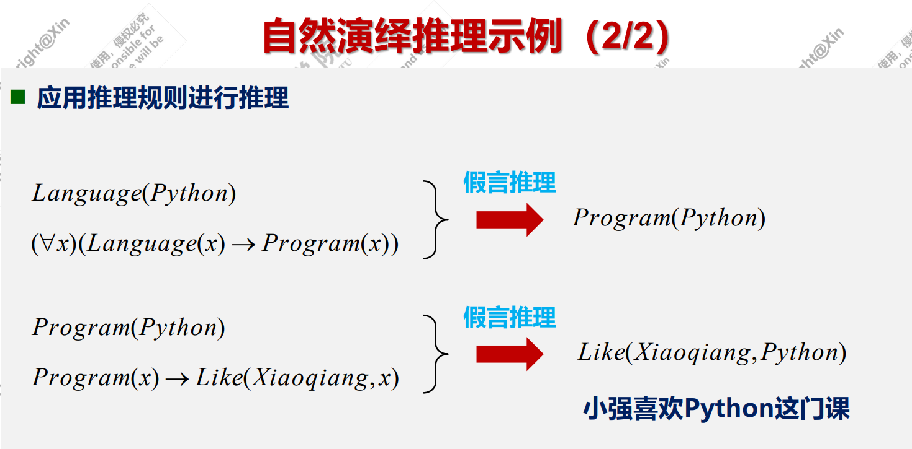
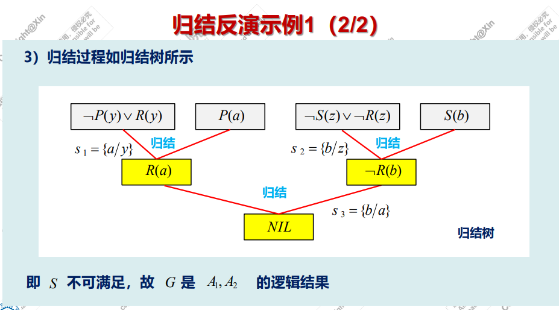

# 导论部分
1956年的达特茅斯会议标志着AI诞生，图灵是人工智能之父。
机器智能的本质属性是自然性。
关于智能疑惑：多元智能理论、智能三元理论(分析、创造、实用)、智能发展理论

==早期种子== ：
- 逻辑与推理(符号学派)
	- 自亚里士多德开始，是符号推理，并非所有智能行为都可调和为逻辑熟思，图灵第一次在纯数学的符号逻辑和实体世界间建立了联系。
	- 图灵测试没有规定问题的范围和提问的标准，计算机能否在智力行为表现得和人无法区分
- 控制论(行为学派)
	- 核心思想——控制、反馈和人机交互


==三大学派==
- 符号主义
	- 观点：认知即计算(知识表达)，物理符号系统假设和有限合理性原理，人类认知和思维的基本单元是符号，认知过程就是符号的一种运算。自上而下
	- 成果：知识回答，专家系统 、LISP表处理语言
- 连接主义
	- 观点：认知即网络，人的智能是大量简单的人脑神经元细胞的复杂相互连接活动的结果，自下而上 。
	- 成果：归纳学习、神经网络
- 行为主义
	- 认知即反应(控制论)，智能行为的基础是基于“感知--行动”的反应机制，系统与环境的交互作用，自下而上
	- 蚁群算法、遗传算法、强化学习
## 三次爆发
 - 突破(1956-1974) **推理期**
	 - 符号主义盛行，专家系统发展很快
	 - 标志性基石：在统计方法中引入符号方法进行语义处理，出现了基于知识的方法。
	 - 出现了自然语言的相关程序：ELIZA、SHRDLU
	 - 1969年明斯基给机器学习连接学派致命一击：证明了感知机(第一代神经网络)不能学习任何问题。
-  寒冬：数学模型和手段有一定的局限性，并且计算复杂度指数级别增加。
- (1980-1987)  **知识期**
	- 进入知识阶段，连接主义盛行。多层神经元网络、反向传播算法
	- 知识处理成为研究焦点。
- 寒冬： 缺乏实际应用，资助减少。
- **学习期**(至今)
## 两大分类
- 符号智能，自顶而下，通过推理进行问题求解
- 计算智能，以数据为基础，通过训练建立联系

## 研究领域
- 机器学习：监督、无监督、强化(未标记数据集，但在执行一个或多个动作后，会向AI系统提供反馈)
- 深度学习 成功应用于Siri、Alexa等助手
- 视觉
- llm
- Robotics
- 模糊逻辑系统
- 专家系统
- self-driving cars
# 知识
- 知识的特性：相对正确性、不确定性、可表示性与可利用性
- 基于符号的知识表示方法：逻辑表示、语义网络表示、生产规则、框架表示
- 主要的知识表示方法有两种：
	- 陈述性(静态特性，描述事物属性及其关系)，易于表示“做什么”，优点是形式简单、模块性好、可独立使用；缺点是不能直接执行。
	- 过程性(知识的动态特性，表示推理和搜索)，描述规则和控制结构知识，易于表示“如何做 ”，优点是可以直接被计算机执行，易于表达启发性知识，缺点是不易表达大量知识、难于修改和理解。
## 谓词逻辑表示法(略)
优点：表达能力强，新旧知识逻辑一致性 一阶谓词具有完备的逻辑推理算法
缺点：难以表示过程和启发性知识 缺乏组织原则
## 产生式表示法
### 确定性规则与不确定性规则的举例
如果动物会飞且动物会下蛋，则动物是鸟：
	IF 动物会飞 AND 动物会下蛋 THEN 动物是鸟。
如果发烧，就会感冒：
	IF 发烧 THEN 感冒 (0.6)  0.6是发烧的概率 
### 事实的表示
语言变量+关系+语言变量

> 雪是白的
> 王五喜欢大交


#### 确定性事实的表示
一般使用三元组表示`(对象，属性，值)`或者`(关系，对象1，对象2)`
老张年龄45岁  => ( Zhang , Age , 45 )  
老沈和老李是朋友 => ( friend , shen , li )

#### 不确定性事实的表示
`(对象，属性，值，置信度)`或者`(关系，对象1，对象2，置信度)`

> 老张年龄可能45岁  => ( Zhang , Age , 45 , 0.8 )    老沈和老李不太可能是朋友 => ( friend , shen , li , 0.2 )


### 一个生成式系统

## 语义网络表示法
语义基元(节点1，弧，节点2)  这个弧是有方向的。
>	大脑--------part of------->人体
实例关系：ISA (is a)
泛化关系：AKO（A kind of）
成员关系：A-Menber-of
属性关系：AGE等
包含关系：Part-of
时间关系：before after
位置关系：Located-on
相近关系：similar to
推论关系：Reasoning to

==产生式表示法:if wang and li then friend==

### 知识图谱

## 框架表示法

## 状态空间表示法
( S , O , $S_0$,  G ) S是状态集合，O是状态转换集合，$S_0$是初始状态集合，G是目的状态集合，四元组。
==传教士与野人问题==：过去时船上坐两人，回来时船上坐一人（不包括船夫），先考虑回来时船上坐一人，实在不行的话回来的时候船上也可以坐两人，注意行动不要与之前相违背。满足每一个状态的野人数量小于传教士数量。
${S_0}(3,3,1)$，第一个3表示此岸的传教士数量，第二个3表示此岸的野人数量，1表示船是否停靠在此岸。

# 搜索求解
按照问题的表示方式可以分为：状态空间搜索、与或树搜索。
按照是否使用启发式信息可以分为盲目搜索和启发式搜索。
## 状态空间搜索
很多搜索问题都可以转化成图搜索问题，状态空间图。
罗马尼亚旅行问题——搜索树
## 盲目搜索
掌握==八数码问题==和==传教士与野人问题==的有限DFS和BFS，状态空间图是一样的。

八数码的BFS也不是上来就写出那一层的所有接续状态。

DFS是不完备搜索，不能保证找到最优解，可能会陷入死循环，所有限定深度强制进行回溯，存在搜索与回溯相交替出现的现象。

BFS是完备的搜索，如果路径是非递减函数，则广度搜索是最优的，但是子节点较多的情况下，其消耗内存严重。

图搜索包括穷举搜索和启发式搜索。

| 属性    | DFS          | BFS              |
| ----- | ------------ | ---------------- |
| 完备性   | 不一定          | 完备（在分支因子b有限的前提下） |
| 最优性   | 不具备          | 最优（路径是非递减函数）     |
| 时间复杂性 | $b^m$ b是分支因子 | $b^d$  $d$是解的深度  |
| 空间复杂度 | $b^m$        | $b^d$            |
|       |              |                  |

==掌握课堂练习：八数码问题==
### 回溯
掌握N皇后问题。关键在于确定解空间树，建立递归的开始与结束条件，为了降低时间复杂度而剪枝，回溯要返回至问题未被修改的状态。
掌握罗马尼亚旅行问题。

## 一致代价搜索
只考虑到当前节点的代价$g(n)$，挑最小的代价进行拓展。
- 总是扩展路径消耗最小的节点N，N点的路径消耗等于前一节点N-1的路径消耗加上N-1到N的路径消耗。
- 在BFS上进行的拓展，使用优先队列并在边缘中的状态发现更小代价的路径时引入额外的检查，也称为代价一致搜索。
在搜索的时候每搜索一步，就在比较各个路径上的权重，来锚定下一次搜索。
> 掌握一致搜索的罗马尼亚旅行问题

启发函数$h(n)$，其越小表明当前状态$n$越接近目标状态，
## 评价函数

## 贪婪搜索
只依赖$h(n)$作为代价函数，不考虑到当前节点的代价$g(n)$。
仅依赖当前状态与目标状态间的剩余距离。是更聪明的“DFS”，因为有第三者信息告诉它每一个节点里目标还有多远，它只要选最小的那一个就行。

==掌握罗马尼亚旅行问题的贪婪算法搜索树==

贪婪最佳搜索不是最优搜索，启发函数代价最小化会对错误的起点比较敏感，比较依赖外部信息，是不完备搜索。


## A 算法
==掌握八数码的A算法==

$f(n)=g(n)+h(n)$   

$g(n)$表示当前状态(节点)在深度树中的深度，$h(n)$表示当前状态(节点)中不在目标位置的数码个数。
## A* 搜索
最小化总的解决方案代价估计值的最佳优先搜索
 $f^*(n)=g^*(n)+h^*(n)$ 
$g^*(n)$从起始点到节点n的路径最低代价
$h^*(n)$从节点n到目标节点的最低代价路径的代价
> 掌握罗马尼亚的A* 搜索树

# 博弈搜索
在AI领域里的是指：有完整信息的，确定性的、轮流行动的，两个参与者的零和游戏。
博弈的基本要素：参加者、信息、策略、博弈次序、博弈收益。

零和博弈，博弈方的利益始终对立，例如田忌赛马，剪刀石头布。

囚徒困境不是零和博弈。
合作博弈 集体利益最大化
非合作博弈 个人利益最大化

非合作博弈：完全（不完全）信息静态（动态）博弈
## 问题规约的与或树

与树：把一个复杂问题分解成若干子问题的同时求解
或树：把一个复杂问题分解成若干与之等价的新问题的同时求解，这些新问题之间是“或”的关系
本原问题：不可能或者不需要再分解变换，并且可以直接解答的问题
### 与或树求解代价计算示例
“按与点求和计算” “按与点最大值代价计算”

## 极小极大搜索
在有限的深度内使用深度优先搜索，利用递归回溯从可能的走法中选择对自己有利的走法，即对自己的收益最大、对手的收益最小。

或节点是max方，与节点是min方，我们站在max方思考问题，希望或（max）我们，与（min）他们。

## 极小极大搜索示例：井字棋搜索过程

每一种情况井字棋下面的等式是指，在该情况下，所有的剩下的格子全部填上对应的棋子，其中被减数是剩下格子全部填上x后，可以形成“三连”的个数，减数是填上o之后，可以形成的对于o的三连个数。

## Alpha-beta 剪枝

所谓Beta剪枝，是父节点是min节点的剪枝；Alpha剪枝，是父节点是max节点的剪枝。计算方法是，对于每一次由子节点（或者端点）回溯到父节点时，同时考虑父节点的父节点c（c的初始范围为无限制）的范围，若c的范围可以被更新，则不发生剪枝，反之发生剪枝。
这个蓝色的叉叉是……？

参考列式：

## 囚徒困境：纳什均衡
每个人都是理性地追求自己的利益最大化，但得到的结果未必理性。
### 智猪博弈和婆媳之争
注意2×*2*的表。

##  蒙特卡洛搜索 
一边探索一边调整
- 以增量和非对称方式构建树，每次迭代采用树策略。
- 树策略试图平衡考虑探索和利用
- 所选节点运行模拟并根据结果更新搜索树
每个搜索迭代分为四个不同的步骤: 树策略（选择，扩展）默认策略（模拟，回溯）每一个节点包括两个信息：收益值、次数。

搜索示例，中间省略去了扩展：


特点：

# 确定性推理
推理的基本概念：从已知事实出发，按照某种策略或者规则……
推理必须依靠命题表达，推理有内容和形式两方面。
```
推理的陈述与形式举例：
推理陈述：有些教师是女性，所以有些女性是教师
推理形式：有些P是S，所以有些S是P   （所有M都是P，S是M，所以S是P）
```
## 推理的控制策略
### 推理方向
按照推理方向有正向、逆向、混合（先逆后正以及先正后逆）和双向推理。
### 冲突消解策略
正向推理出现一条事实能与系统知识库中的多条知识匹配，或者多个事实能与同一条知识匹配；逆向推理中，同一个假设目标能与系统知识库中多条知识匹配，或多个假设目标能与同一条知识匹配。

基本思想就是对匹配的知识或规则进行排序，以确定匹配知识规则的优先级别。

常用的排序方法有：
就近原则排序
按知识特殊性排序，优先选择特殊性知识
按照上下文限制排序
按知识的新鲜性排序
按照知识的差异性排序
领域问题的特点排序
按照规则的次序排序
按前提条件的规模排序

##  命题逻辑
悖论不是命题。
如果今天不封校，那么我去超市购物，除非我很累：
$(\neg Feng \wedge \neg Tired) \to Shopping$

掌握真值表、析取范式和合取范式（离散讲过了，故略）
**但是复习还需要过一遍概念**。例如：什么是二阶谓词？
注意全称量词的消除。
## 演绎推理
主要包括三段论、假言推理、选言推理等。**从一般到个别**
假言演绎推理：

## 三段法演绎推理
跟上述图片很像。。
## 假言演绎推理
- 充分性条件假言推理：
	判断标准：如果……那么……，若……则……，只要……就……。可以形象化记忆，前件在内。
- 必要性条件假言推理：
	判断标准：只有……才……，不……不……。可以形象化记忆，后件在内。
## 完全归纳推理
从大量实例中总结出一般性结论的推理过程，是一种从**个别到一般**的推理，是自下而上的过程。前提所断定的知识范围和结论所断定的知识范围完全相同。
```
男生都做了核酸检测，女生也都做了核酸检测，所以学生都做了核酸检测。
```
结果是必然的。

## 不完全归纳推理
例如：瑞雪兆丰年。
## 枚举归纳推理
这样做的结论是或然的。
1）可靠程度是和事例数量相关的，得到的结果 肯定是正确的；2）效率低下，可能会造成时间崩溃；3）通常会涉及到求极值（ 如最大，最小，最重等）。

**演绎推理与归纳推理的区别**：
1. 推理方向：演绎推理是从一般到个别，归纳推理从个别到一般。
2. 结论断定范围：演绎推理的结论所得到的知识，没有超出前提所提供的知 识范围；而归纳推理的结论所得到的知识，却超出了前提所提供的知识范围。
3. 演绎推理的前提数量是确定而有限的，归纳推理的前提数量通常不确定。
4. 
演绎推理是前提与结论之间有必然性联系（蕴含关系）的推理（即必然性推理）
## 默认推理
在**知识不完全**的情况下作出的推理，在条件A已成立的情况下，如果没有足够的证据能证明条件B不成立， 则默认B是成立的，并在此默认的前提下进行推理，推导出某个结论。

## 自然演绎推理

## 归结推理

归结推理是对要证明为真公式取非，导出矛盾；而自然演绎推理是从已知为真的事实出发，运用经典逻辑的推理规则推出结论。

反证法思想：把关于永真性的证明转化为关于不可满足性的证明，即要证明P→Q永真 ，可以转化为证明 $P \wedge \neg Q$是不可满足的。
## 前束范式与谓词转换等
了解定理公式、辖域扩张、量词等价转换式……
## skolem范式

- 前缀仅含全称量词且辖域为母式全部
- 母式为合取范式，其中不含量词
有一种特定化的思想。

突然发现有点难看懂：


## 子句
原子命题公式
文字：原子谓词公式及其否定。
子句：任何文字的析取式，任何文字本身就是子句
空子句：不含任何文字的子句，不能被任何解释所满足，是永假，记为NIL
子句集：由子句或空子句构成的集合，其变元手全称量词约束，子句之间具有合取关系“与”。
$a \leftrightarrow b \Leftrightarrow (a \wedge b) \vee (\neg a \wedge \neg b)$这是怎么推出来的……

### 示例


 子句集的子句间具有合取关系（“与“），各子句的变量实际上都是全称量词的 约束变量，且作用域只在子句范围内。 
 
为消除子句间不必要的交互作用，各子句可使用不同的变量名。

在消去存在量词是所用的Skolem函数可以不同，化简后的标准子句集是不唯一的。 

当原谓词公式为非永假时，它与其标准子句集并不等价。 

当原谓词公式为永假（或不可满足）时，其标准子句集则一定是永假，即Skolem 化不影响原谓词公式的永假性。

谓词公式永假《= =》子句集不可满足性
## 海伯伦域 H域
将每次新增的项丢到下一次的迭代里，本例中没有个体常量。

## 鲁滨逊归结

#### 谓词逻辑文字互补与置换
#### 谓词逻辑的归结示例与原理

归结反演示例：
结果应该是一个NIL

归结反演记得写出子句集，子句集中相同变量应该进行换名处理。

归结原理求解示例：
与归结反演不同的是，证明的命题不太具有“是否”的表达，例如：“小张的老师是谁”而不是“王是小张的老师”
解题上则是对待求解问题表达成否定，之后再与谓词`Answer(x)`构成析取式。

注意谓词表示。例如“如果x和y是同班同学，则上课时x的教室也是y的教室”。

往往不同的子句会推出不同的结论，子句的选取重要。
#### 思维导图


# 不确定性推理

贝叶斯公式，单证单论 ：

## 概率推理
多证多论：

odd几率函数定义（获胜概率/落败概率） 

## 主观贝叶斯
$IF\quad E \quad THEN \quad (LS,LN) \quad H\quad p(H)$
H代表一般性的结论，S代表所有证据的一部分，可以表示为我们观测到的数据现象，E代表所有的证据。$LS$   、$LN$用于度量知识的不确定性，LS是充分性度量，LN是必要性度量。

证据充分性的度量 p(H|E)=1。

$$\frac{{p(H|E)}}{{P(\neg H|E)}} = \frac{{p(E|H)}}{{p(E|\neg H)}}\frac{{p(H)}}{{p(\neg H)}},LS = \frac{{p(E|H)}}{{p(E|\neg H)}}$$
我们考察证据E对H的支撑程度，看等号左边。当LS为正无穷的时候，$P(H|E)$无限大。上式也可以写作：
$O(H|E)=LS*O(H)$
$$\frac{{p(H|\neg E)}}{{P(\neg H|\neg E)}} = \frac{{p(\neg E|H)}}{{p(\neg E|\neg H)}}\frac{{p(H)}}{{p(\neg H)}},LN = \frac{{p(\neg E|H)}}{{p(\neg E|\neg H)}}$$
证据必要性的度量：$O(H|\neg E) = 0$

$LN = \frac{{O(H|E)}}{{O(N)}}$,$LN = \frac{{p(\neg E|H)}}{{p(\neg E|\neg H)}}$


### 杜达公式
~~带鱼胆固醇含量高。~~
$p(H|S) = p(H|E)p(E|S) + p(H|\neg E)p(\neg E|S)$
**(100,0.01)** 代表$LS$为100， $LN$为0.01.

$O(H|{E_1},{E_2}) = O(H) \times L{S_1} \times L{S_2}$ 可以这样叠加。

先观察$P(E_1|S_1)$题目给的是否大于0.5，若大于0.5，则求$P(H_1|E_1)$。

杜达公式有概率考察，需要防备，但ppt上的推导略微简略。
==掌握**主观贝叶斯应用——天气预报**==，这玩意有两种计算方法：


## 知识的不确定性表示：可信度因子(CF)模型
*可信度因子的定义为信任与不信任的差*
$CF(H,E)=MB(H,E)-MD(H,E)$   CF(H,E)$\in$$\rm{[ - 1,1]}$
**MB (measure belief)信任度量：表示证据E对前提结论H的信任增长度
MD (measure disbelief) 不信任度量：表示证据E对前提结论H的不信任增长度**

```
若 CF(H,E)>0，CF(H,E)的值越大，则证据E支持结论H越真 
若CF(H,E)<0 ，CF(H,E) 的值越小，则证据E支持结论H越假 
若 CF(H,E)=0，则证据E的出现与否与H无关。
```
可信度CF是由领域专家~~题目~~提出的。
$CF(H|E) + CF(\neg H|E) = 0$


### 不确定性推理
$CF(H) = CF(H,E) \times \max \{ 0,CF(E)\}$
### 结论不确定性的合成

**重点：==掌握可信度计算示例==**
先算出每个证据的可信度 

$E_1(0.6)$ 这个代表的是证据的权重$w$，$E_6(0.8,0.75)$中，$0.8$是可信度，$0.75$是阈值。
先算$CF(E_6)和$$CF(E_7)$，再$\frac{{0.7CF({E_6}) + 0.6CF({E_7})}}{{(0.7 + 0.3)}}$=$CF({\bar E})$，$CF({\bar E})$与阈值0.6进行比较发现$CF({\bar E})$比0.6大，于是使用$CF({\bar E})$。$R_3$那一句的$CF(R_3)=CF(H,E)$，再使用$CF(\bar E)*CF(H,E)$，得到$CF(H)$。


## 证据理论
信任函数$Bel$（下限）与似然函数$Pl$（上限）
$Bel({r,y})=m({r})+m({y})+m({r,y})$
$Pl({r})=m({r})+m({r,y})+m({r,y,g})$ 所有与r有关的m的求和。
$[Bel(A),Pl(A)]$表示信任区间。
概率分配函数正交和的示例，举一个例子就很好懂了。

四步走：
- 先求出识别框架和m集合的可能取值，以及概率分配表。
- 求K   
- 综合求出$m_1({h_1})$这样的，使用正交和公式
 $m(\{ {h_1}\} ) = \frac{1}{K}\sum\limits_{x \cap y = \{ {h_1}\} } {{m_1}(x){m_2}(y)}$
- 最后求$Bel({h_1})$等信任函数、似然函数$Pl({h_1})$，对此一定要参考识别框架。

中间跳过了一些。

## 笑话一则
与诸君共赏。

**基于证据理论的不确定性推理**
例题是这样的：

### Zadeh悖论
感觉很有特点，掌握一下，两组概率分配函数正交和。
答案可能有问题。
	在自动驾驶时某个具体道路场景中无人车前方会有四种命题假设：（A）有障碍物，（B）无障碍物，（C）有障碍物或者无障碍物，（D）空集 （既不是有障碍物，也不是无障碍物，就是没法判断），使用2个车载传感器进行检测。
	1）LiDAR作为证据源之一，在某个时刻对某个位置各个假设的分配概率分别为：A的概率是0.6，B的概率0.3，C的0.1，D的概率为0； 
	2）相机作为另一个证据源之一，在某个时刻对某 个位置各个假设的分配概率分别为：A的概率是 0.1，B的概率0.8，C的0.1，D的概率为0， 现要求融合2个传感器的障碍物检测数据，判断障碍物的存在情况。贴一个结果：
	


## 模糊推理方法
在模糊逻辑中，一个命题不再非真即假，它可被认为是“部分的真” ，模糊逻辑取消二值之间非此即彼的对立，用隶属度表示二值间的过度状态。


### zadeh表示法
模糊集合的表示包含该集合的元素、该元素属于这个集合的隶属度。 
通常用“隶属度/元素”的形式表示模糊集合。
首先，确定论域{5，10，20，30，35}
其次，确定对应隶属度{0，0.33，1，1，0.5}
再者，求出隶属函数$m_A$：

### 模糊集合的基本运算
相等 在隶属函数在论域上相等
包含 隶属函数在论域上${m_A}(x) \le {m_B}(x)x \in U$
并集 交集 补集（论域在(0,1)上的补集）

$A \oplus B$对应系数相加，与1相比用小的那一个。

### 经典集合关系和笛卡尔乘积
集合关系：不同集合元素间的关联，通常用笛卡尔乘积(Cartesian product)定义
用来求模糊集合A到B的隶属关系
$R = A \times B = {\bf{m}}_A^T \times {\bf{m}}_B$   $m_B,m_A$就是一个行向量就是其模糊函数的系数，按上图就是$[0.3,0.8,0.7,0.1]$

模糊关系的合成，先合取再析取，乘法取min，加法取值max：

笛卡尔乘积。
模糊推理以及模糊决策：


# 智能体Agent
智能体的重要组件：传感器执行器效应器，环境收到效应器的影响，例如腿、屏幕。
分为理性智能体和全职智能体，理性是使理想效应最大化，使用的是到当前的感知序列。
## 智能体与环境

### PEAS表示
performance environment actuators sensors
请举例无人驾驶汽车的PEAS，掌握：
性能（P）：速度、驾驶安全（汽车和用户）、开车到特定地点的时间、用户的舒适度等 
环境（E）：汽车行驶的道路、道路上的其他车辆、行人、十字路口、路标、交通信号等
执行器（A）：转向、油门、 刹车、信号、喇叭、音响等所有用于控制汽车的设备 
传感器（S）：摄像头、GPS 、车速表、里程表、加速度计 、声纳等汽车通过其获得对周围环境的估计并从中得出某些感知的所有设备
### Agent的任务环境（了解即可）
完全可观察（象棋） vs 部分可观察（驾驶）（Fully Observable vs Partially Observable） 
确定性（象棋） vs 随机性（驾驶）（Deterministic vs Stochastic） 
竞争 vs 合作（Competitive vs Collaborative） 
单智能体（单人迷宫） vs 多智能体（足球赛）（Single-agent vs Multi-agents）

智能体的环境类型（Types of Environments）
静态 （空房子）vs 动态（过山车）（Static vs Dynamic） 
离散 （象棋）vs 连续 （驾驶）（Discrete vs Continuous）
片段（问答机器人） vs 延续（网球） （Episodic vs Sequential）
## 智能体与结构
行为
架构
函数 以感知历史作为输入
程序 以当前感知环境作为输入

智能体的形式：人类智能体、机器人智能体、软件智能体

智能体的特点：情境性、自主性、适应性、社交性
### 智能体的类型（掌握）
**简单反射智能体（simple reflex agents）**
==仅根据当前感知采取行动。==
该智能体基于条件—动作规则工作，该规则将状态（即条件）映射到动作，如果 条件为真，则执行操作，否则不执行。
仅当环境完全可观察时，该智能体才会成功。

**基于模型的反射智能体（model-based reflex agents）**
智能体可在部分可观测环境中工作，使用内部模型来确定动作的感知历史和效果， 并跟踪状态，该智能体的2个重要因素： 
模型（model）：关于“世界事情如何发生的知识”。
内部状态（internal state）：基于感知历史的当前状态的表示。
智能体具有“哪个是世界知识”的模型，并基于此模型查找其条件与当前情况匹配的规则执行动作，通过使用此关于世界的模型来处理部分可观察的环境。
==在无法完全观察的环境中仍可工作==，须跟踪由每个感知调整的内部状态，并依赖感知历史。

随时更新内部状态信息 要求在Agent程序中加 入两种类型的知识： 
知识一：世界是如何独立于Agent而发展的信息
知识二：Agent自身的行动如何影响世界 
缺点：部分可观察环境中的Agent不能精准确定当前状态

**基于目标的智能体（goal-based agents）**

特点 ：  Agent 需要一个目标来了解期望达到什么状况。
随着达到目标所需要的动作数目的增多，问题越来越难求解。
支持它决策的知识被显示表现出来，且可以修改,虽然显得效率较低，但更灵活。
适合部分可观察、动态的、连续式的。
**基于效用的智能体（utility-based agents）** 推荐算法


**学习智能体（learning agent）**

所有Agent都可以通过学习来改进它们的性能。
## 智能体的应用(略)
自动驾驶、医疗诊断等。。
