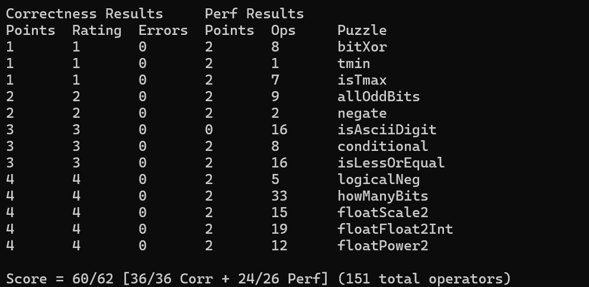
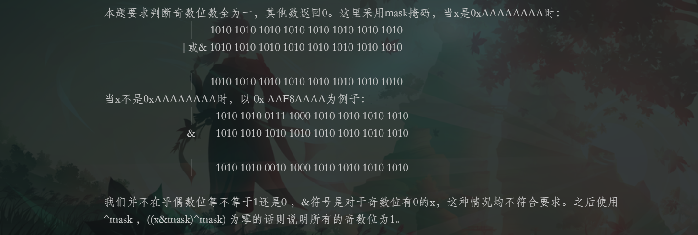
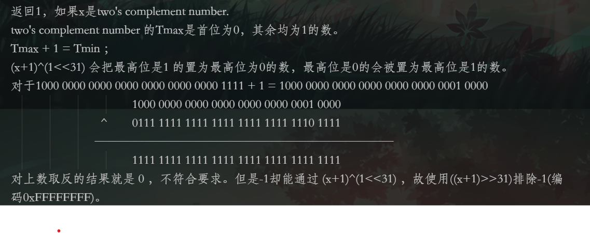

没得满分是因为在isAsciiDigit中使用了`>>`违规符号。没有用`>>`感觉不会写……请求各位大佬对此出谋划策，感谢！
## 写在前面
这部分内容参考[Arthals' ink](https://arthals.ink/blog/data-lab)。
`btest`：用于测试你的函数是否正确。仅在一个小的测试集上进行测试，不能完全保证你的函数是正确的。
```python
# 编译并运行
make && ./btest
# 对某个函数进行单元测试
make && ./btest -f bitXnor
# 对某个函数进行单元测试，且指定测试用例，以 -1 指定第一个参数，依次类推
make && ./btest -f bitXnor -1 7 -2 0xf
```
`dlc`：用于检查你的代码是否符合规范。
```
# 检查是否符合编码规范
./dlc bits.c
```
`driver.pl`：用于评分，检查你的函数是否符合规范且正确。

```c
./driver.pl
```
## BitXor
- `int temp = ~(x & y)`这一步计算的是 `x` 和 `y` 各位同时为1的位置的反，即 `temp` 中的每个位都代表 `x` 和 `y` 对应位不同时为1。换句话说，它标记了 `x` 和 `y` 中至少有一个位为0的位置。
- `int a = ~(x & temp)`这里使用 `x & temp` 获取 `x` 中与 `temp` 相应位都为1的位。由于 `temp` 已经标记了 `x` 和 `y` 中不同时为1的位置，`x & temp` 表示 `x` 是1且 `y` 是0的位置。`~(x & temp)` 则将这些位置置为0，其他位置置为1。
- `int b = ~(y & temp)`类似于上面的 `a`，这里计算的是 `y` 中与 `temp` 相应位都为1的位，即 `y` 是1而 `x` 是0的位置。`~(y & temp)` 将这些位置置为0，其他位置置为1。
- `return ~(a & b);`此步骤中，`a & b` 会在 `x` 和 `y` 中同时为0或同时为1的位上返回1（因为只有这两种情况下，`a` 和 `b` 的对应位同时为0，取反后为1）。因此，`~(a & b)` 将这些位置反转，从而得到 `x` 和 `y` 的按位异或结果，即只有当 `x` 和 `y` 的某位不同时，该位才为1。
```c
int bitXor(int x, int y) {
        int temp = ~(x&y);
        int a = ~(x&temp);
        int b = ~(y&temp);
  return ~(a&b);
}
```

## allOddBits


```c
int allOddBits(int x) {
        int  mask0 = 0xAA;
        int mask1 = mask0 << 8;
        int mask2 = mask0 << 16;
        int mask3 = mask0 << 24;
        int mask =  mask0 | mask1 | mask2 | mask3;
        return  !((x&mask)^mask);
        // ((x|mask)^mask)结果为零的话则说明所有的偶数位均为0
}
```
## Tmax
### answer1


```c
int isTmax(int x) {
        return !((x+1)^(~x) & ((x+1)>>31)) ;
}
```
### answer2
**当 `x` 是 `Tmax`** (`0x7FFFFFFF`):`x + 1` 会变成 `Tmin` (`0x80000000`)，并且 `y ^ (~x)` 会是0，`!!y` 会是1，因此返回1。
**当 `x` 不是 `Tmax`**: 如果 `x` 是其他数，`y ^ (~x)` 会是非零值，或者 `y` 为0（针对 `x = -1` 的情况），结果返回0。
```c
int isTmax(int x) {
        //return ( (!((x+1)^(~x))) & ((x+1)>>31) );
        int y = x + 1;
        return !(y ^ (~x)) & !!y;
}
```

## isMax
我有些违规。。
```c
int isTmax(int x) {
        return ( (!((x+1)^(~x))) & ((x+1)>>31) );
        //int isTmax(int x) {
        //int y = x + 1;
        //return !(y ^ (~x)) & !!y;

}
}
```
## Tmin
```c
int tmin(void) {
  return 1<<31;
}
```

## negate
返回 -x。这个运用书上的结论就好。。
```c
int negate(int x) {
        return ~x+1;
}
```

## isAsciiDigit
0x30 是 0011 0000，0x39是0011 1001。也就是满足第五位和第六位都是1的前提下，第四位如果是零，则剩下三位怎么取都可以。第四位如果是1，剩下的2、3位只能是0，第1位随意。others是用来检测剩下其它位到底是不是1，因为在`make && ./btest`时，对于`-1853013669[0x918d415b]`出错了。
```c
int isAsciiDigit(int x) {
        int others = !(x >> 6);
        int x6 = (x & 0x30)>>5;
        int x5 = (x & 0x10)>>4;
        int x4 = (x & 0x08)>>3; 
        int x23 = !(x & 0x06); //x is '~00~', then x23 is 1;it's good.
        return others & x6 & x5 & ((x4 & x23) | !x4);
// 0011 1010
}
```

## conditional
本题要求实现`same as x ? y : z . Example: conditional(2,4,5)` ，使用`!!`将数映射到`{0,1}`，如果~x+1的结果全为1的话，使用 `&`可以保留`y`的性征，同理z。
```c
int conditional(int x, int y, int z) {
        x = !!x;
        x = ~x+1;
        return (x & y) | (~x & z) ;
}
```

## logicalNeg

只有0与它的补码（它自己）的`|`的最高位为0。
```c
int logicalNeg(int x) {
        return !((x | (~x+1)) >> 31);
}
```
## Floatscale2
通过按位与操作提取符号位、指数位和尾数位：
- `s`：最高位（第31位）为符号位，决定浮点数是正数还是负数。
- `exp`：指数位（第23到30位），决定浮点数的数量级。
- `frac`：尾数位（第0到22位），决定浮点数的小数部分。
处理非归一化数（`exp == 0` 的情况）
- 如果尾数的最高有效位（第22位）为 1，则此时需要将指数加 1，表示进入归一化数状态，同时将尾数左移一位。否则，直接将尾数左移一位，表示乘以 2。
处理归一化数（`exp != 0` 且 `exp != 0x7F800000` 的情况）：
- 正常情况下，指数加 1，表示乘以 2。如果指数加 1 后变为全 1，则表示结果为无穷大，尾数置为 0。
最后没想到是要写`!(exp ^ 0x7F800000)`，写成`!(~(exp & 0x7F800000 ))`不行！？

```c
unsigned floatScale2(unsigned uf) {
        int s = uf & 0x80000000;
        int exp = uf & 0x7F800000;
        int frac = uf & 0x007FFFFF;
        if (exp == 0)
        {
           if (frac & 0x00400000)
           {
                exp += 0x00800000;
                frac = (frac<<1) & 0x007FFFFF;
           }
           else
           {
                frac = frac <<1;
           }
        }
        else if (!(exp ^ 0x7F800000)){
                //  wu qiong
          return uf;
        }
        else {
                exp += 0x00800000;  //如果 `exp == 0x7F800000`，即指数全为 1，表示无穷大或 NaN，直接返回原数值。
                if (exp==0x7F800000){
                        frac = 0;
                }
         return s | exp | frac;       // 最后将符号位、指数位、尾数位重新组合为一个无符号整数返回
}             
```
## floatPower2
```c
unsigned floatPower2(int x)
{
        int exp = x & 0x7F800000;
        int ret;
        exp = exp >> 23;
        if (x>127) return (0xFF<<23);
        if (x<-149) return 0;
        if(x < -126) return 0x1 << (x + 149);
        exp = x + 127;
        ret = exp << 23;
        return ret;

}
```

## howMantBits
最具有难度的一个。
`(b16 + b8 + b4 + b2 + b1 + x + 1)` 正负数都是因为x -> |x| -1 才要补上1的。

```c
int howManyBits(int x) {
        int s = x>>31;
        int b16,b8,b4,b2,b1;
        x = x ^ s; //calculate right shift 这里无形中是算术右移，s=0xFFFFFFFF
        //result is x -> |x| -1 
        b16 = !!(x>>16) <<4;/* 0000 0000 0000 1000 0000 0000 0000 0000 */
        x = x >> b16;
        b8 = !!(x>>8) << 3;
        x = x >> b8;
        b4 = !!(x >> 4) << 2;
        x = x >> b4;
        b2 = !!(x >> 2) << 1;
        x = x >> b2;
        b1 = !!(x >> 1) << 0;
        x = x >> b1;
        return (b16 + b8 + b4 + b2 + b1 + x + 1);

}
```

至此，完成。


