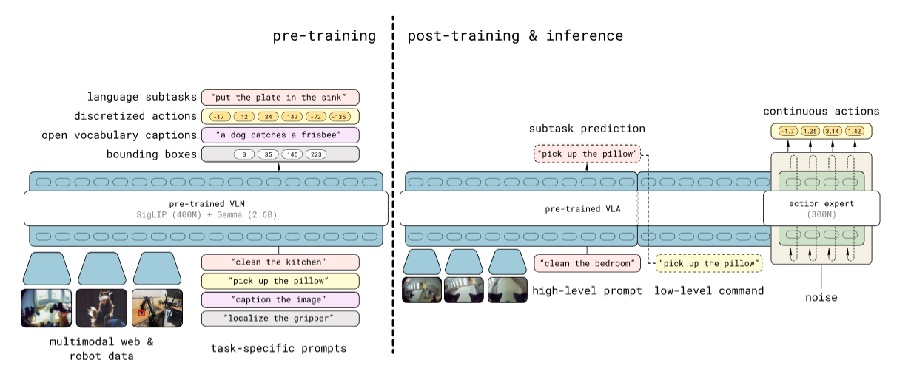

# pi0
如你所见，pi 0 的flow match model VLA包括一个大的VLM backbone 以及一个较小的 action expert组成，VLM backbone有权重初始化。输入为第$t$时刻的1到$n$张image（每个机器人2-3张）加上language，image encoder(是ViT吗？)将图像投影到与text embedding相同的空间中。$q_{t}$是关节角度的向量，也需要encoder和linear projection到text embedding的空间中。$a_{t}^{\tau}$是加噪的动作，$\tau$是流匹配的时间步（？），$\tau$范围是$[0,1]$。
$$\boldsymbol{o}_t = \left[ \left[ \boldsymbol{I}_1^t, \dots, \boldsymbol{I}_n^t, \ell_t \right], \left[ \boldsymbol{q}_t \right], \left[ \boldsymbol{a}_t^\tau, \boldsymbol{a}_{t+1}^\tau, \dots, \boldsymbol{a}_{t+H-1}^\tau \right] \right]$$

$\pi_{0}$的数据集构建的很成功，预训练的数据来源未$\pi 0$数据集以及开源数据集OXE，以量取胜，之后再对于特定任务进行微调。为了使数据结构统一，robot state被对齐到18维度。

$\pi0$采用了多样的语言标签，即任务名称与分段标注（每个两秒）。$A_{t}$为动作片段(chunk)，分为许多action $a_{t}^{\tau}$。每个$a_{t}^{\tau}$对应一个action token，输入到上述模块的action expert中。在action expert中的训练阶段的loss function，是对于两个概率分布的联合平均：$p(A_{t}​∣o_{t}​)$为给定当前观测$o_{t}$时，当前动作$A_{t}$的概率分布。$q(A_{t}^{\tau}|A_{t})$指的是当前动作$A_{t}$给定，未来动作序列的分布。后面的2范数是在度量“模型预测值”与“真实目标值”的差异。
$$L^\tau(\theta) = \mathbb{E}_{p(\boldsymbol{A}_t \mid \boldsymbol{o}_t), q(\boldsymbol{A}_t^\tau \mid \boldsymbol{A}_t)} \left\| \boldsymbol{v}_\theta \left( \boldsymbol{A}_t^\tau, \boldsymbol{o}_t \right) - \boldsymbol{u} \left( \boldsymbol{A}_t^\tau \mid \boldsymbol{A}_t \right) \right\|^2$$
在推理时，真实动作序列通过Euler步进法进行恢复,$\boldsymbol{A}_{t}^{\tau + \delta} = \boldsymbol{A}_{t}^{\tau} + \delta \boldsymbol{v}_{\theta}(\boldsymbol{A}_{t}^{\tau}, \boldsymbol{o}_{t})$，$\delta$=0.1。以下是对上式的解读，不过貌似原论文没找到。

原文提出的一些局限性：大多数知识来源于预训练阶段，微调则负责告诉模型如何用某些知识完成用户的指令。复杂任务的高精度数据(longhorizon移动操作任务)进行微调会导致模型脆弱，以zero shot 方式运行预训练模型并不总能展现出后训练数据中所展示的流畅策略。

> action expert 有两种，一种是自回归的detokenizer,另一种是flow matching 的Diffusion Policy（例如pi0）。流匹配的DP倾向于让model学到一个分布，将噪声流到动作，输出的控制信号是连续的。自回归的Detokenizer是逐token预测，输出空间是离散的token化动作。
> 
> 对于VLA而言，大部分VLA的主干是VLM，另⼀种范式的兴起也不可忽视，也就是World Model的范式，换言之，即使用 Video Prediction Model 作为 VLA 的主干部分，并且辅佐以 DP 或者 Detokenizer 进行 Action 的输出。[参考链接](https://axi404.top/blog/embodied-talk-2#vlm-%E7%9A%84%E4%B8%A4%E7%A7%8D%E8%8C%83%E5%BC%8F)   相关工作有MindJourney 、Unified Video Action Model和Genie Envisioner。但这个idea并不是很新的了。
# $\pi_{0.5}$
揭示了一个端到端学习的robot可以执行长时间范围的灵巧操作技能。

$\pi_{0.5}$做了subtask的划分，高层 VLM 是建模观测 + 整体 task prompt 到 subtask prompt 的分布；低层 VLA 是建模观测 +subtask prompt 到 action 的分布，并且多了action expert。参考$\pi 0$的输入，图像 patch、文本提示和连续动作 token 均使用双向注意力。

$\pi_{0.5}$的范式与$\pi_{0}$几乎差不多，且某种程度上与unified model当前的范式基本一致，VLM在训练VLA数据的过程中输出hidden state，之后使用hidden state作为condition，并且使用流匹配的DP进行action的输出。 

>向前追溯，包括TinyVLA和CogACT等，均是使用相同的思路，使用VLM作为backbone，并且使用DP/flow matching进行action的输出。

## Test-Time Scaling with World Models for Spatial Reasoning
当下VLM在处理诸如预测自我中心运动后场景变化这样简单的任务时常常遇到困难，这是因为它们感知二维图像，但缺乏对三维动态的内部模型。MindJourney通过将VLM与⼀个基于视频扩散的可控世界模型相结合，赋予VLM所缺失的这种能力。

每一个初始动作action被映射成一个相机的姿态变换，一条轨迹被确定为姿态变换序列。尽管原文在原理中意识将相机姿态输入diffusion model中，但文章末尾提到diffusion model会生成许多与查询无关的图像，可见相机位姿并没有在diffusion model中起到很好的限制作用。原文之后又讲到对于轨迹空间进行剪枝，剪枝的标准是对于每次 (轨迹，图像)对创建natural language description，让VLM进行评估。

[Yilun Du 在采访](https://mp.weixin.qq.com/s/t1Y2VGoEeRdaG4aW9xc8Lg?poc_token=HAnR6GijPJZtR7kLV4h3nVVIGchVgLmDTqE82ceC)中指出（尽管个人能量函数那一块有点扯淡），他认为其他大多数任务都在使用video model生成数据或者video based planning，应该做的是使video model做高层直接作为更高层次的planner会好许多。具体来说，给定当前的一帧图像，由video model生成一段未来的视觉视频序列。根据这段预测视频，就可以推断出当前应该采取的动作。因为如果知道未来每一帧应该处于什么位置，那么规划出当前的动作其实是一个相对简单的问题，只需要通过controller进行解析。

## show-o
自回归对于text token是合理的，但其对于image prediction受限于因果注意力，而且diffusion model在image generate方面有着更优越的能力。于是本文想提出一个单一的transformer融合自回归与扩散，同时处理多模态理解和生成任务。

文本仍是用llm处理，图像采用了MAGVIT-v2，将256$\times$ 256图像编码为16 $\times$ 16个离散词元。对于图像文本输入，支持自适应因果注意力和全注意力。

## [NaVILA: Legged Robot Vision-Language-Action Model for Navigation](https://arxiv.org/abs/2412.04453)
- 研究问题：该方法使得四足能够在复杂的环境中进行VLN
- 解决的challenge：是人类语言到四足低级腿部低级action的转化。架构分为两层，上层是VLA：

训练时冻结LLM，对于Vision encoder和projector进行训练，然后就是对于LLM的输入采取规范的格式，LLM生成中间级别的指令流（例如前进75cm），然后将指令转换为固定的命令速度。尽管十分工程化，但其突出了跨平台的适应性。对于不同的机器人只需要替换低级策略，无需重新训练VLM。

数据：采用的数据是youtube、模拟轨迹（R2R-CE/RxR-CE）、辅助数据（ScanQA）和通用 VQA。传感器采用雷达生成的2.5D高度图，解决透明物体（玻璃）和强光环境下的感知问题。

文章里道出：本文提升模型了对复杂指令和场景的理解，且在现有 VLN 任务中优于前人方法，单RGB输入达到了与全景视图、里程计等输入相当的效果。

开源情况：https://navila-bot.github.io/ 部分开源
## [You Only Teach Once](https://arxiv.org/pdf/2501.14208)

- 提出了一种高效的学习范式，从视频中提取目标（单RGB多RGB）、位姿等等特征，迁移到机械臂的动作生成。

视觉动作的模仿学习通过利用标注端到端学习，基于diffusion model，本文提出了BiDP，添加了motion mask，将视觉任务简化为点云。大体框架是：
- 提取动作的3D点轨迹到2D，滤出目标物体的关键帧进行利用[IGEV-Stereo](https://github.com/gangweiX/IGEV)升为点云，粗略估计手部夹角。
- 动作injection：将轨迹简化为关键帧（检测末端执行器速度极值），手眼变换成K个动作，K为10。
- 手臂协调需要掩码，对于拉抽屉而言需要hold one hand. （这没什么）
- 现实中对物体的点云进行平移旋转达到数据增殖
- 将观测点云降采样，diffusion: SIM框架、DDPM和Unet等组件，未详细道出。
实验部分进行的任务都是长序列的复杂任务，相较于pi0，成本更低，自动回放（对每个任务设置不同位置和不同资产进行替代？）生成了许多演示使得数据成本极低。在长期性能比较的定量结果上有显著提升，成功率为35.0%高于EquiBot。在基础五项任务上是76.8%。
- 局限性：
	- 面向固定工作台。
	- 执行器限制：平行夹爪无法完成精细操作。
	- 进行了分布外的物体的测试，但任务结构相同，未涉及任务结构的变换，视觉误差和固定工作台限制其范化能力，有很多组件都有待升级。
## [RobotDancing: Residual-Action Reinforcement Learning Enables Robust Long-Horizon Humanoid Motion Tracking](https://arxiv.org/pdf/2509.20717)
这是一个tiny的工作。

- 解决问题：实现长时程高动态的人形运动追踪，因为关节的电机指令并未起到闭环补偿模型与现实系统之间的Gap。
- 模型部分：
	- 舞蹈动作由LAFAN1 舞蹈集并且利用Unitree的重定向代码生成参考舞蹈动作$G$和base link position.
	- training：对于t时刻，从目标舞蹈动作$G$检索$t+1$时刻的动作用于纠正actor生成的action。将t时刻之前$k$步的参考动作$G_{t-k+1:t+1}$和加噪的前k步观测给到actor，用$G_{t+1}$纠正actor output，由PD转换为底层关节controller给到robot。
	- policy消融实验体现了论文方法收敛速度更快，能在train阶段达到更高的reward，并且误差比baseline小。
- 在宇树的H2 H1 G1上泛化性良好，其他的不好说。
## [Iterative RL for VLA model (iRe-VLA)](https://www.arxiv.org/pdf/2501.16664)
解决问题：通过监督微调可以将VLMs融入低级机器人的控制，VLA的在线RL用于大型VLA可能极其不稳定，因而提出了迭代RL，即本文iRe-vla，在RL和监督微调（SFT）之间迭代。

- 模型结构：
	- 由预训练VLM加上轻量动作头生成底层控制动作，LoRA微调VLM的参数$\theta$与动作头参数$\phi$即可。
	- 在RL和SFT之间迭代：在RL时冻结VLM的$\theta$防止崩溃，只优化动作头（Token Learner 和 MLP）的参数$\phi$，将调出来的轨迹收集到online Database中；采用$D_{b}$内原有数据与新的在线数据$D_{RL}$监督训练，文章说是防止遗忘。
- 实验部分最初在 MetaWorld 和 FrankaKitchen 基准测试中进行了实验。采用三个领域进行测试：专家数据集中观察到的任务、运用强化学习的新任务，以及留出法未见的任务。 观察曲线可以看到RL阶段Unfreeze VLM出现了性能下降。
- 将 iRe-VLA 方法与标准的 PPO 算法进行了比较，确保了实验的公平性。通过对比，结果表明 iRe-VLA 方法在各种任务中表现出了较好的性能。标准PPO在引入RL任务时往往不稳定。

- 消融实验表明，始终冻结VLM进行RL-SFT并没有本文iRe-VLA效果好。
- 局限：无法从零开始学习陌生技能，当前方法更适用于已有技能的微调和优化，而非完全的技能迁移或自主学习新任务。
## [Do generative video models learn physical principles from videos?](https://arxiv.org/pdf/2501.09038)
本文是Google DeepMind的一篇报告，其主页甚至给出了各个模型对于物理理解的Leaderboard，目前在该Benchmark下最好的是VideoPoet，Sora(i2v)的rank并不是很高。
- 论文的结论是：对视频生成式模型，视觉逼真并不等同于物理理解。 
- 本文开发了Physics-IQ Benchmark，用于测评模型的物理理解能力。

模型将看到3秒的图像并且对于接下来5秒的视频进行延续。

