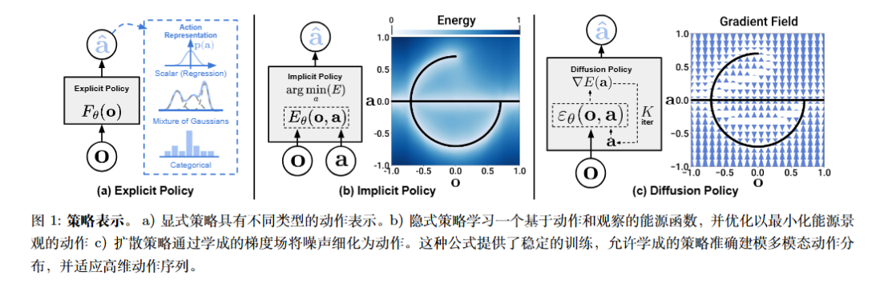
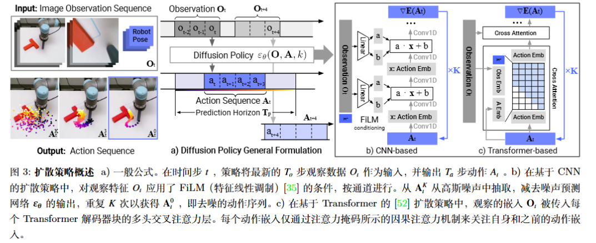
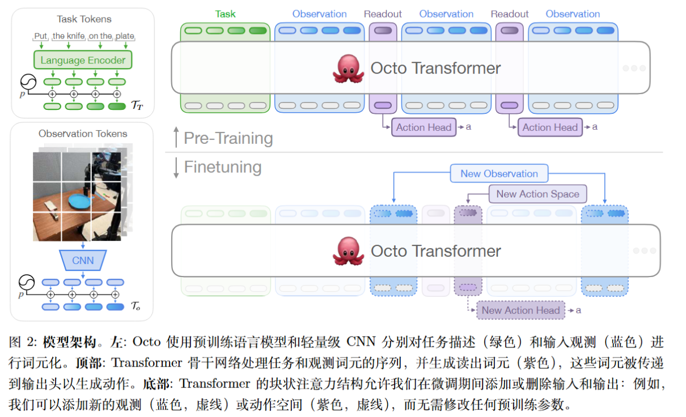
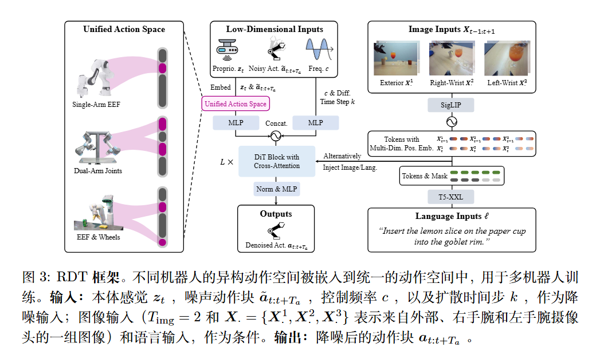
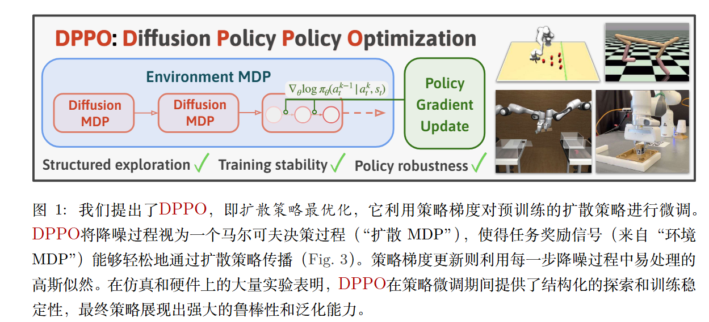
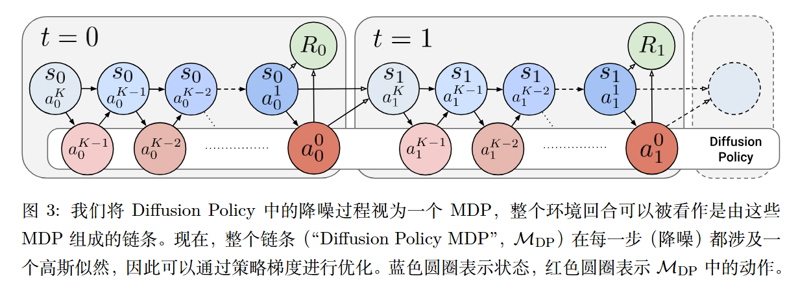

## Local Policies Enable Zero-shot Long-horizon Manipulation
- 问题：sim2real中面临挑战，主要源于难以模拟复杂的接触以及“生成真实的任务分布”。
- 贡献：ManipGen，其利用一种新的局部策略，使得sim2real能够迁移以及zero-shot。在仿真中训练agent便可以实现迁移规模化，提出了在仿真中训练的policy；进而同VLM和运动规划器结合进行部署。
在仿真中训练了数千个RL expert，采用PPO，通过DAgger将单任务RL expert蒸馏为用于迁移的视觉动作policy，使模型能够跨物体适应多种技能。VLM将动作分解实现基于text的长时程操作以及局部的sim2real迁移。

对于语言目标$g$和观测$O$，使得VLM预测$k$个语言子目标$\sum\limits_k {{g_k}}$，从$g_{k}$中提取子策略，子目标被LLM结构化为(物体，技能)元组。每次的输入为第$k$子目标$g_{k}$和当前观测$O^t$，操作分为两个阶段$\pi_{reach}$和$\pi_{loc}$，$\pi_{reach}$需要接近物体并靠近目标位姿$X_{targ,k}$(采用Grounded SAM对点云分割)，运动规划器则是Neural MP。接着由$\pi_{loc}$进行丰富的交互。如此分配，不同场景下的相同任务$\pi_{loc}$相对固定，仅需观察交互区域周围的环境，采用的是腕部相机的深度图。

对于上文中提到的训练RL expert的阶段一，聚焦于抓取、放置、打开、关闭把手的基础任务，基础数据是使用 3.5K 个多样化对象（UnidexGrasp 数据集），随机生成初始位姿与障碍物；以及2.6K 个门/抽屉把手（PartNet 数据集），随机化尺寸、形状、摩擦系数等物理属性。观测$O$则是单一观测，并引入特权信息（物体的网格进行位姿采样）。奖励function则综合了：特定末端执行器的位姿+特定关节配置和特定物体位姿+末端执行器相对于物体的运动+是否成功+惩罚动作。

RL expert的阶段二如何蒸馏，传统 DAgger 在多任务场景下不稳定（不同任务的初始状态差异大），改进方法为回放缓冲区（存储最近 K$\times$B 条轨迹），交替进行策略更新和与新数据收集，平衡在线与离线学习。换而言之就是边训练边采样，每采到一批新轨迹，就在当前经验池$K$批上训练一次，如果经验池满了则删去最旧的，再放入最新的，然后训练一次。$K=100$时效果最佳。除此之外对于边缘像素丢失进行了处理。

论文对于现有方法的分析是：SayCan在初始位姿不理想或者任务需要丰富的接触控制时不理想；LLMTrajGen在避障上做的不好。传统的sim2real 方法如 Transic，IndustReal 需任务特定训练或真实世界修正数据，无法 zero shot。

未来：解决透明/反光物体的深度感知问题（如 RGB-D 融合）；引入在线自适应机制（如实时策略微调）减少模块化系统的级联错误。

##  Adaptive Compliance Policy:Learning Approximate Compliance for Diffusion Guided Control
对于robot需要精确的力控制的任务，大多数imitation learning需要以位置为中心，缺乏显式的力感知能力，并且协作机械臂添加力和力矩传感器通常成本较高且需要额外的硬件设计。本论文通过关节力矩估计末端执行器的力，同时利用数字孪生预测力矩进行补偿。

本论文是双环的框架，外层是输入image，末端位姿和受力，以25Hz去predict下一个动作；接着将目标位姿输入内环，内环的阻抗扭矩控制器，运行频率为 `2 kHz`,重力补偿则是`250Hz`，输出为生成力矩指令，即“力入-力出”的结构。这一套有两种互补的力反馈机制：手持控制器提供触觉反馈，在虚拟现实中提供视觉反馈，也就是力向量可视化。

外环：外部力估计量提供交互力，与正向运动学（FK）输出融合，并通过多层感知机（MLP）层进一步处理。视觉观测由双残差网络主干网络编码，并通过交叉注意力模块与估计的力嵌入进行融合，多模态加噪输入transformer encoder。内环是将预测的动作位姿通过逆向运动学进行跟踪，给到阻抗扭矩控制器。

仿真中的数据采集基于mujoco，数据采集一共采集了150条轨迹，每一条轨迹包含同步的 RGB图像、笛卡尔位置、关节力矩、末端执行器力/力矩以及操作员指令。

对于仿真与实机实验结果，一共设置了三组：末端执行器position、末端执行器position+关节力矩、末端执行器position+末端执行器力，输入图像均为RGB图像。
- 仅使用末端执行器位置组仿真68%，到实机成功率掉得厉害；加入关节力矩观测量的第二组并没有加入末端执行器的第三组好，第三组的仿真成功率为90%，实机成功率为80%。一种解释是原始的关节转矩收到运动链的影响导致噪声较大且含义模糊。

本论文只是一个对于力控的trival性探索，可以看见其框架均为手搭，未来能在任务、结合VLA的指令等方向上进行探索。
## Diffusion-Based Impedance Learning for Contact-Rich Manipulation Tasks
 > diffusion policy的开山之作。
  
 原文链接：[Diffusion-Based Impedance Learning for Contact-Rich Manipulation Tasks](https://arxiv.org/abs/2509.19696)
 
 解决的问题：对于富接触和操作任务中，机器人不仅要生成运动轨迹（信息域），还要通过力/力矩控制与环境交互（能量域）。传统的运动擅长于路径和姿态生成，往往不专注于物理上的交互力学，其生成的轨迹无法保证力、阻抗参数合适。经典的阻抗控制（Impedance Control）方法能够很好地调节交互刚度与阻尼，但通常需要人工手工调参或为每个任务单独设计阻抗参数。因而本文希望提出一个能够统一学习运动轨迹与实时调节力参数的框架，这个框架是基于diffusion model的，该框架的关键要素是方向性刚度自适应。

文章中有一些概念：
- ZFT：名义上的零力轨迹：一种程序化的平衡运动，在执行过程中保持不变，可通过基于帧的编程、模仿学习学到
- sZFT simulated的零力轨迹，并未被预先编程，而是由扩散模型根据观测到的位姿和外部力矩重构得到，并且仅作为刚度估计的输入。

整体流程是：
- 首先有机器人执行动作、产生轨迹 ＋ 外力 力矩观测。
- 利用一个diffusion model来重构sZFT。
	- 在diffusion中，输入为轨迹tokens+力矩（上下文），噪声分为平移和旋转，旋转噪声的添加则是基于SLERP方法。
- 基于这个重构的 sZFT 和当前观测（位姿偏差＋外力 外力矩），通过一个能量-基的控制模块，计算或调整刚度$K_{t}$和旋转刚度$K_{r}$，给到阻抗控制器使其实时追踪、适应接触状态。
- 控制器在任务空间按计算出来的阻抗参数执行轨迹跟踪交互。

对于扩散模型：将信息域和能量域连接起来，学习预测观测位姿$(p,q)$与真实值平衡位姿之间的差异(可以由外部的力矩$F_{ext}$得到)，推理阶段则对位姿差进行去噪，输出重构的sZFT。在碰到意外障碍物时，规划的 ZFT 会使其进入接触状态，产生一个外部力矩。在该力矩的条件下，扩散模型重构出 sZFT，接着将sZFT输入到能量-基的“刚度估计”模块中。

实验是在跑酷和插销插入两种任务上，论文研究了各个轴基于任务在时间维度上对于sZFT的贡献。

# Adaptive Compliance Policy: Learning Approximate Compliance for Diffusion Guided Control

- 研究的问题：目前主流的视觉-运动策略通常仅预测位置和姿态，但精密的接触需要控制接触力或者力矩以满足合规性(compliance)。
- 贡献：提出了Adaptive Compliance Policy（ACP）这一新框架，动态地和空间地调整合规参数，以适应不同任务阶段和接触方向；提出了一种能够从人类示范中标注合规参数的方法，使得演示具有两个有用属性——“避免大的接触力”和“鼓励精准跟踪”。

模型训练方面采用了体感教学+估算出的合规标签进行策略网络监督训练；观测数据鱼眼 RGB 图像，机器人末端执行器位姿，以及力/力矩数据。论文中的机械臂为一个RGB摄像头、一个力矩传感器，通过人类示范估计合规性。 对于刚度方向，在力反馈方向上使用低刚度$k_{low}$，而在其他方向上使用高刚度$k_{high}$。  

策略网络（ACP）输出不仅是参考目标位姿（reference pose），还包括一个虚拟目标位姿（virtual target pose）和刚度值（stiffness）方向性合规参数，一共是19维向量。虚拟目标与参考目标的方向差编码出合规方向。虚拟目标位姿实际上是将一个力目标转换为位置目标（原文表述是虚拟目标位姿的计算方式是，当机器人在跟踪虚拟目标时，若达到参考位姿，则会施加参考力。这实际上
将一个力目标转换为位置目标）。 

输出这些高层策略之后，通过经典的低层高频合规控制器（如阻抗/顺应控制器）执行，从而真正“位置控制 + 力控制”并行。 因此，体系从“示范 → 合规标签估算 → 策略学习 → 输出参考＋合规参数 → 控制器执行”形成完整流程。

实验部分则是分了四组，在物品翻转任务中，(ACP w.o FFT)(对力信号不使用fft而是时间卷积)的性能与$ACP$相似。在擦拭花瓶任务中，采用FFT编码的ACP更优，FFT 编码与 RGB 编码通过交叉注意力结合使用时，能够更好地判断下一个最佳擦拭位置。

# Diffusion Policy: Visuomotor Policy Learning via Action Diffusion
> 继diffusion policy后的作品，提出了DDPMs(decoder diffusion policy model)，把扩散模型作为 visuomotor policy 的开创性工作之一。

解决的问题：在机器人视觉-运动（visuomotor）策略学习（如模仿学习 行为克隆）中，一个关键难点是 动作 动作序列分布往往是多模态的（即给定一个观察，可能有多种合理动作或轨迹）。普通的策略回归（预测平均动作）容易产生 “模糊” 或 “平均化” 的动作，从而性能下降。并且动作空间可能很高维，需要有更好地拓展框架用于适应之后的任务。

本文将图像生成模型DDPM从图像生成等领域转移到“策略生成 动作生成”这一场景。核心想法是：如果我们把“给定观察 → 生成动作”看作一个「从随机噪声 → 动作序列」的生成过程，那么扩散模型天然具备“从噪声逐步生成复杂分布”的能力。

本文引入视觉条件化（视觉输入 + 状态输入 → 动作输出的扩散模型）以适应真实机器人任务。时间序列扩散 Transformer以处理动作序列（而不仅单步动作）及其时间依赖性。滚动视野控制：策略并不是一步预测最终动作，而是在滚动控制模式下预测一段动作序列，执行部分，再重新预测。该设计使模型更适应在线控制环境。

- 数据收集：从演示中收集视觉观察 $O$状态 $s$（及对应动作序列 $a_{0},a_{1},…a_{T−1}​$（可为多步动作段）。
- 训练阶段，构建一个条件扩散模型：输入包括当前观察 O (视觉 +状态) 及噪声化的动作序列$x_{t}$​ (在正向过程中) + time-step t。在正向过程：按预定噪声 schedule 把真实动作（或动作序列）扰动为 $x_{t}$​（t从0到T噪声步骤）。
- 在反向训练阶段，模型预测噪声或动作得分梯度（score），损失通常为 MSE 噪声预测损失。该网络为视觉条件 + $x_{t}$+ t → 估计噪声。
- 推理、采样阶段：给定当前观察$o$，初始从高斯噪声 $x_{T}∼N(0,I)$开始。进行 K 次去噪迭代在每一步用网络预测 score (或噪声) → 更新 $x_{t−1}=x_{t}+step-size∗score+noise$。得到最终 $x_{0}$​ 作为动作序列（或动作）。在滚动视野控制模式中，模型生成一个动作段（n 步），只执行首步或首若干步，然后再由新的观察重新生成。
- 此外，论文发现Diffusion policy的特性有：位控优于速度控制，位控的动作多模态性更为明显。对于空闲动作鲁棒，时空动作一致性。

主要局限性部分分两点：实时性：扩散模型本质上需要多步迭代去噪，在真实机器人实时控制场景中可能延迟较高。论文虽然使用滚动控制、短序列预测等设计缓解，但仍不是 “一步预测” 的即时策略。资源需求：训练条件扩散模型、视觉 encoder、Transformer 架构，对计算资源要求较高。执行采样也较重。

# 3D Diffuser Actor: Multi-task 3D Robot Manipulation with Iterative Error Feedback
解决的问题：位置+动作预测，机器人操作通常要求预测三维平移+三维旋转，动作空间高维。2D图像或者低维姿态的策略难以泛化，使用3D场景(多摄像机)表示能够更好地泛化。论文提出一种策略模型：能够基于 3D 场景表示 + 语言任务指令，用diffusion policy预测末端执行器的 3D 平移＋旋转轨迹，从而提升多视角、强泛化的机器人操作能力。

创新点：在每一步迭代的去噪过程中，模型将末端执行器当前估计姿态视作 3D 场景中的一个 token，与 3D 场景视图 token + 语言指令 token 一起输入。

在每一个去噪iteration 中，模型会将当前末端执行器姿态估计视作一个 3D scene token，然后基于场景中 3D 视觉 token、语言 token、动作历史 token，通过 3D 相对位置注意力计算出 “平移误差 + 旋转误差”，然后将这个误差用作修正量，对估计姿态做更新。误差是末端执行器姿态轨迹估计（模型在去噪步骤 $t$的输出状态）去预测它与真实目标之间的误差。然后用这个误差来“修正”当前估计。

局限性：采样速度，实时性、训练，部署资源成本等。

# Octo: An Open-Source Generalist Robot Policy
在机器人操作与视觉-动作策略学习领域，通常的方法是为每一种机器人、每一种任务、每一种传感器配置专门训练一个策略。这种 “专属” 策略方式导致数据收集量大、效率低、难以泛化、模型迁移、微调困难，因此，作者提出希望构建一个通用机器人策略模型，用户不必从零开始训练，而是基于该模型做少量微调即可。

机器人领域也正朝向“Foundation 模型”方向：即先在多任务、多模态、大规模数据上预训练一个通用模型，再在下游做少量任务特定适配。Octo 正是朝这个方向迈出一步。

Octo 有着极高灵活性、模块化设计，架构设计允许 改变传感器输入改变动作空间，实验中，Octo 在新机器人、新任务、新输入输出配置上只用了约 100 条演示即进行微调，并在数小时内完成。官网给出微调成功率显著高于从零训练。

大致pipeline：
- 输入 tokenizers：将语言、目标图像、视觉序列、机器人状态等转换为 token 表示。 (“tokenizer”模块)
- Transformer 主干网络：以 sequence 模型形式处理这些 token（包括观测序列 +任务指令 +目标）— block-wise masked attention 结构使得历史观测、当前观测与任务指令被正确编码。
- Readout token: 模型中加入可学习的 “readout tokens” 用于动作预测。然后接一个 “diffusion decoding head” 或连续动作预测头来输出动作。
- 输出：动作序列或动作片段（可以是末端执行器动作或关节位置控制）。
- 预训练：在大规模数据上训练 Transformer + 动作头，目标是学习从观察指令 → 动作分布。因为动作空间是连续且多模态，采用扩散解码比简单回归更合适。 
- 微调：利用预训练模型作为初始化，插入或修改少量的 tokenizer/输出头以适配新的输入输出，再微调模型。
主要局限性：对于动作输出/实时控制可能难以代替专门设计策略，尽管模型规模比某些超大模型小很多，但预训练仍需大量数据与计算资源，微调虽快但仍需一定硬件支持。

# 3D Diffusion Policy : Generalizable Visuomotor Policy Learning via Simple 3D Representations
主要解决问题：传统的视觉模仿学习通常需要大量人类演示才能学出稳定的策略，并且这些策略在训练分布之外往往泛化能力差且容易产生越界、碰撞的问题。

核心动机：将视觉模态转向3D，如点云、体素、深度＋位姿等信息。采用Diffusion Policy，并且希望少样本也能取得不错效果。

环境以单摄像机获取深度图，将深度图通过相机内外参转为点云并且对点云进行裁剪+下采样，之后使用一个轻量点编码器（MLP）将点云映射到一个紧凑的特征向量（3D 表示）。**决策模块**基于 diffusion-based policy 架构，模型从噪声中逐步“去噪”生成动作序列预测，模型输出的动作可以是相对 end-effector 位置、手部关节角度、抓取动作等，视任务而定。

创新点：通过消融分析，展示“简单点云表示”胜过更复杂的 3D 表示（如体素、深度图直接、或其它点编码器）在本任务中的效果。用单视图深度→点云转换，而不是多视图、复杂扫描，增强实用性。使用稀疏点云（而不是密集体素／隐式场） + 高效编码器—强调“简单”3D 表示即可取得好效果。 将该 3D 表示作为条件输入给 diffusion 模型，用于生成 动作序列，而不仅是静态动作。在真实机器人上验证其泛化能力。

之后工作：点云表示有可能并非最优的 3D 表示，并且diffusion的推理频率的控制频率仍待探究。
# RDT-1B: a Diffusion Foundation Model for Bimanual Manipulation

解决的问题：双臂机器人操作的场景下如何学习一个泛化性强的policy，并且当前双臂数据集匮乏现有方法泛化能力差，多臂系统并没有设计统一的框架进行表示。因此，本研究的目标是构建一个双臂操控的「大模型」——即一个规模大、预训练于多机器人数据、然后能用于双臂任务 fine-tune 或甚至 zero-shot 的策略模型。

不同机器人、不同操作平台具有不同的动作维度、不同类型。论文设计了一个 “Physically Interpretable Unified Action Space”，将各种动作映射到统一表示，使预训练数据能够跨机器人共享。具体而言就是“意义槽”，即这个空间的每个“槽”都有固定“物理意义”，文章是128维。为了让统一空间也能涵盖机器人的状态与动作，RDT-1B 将 “当前状态” 与 “要输出的动作” 放在同一空间结构内。动作以 “动作 chunk”（action chunk）形式输出——即模型一次预测一段时间内的动作序列，而不仅单步动作。

主要启示：大模型 + 多数据 +统一表示 是提升泛化能力的关键，扩散模型可用于控制任务。并且大规模预训练 + fine-tune 可实现少样本新任务的泛化。

# ALOHA Unleashed: A Simple Recipe for Robot Dexterity
解决的问题：尽管模仿学习在机器人上成功许多，但大多定位于“推放抓取”类的任务，并非高灵巧任务。仅靠标准模仿学习 + 少量数据”是否能胜任这种“高度灵巧 + 双臂 +变形物体”的任务？如果不能，怎样的“规模＋模型”组合足够？

创新点：任务难度更高，你可以看到系鞋带、随机厨房的任务。开环执行，模型预测一个长度为 50 动作的 chunk，然后机器人执行，无需每步反馈重规划，这简化了控制流程。

大致pipeline：
- 输入：4 幅 RGB 图像（每幅 480×640) + 机器人本体状态 。
- 视觉编码：每个图像用 ResNet50 提取特征 。
- Transformer 编码器：将所有视角特征 + proprioceptive embedding（被投影为 1 个 embedding）拼接、加位置编码，输入 Transformer Encoder。
- Diffusion Policy Decoder：在 action chunk 模式下（一个 chunk 长度为 50 步动作，每步 14 维：12 维关节位置(6dof ×2臂) + 2 维夹爪位置) 。模型以 “noised” action chunk + observation embedding + diffusion timestep 作为输入，输出预测的噪声，进行反向去噪流程。
- 推理：从初始噪声采样 action chunk →通过 50 次 diffusion 去噪 →输出动作序列 →机器人执行这 50 步动作。整套前向 + 50 步去噪耗时约 0.043 秒。
其为每个任务都训练了一个独立的扩散策略，使用了隐式扩散去噪DDIM，

主要局限性：尚未实现 “一个模型覆盖多任务” 的情形，所需数据成本仍然较高，需要许多人类操作员。
# Diffusion Policy Policy Optimization(扩散策略最优化)
动机：已有基于扩散模型的策略在机器人控制/连续控制任务中显示出优势，但是，这类扩散策略在后续用传统强化学习方法（例如策略梯度、PPO）做 fine-tune 或在线调优时，存在效率低的问题。该论文解决的问题是，如何设计一个高效、稳定、适合将预训练的扩散策略用于机器人/连续控制任务的强化学习优化框架？让扩散策略通过 RL Fine-tuning 真正变得可用、高效且可靠——解决“扩散策略虽优秀但难以用 RL 优化”这个瓶颈。
大致pipeline：
- 预训练阶段行为克隆或演示数据训练一个扩散策略。
- 微调阶段：
	- 将预训练的扩散策略作为初始策略 $π_{θ}$​。
	- 在环境中采样轨迹（状态、动作、奖励）与扩散策略交互。
	- 由于策略为扩散模型，其内部可视为“denoising”过程（多步采样）—作者将其视为 “inner MDP”。
	- 使用策略梯度 PG方法对该策略进行优化。
	- 在训练过程中，DPPO 强调“结构化探索”：策略样本仍然保持在数据流形上（由预训练演示数据定义），而不是随机跳出流形，从而避免产生无效/危险动作。
	- 训练结束后，得到 fine-tuned 的扩散策略，可用于部署。

局限性：模型依赖于预训练、扩散策略本身计算量大等。