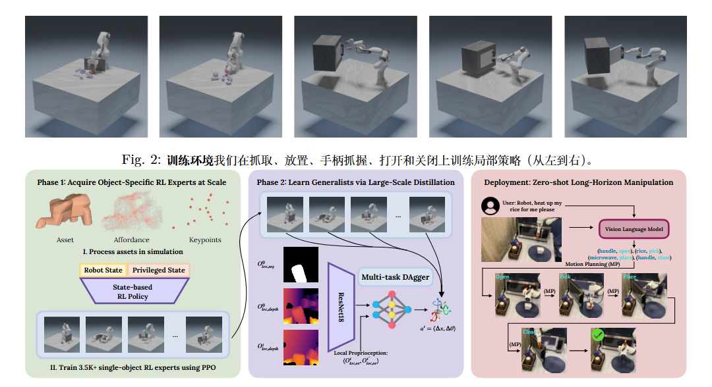
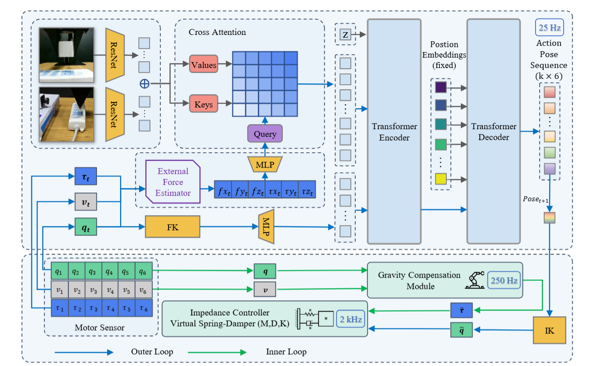
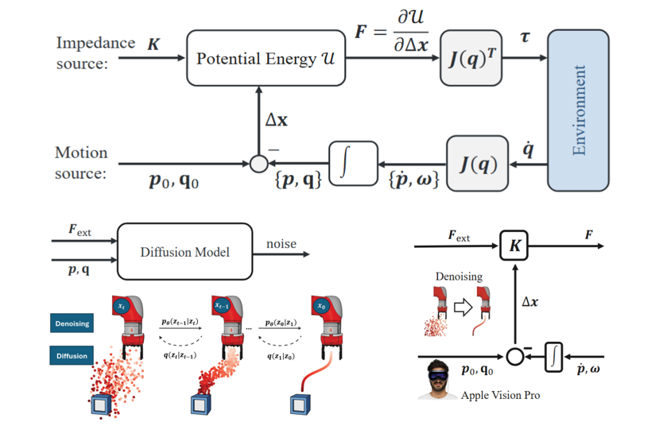
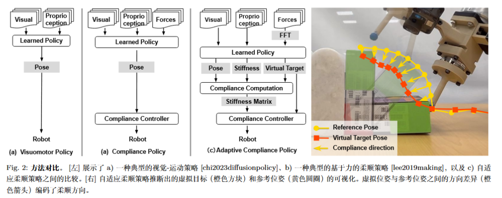

## [Local Policies Enable Zero-shot Long-horizon Manipulation](https://arxiv.org/abs/2410.22332)
- 问题：sim2real中面临挑战，主要源于难以模拟复杂的接触以及“生成真实的任务分布”。
- 贡献：ManipGen，其利用一种新的局部策略，使得sim2real能够迁移以及zero-shot。在仿真中训练agent便可以实现迁移规模化，提出了在仿真中训练的policy；进而同VLM和运动规划器结合进行部署。
在仿真中训练了数千个RL expert，采用PPO，通过DAgger将单任务RL expert蒸馏为用于迁移的视觉动作policy，使模型能够跨物体适应多种技能。VLM将动作分解实现基于text的长时程操作以及局部的sim2real迁移。

对于语言目标$g$和观测$O$，使得VLM预测$k$个语言子目标$\sum\limits_k {{g_k}}$，从$g_{k}$中提取子策略，子目标被LLM结构化为(物体，技能)元组。每次的输入为第$k$子目标$g_{k}$和当前观测$O^t$，操作分为两个阶段$\pi_{reach}$和$\pi_{loc}$，$\pi_{reach}$需要接近物体并靠近目标位姿$X_{targ,k}$(采用Grounded SAM对点云分割)，运动规划器则是Neural MP。接着由$\pi_{loc}$进行丰富的交互。如此分配，不同场景下的相同任务$\pi_{loc}$相对固定，仅需观察交互区域周围的环境，采用的是腕部相机的深度图。

对于上文中提到的训练RL expert的阶段一，聚焦于抓取、放置、打开、关闭把手的基础任务，基础数据是使用 3.5K 个多样化对象（UnidexGrasp 数据集），随机生成初始位姿与障碍物；以及2.6K 个门/抽屉把手（PartNet 数据集），随机化尺寸、形状、摩擦系数等物理属性。观测$O$则是单一观测，并引入特权信息（物体的网格进行位姿采样）。奖励function则综合了：特定末端执行器的位姿+特定关节配置和特定物体位姿+末端执行器相对于物体的运动+是否成功+惩罚动作。

RL expert的阶段二如何蒸馏，传统 DAgger 在多任务场景下不稳定（不同任务的初始状态差异大），改进方法为回放缓冲区（存储最近 K$\times$B 条轨迹），交替进行策略更新和与新数据收集，平衡在线与离线学习。换而言之就是边训练边采样，每采到一批新轨迹，就在当前经验池$K$批上训练一次，如果经验池满了则删去最旧的，再放入最新的，然后训练一次。$K=100$时效果最佳。除此之外对于边缘像素丢失进行了处理。

论文对于现有方法的分析是：SayCan在初始位姿不理想或者任务需要丰富的接触控制时不理想；LLMTrajGen在避障上做的不好。传统的sim2real 方法如 Transic，IndustReal 需任务特定训练或真实世界修正数据，无法 zero shot。

未来：解决透明/反光物体的深度感知问题（如 RGB-D 融合）；引入在线自适应机制（如实时策略微调）减少模块化系统的级联错误。

##  Adaptive Compliance Policy:Learning Approximate Compliance for Diffusion Guided Control
对于robot需要精确的力控制的任务，大多数imitation learning需要以位置为中心，缺乏显式的力感知能力，并且协作机械臂添加力和力矩传感器通常成本较高且需要额外的硬件设计。本论文通过关节力矩估计末端执行器的力，同时利用数字孪生预测力矩进行补偿。

本论文是双环的框架，外层是输入image，末端位姿和受力，以25Hz去predict下一个动作；接着将目标位姿输入内环，内环的阻抗扭矩控制器，运行频率为 `2 kHz`,重力补偿则是`250Hz`，输出为生成力矩指令，即“力入-力出”的结构。这一套有两种互补的力反馈机制：手持控制器提供触觉反馈，在虚拟现实中提供视觉反馈，也就是力向量可视化。

外环：外部力估计量提供交互力，与正向运动学（FK）输出融合，并通过多层感知机（MLP）层进一步处理。视觉观测由双残差网络主干网络编码，并通过交叉注意力模块与估计的力嵌入进行融合，多模态加噪输入transformer encoder。内环是将预测的动作位姿通过逆向运动学进行跟踪，给到阻抗扭矩控制器。

仿真中的数据采集基于mujoco，数据采集一共采集了150条轨迹，每一条轨迹包含同步的 RGB图像、笛卡尔位置、关节力矩、末端执行器力/力矩以及操作员指令。

对于仿真与实机实验结果，一共设置了三组：末端执行器position、末端执行器position+关节力矩、末端执行器position+末端执行器力，输入图像均为RGB图像。
- 仅使用末端执行器位置组仿真68%，到实机成功率掉得厉害；加入关节力矩观测量的第二组并没有加入末端执行器的第三组好，第三组的仿真成功率为90%，实机成功率为80%。一种解释是原始的关节转矩收到运动链的影响导致噪声较大且含义模糊。

本论文只是一个对于力控的trival性探索，可以看见其框架均为手搭，未来能在任务、结合VLA的指令等方向上进行探索。
## Diffusion-Based Impedance Learning for Contact-Rich Manipulation Tasks
 原文链接：[Diffusion-Based Impedance Learning for Contact-Rich Manipulation Tasks](https://arxiv.org/abs/2509.19696)
 
 解决的问题：对于富接触和操作任务中，机器人不仅要生成运动轨迹（信息域），还要通过力/力矩控制与环境交互（能量域）。传统的运动擅长于路径和姿态生成，往往不专注于物理上的交互力学，其生成的轨迹无法保证力、阻抗参数合适。经典的阻抗控制（Impedance Control）方法能够很好地调节交互刚度与阻尼，但通常需要人工手工调参或为每个任务单独设计阻抗参数。因而本文希望提出一个能够统一学习运动轨迹与实时调节力参数的框架，这个框架是基于diffusion model的，该框架的关键要素是方向性刚度自适应。

文章中有一些概念：
- ZFT：名义上的零力轨迹：一种程序化的平衡运动，在执行过程中保持不变，可通过基于帧的编程、模仿学习学到
- sZFT simulated的零力轨迹，并未被预先编程，而是由扩散模型根据观测到的位姿和外部力矩重构得到，并且仅作为刚度估计的输入。

整体流程是：
- 首先有机器人执行动作、产生轨迹 ＋ 外力 力矩观测。
- 利用一个diffusion model来重构sZFT。
	- 在diffusion中，输入为轨迹tokens+力矩（上下文），噪声分为平移和旋转，旋转噪声的添加则是基于SLERP方法。
- 基于这个重构的 sZFT 和当前观测（位姿偏差＋外力 外力矩），通过一个能量-基的控制模块，计算或调整刚度$K_{t}$和旋转刚度$K_{r}$，给到阻抗控制器使其实时追踪、适应接触状态。
- 控制器在任务空间按计算出来的阻抗参数执行轨迹跟踪交互。

对于扩散模型：将信息域和能量域连接起来，学习预测观测位姿$(p,q)$与真实值平衡位姿之间的差异(可以由外部的力矩$F_{ext}$得到)，推理阶段则对位姿差进行去噪，输出重构的sZFT。在碰到意外障碍物时，规划的 ZFT 会使其进入接触状态，产生一个外部力矩。在该力矩的条件下，扩散模型重构出 sZFT，接着将sZFT输入到能量-基的“刚度估计”模块中。

实验是在跑酷和插销插入两种任务上，论文研究了各个轴基于任务在时间维度上对于sZFT的贡献。

# Adaptive Compliance Policy: Learning Approximate Compliance for Diffusion Guided Control
- 研究的问题：目前主流的视觉-运动策略通常仅预测位置和姿态，但精密的接触需要控制接触力或者力矩以满足合规性(compliance)。
- 贡献：提出了Adaptive Compliance Policy（ACP）这一新框架，动态地和空间地调整合规参数，以适应不同任务阶段和接触方向；提出了一种能够从人类示范中标注合规参数的方法，使得演示具有两个有用属性——“避免大的接触力”和“鼓励精准跟踪”。

模型训练方面采用了体感教学+估算出的合规标签进行策略网络监督训练；观测数据鱼眼 RGB 图像，机器人末端执行器位姿，以及力/力矩数据。

策略网络（ACP）输出不仅是参考目标位姿（reference pose），还包括一个虚拟目标位姿（virtual target pose）和刚度值（stiffness）方向性合规参数。虚拟目标与参考目标的方向差编码出合规方向。 输出这些高层策略之后，通过经典的低层高频合规控制器（如阻抗/顺应控制器）执行，从而真正“位置控制 + 力控制”并行。 因此，体系从“示范 → 合规标签估算 → 策略学习 → 输出参考＋合规参数 → 控制器执行”形成完整流程。

- 作者在两个真实机器人操作任务（如 item flipping 和 vase wiping）中测试了该方法。 
- 实验结果表明：相比于仅位置控制的视觉-运动基线，ACP 在成功率上有超过 50% 的提升。 
- 这说明：通过动态调整合规，而不是用固定刚度／忽视力反馈，能更好地应对接触扰动、不确定的环境和任务变体。
