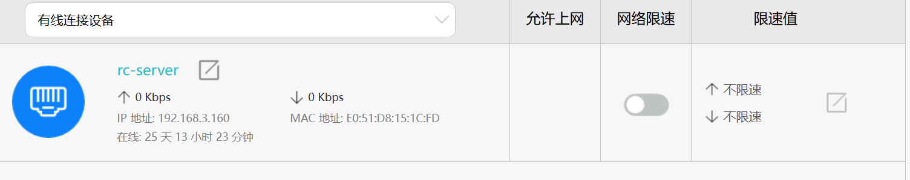
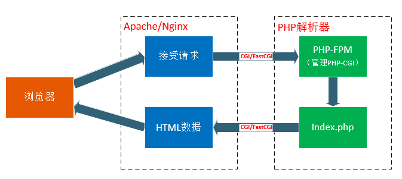

# RC 网络仓库服务介绍

## Intro 服务是什么

本文档介绍的对象是一组部署在服务器上，用于RC视觉组共享与传承工作成果的Web服务。主要提供了私有远程git仓库服务(gogs)，文档与博客分享服务(hugo)，与文件下载服务，并最终通过 nginx (读作 Engine X) 集成到服务器的一个端口上。目前，该服务仅通过端口转发的形式，将运行在ROBOCON局域网下的服务器服务端口借由路由器（校园网域）暴露到一个校园网ip，每次路由器重启，校园网中的服务ip都会变化。

## Aim 部署目的

- 私有远程git仓库服务（以下以 git-service 代称）：核心目的是用于收集视觉组各年工作项目，防止之前的方案随时间丢失。由于github，gitcode等网站的“组织”功能往往需要按时间付费，并且具有人数限制，因此采用 [gogs][1-1] 作为队内专用的git仓库。这个服务能够帮助团队协作开发（需要有git使用能力），跟踪各个组员进度。
- 文档与博客分享（以下以 doc-service 代称）：鼓励记录分享自己的经验，以及阅读他人的经验。采用 [Docs][2-2] 这一仓库，其可以将简单的markdown 文档生成美观的静态网站。
- 文件下载服务(以下以 file-service 代称)：除了保存资源文件，还可以把配置好的系统镜像，docker镜像放在里面，这样就可以免去配置环境的烦恼。现在采用的FileBrowser是一个充满bug的程序，打算换其他的。

## Description 详细介绍

### ssh 登录


从队里华为路由器登录界面（华为路由器默认局域网ip为192.168.3.1）可以看到，通过有线方式连接的 rc-server 记录其 ip 地址，可以在连接 ROBOCON 局域网的情况下访问服务器。主用户用户名是robocon，密码是qingchun，服务均部署在git用户下，git用户无法直接通过ssh登录，需要登录后切换。ssh 端口经过路由器转发到 22 端口，为了防止枚举用户名与密码破解，通过端口转发方式访问的连接都只能通过 public-key 方式进行登录认证，而无法使用密码登录。使用robocon和git用户登录服务器均需要公钥。

另外，如果您想从校园网登上服务器，您可以在局域网条件下先查看路由器在校园网下的WAN IP，然后通过该IP登录服务器。

```bash
# 从robocon用户切换到git用户
su git
```
### git-service

SOURCE:

- [<u>github 仓库地址</u>][1-1]
- [<u>中文文档</u>][1-2]
- [<u>custom/conf/app.ini配置文件解释</u>][1-3]
- [<u>简单CSDN安装教程</u>][1-4] 
- [<u>详细CSDN安装教程</u>][1-5] 

#### 下载安装与首次配置

按照 _中文文档_ 中的 [<u>下载安装-环境要求</u>][1-6] 配置依赖后，按照 [<u>下载安装-二进制安装/源码安装/包管理安装</u>][1-7] 中的任意一种方式进行安装(推荐使用压缩包安装)，然后使用命令行运行"./gogs web"(压缩包安装)，第一次启动服务，会在<http://localhost:3000/install>上启动配置安装界面，类似如下：


#### 修改配置文件

请参照 [<u>下载安装-配置与运行</u>][1-8] 与 [<u>配置文件中文解释</u>][1-9] 修改`custom/conf/app.ini` 的部分值。

目前部署在服务器上的配置文件如下，~~甚至密码都告诉你了~~：

```bash
BRAND_NAME = rc-Gogs
RUN_USER   = git
RUN_MODE   = prod

[database]
TYPE     = mysql
HOST     = 127.0.0.1:3306
NAME     = gogs
SCHEMA   = public
USER     = git
PASSWORD = qingchun
SSL_MODE = disable
PATH     = /home/git/gogs/data/gogs.db

[repository]
ROOT           = /home/git/gogs-repositories
DEFAULT_BRANCH = master
DISABLE_HTTP_GIT = true

[server]
DOMAIN           = rcserver
HTTP_ADDR        = 0.0.0.0
HTTP_PORT        = 5200
EXTERNAL_URL     = https://rcserver:5200/gogs/
DISABLE_SSH      = false
START_SSH_SERVER = false
PROTOCOL         = https
SSH_PORT         = 22
START_SSH_SERVER = false
OFFLINE_MODE     = true
CERT_FILE        = /home/git/cert/server/server.crt.pem
KEY_FILE         = /home/git/cert/server/server.key.pem 

[mailer]
ENABLED = false

[auth]
REQUIRE_EMAIL_CONFIRMATION  = false
DISABLE_REGISTRATION        = false
ENABLE_REGISTRATION_CAPTCHA = true
REQUIRE_SIGNIN_VIEW         = false

[user]
ENABLE_EMAIL_NOTIFICATION = false

[picture]
DISABLE_GRAVATAR        = false
ENABLE_FEDERATED_AVATAR = false

[session]
PROVIDER = file

[log]
MODE      = console,file
LEVEL     = Info
ROOT_PATH = /home/git/gogs/log

[security]
INSTALL_LOCK = true
SECRET_KEY   = OVfLU6Z3xEz1A16
```

#### 配置开机启动服务

开机启动脚本均放置在 [<u>github-url</u>][1-10]中，对应到服务器上的路径则是`/home/git/gogs/scripts/mygogs.service`以 systemd 启动方式为例，具体结合两个中文教程的对应章节执行。已经实现的service脚本名称应该是 mygogs.service，直接修改该文件即可。

```yaml
[Unit]
Description=Gogs
After=network.target
After=mysql.service mysqld.service

[Service]
# Modify these two values and uncomment them if you have
# repos with lots of files and get an HTTP error 500 because
# of that
###
#LimitMEMLOCK=infinity
#LimitNOFILE=65535
Type=simple
User=git
Group=git
WorkingDirectory=/home/git/gogs
ExecStart=/home/git/gogs/gogs web
Restart=always
RestartSec=2s
Environment=USER=git HOME=/home/git

# Some distributions may not support these hardening directives. If you cannot start the service due
# to an unknown option, comment out the ones not supported by your version of systemd.
ProtectSystem=full
PrivateDevices=yes
PrivateTmp=yes
NoNewPrivileges=true

[Install]
WantedBy=multi-user.target
```

#### 使用nginx反向代理

> 当然，反向代理也可以统一用apache实现。注意，在 ubuntu 上开启 nginx 服务前，需要检查是否有 apache 抢占了80与443端口，如有需关。

具体部署时，服务器利用了nginx实现了一些高级功能。因此，如果想要对具体实现原理有所了解的话，便不能不了解nginx配置文件规则。

- [<u>nginx location 匹配规则解释</u>][1-11]
- [<u>重定向与重写</u>][1-12]
- [<u>proxy_pass</u>][1-13]

这一段代码将 /gogs/ location 下的所有服务重写到本地回环ip上

根据访问源ip判断是否是来自于ROBOCON局域网ip(通过ip是否是192.168.3.xxx来判断)，如果是，则说明其是通过路由器内部访问的，允许访问注册界面，如果不是，则将对注册界面的访问重定向/重写到拒绝注册页面。

目前在`/etc/nginx/sites-available/default`中是这样配置的：

```bash
##
# You should look at the following URL's in order to grasp a solid understanding
# of Nginx configuration files in order to fully unleash the power of Nginx.
# https://www.nginx.com/resources/wiki/start/
# https://www.nginx.com/resources/wiki/start/topics/tutorials/config_pitfalls/
# https://wiki.debian.org/Nginx/DirectoryStructure
#
# In most cases, administrators will remove this file from sites-enabled/ and
# leave it as reference inside of sites-available where it will continue to be
# updated by the nginx packaging team.
#
# This file will automatically load configuration files provided by other
# applications, such as Drupal or Wordpress. These applications will be made
# available underneath a path with that package name, such as /drupal8.
#
# Please see /usr/share/doc/nginx-doc/examples/ for more detailed examples.
##

server{
    listen 80;
      # 你的域名或 IP 地址
    return 301 https://$host$request_uri;
}

geo $gogs_signup_disabled_ip {
    default 1;
    192.168.3.0/24 0;
}

server {
    listen 443 ssl;
    # 115.154.175.254:5200
    server_name _;  # 域名或 IP 地址

    ssl_certificate /home/git/cert/server/server.crt.pem;   # 证书路径
    ssl_certificate_key /home/git/cert/server/server.key.pem;  # 密钥路径

    ssl_protocols TLSv1.2 TLSv1.3;
    ssl_ciphers 'AESGCM:CHACHA20:!aNULL:!MD5:!3DES';
    ssl_prefer_server_ciphers off;

    error_page 497 301 =307 https://$host:5200$request_uri;
    location /register-denied.html {
    	root /home/git/gogs/public/error_pages;
    }
    location = /gogs {
	rewrite ^/(.*) https://$host:5200/gogs/ break;
    }
    location ^~ /gogs/ {
	set $flag 0;
	if ($gogs_signup_disabled_ip) {
	     set $flag "${flag}1";
        }
	if ($uri ~ ^/gogs/user/sign_up) {
	    set $flag "${flag}2";
	}
	if ($flag = "012"){
	    rewrite ^/(.*) https://$host:5200/register-denied.html break;
	}
        proxy_pass https://localhost:5200/;  # 代理到你的 HTTP 服务
        proxy_set_header Host $host;
        proxy_set_header X-Real-IP $remote_addr;
        proxy_set_header X-Forwarded-For $proxy_add_x_forwarded_for;
        proxy_set_header X-Forwarded-Proto $scheme;
    }
    location = /docsy {
	rewrite ^/(.*) https://$host:5200/docsy/ break;
    }
    location ^~ /docsy/ {
        alias /home/git/hugo/xjrcBlog/public/;
        index index.html;
    }
    location ^~ /files {

	 rewrite ^/(.*) https://$host:5200/files/ break;
    }
    location ^~ /files/{
	proxy_pass http://localhost:5202/;
        proxy_set_header Host $host;
        proxy_set_header X-Real-IP $remote_addr;
        proxy_set_header X-Forwarded-For $proxy_add_x_forwarded_for;
        proxy_set_header X-Forwarded-Proto $scheme;
    }

    location / {
	alias /home/git/hugo/xjrcBlog/public/;
	index index.html;
    }
}
```


### doc-service

SOURCE:

- [<u>Hugo github repo</u>][2-1]
- [<u>Docsy github repo</u>][2-2]
- [<u>Docsy-example github repo</u>][2-3]
- [<u>Docsy 英文文档</u>][2-4]
- [<u>Docsy 中文文档</u>][2-5]

#### 修改内容

主要修改了初始页面，about页面，删除了博客页面与文档页面的例子。

#### nginx configuration

```bash
robocon@rc-server:/etc/nginx$ cat nginx.conf 
user www-data;
worker_processes auto;
pid /run/nginx.pid;
include /etc/nginx/modules-enabled/*.conf;

events {
        worker_connections 768;
        # multi_accept on;
}

http {

        ##
        # Basic Settings
        ##

        sendfile on;
        tcp_nopush on;
        types_hash_max_size 2048;
        # server_tokens off;

        # server_names_hash_bucket_size 64;
        # server_name_in_redirect off;

        include /etc/nginx/mime.types;
        default_type application/octet-stream;

        ##
        # SSL Settings
        ##

        ssl_protocols TLSv1 TLSv1.1 TLSv1.2 TLSv1.3; # Dropping SSLv3, ref: POODLE
        ssl_prefer_server_ciphers on;

        ##
        # Logging Settings
        ##

        access_log /var/log/nginx/access.log;
        error_log /var/log/nginx/error.log;

        ##
        # Gzip Settings
        ##

        gzip on;

        # gzip_vary on;
        # gzip_proxied any;
        # gzip_comp_level 6;
        # gzip_buffers 16 8k;
        # gzip_http_version 1.1;
        # gzip_types text/plain text/css application/json application/javascript text/xml application/xml application/xml+rss text/javascript;

        ##
        # Virtual Host Configs
        ##

        include /etc/nginx/conf.d/*.conf;
        include /etc/nginx/sites-enabled/*;
}


#mail {
#       # See sample authentication script at:
#       # http://wiki.nginx.org/ImapAuthenticateWithApachePhpScript
#
#       # auth_http localhost/auth.php;
#       # pop3_capabilities "TOP" "USER";
#       # imap_capabilities "IMAP4rev1" "UIDPLUS";
#
#       server {
#               listen     localhost:110;
#               protocol   pop3;
#               proxy      on;
#       }
#
#       server {
#               listen     localhost:143;
#               protocol   imap;
#               proxy      on;
#       }
#}
```

### file-service

拟采用 rust 语言实现的 [dufs][3-1] 来提供文件服务。原本的 FileBrowser 由于bug太多，拟弃用。

#### 安装与启动方式

建议通过二进制形式安装，直接从 [<u>dufs-Releases</u>][3-2] 页面下载系统对应的二进制包。

采用 systemd 方式配置启动：

```yaml
[Unit]
Description=Gogs
After=network.target

[Service]
Type=simple
User=git
Group=git
WorkingDirectory=/home/git/gogs
ExecStart=/home/git/gogs/gogs web
Restart=always
RestartSec=2s
Environment=USER=git HOME=/home/git

# Some distributions may not support these hardening directives. If you cannot start the service due
# to an unknown option, comment out the ones not supported by your version of systemd.
ProtectSystem=full
PrivateDevices=yes
PrivateTmp=yes
NoNewPrivileges=true

[Install]
WantedBy=multi-user.target
```

#### 配置文件

参考 [<u>README#Configuration File</u>][3-3] 修改配置文件：

```yaml
serve-path: '.' # 修改为提供共享文件夹的地址
bind: 0.0.0.0   # 全局监听
port: 5203      # 一个不与其他服务冲突的端口
path-prefix: /dufs
hidden:         # 指定需要隐藏的文件，允许正则匹配
  - tmp
  - '*.log'
  - '*.lock'
auth:           # 指定访问控制，@前是'用户名:密码'，@后是'文件夹:访问权限'组成的列表
  - admin:admin@/:rw
  - user:pass@/src:rw,/share
  - '@/'  # According to the YAML spec, quoting is required.
allow-all: false # allow-是全局设置，一旦设置为false，具体的访问控制将会被覆盖
allow-upload: true
allow-delete: true
allow-search: true
allow-symlink: true # 允许指向根目录外的符号链接
allow-archive: true # 允许压缩zip文件
enable-cors: true
render-index: true # 当指定的目录不存在时，如果不存在./index.html页面，则显示404 not found ？？——是否理解正确？
render-try-index: true # 当指定的目录不存在时，如果不存在./index.html页面，则显示根目录列表 ？？——是否理解正确？
render-spa: true
assets: ./assets/ # 指定网页的样式文件(html,css,etc.)存储的文件夹
log-format: '$remote_addr "$request" $status $http_user_agent'
log-file: ./dufs.log
compress: low
tls-cert: tests/data/cert.pem       # tls(https)公钥
tls-key: tests/data/key_pkcs1.pem   # tls(https)私钥
```

### 模块联动

Docsy Site 托管在 gogs 上，所有所有对其仓库的更改均会触发githook重新生成静态页面。这个钩子叫做post-receive，即服务端收到提交后运行的代码。

```bash
#!/bin/sh
#
# An example hook script for the "post-receive" event.
#
# The "post-receive" script is run after receive-pack has accepted a pack
# and the repository has been updated.  It is passed arguments in through
# stdin in the form
#  <oldrev> <newrev> <refname>
# For example:
#  aa453216d1b3e49e7f6f98441fa56946ddcd6a20 68f7abf4e6f922807889f52bc043ecd31b79f814 refs/heads/master

while read oldrev newrev refname
do
    branch=$(git rev-parse --symbolic --abbrev-ref $refname)
    if [ "master" = "$branch" ]; then
        # 同步更改到 /home/git/hugo/xjrcBlog/ 文件夹，并且强制与现在仓库样貌保持一致
        git --git-dir=/home/git/hugo/xjrcBlog/.git --work-tree=/home/git/hugo/xjrcBlog fetch origin
        git --git-dir=/home/git/hugo/xjrcBlog/.git --work-tree=/home/git/hugo/xjrcBlog reset --hard origin/master
        # 一个mermaid 图表生成脚本
        python3 /home/git/scripts/git-mermaid.py \
        --repo-name=xjrc-blog \
        --repo-dir=. \
        --output-file=/home/git/hugo/xjrcBlog/content/zh-hans/tools/git-history/xjrc_blog/index.md
        cd /home/git/hugo/xjrcBlog/
        # 不尝试获取系统时间 不使用 Chmod 保护文件属性 --- 脚本不是以root用户运行的，没有对应权限
        /usr/local/bin/hugo --noChmod --noTimes
    fi
done
```

### nginx 其他配置

#### FastCGI
FastCGI（FastCommon Gateway Interface）全称是“快速通用网关接口”，是一种让客户端（web浏览器）与Web服务器（nginx等）程序进行通信（数据传输）的协议。

FastCGI的工作原理如下：

- Web Server启动同时，加载FastCGI进程管理器(nginx的php-fpm或者IIS的ISAPI或Apache的Module)
- FastCGI进程管理器读取php.ini配置文件，对自身进行初始化，启动多个CGI解释器进程(php-cgi)，等待来自Web Server的连接。
- 当Web Server接收到客户端请求时，FastCGI进程管理器选择并连接到一个CGI解释器。Web server会将相关环境变量和标准输入发送到FastCGI子进程php-cgi进行处理
- FastCGI子进程完成处理后将数据按照CGI规定的格式返回给Web Server，然后关闭FastCGI子进程或者等待下一次请求。


所以说，需要按照配置文件`/etc/nginx/fastcgi.conf`将 Nginx 的请求环境变量打包并传给 FastCGI 后端。FastCGI的优势在于它可以缓存进程，避免了每次请求都要创建和销毁进程的开销，提高了服务器的性能和响应速度。
```bash
fastcgi_param  SCRIPT_FILENAME    $document_root$fastcgi_script_name;
fastcgi_param  QUERY_STRING       $query_string;
fastcgi_param  REQUEST_METHOD     $request_method;
fastcgi_param  CONTENT_TYPE       $content_type;
fastcgi_param  CONTENT_LENGTH     $content_length;

fastcgi_param  SCRIPT_NAME        $fastcgi_script_name;
fastcgi_param  REQUEST_URI        $request_uri;
fastcgi_param  DOCUMENT_URI       $document_uri;
fastcgi_param  DOCUMENT_ROOT      $document_root;
fastcgi_param  SERVER_PROTOCOL    $server_protocol;
fastcgi_param  REQUEST_SCHEME     $scheme;
fastcgi_param  HTTPS              $https if_not_empty;

fastcgi_param  GATEWAY_INTERFACE  CGI/1.1;
fastcgi_param  SERVER_SOFTWARE    nginx/$nginx_version;

fastcgi_param  REMOTE_ADDR        $remote_addr;
fastcgi_param  REMOTE_PORT        $remote_port;
fastcgi_param  REMOTE_USER        $remote_user;
fastcgi_param  SERVER_ADDR        $server_addr;
fastcgi_param  SERVER_PORT        $server_port;
fastcgi_param  SERVER_NAME        $server_name;

# PHP only, required if PHP was built with --enable-force-cgi-redirect
fastcgi_param  REDIRECT_STATUS    200;
```

[1-1]: https://github.com/gogs/gogs/ 
[1-2]: https://gogs.io/docs/
[1-3]: https://www.bookstack.cn/read/gogs_zh/advanced-configuration_cheat_sheet.md
[1-4]: https://blog.csdn.net/helloxiaozhe/article/details/134348522
[1-4.snapshot]: snapshots/screencapture-blog-csdn-net-helloxiaozhe-article-details-134348522-2025-08-07-21_02_56.png
[1-5]: https://blog.csdn.net/qq_36025814/article/details/122272936
[1-5.snapshot]: snapshots/screencapture-blog-csdn-net-qq-36025814-article-details-122272936-2025-08-07-21_06_33.png
[1-6]: https://gogs.io/docs/installation
[1-7]: https://gogs.io/docs/installation/install_from_binary
[1-8]: https://gogs.io/docs/installation/configuration_and_run
[1-9]: https://www.bookstack.cn/read/gogs_zh/advanced-configuration_cheat_sheet.md
[1-10]: https://github.com/gogs/gogs/blob/main/scripts/
[1-11]: https://www.cnblogs.com/benwu/articles/15843305.html
[1-12]: https://www.cnblogs.com/firstlady/p/17916938.html
[1-13]: https://geekdaxue.co/read/aisuhua@kegnat/hg0cnp
[2-1]: https://github.com/gohugoio/hugo
[2-2]: https://github.com/google/docsy
[2-3]: https://github.com/google/docsy-example
[2-4]: https://www.docsy.dev/docs/
[2-5]: https://t.is-local.org/zh-cn/docs/- 
[3-1]: https://github.com/sigoden/dufs
[3-2]: https://github.com/sigoden/dufs/releases/tag/v0.43.0
[3-3]: https://github.com/sigoden/dufs/tree/v0.43.0?tab=readme-ov-file#configuration-file

