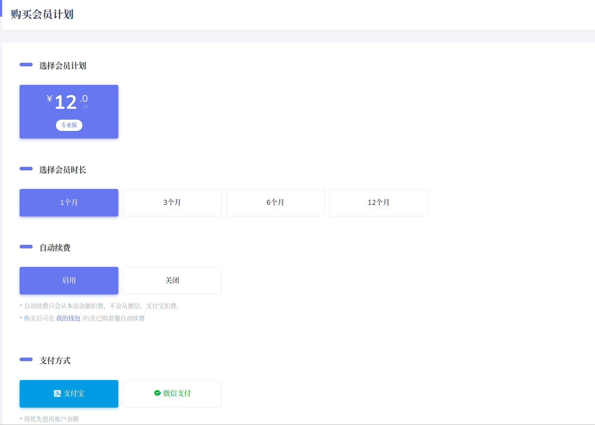
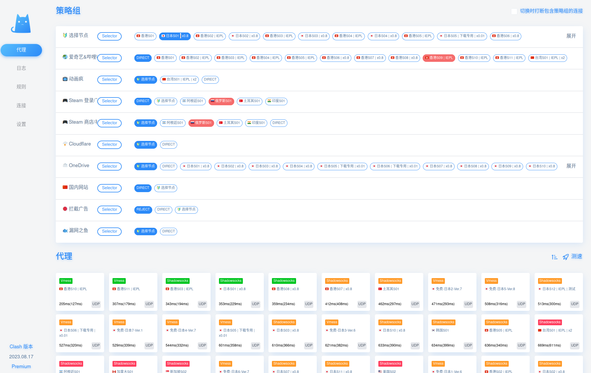

## Ubuntu 22.04 VPN配置教程
--------------------
ubuntu版本不同其实差别不是很大。
#### 步骤一：建立clash文件夹并导入安装包
```bash
mkdir clash
cd clash
```

之后在本仓库下载`clashpremium-release-linux-amd64.s1lSU-Ho.tar.gz`导入到`~/clash/`路径下，换言之，就是将安装包放置在`clash`文件夹里面，之后解压该文件，并修改命名为`clash`
```
bash
tar -xzvf clashpremium-release-linux-amd64.s1lSU-Ho.tar.gz.tar.gz
```

#### 步骤二：配置VPN参数文件

```bash
wget -O config.yaml "https://cqd4w.no-mad-world.club/link/JMdr9H6ofZOHDvJO?clash=3"
```

#### 步骤三：执行配置命令实现启动clash和VPN代理
```bash
chmod +x clash
./clash -d . 
```

执行效果图如下所示：


#### 步骤四：购买机场提供的稳定VPN,并修改设置网络参数

机场链接[IKUUU VPN](https://ikuuu.one/user/tutorial?os=linux&client=clash##)

在这个机场里面选择VPN网络包,效果如下图所示

以 Ubuntu 20.04 为例，打开系统设置，选择网络，点击网络代理右边的`设置`按钮，选择手动，填写` HTTP` 和 `HTTPS` 代理为 `127.0.0.1:7890`，填写 `Socks` 主机为 `127.0.0.1:7891`，即可启用系统代理

修改图如下所示


之后点击`clash`链接[clash board](https://clash.razord.top/#/proxies)

clash界面如下图所示


点击确定，之后便可享用VPN了

最终clash效果图如下所示：



外网游行--`Youtube`展示:


#### 平日开启VPN的方法

在终端中`cd`到`clash`的文件夹下，输入`./clash -d .`启动clash，启动完之后一般不要使用`ctrl+c`或`ctrl+z`打断运行，否则再次输入`./clash -d .`运行会出现端口占用，如果打断了就只能：
```bash
pa aux | grep clash
kill -9 [端口号]
```
在浏览器中打开ikuuu的dashboard，里面可以配置代理和节点。


