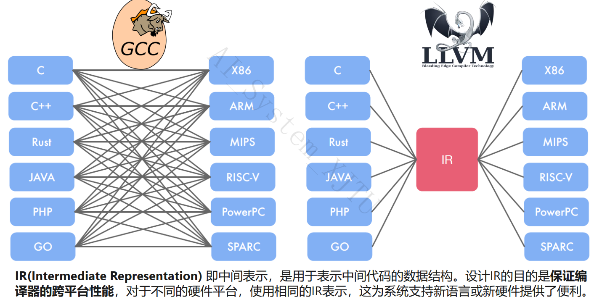
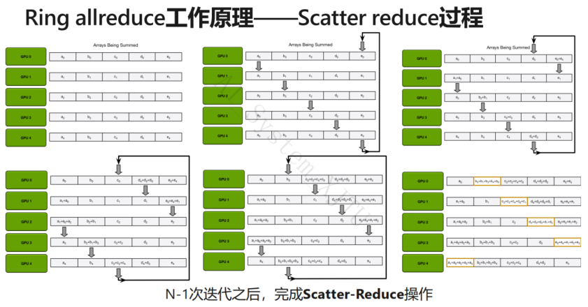

---
title: 2025XJTU AI系统复习
description: 本课程的中文名称设定为人工智能系统，主要讲解支持人工智能的计算机系统设计，对应的英文课程名称为 System for AI。本课程中将交替使用以下词汇：人工智能系统，AI-System 和 System for AI。本课程为微软人工智能教育与共建社区中规划的人工智能相关教程之一，在基础教程模块下，课程编号和名称为 A6-人工智能系统。
draft: false
categories: 
    - technology
date: 2025-05-01T15:00:00-07:10
lastmod: 2025-05-02T16:00:00-07:20
--

# 深度神经网络基础
## 早期的深度学习框架
主要用来CNN网络图像识别，由一些常用的layers组成。
主要特点就是通过.yaml这样的配置文件定义神经网络，可由一些常用的layer构成一个简单的图，支持多设备加速，代表框架是由UCB提出的Caffe。
### 基于数据流图DAG的计算框架
- 基本数据结构是tensor
- 基本运算单元接收N个输入tensor，输出M个tensor。 tensorflow中有大于400个基本的operator
在数据流图中，**节点**表示`operator`，**边**表示`tensor`。有一些特殊的节点用来构建控制流，控制边用来表示节点之间的依赖关系。
#### 静态数据流图TensorFlow
先定义后执行，静态图表示在编译时首先生成神经网络的结构，然后再执行对应的操作。
- 静态图定义图后可以全局图优化
#### 动态数据流图pytorch
边定义边运行，每次编译时都需要构建一个新的计算图。

**计算流图**：引入中间变量将复杂的函数分解成一系列基本函数，构成计算流图。

### 自动求导
前向计算并且保留计算结果，有个主要问题是需要保存大量的计算结果。在导数的计算也可以表示成数据流图。方便全局图优化与节省内存。
	
现代大部分框架同时提供：
- 自动求导系统，针对常见函数的组合
- 大量内置的Operators和与之对应的反向函数
- 为用户提供接口，自己提供反向函数。
### 图优化
先定义后执行的模式允许框架在计算前看到全图信息。数据流图作为深度学习框架中的高层中间表示，可以允许任何等价图优化Pass去化简计算流图或提高执行效率。
#### 图优化：DEMM自动融合
参考文章：[深入浅出GPU优化系列：GEMM优化（一） - 知乎](https://zhuanlan.zhihu.com/p/435908830)

####  计算内核与多硬件支持
`kernel`定义了一个算子在某种具体设备的计算实现。

每个operator都可以注册多个kernel，取决于数据类型、计算设备不同。runtime框架会自动根据operator的设备类型，数据类型和属性选择对应的kernel来执行。

一段反向传播代码：
$\sum({x}*{y})+{z} = c$
```python
import numpy as np
N,D = 3,4
x = np.random.randn(N,D)
y = np.random.randn(N,D)
z = np.random.randn(N,D)

a = x * y
b = a + z
c = np.sum(b)

grad_c = 1.0  
grad_b = grad_c * np.ones((N,D))
grad_a = grad_b.copy()
grad_z = grad_b.copy()
grad_x = grad_a * y
grad_y = grad_a * x
```
这里给出$grad_{x}$和$grad_{y}$的求解:


# 深度学习框架pytorch
### 池化操作


### Pytorch示例代码
以下代码实现了CNN：
```python
import torch
import torch.nn.functional as F

class Net(nn.Module):
	def __init__(self):
		super(Net,self).__init__()   # 请你填空
		self.conv1 = nn.Conv2d(1,10,kernel_size=5) # [26,26](inchannel,outchannel,kernelsize)
 		self.conv2 = nn.Conv2d(10,20,kernel_size=5) # [22,22]
 		self.mp = nn.MaxPool2d(2) # 不改变通道数 [11,11]
 		self.fc = nn.Linear(?,10)  # 
	def forward(self,x):
		in_size = x.size(0)
		x = F.relu(F.mp(self.conv1(x))) # 10 ，12 ，12
		x = F.relu(F.mp(self.conv2(x))) # 20，4，4
		x = x.view(in_size,-1)
		x = self.fc(x)  
		return F.log_softmax(x)

x = torch.randn(1, 1, 28, 28)  # 示例输入
```
`?`处应为$20 \times 4 \times4 = 320$。

 卷积输出图像边长计算公式：
 $$N =\frac{Width+2\cdot Padding - Kernelsize}{stride} + 1$$
定义网络时，需要继承`nn.Module`并且实现`forward()`方法，将具有可学习参数的层放在`__init__`中。
### Inception Module
定义成`self`形式，越在后面的层，越外面。
`branch3x3dbl =self.branch3x3dbl_3(self.branch3x3dbl_2(self.branch3x3dbl_1(x)))`


1、采用1x1卷积核将不同通道的信息融合。使用1x1卷积核虽然参数量增加了，但是能够显著的降低计算量。
2、`Inception`模块分为不同的分支是为了提取到更多的特征，同时也可以加速训练过程。
3、`Inception Moudel`由4个分支组成，最终4个分支在`dim = 1(channels)`上进行组合。最终输出的通道总数为`24+16+24+24 = 88`
 
代码有以下特点：
```python 
self.branch3x3dbl_1 = nn.Conv2d(inchannels,10,kernel_size=1)
self.branch3x3dbl_2 = nn.Conv2d(10,24,kernel_size=3,padding=1)

# 在forward中：
	branch3x3dbl_1 = self.branch3x3dbl_1(x)
	output = self.branch3x3dbl_2(branch3x3dbl_1)
# 这样套起来，再将每个分支的channel拼起来即可output
```
## 加载torchvision的自带数据集
`torchvision`实现了常用的图像数据加载功能，例如Imagenet、CIFAR10、 MNIST等，以及常用的数据转换操作，这极大地方便了数据加载。

这里给出了如何使用自带数据集的示例：
```python
transform = transform.compose([
	transform.ToTensor(),
	transform.Normalize((0.5,0.5,0.5),(0.5,0.5,0.5))
])

trainset = torchvision.datasets.CFAIR10(root='./data',train=True,download=Trued,transform=transform)

trainloader = torch.utils.data.DataLoader(trainset,batchsize=4,shuffle=True,num_workers=2)
```

## 定制数据集
首先安装依赖库：`scikit-image`（图像输入输出和转换）、`pandas`。
### 生成定制的dataset
代码示例：
```python
from skimage import io,transform
from torch.utils.data import Dataset

class MyDataset(Dataset):
	def __init__(self,csv_file,root_dir,transform=None):
		self.root_dir = root_dir
		self.transform = transform
		self.frame = pd.read(csv_file)

	def __len__(self):
		return len(self.frame)

	def __getitem__(self,idx):
		if torch.is_tensor(idx):
			idx = idx.tolist()
			
```
需要重写`__len__ __getitem__ __init__`方法：
- `__getitem__`用来支持dataset索引，这样`dataset[i]`可以用来得到第i个样本
- `__len__`让`len(dataset)`返回`dataset`的大小
### 生成定制的transform
部分神经网络需要固定大小的图像输出，需要对图像进行一些预处理。可以创建三种`transform`例如`Rescale Randomcrop ToTensor`，将这三个写成可调用的类。**需要重写__call__ 和__init__方法。**

## linux、服务器和vim


To Name But A Few,上述键位包含了[宏录制](https://zhuanlan.zhihu.com/p/122215250)、`>>`行首缩进、`S`删除行并且直接进入插入模式、`s`删除字符并插入、`Y`拷贝行、`f`行内字符查找(按下`;`继续查找)

```bash
# 例如查找对应行，将匹配的字符替换成bar
:{作用范围}s/target\c/bar/g 
# g 是global的意思 \c是大小写不敏感的替换 
```
### 服务器框架与环境配置
**Cuda**，是一种由nvidia退出的通用并行计算架构，包含了CUDA指令集架构ISA以及GPU内部的并行计算引擎。
**Cudnn**，是用于深度神经网络的GPU加速库，强调性能、易用性和低内存开销。Nvidia cudnn可以集成到更高级别的机器学习框架中，如tensorflow、pytorch。

**Tensorboard**，是一组用于[数据可视化](https://so.csdn.net/so/search?q=%E6%95%B0%E6%8D%AE%E5%8F%AF%E8%A7%86%E5%8C%96&spm=1001.2101.3001.7020)的工具。它包含在流行的开源机器学习库 Tensorflow中。主要功能包括：
1. 可视化模型的网络架构
2. 跟踪模型指标，如损失和准确性等
3. 检查机器学习工作流程中权重、偏差和其他组件的直方图
4. 显示非表格数据，包括图像、文本和音频
5. 将高维嵌入投影到低维空间
使用说明：
```python
# 在开头: 
from torch.utils.tensorboard import SummaryWriter

writer = SummaryWriter('runs/exp')

# 接着在每个epoch循环内加上：
writer.add_scalar('Loss/train',loss,epoch)
writer.add_scalar('Accuracy/train',accuracy,epoch)

# 最后关闭writer
writer.close()
```

`remote server`开启`tensorboard`:
```bash
tensorboard --logdir='./runs/exp1'
ssh -L 7707:localhost:6006 root277@ip
```
其中,7707是本地机器的端口，`localhost`是远程SSH服务器的6006端口。

在客户端浏览器中`https://localhost:7707`即可访问`tensorboard`。

# 矩阵运算与计算机体系结构
## 卷积层映射到矩阵运算
卷积也是一种线性运算：

## CPU体系结构
对于**CPU**而言，L1 cache集中在**CPU** 内部，**Cache**主要由**SRAM**组成，位于**CPU**和主存储器**DRAM**(内存)之间。采用较深的内存架构，在调度上采用访存预取和各种较为成熟的预取预测机制。
## 并行处理硬件架构
### SISD单指令流单数据流
每个指令部件每次仅译码一条指令，而且在执行时仅为操作部件提供一份数据；串行计算，在时钟周期内，CPU只能处理一个数据流。
### SIMD单指令流多数据流(Single Instruction,Multiple Data)
目前 CPU 和 GPU 主要用到的并行计算架构是 SIMD，处理器硬件中添加了多个 PU（Process Unit）单元，此时一个控制器控制多个处理器，同时对一组数据中每一个数据分别执行相同的操作，实现并行计算。

SIMD仍然是单线程，硬件上仅需要一个计算核心，主要执行向量矩阵等数组运算。处理单元数量很多。

## 矩阵乘的优化方案

优化方案：对图示中A的行的每个数据进行广播，广播次数为B中的行（在图中是4）。设$A_{m\times n}$，中的行锚定了$C$中的行，$C$中的每一行进行了$m$（$m-1$）次累加。

当然，$A$不仅仅可以$load$一行。

## GPU体系结构
对于向量化的计算算子${SSE}、{AVX}$，执行计算的ALU有许多。GPU内部具有许多ALU。

GPU由上千个简单的核心组成，每个core的结构相对简单，不支持分支预测、推测执行、乱序执行等。

### GPU执行模型 
#### SIMT
将一组Cores组织成一个cluster，在同一时间这些cores都执行相同的指令，32个线程为一组构成warp，以warp为单位调度到cores上。一个warp内所有线程执行相同指令，但操作在不同的数据上。

在 CUDA 编程模型中，每一个线程块（thread block）内部需要有很多并行线程，隐式分成了若干个 Warp，每个 Warp 包含串行交错的访存和计算。GPU 通过 Warp Scheduler 动态交错执行，如果一组 Warp0 流水阻塞就会切到下一个 Warp1，隐式通过 Warp 的并行掩盖指令流水阻塞，因此开发者可以得到较好的性能。

SM（Streaming Multiprocessors）称作流式多处理器，核心组件包括 CUDA 核心、共享内存、寄存器等。SM 包含很多为线程执行数学运算的 core，是英伟达 GPU 的核心，在 CUDA 中可以执行数百个线程、一个 block 上线程放在同一个 SM 上执行，一个 SM 有限的 Cache 制约了每个 block 的线程数量。

每一个$Kernel$下有$device$，下分诚不同的grid，每个grid下有许多block，每个block下的基本单元是线程，32个线程被隐式地划分为一组的warp（执行单元），通过warp的交错并行计算掩盖指令的流水线阻塞。运行时每个scheduler选择一个warp，发送给CUDA执行。(dispatches)
### GPU内存架构
不同于一般$CPU$的$cache$，L1和L2cache都在Core中，GPU的L1 cache在SM中，L2在SM外。


如何在GPU上高效地计算矩阵乘法，应该提高访存计算比，从$global$尽可能多的复用数据。

在图中，矩阵对应块的相乘要求BlockitemsK的索引要一致。Tile A 和B 从memory中load到shared memory中，该SM中的所有$warps$都可以读取A和B。


大量使用寄存器使得并发运行的block较少，访存计算比较低，采用软件流水线的方法隐藏访存延时。

### 矩阵运算专用芯片ASICs
- Tensor Processing Unit(TPU) 一代TPU采用8bit整型作为计算数据类型。TPU 计算方式是matrix、 vector CPU with AVX/SSE GPU 用 vector 计算。
- 精简指令集MXU 乘加单元 可以在一个时间周期计算数十万个计算
- UB 24MB of SRAM
- Activation Unit 硬件激活单元
### 节省访存的核心：脉动阵列
CPUs和GPUs通常需要花费大量的功耗去读取寄存器的值，脉动阵列的设计思想是将多个ALU运算单元串起来，从而避免每次计算都读取寄存器，缺点是要求计算符合特点的规则。

下面是**计算图**：


上图归结起来可以理解为：在$w_{i1} w_{{i2}}$的方向传播$x_{i}$，横向传播每一次$w$与$x$的乘积。

# AI编译器与编译优化
## 一般编译器
笔者认为有必要了解一般编译器的大致逻辑，以便更好地使用`gcc -E example.c -o example.i`这样的生成中间代码的命令。

需要指明的是，`.c`是源代码文件，`.i`是预处理后的源代码，包含展开的宏和包含的头文件，可以通过参数`-E`选项生成此文件。`.s`是汇编代码，包含低级汇编语言指令，例如`gcc -S example.c -o example.s`。`gcc -c example.c -o example.o`是生成目标文件。`-o` 选项在 `GCC` 中用于指定输出文件的名称。
## AI编译器的基本构成

- `front-end`：主要负责词法和语法分析，检查源程序语法和语义，然后将源代码转化为抽象语法树。
- `back-end`：将已经优化的中间代码转化为不同平台的编译器代码。

## GCC与LLVM


`Pass：`对源程序的一次完整扫描与优化处理。`IR`有`Graph IR`。
```
专用加速芯片爆发导致性能可移植性成为一种刚需。不同厂商提供 XPU 的 ISA（Instruction Set Architecture） 多种多样， 一般缺乏如 GCC、 LLVM 等编译工具链，使得针对 CPU 和 GPU已有的优化算子库和针对语言的优化 Pass 很难短期移植到NPU 上，难以复用。
```
**IR的表达层级差异**：AI 编译器的`IR`表达层级较高，用来抽象描述深度学习模型中的运算`Convlusion`等，甚至部分会有`Transformer`带有图的结构。

**IR的优化策略差异**：可以在`high-level`的`IR`上面做`operation fusion`。AI编译器也可以降低计算精度。

## 神经网络编译器
前端一般是`dpytorch`，`tensorflow`这样的语言，后端为神经网络加速器，如`GPU TPU FPGA`这样的。中间表达为计算图 算子表达式 ，如`DAG TVM IR`。
### 中间表示——计算图
基本数据结构是Tensor，基本运算单元是Operator，由最基本的代数算子组成，例如batchnorm conv这样的。每一个operator接收N个tensor，并且输出M个tensor。tensorflow中有大于400个的基本的`operator。
### 前端优化
通过图的等价变化化简计算图，从而降低计算复杂度或者内存开销。允许任何等价图优化`Pass`去化简计算流图或提高执行效率。

前端优化与**硬件无关**，意味着可以将计算图优化应用于各种后端目标。优化方式有：
- 算术表达式化简 $(A\times B)\dot{D} +  (A\times B)\dot{C} =(A \times B)(C+D)$
- 公共子表达式消除，例如：
	```c
	a = b * c + g
	d = b * c + g
	//可以转化为
	temp = b * c
	a = temp + g
	d = temp + e
	```
	如下图所示，发现`sub 6`和`sub 10`等等重复，因此可以进行公共表达式消除。
	
- 死代码消除
	死代码消除一般不是在定义神经网络模型结构时候引起的，而是其他图优化Pass造成的结果，因此死代码消除Pass常常在其他图优化pass后被应用。如无用的控制流、推理时仅删除训练相关的子图。
- 常量折叠	
	- 例如`i = 320 * 20`，不需要`%a:load 320,%b:load 20,%x:mul %a %b`，而是可以直接`load 6400` 。
	- `BN`折叠，主要用于将 ​**​Batch Normalization（BN）层​**​ 的参数合并到其前驱的 ​**​卷积层（Conv）​**​ 或 ​**​全连接层（FC）​**​ 中，从而减少推理时的计算量并提升部署效率。其将`Batch Normailzation`各层输入进行归一化。对于${x_{1},x_{2},\dots,x_{m}}$，在$batch$维度拼接。训练时，$\gamma \beta \mu \sigma$一直在更新，推理时则是固定，在推理过程中，BN像是对上一层结果进行的简单线性变换。由于卷积也是一个线性变换，这两个操作甚至可以合并成一个单一的线性变换，这将提升推理速度。$$\frac{1}{m}\sum\limits_m {{x_m}}  = \mu \quad \frac{1}{m} {\sum\limits_{i = 0}^m {{{({x_i} - \mu )}^2}} }  = {\sigma ^2}\quad {\hat x_i} = \frac{{{x_i} - \mu }}{{\sqrt {{\sigma ^2} + \varepsilon } }} \quad{y_i} \leftarrow \gamma {\hat x_i} + \beta $$
	 - `BN`折叠，合并BN层后的卷积层权重和偏置可以表示为$z = {W_{fold}} \times x + {b_{fold}}$，减少了访存时间。其中：$${W_{fold}} = \gamma \frac{w}{{\sqrt {{\sigma ^2} + \varepsilon } }} + \beta \quad {b_{fold}} = \gamma \frac{{b - \mu }}{{\sqrt {{\sigma ^2} + \varepsilon } }} + \beta $$
-  算子融合，向量化的多个算子的操作可以合并成一个向量化操作。既可以减少内核启动开销，又可以减少内存的读取，提高计算精密度
- GEMM自动融合。将输入张量合并成一个大张量来实现相同的算子合并成更大的算子，提高并行度。
- 布局转换。讨论了`tensor`的布局方式，有列优先存储、行优先存储这样的。在深度学习领域，多维数据通过多维数组存储，例如卷积神经网络通常采用四维数组保存，即`N H W C`。`N`是`batch`数量。
	- 对于不同的排列方式，有$NCHW$(pytorch的存储结构) 和$NHWC$ ，如果需要让你写出这两种数据布局的划分，可以这样看：对于NHWC而言，C被优先遍历，其次是W、H。因而在`1 7 13`这样的序列是限定遍历Channel，再按照横行遍历`W--width`。	
- 内存分配：
	-  内存复用：利用AI编译器对计算图中的数据流进行分析，以允许重用内存。
	-  替代操作：如果一块内存不再需要，且下一个操作是`element-wise`(操作前后tensor的维度一样)的，可以做原地操作覆盖内存，无需新内存。
	- 内存共享：两个数据共享同一块内存空间，并且其中有一个数据参与计算后不再需要，后一个数据可以覆盖前一个数据。这于内存共享的区别在于不要求`element-wise`，只要求前一个数据的大小足够容纳后一个数据的存放。下图中红颜色代表了内存共享。 
> 请简要简述一下AI编译器前端优化中内存共享与替代操作的区别。
## 后端优化
- 循环展开，这个不必多说，尽量减少`for`循环的次数。
- 循环分块，这是将数据分块存储再cache中，从而使处理器在每次循环迭代中尽可能直接访问缓存中的数据块，避免需要从贮存中读取数据带来的访存模式。
- 循环融合。将相邻或紧密间隔的循环融合在一起`for(int i=0;i<N;i++)`和`for(int i=0;i<N-1;i++)`这样相近的循环融合在一起。
- 循环拆分。
# 神经网络的稀疏化与轻量化
## 权重稀疏
如果小于阈值则置零。

### 非结构化剪枝
直接减除低于阈值的权值，神经元数量未发生变化，这是一种细粒度的剪枝。
```python
import torch.nn.utils.prune as prune

model = LeNet().to(device=device)
module = nodel.convl
print(list(module.named_parameters())

prune.random_unstructured(module,name="weight",amount=0.3)
prune.l1_unstructured(module,name="weight",amount=0.3) # 剪掉30%
print(list(module.named_buffers()))
print(module.weight)
```
优点：稀疏化矩阵的存储，只需存储非零元素的位置，降低了存储体积，但是造成了一定的时间开销，有一些难于加速的问题；计算的收益需要依赖于特定硬件的推理库进行加速，否则会访问到空值。
#### 结构化剪枝与非结构化剪枝
结构化稀疏对非零权值的位置进行了限制，在剪枝过程中会将一些数值较大的权值剪枝。

这是一种权衡：非结构化稀疏具有更高的模型压缩率和准确性，但通用性不好。因为其计算特征上的“不规则”，导致需要特定硬件支持才能实现加速效果。结构化稀疏虽然牺牲了模型压缩率或准确率，但通用性更好。因为结构化稀疏使得权值矩阵更规则更加结构化，更利于硬件加速。
### 结构化剪枝
复用已有的卷积、矩阵乘算子，无需实现推理算子。
```python
prune.ln_structured(module,name="weight",amount=0.5,n=2,dim=0) # n代表范数类别， dim表示剪枝的维度，dim=0 表示按输出通道剪

def index_remove(tensor,dim,index):
	size_ = list(tensor.size())
	a = tensor.size(dim)
	b = len(index)
	new_size = a - b  # 计算移除索引后该维度的新大小
	size_[dim] = new_size # 更新 size_ 列表中对应维度的值，用于记录新张量的形状。

	# 例如set(range(3)) - set(1) = [0, 2]
	select_index = list(set(range(tensor.size(dim))) - set(index))

	# 选择dim上剩下的行进行保留
	new_tensor = torch.index_select(tensor,dim,torch.tensor(select_index))
	return new_tensor
```

> 如何实现结构化和非结构化的剪枝？

对于卷积核的重要性而言，可以使用`L1-norm` ，`L1`范数是向量中的各个元素之和。


重新定义网络的每一层，生成一个更小的模型结构。
```python
def get_new_conv(conv,dim,channel_index,independent_prune_flag=False):
	if dim == 0:
		new_conv = torch.nn.Conv2d(in_channels=conv.in_channels,
			outchannels=int(conv.out_channels - len(channel_index)),
			kernel_size=conv.kernel_size,
			stride=conv.stride,padding=conv.paddding,dilation=conv.dilation)
	new_conv.weight.data = index_remove(conv.weight.data, dim, channel_index)d
	new_conv.bias.data = index_remove(conv.bias.data, channel_index)

	return new_conv
```


需要指明的是，在多通道多卷积核的情况下，每一个卷积核$a_{i}$是对于单通道$b_{i}$进行卷积。输入channel，输出也是`channel`。
### 正则化
如果原始模型滤波器表现为0值的参数数量较小，则上述算法可供剪除的滤波器数目也将随之减小，从而达不到模型预期的压缩率。
## 激活稀疏
与权重稀疏的区别是：其是动态的，通过数据驱动的激活稀疏。


有点trick。对于一个神经元而言，对用于验证的图像样本、每个特征图维度进行$f(O_{c,j}(k)==0)$的情况进行求和，算百分比，定义为$APoZ$的值。那些激活输出APoZ指标接近于1的神经元，可以移除，不会显著影响整个网络的精度。


- 激活稀疏的引入使得DNN网络中存在大量的稀疏与冗余性。
- 激活稀疏是一种数据驱动的剪枝方法——神经元剪枝

## 梯度稀疏
在分布式训练中，多台节点上分别运行分布式随机梯度下降SGD算法，需要实时交换各自梯度计算数值，随着节点的增多，网络上传输的梯度数据量急剧增加，逐渐超过梯度计算本身消耗的资源。

梯度稀疏SGD算法：只有梯度大于`threshold`才被传输，剩下未被大于梯度的值则被local保存用于做累加直到大于`threshold`才被传输。结束循环时，一次性传播所有的梯度。


小结：


## 量化/低比特计算
模型量化是一种将浮点数计算转成低比特计算的技术，可以有效降低模型计算的强度、参数大小和内存消耗，但往往带来巨大的精度损失。


## 三值网络/二值网络

## 轻量化网络
### 模型复杂度分析
- $FLOPs$：计算量，可以用来衡量算法/模型时间的复杂度。
- $FLOPS$：芯片每秒执行的浮点运算次数。
- $MACCs$：乘加操作次数，大约是$FLOPs$的一半。
- $MAC$：内存访问代价，指的是输入单个样本，模型/卷积层完成一次前向传播所发生的内存交换总量，即模型的空间复杂度，单位是byte。

什么是轻量化网络MobileNet？


上图的MAC大概是计算了特征图的参数量，并没有什么“内存交换”的意味。

什么是轻量化网络*shuffleNet*？

上图中的$\frac{c_{in}}{g}$相当于Mobilenet的M，$\frac{c_{out}}{g}$相当于是Mobilenet的N。
分组之后各组之间信息互不相通，降低了网络的特征提取能力。对channel进行shuffle，增加了不同channels之间的信息连接多样性。
# 分布式算法
并行化的基本方案在下图的各个标题之中。
## 算子内并行
并行单个张量计算子内的计算（GPU多处理单元并行）：
- 利用线性计算和卷积等操作内部的并行性，在batch 空间维度 时间维度等多个并行维度上计算。利用SIMD架构等多执行单元，同时运算。
## 算子间并行
数据并行：多个样本并行执行。
模型并行：多个算子并行执行。
组合并行：多种并行方案组合叠加。

## 模型并行
例如，将卷积层部署到不同的GPU。标签应与模型输出位于相同的GPU。
```python
self.seq1 = nn.Sequential(
	self.conv1,
	self.bn1,
	self.relu,
	self.maxpool,
	self.layer1,
	self.layer2
).to('cuda0')
```

```python
self.seq2 = nn.Sequential(
	self.conv1,
	self.bn1,
	self.relu,
	self.maxpool,
	self.layer1,
	self.layer2
).to('cuda1')
```

结果：并未减少训练时间的一半，甚至有时会更长，原因是：

### 模型并行的优化措施——流水线
将`batch`进行切分，前一个`split`出`cuda0`时进入`cuda1`时，下一个`split`就可以进入`cuda0`.
```python
class PipelineParallelRedNet50(ModeParallelResnet50):
	def __init__(self,split_size=50,**args,**kwargs):
		super(PipelineParallel).__init__(**args,**kwargs)
		self.split_size = split_size
	def forward(self,):
		splits = iter(x.split(self.self.split_size,dim=0))
		prev = next(splits)
		s_prev = self.seq1(prev).to("cuda0")
		for s_next in splits:
			s_prev = self.seq2(s_prev)
			ret.append(self.fc(s_prev.view(s_prev.size(0),-1)))

			s_prev = self.seq1(s_next).to("cuda1")

		s_prev = self.seq2(s_prev)
		ret.append(self.fc(s_prev.view(s_prev.size(0),-1)))
```
### Gpipe算法
通过对batch进行拆分，减少设备空闲，更好地利用设备进行流水化。

**特点**：每个batch的所有splits前馈运算(经过$Device\quad n$)结束后，才能开始后向运算。

### PipeDream算法
- 第一个split前馈运算一旦结束，即提前开始后向运算
- 每个split的后向运算占两个时隙，从而人为制造出bubble，使得后续的前馈运算可以在此间隙中进行，从而消除了bubble。

结果就是在Gpipe的基础上进一步减少了设备空闲。


## 数据并行
即在不同设备上执行相同的计算图，跨设备聚合梯度，利用聚合后梯度更新模型。
### 一对多
可以分为scater分发和broadcast广播。

### 多对一
分为reduce整合和gather收集。

### 多对多
分为All Gather和All Reduce。

**通信原语**：
```python 
dist.broadcast(tensor,src,group)
dist.scatter(tensor,scatter_list,src,group) # copy the i tensor scatter_list[i] to the i process
dist.all_reduce(tensor,op,group) # same as reduce,but result is stored in all process 
dist.gather(tensor,gather_list,dst,group) # copy tensor from all process in dst
dist.all_gather(tensor_list,tensor,group) # copy tensor from all process to tensor_list
dist.reduce(tensor,dst,op,group) # applies op to all tensor and stores the result in dst.
dist.barrier(group) #block all processes in group until each one has entered this function.
```

> Allreduce的基础是点对点通信。用以实现同步的`send/recv`，例如：`rank0 send -> rank 1 recv`,又称为阻塞式通信，发端需等待收端开始接收数据之后才能结束，发送命令的返回意味着收端已经执行了一定程度的接收工作。双方进程到达一个确定的同步点之后，通信才可以结束。 

> 异步实现send/recv：又称非阻塞式通信，可以将通信和计算进行重叠，有时可以大大改善性能。 即发送命令并不要求操作立即执行，从发送数据区取走数据即可返回，在wait()收端接收完之前可以并发进行数据传输和运算。

### Allreduce 的通信原语实现算法1

$\log _2 N$代表着时间上不重叠的通信次数，$\alpha$可以认为是一个固定时延，传输时间是$\frac{S}{B}$，$2\times S\times B$可以认为是接收节点的计算耗时。由于接收了两份数据所以乘2.
### Allreduce 的通信原语实现算法2 
 在`scatter-reduce`中，`A1 A2 A3 A4`分别发送到不同的`worker`上，A1、B1、C1和D1发送到相同的`worker`上，进而做`reduce`。
### Ring Allreduce  
为了避免master的带宽限制，采用环状的reduce加上gather。  之后再经过N-1次的`gather`：


性能分析：在整个过程中每个`worker`上`send`或`receive`的总通信数据量均为：$\frac{2(N-1)K}{N}$。K代表每个`worker`上所有`chunk`的总数据量。$\frac{K}{N}$是每个`worker`上每一块的数据量。

每个$worker$通信数据量近似独立于网络中`worker`的数量，为$O(K)$，而主从架构中主节点的通信数据量为$O(N*K)$。

每个`worker`的网络收发负载是均衡的，网络双向带宽得到充分利用。
#### 程序实现
```python
def allreduce(send,recv):
	for i in range(size - 1):
		if i % 2 == 0:
			send_req = dist.isend(send_buff,right) # 非阻塞发送`send_buff`（初始为`send`的数据）给右侧进程（`right`）。 
			dist.recv(recv_buff,left) # 阻塞接收左侧进程（`left`）的数据到`recv_buff`。 
			accum[:] += recv_buff[:] # 将接收到的`recv_buff`数据累加到`accum`。
		else :
			send_req = dist.isend(recv_buff,right) #非阻塞发送`recv_buff`（上一轮接收的数据）给右侧进程。
			dist.recv (send_buff,left) # 阻塞接收左侧进程的新数据到`send_buff`。
			accum[:] += send_buff[:]
		send_req.wait() # 每次迭代结束前，调用`send_req.wait()`确保数据发送完成，避免通信重叠错误。
	recv[:] = accum[:]	

def run(rank,size):
	t = th.ones(2,2)
	for _ in range(2):
		c = t.clone()
		allreduce(t,c) #t发c收
		t.set_(c)  # 收到并且更新
	print(t)
```
阻塞代表预先接收数据，发送则在空闲的时候进行，从而避免冲突发生。
### 通信后端
- MPI 通用性强，适合复杂的HPC任务，支持异构环境，代表例子有Horovod
- NCCL   英伟达2015年公开发布，充分发挥英伟达自身硬件性能，广泛用于GPU深度学习
- GLoo Facebook开发，`pytorch`默认安装，跨平台，易用，适合 CPU 或低性能网络环境，在GPU中不如NCCL高效。
### 集合通信原语的应用：分布式SGD算法
多态节点上分别运行分布式随机梯度下降算法，需要实时交换各自梯度计算数值。
利用的是全局加和后的梯度进行更新。
### 单机多卡分布式SGD
稍微看一下就行，老师上课也没有多讲什么。


### 多机分布式SGD
首先为各个主机编写`shell`脚本：
```bash
python -m torch.distributed.launch \
    --master_port 12345 \      # 主节点监听的端口号
    --nproc_per_node=1 \       # 每个节点启动的进程数（通常等于GPU数量）
    --nnodes=2 \               # 参与训练的总节点数
    --node_rank=1 \            # 当前节点的编号（从0开始）
    --master_addr="115.154.142.79" \  # 主节点的IP地址
    test_module.py             # 要执行的训练脚本
```
其次：使用`parser.add_argumet`加入分布式支持。
```python
parser.add_argument('--tcp',type=str,default="",metavar='N',help='asda')
# 等等相关参数……
parser.add_argument('--world_size',default=1,type=int,help='number of distributed process')

parser.add_argument('--gpu',type=int,default=0,metavar='N',help='distributed rank')
```
- `metavar='N'` 表示在帮助信息（`--help`）中，`--gpu` 选项后会显示为 `N`，提示用户此处需要输入一个整数值。

进而：
```python
args.rank = int(os.environ["RANK"])
args.world_size = int(os.environ["WORLD_SIZE"])
args.gpu = int(os.environ['LOCAL_RANK'])

dist.init_process_group(init_method='env://',backend="nccl",rank=args.rank,world_size=args.world_size,group_name="pytorch_test")
```
最后：
```python
train_sampler = torch.utils.data.distributed.DistributedSampler(train_dataset)
```
### 具有同步障的dist-SGD算法


### Horovod
>Horovod is a distributed deep learning training framework for TensorFlow, Keras, PyTorch, and Apache MXNet. The goal of Horovod is to make distributed deep learning fast and easy to use.
[horovod/horovod: Distributed training framework for TensorFlow, Keras, PyTorch, and Apache MXNet.](https://github.com/horovod/horovod)

让代码不再依赖torch.distribute的支持，将基本的并行命令进一步封装于底层，对用户透明，更简单易用。提供梯度压缩等提升数据并行效率的函数支持，以及提供多种通信后端的支持。

## 小结

# 分布式训练 实验部分
通信后端:`MPI` `NCCL` `Gloo`.

我们知道 PyTorch 本身对于单机多卡提供了两种实现方式:
- DataParallel（DP）：nn.Dataparallel 方法实际上是使用单进程将模型和数据加载到多个 GPU 上,协同不同的 GPU 上的模型进行并行训练。
- DistributedDataParallel（DDP）：与 nn.Dataparallel 使用单进程控制多个 GPU 不同， nn.DistributedDataParallel 为每个 GPU 都创建一个进程。这些 GPU 可以位于同一个结点上（单机多卡），也可以分布在多个节点上（多机多卡）。每个进程都执行相同的任务，每个进程都与其他进程进行通信。一点不同是，只有梯度会在进程（GPU）之间传播。以单机多卡举例，假设我们有三张卡并行训练，那么在每个 epoch 中，数据集会被划分成三份给三个 GPU，每个 GPU 使用自己的 minibatch 数据做自己的前向计算，然后梯度在 GPU 之间全部约简。在反向传播结束的时候，每个 GPU 都有平均的梯度，确保模型权值保持同步（synchronized）。
```bash
model = nn.DataParallel(model, device_ids=config.gpu_id, output_device=gpu)

# DDP
from torch.nn.parallel import DistributedDataParallel as DDP

def setup(rank,world_size):
	os.environ['MASTER_ADDR'] = 'localhost'
	os.environ['MASTER_PORT'] = '12345' 
	dist.init_process_group("nccl", init_method='tcp://127.0.0.1:12345',rank=rank, world_size=world_size) # 在 DDP 管理的进程组中，每个独立的进程还需要知道进程组中管理进程的数量，我们称为 world_size
# rank是当前进程的等级。在 DDP 管理的进程组中，每个独立的进程需要知道自己在所有进程中的阶序，我们称为 rank.
# init_method='tcp://127.0.0.1:12345' 一般是单机多卡这样配置

def run(rank,world_size):
	setup(rank,world_size)
	device = torch.device(f'cuda:{rank}')
	model = mymodel()
	model = DDP(model,device_ids=[rank])
	optimizer = optim.SGD(……) 
	for epoch in epoches:
			
def main():
	torch.multiprocessing.spawn(train,args=(world_size,),nprocs=world_size,join=True) # 这里的train是void*，指向一个方法 ，在这个方法中，需要调用ddp_model = DDP(model, device_ids=[rank])
``` 


>  问：你是如何理解并行/分布式训练原理的？ 
>  答：并行分为数据并行和模型并行，数据并行将数据切分成多个子集，每个设备处理一个数据子集，每个设备拥有完整的模型副本。模型并行将模型切分到不同设备上,每个模型负责一部分计算。

> 问：你是如何执行分布式训练的？
   答： 我执行的是单机多卡分布式训练。

首先利用torchrun，自动生成进程的rank = nproc_per_node * node_rank + local_rank，对于单机多卡而言，torchrun使得每个node中local_rank从$0,1,……，n-1$递增，自动求得每个进程的rank。
```bash
# 单机多卡
torchrun --standalone --nproc_per_node = 4 \
	mynet.py
```
接着 在`setup`中让`torchrun`自动定义`master_addr master_port`：
```python
def setup(rank):
	 init_process_group("nccl",intial_method='env://')

def main():
	rank = int(os.environ["LOCAL_RANK"])
	setup(rank)
	# 接着将dataset 进行切分
	dataset = Mydataset()
    sampler = DistributedSampler(dataset) if is_distributed else None    
    loader = Dataloader()

	# model to rank
	model.to(rank)
	model = DDP(model,device_id=[rank])
	train(……)
	
```
多机多卡：
```bash
# 多机多卡
torchrun \
    --nnodes=2 \               # 总节点数
    --nproc_per_node=4 \       # 每节点GPU数 进程数 world_size = nproc_per_node * nnodes 
    --node_rank=0 \            # 当前节点rank 
    --master_addr="192.168.1.100" \  # 主节点IP
    --master_port=12345 \      # 主节点端口
    train_script.py
```
# 异构计算集群调度与资源管理系统
## Docker的介绍
`docker`镜像分层构建的，分层结构的目的之一是共享资源，如多个镜像从相同的`base`镜像构建而来，则只需在磁盘上保存一份base镜像；内存中加载的一份该`base`镜像可以为所有容器服务。例如典型 `Linux`文件系统由 `bootfs` 和`rootfs` 两部分组成，`Docker`将其他`layer`加载其上，且每层都是只读`rootfs`结构，相同的`base`镜像可以共享，只有顶层的容器层可以读写。

> $容器=镜像image+读写层$

Docker的网络配置分为`container bridge host`三种，具体可以参考：[Docker 网络模式详解及容器间网络通信 - 知乎](https://zhuanlan.zhihu.com/p/212772001)。

## 镜像与容器实践

PPT上的docker 命令行：
```bash
docker build -f Dockerfile -t train_cpu:latest .
docker run --name training(容器名称） train_cpu(镜像名称)
docker pull <name>
sudo docker run -it <name> /bin/sh
```

## 公平性调度
- 最大最小公平（max-min fairness）算法—— the most popular allocation policy so far.Idea： Maximizes the minimum allocation received by a user in the system.
- Dominant Resource Fairness (DRF).Its goal is to maximizes the minimum dominant share across all users.

### 异构资源的公平性调度
对于增加的比例而言，需要使主导资源的比例equal，如下图：

在这个例子中，$y$先取1，所以user B 的dom share就是$\frac{1}{3}$，接着x取1，所以user A的dom share就是$\frac{2}{9}$，相比之下$\frac{2}{9} \lt \frac{1}{3}$，所以再次增加user A的资源，取$x = 2$，来到了$\frac{4}{9}$。
$<\frac{1}{9},\frac{4}{18}>$ 中，选择较大的那一个作为user占用内存的计量值。

### 拓扑亲和性
**共享异常（Sharing anomaly)**：
Quota机制为每个任务指定所需要使用GPU的数目，即使分配了足够的GPU数目，由于不同用户随时可能会要求分配或者释放GPU数目，就会导致出现大量的外部碎片，即随着分配、释放的次数变多，大量的GPU数目可能会变成跨CPU socket、甚至是跨机器。因此，造成了虽然分配了足够的GPU，但是还是会导致性能的大幅下降。
### HiveD调度算法
分层级的，尽可能先从high-level分配资源满足租户的需求。

## 调度的灵活性——弹性与抢占
### Hadoop YARN抢占的实现
- step 1:从过度使用的队列中获取需要被抢占的容器
- step2：通知application master以便调度器采取行动，上报组织
- step3：resource manager 强行杀死被标记为抢占的容器
这些在`HiveD`上是这样的：
- 允许优先级高的任务能够抢占优先级低的任务所需要的单元(cell)。
- 低优先级单元一般被分配于远离高优先级绑定的区域（如尽量避免分配buddy单元），以降低被抢占几率。
- 高优先级作业也尽量避免在存在低优先级作业的设备上分配单元。
## 异构计算集群管理系统
OpenPAI（Open Platform for AI）， 是由MSRA开发的人工智能集群管理平台——分布式训练环境下的操作系统。
- 基于Docker的架构，几乎所有深度学习框架如CNTK、 TensorFlow、PyTorch等无需修改即可运行。
- 作业请求提交至Hadoop YARN进行资源分配与调度
- OpenPAI给YARN添加了使GPU作为可计算资源调度
- 静态资源由Kubernetes进行管理
# Docker的使用与解释 实验部分
```bash
sudo docker build -f Dockerfile.train.cpu -t train_dk_cpu .
docker images # 查看系统中的镜像
sudo docker run --name training train_dk_cpu
docker ps # 查看当前正在运行的镜像
```
## 示例dockerfile
```dockerfile
ARG CODE_VERSION=latest

# 继承自哪个基础镜像 FROM前面只能有一个或多个ARG指令，dockerfile只能从FROM开始（除去ARG）
FROM nvidia/cuda:10.1-cudnn7-devel

ENV cuda=11.3.1
# 创建镜像中的文件夹，用于存储新的代码或文件
RUN mkdir -p /src/app

# WORKDIR指令设置Dockerfile中的任何RUN，CMD，ENTRPOINT，COPY和ADD指令的工作目录，WORKDIR并不会在容器中创建目录，只是设置工作目录，如果没有，docker会自动创建。
WORKDIR /src/app
# 在设置了WORKDIR之后，COPY pytorch_mnist_basic.py /src/app可以简化为COPY pytorch_mnist_basic.py . 命令

# ADD可以将本地文件添加到容器中，也可以从远程URL下载文件并且添加到容器中。如果文件是压缩文件则会自动解压缩。
ADD nickdir.tar.gz .

# 拷贝本地文件到Docker镜像中相应目录，注意是本地。不能从远程url中下载文件，也不会自动解压缩
COPY pytorch_mnist_basic.py /src/app

# 用于容器内部的端口暴露给外部网络，让其他容器主机上的程序通过网络连接到容器内运行的服务。EXPOSE指令并不会将容器内部上的端口映射到主机上的端口，因此如果需要从主机上访问容器内部的服务，需要使用docker run -p 进行端口映射。
EXPOSE 80/tcp

# 需要安装的依赖，每个指令会被当做一个新的镜像层。每个RUN
RUN apt-get update && apt-get install wget -y
RUN wget https://repo.continuum.io/miniconda/Miniconda3-latest-Linux-x86_64.sh -O miniconda.sh
RUN bash miniconda.sh -b -p /opt/conda
# 下面的RUN命令被解析为json数组，必须使用双引号而非单引号。
RUN ["executable","param1","param2"]
#ENV 设置环境变量
ENV PATH /opt/conda/bin:$PATH 

RUN conda install pytorch torchvision cudatoolkit=10.1 -c pytorch

# 在容器中运行命令时使用的用户或用户组，增强容器的安全性。
USER Bertsin

# 在容器中创建挂载点，将宿主机上的目录与容器内的目录进行映射，以便容器内部与外部共享数据。
VOLUME ["/data"] 

# 容器启动时执行的命令，dockerfile种只能有一个CMD命令，如果有多个，则最后一个才生效。
CMD [ "python", "pytorch_mnist_basic.py" ]

# ENTRYPOINT ["python","pytorch_mnist_basic.py"]  设置一个默认应用程序，每次使用该镜像创建容器时都会使用该程序。可以在docker run 后指定--entrypoint选项，将覆盖ENTRYPOINT指令指定的程序。如果Dockerfile中同时指定了ENTRYPOINT和CMD指令，CMD指令提供的命令会作为ENTRYPOINT指定的命令的参数。如果运行容器时提供了参数，则会覆盖CMD指令提供的参数。
```

`CMD`和`ENTRYPOINT`都可以指定容器启动的时候要运行的命令。不同的是，`CMD`可以被`docker run cmd-test:0.1 <命令>`给覆盖。对于`ENTRYPOINT`而言，`docker run cmd-test:0.1 -l`，会在`ENTRYPOINT ["ls","-a"]`命令之后进行`append`，成为`al -la`。
## docker部署pytorch推理程序
torchserve可以使大规模部署经过训练的pytorch更加轻松。包括以下组件：Model archiver将model打包成trochserve支持的格式。model loader用于加载和初始化打包好的模型。model predictor用于将输入数据传给模型进行预测，并返回预测结果。model-view controller 用于将请求路由到正确的模型示例，以及请求和响应。
#  Security & privacy
- 联邦学习：在不共享数据的情况下联合建模；
- 同态加密：允许在密文的基础上进行代数运算。
## 对抗攻击
攻击的损失函数
- 训练时：${L_{train}}(\theta ) = C({y^0},{y^{true}})$，图像$x$是固定的
- 无目标攻击 $L({x_{false\_img}}) =  - C({y^{false\_img\_pred}},{y^{true}})$  ，$\theta$是固定的。
- 有目标攻击$L({x_{false\_img}}) =  - C({y^{false\_img\_pred}},{y^{true}}) + C({y^{false\_img\_pred}},{y^{false}})$，其中$y^{false}$是我想让Net预测错误的类别。
- 约束可以是L2范数，无穷范数。$d(x^0,x^{'})$
$$x^* = \arg \min L({x_{false\_img}})$$
上式中，$x^*$为找到的最终对抗样本。

伪代码：
```
start from original image x0
for t = 1 to T:
	xt = x_{t-1} - ksi * gradient(x_{t-1})
	if distance(x{0},x{t}) > epsilon
		x_{t} = fix (x_t)

def fix(x_{t}):
	for all x fullfill distance(x,x{0}) <= epsilon
	return the one closest to x_{t}
```
`distance` 可以使用二范数或者无穷范数。$\epsilon$的大小决定了能够迭代多远。如果$\epsilon$过小，则会出现寻找假样本的第一步有效，之后T-1步均无效迭代的情况。

### 攻击方法FGSM
$${x_{i + 1}} = x_{i} - \varepsilon  \cdot sign({\nabla _x}L(x,y;\theta ))$$
$x^{*} =argmin L(x_{false_{img}})$，这里的$argmin$是对$d(x^{0},x{'})\leq\epsilon$而言，在满足这个的条件下取loss最小的$x{'}$。
### 白盒与黑盒
白盒攻击：在进行攻击之前，就知道网络的模型参数$\theta$。

黑盒攻击：如果你有目标网络的训练数据，自己训练一个代理网络，使用代理网络生成对抗样本。若无训练数据，从目标网络获取输入输出对。
## 通用对抗攻击
### 对抗补丁 
全图加噪声扰动的方式需要操纵整个图像，并且在现实世界的物理攻击中变得很不现实，引入对抗补丁作为现实世界进行攻击的一种实用方法。它通过在目标物体表面添加一个经过特殊设计的局部图案（如贴纸、涂鸦或图案），使得机器学习模型（尤其是计算机视觉模型）对包含该补丁的输入产生错误判断。
## 防御
### 被动防御
在不修改模型的情况下找到对抗样本。对$x_{falseimg}$进行$smoothing$处理。
- 特征减缩
- 随机调整数据尺寸
### 主动防御


### 被动防御与主动防御的区别
被动防御是在不改变模型的前提下，找到对抗样本，而主动防御是训练一个能够抵抗攻击的模型。
