# 写在前面

贴一个下载链接[CS:APP3e, Bryant and O'Hallaron (cmu.edu)](https://csapp.cs.cmu.edu/3e/labs.html)，点击[Self-Study Handout](https://csapp.cs.cmu.edu/3e/bomb.tar)下载lab。

```c
    /* Do all sorts of secret stuff that makes the bomb harder to defuse. */
    initialize_bomb();
    printf("Welcome to my fiendish little bomb. You have 6 phases with\n");
    printf("which to blow yourself up. Have a nice day!\n");
    /* Hmm...  Six phases must be more secure than one phase! */
    input = read_line();             /* Get input                   */
    phase_1(input);                  /* Run the phase               */
    phase_defused();                 /* Drat!  They figured it out!
```

在进入到`phase_1`之前，对于`input = read_line()`函数，我们查看一下input变量的地址，使用`gdb bomb`命令进入gdb调试阶段，再通过查看反汇编代码确定`input = read_line()`函数return时的栈顶指针`%rsp`所指向的内容，先设置断点，为了方便，使用`touch ~/.gdbinit`命令创建一个默认配置，具体可以参考[这个链接](https://arthals.ink/blog/bomb-lab)。

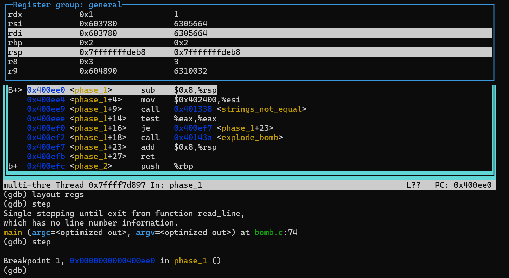

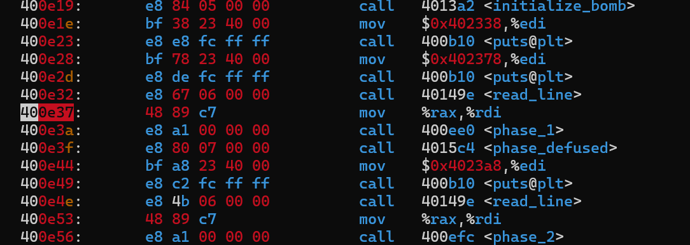

在x86-64架构中，返回值会通过特定的寄存器传递。在此架构中，返回值通常存放在 `RAX` 寄存器中。因此，当你的函数执行到 `ret` 指令时，返回值会放入 `RAX` 寄存器，建议在phase_1之前输入`p $rax`查看寄存器rax的值。

下图描述了进入`explode_bomb()`的gdb调试界面，代表这个炸弹即将爆炸：
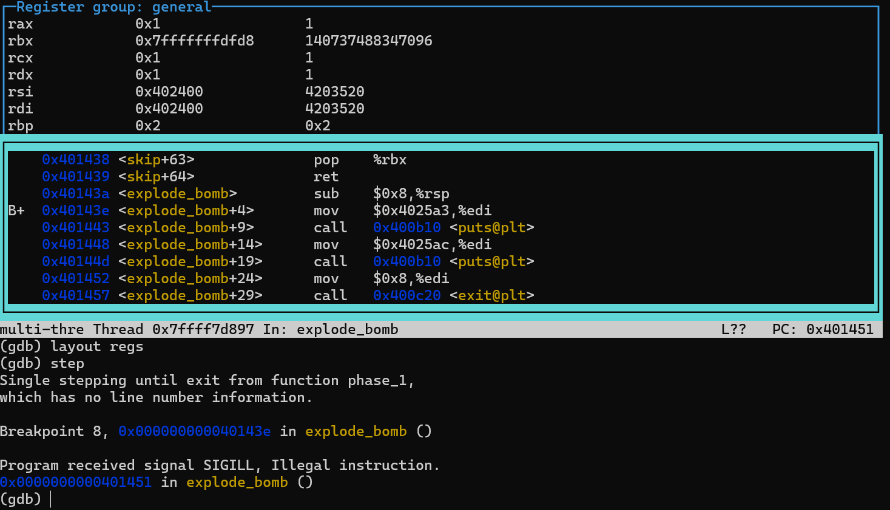
## gdb调试命令
```c
gdb //命令
step //步进
layout regs //寄存器变量视图
p/d $rdi //十进制查看变量%rdi的值
x/s $esi //以c风格查看%esi的字符串
x/2d $rsp //十进制查看$rsp开始的两个单位，栈指针
info registers //打印所有寄存器的值 
info breakpoints // 打印所有断点的信息
// %rip 储存下一条指令的地址

```
调试命令示例：


可以看到，在返回read_line 函数后，%rax寄存器的值被保存到了%rdi中，%rdi的值是6305664，%rsp是栈顶指针。
## string_length复现
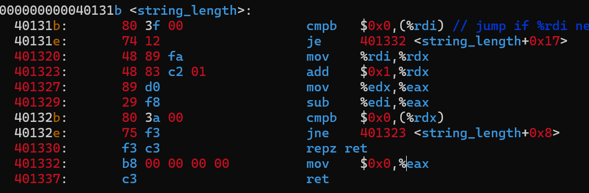

```c
 if (rdi != 0)
 {
  rdx = rdi;
  rdx = rdx + 1;
  eax = rdx;
  rax = rdi
  if (rdx != 0) 则跳到 rdx = rdx + 1;
 }
```
接下来一起解答。
# Phase_1
```c
mov $0x402500, %edi  ; 假设这是第二个字符串的地址，放入 %edi
call 401338 <strings_not_equal>  ; 调用函数比较两个字符串
```
传入`<strings_not_equal>`的参数有两个`%esi`和`%rdi`
- `%esi`：通常用来传递第一个指针或地址类型的参数给函数。在字符串操作函数中，它经常被用来传递源字符串的地址。
- `%edi`：通常用来传递第二个指针或地址类型的参数给函数。在字符串操作函数中，它经常被用来传递目标字符串的地址。
-  Linux遵循System V AMD64 ABI 调用约定，具体来说，函数传参的时候前六个整数或指针参数通常分别通过寄存器 `RDI`, `RSI`, `RDX`, `RCX`, `R8`, `R9` 传递。
也就是说，我们只需要查看`%esi`的值就行了，在`0x400ee9`设置断点，输入`x/s $esi`得到：
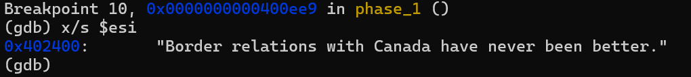
于是我们返回到`psol.txt`中写下这句话，注意不要漏了标点。
# Phase_2
第一步，通读代码了解跳转结构，`<read_six_numbers >`函数告诉我们应该在psol.txt文件下写入6个数字。
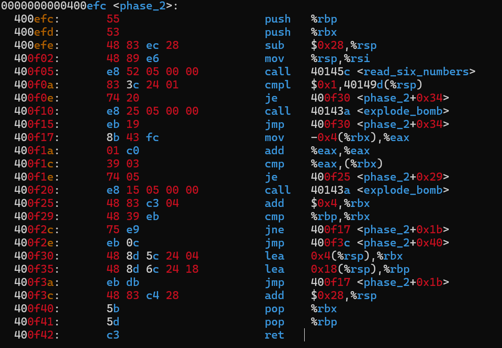
接着，我们可以在`0x400f0e`、`0x400f1e`、`0x400f3a`处设置断点(主要是前面两个)，这三处都是跳转语句。对于`(%rbx)`，使用`x/d $rbx`或者`x/2d $rbx`查看十进制的值，对于`%eax`，可以使用`p/d`查看十进制的值。`<read_six_numbers >`的返回结果先存在于`%rsp`中，随后第一位数字被“吃掉”，剩下的数字放在了`(%rbx)`中。
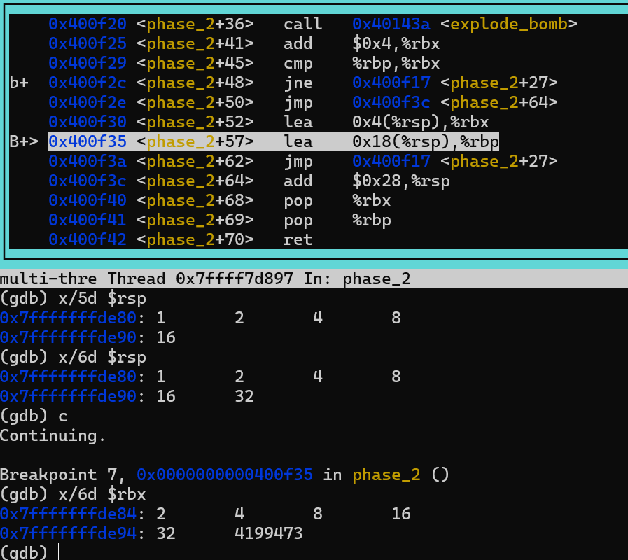
接着：


接下来，当`gdb`每一次在`0x400f1e`处停下时，我们可以通过`p/d $eax`查看`%eax`的值，修改对应的`%rbx`的值就可以了，最后答案是`1 2 4 8 16 32`。

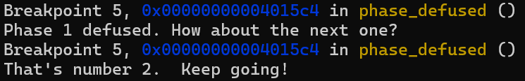
# phase_3
-  首先观察代码结构，凭借个人经验在`je`、`ja`、`jmp`处打上`breakpoints`，很明显phase_3的代码有switch关键字。
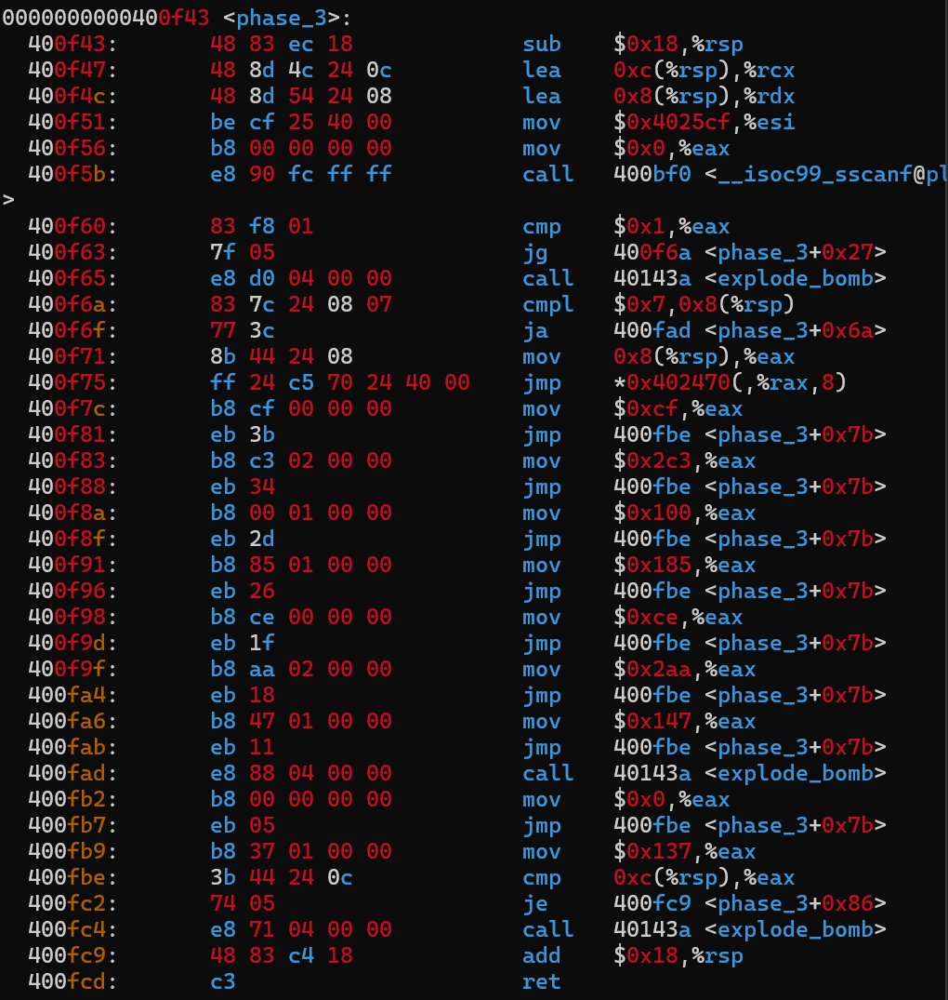

在`sscanf`函数之前添加断点，使用`(gdb) x/s $esi`可以看到两个`%d %d`，这提醒我们输入十进制的两个数字。在`400f6a`处提醒我们输入的第一个数字应当小于7，我这里输入的是7。在`400fb9`和`400fbe`可以看到第二个数字应该等于`0x137`,也就是327。

解开答案，调试界面输出：
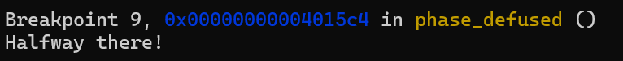
# phase_4
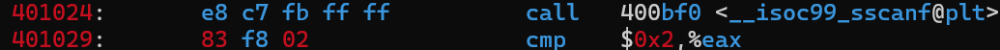
我们注意到了这一句话，结合上一题的经验，很有可能在提醒我们应该有两个输入。
于是我们在`psol.txt`中写下：`999 666`。
`continue!`
## phase_4 step1
我们在调试时发现：

这意味着输入的第一个数字应该小于等于`14`。
## phase_4 step2
在调试时，遇到了难点`<func4>`它是一个递归函数，我们需要让其返回值`%rax`的值等于0，这样才不会触发`0x40104f`的跳转：
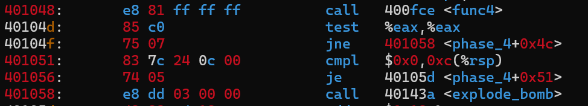
## func4
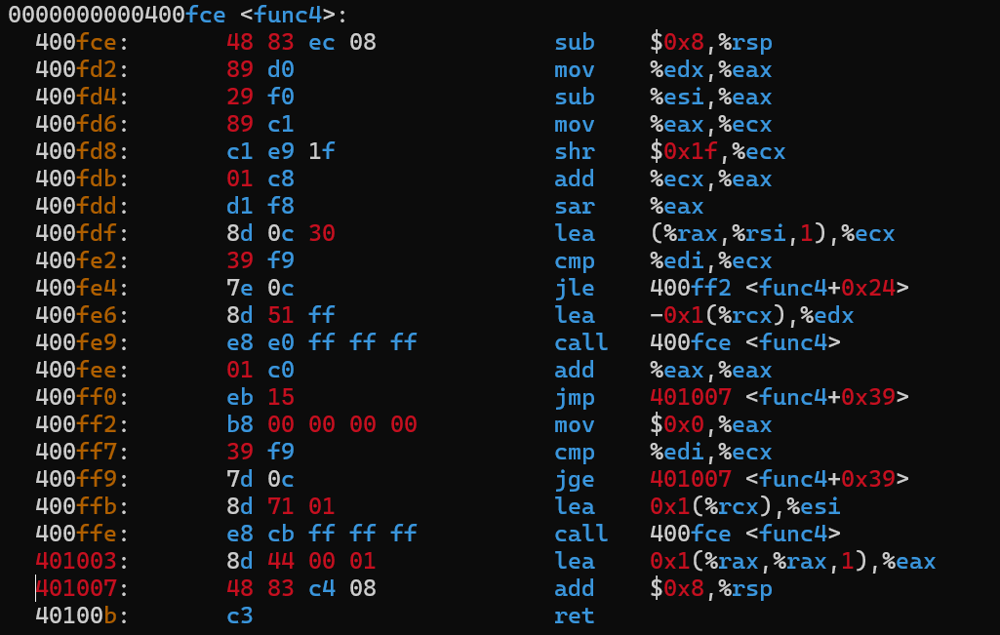

这段代码类似于二分查找，发现其有极高的对称性。当输入的rdi(应该是rdi)为1时，func4函数返回值为0。

## phase_4 step3
`0x401051`启示我们输入的第二个参数为0。
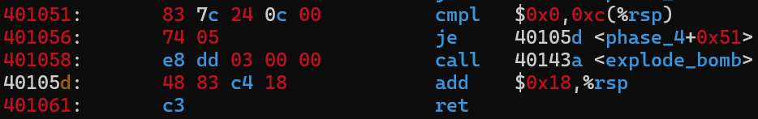
因此答案：`1 0`
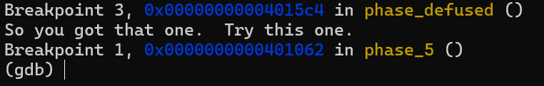
# phase_5
先标好跳转结构：
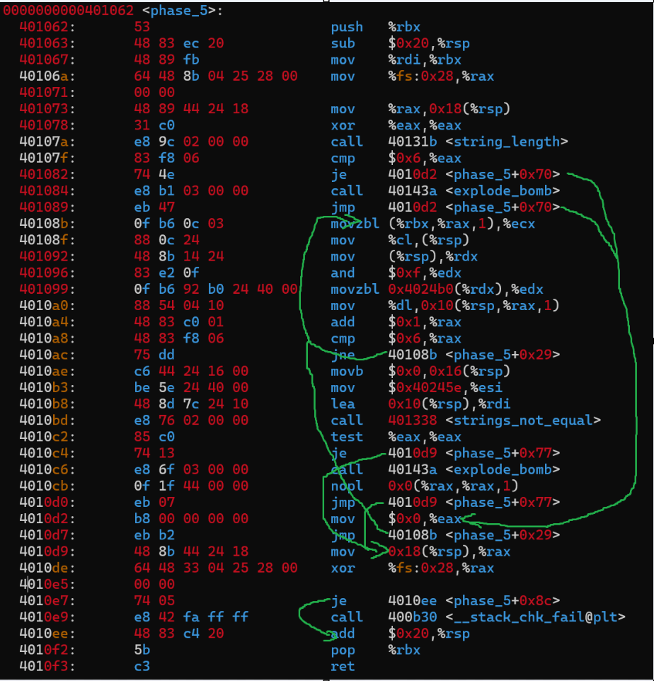
看到函数`string_length`和`cmp $0x6 %eax`输入应该是长为6的字符串，于是我们在`psol.txt`中写下：
```c
'xjtu'
```
在`0x4010bd`处，我们发现：
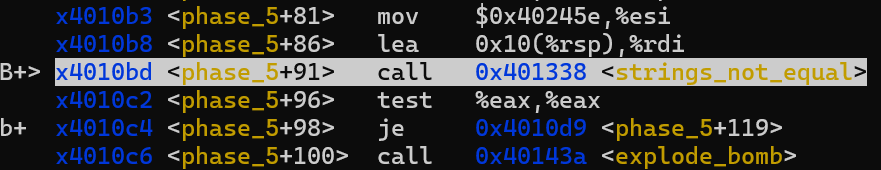
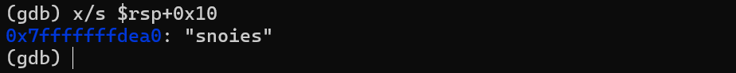
`'xjtu' -> snoies`, `snoies`作为输入时，`$rsp+0x10`的值是就变成了`snoies`=>`uylfeu`。我们需要某六个数字，使得变换之后的结果是`flyers`。这究竟是什么样的映射呢？
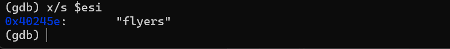
这个过程不可谓不离奇曲折，但是当我们知道了具体的过程之后，就可以很容易地得到答案了。

首先，我们先去维基百科找来一张 [ASCII 码表](https://zh.wikipedia.org/wiki/ASCII)：
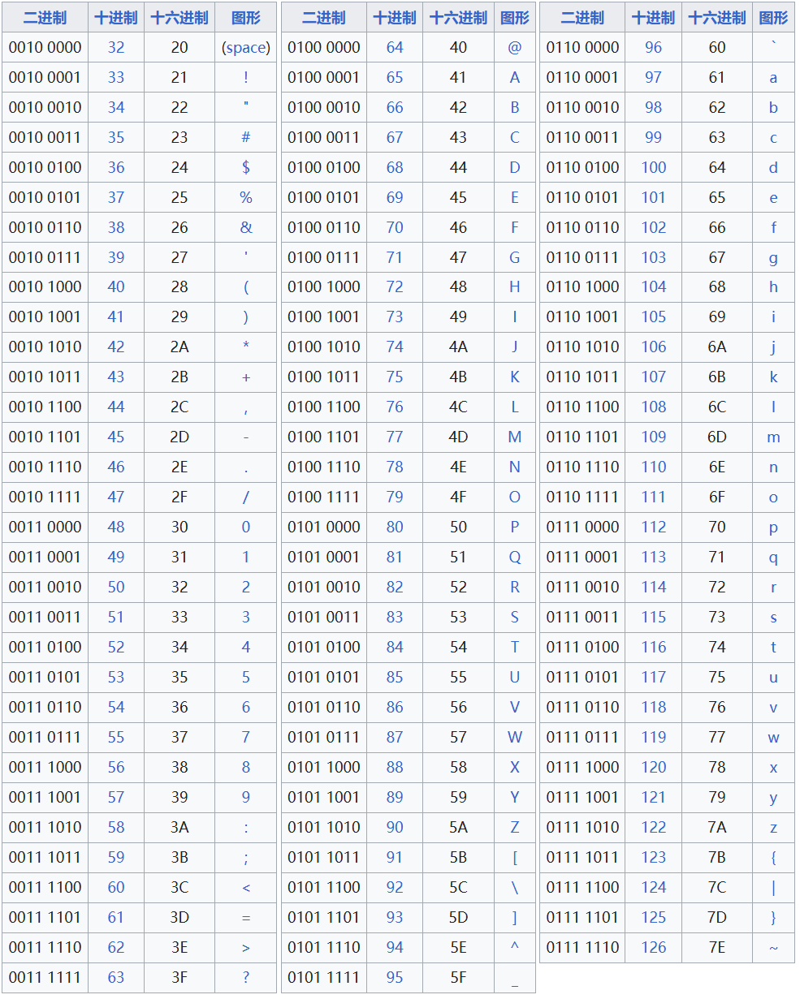
## 分析
在`0x4010778`处， `xor %eax,%eax`执行异或操作，将EAX寄存器与自身进行异或。由于任何数与自身进行异或的结果都是0，这条指令通常用于将EAX寄存器的值快速清零。

`movzbl` 指令是一个数据传送指令，从内存地址 `%rdx + 0x4024b0` 处读取一个字节（8位）的值，将这个字节值移动到EDX寄存器的最低位字节，之后将EDX寄存器的高位24位填充为零。

在`0x40108b`到`0x4010ac`，我们可以看到一个循环，直到`%rax`的值满6方能离开，但是这个循环中的代码十分难懂。

以输入`'xjtu'`为例，在循环中我们发现寄存器`%rcx`的变化，分别是115=》110=》111=》105=》101=》115，分别对应 `snoies`的`acsii`码，而读取`'xjtu'`的寄存器`%rcx`，值分别是39=>120=>106=>116=>117=>39，在下面语句设置断点发现`%rdx`的值就此变化：
```
  401099:       0f b6 92 b0 24 40 00    movzbl 0x4024b0(%rdx),%edx  
  4010a0:       88 54 04 10             mov    %dl,0x10(%rsp,%rax,1)
```

我们尝试破解它，在循环任意一处打上断点后，我们对`movzbl 0x4024b0(%rdx),%edx`进行探索，它将`0x4024b0`作为地址偏移量，读取一个字符，将其转换为无符号32位整数值放入`$edx`，接着`%edx`的最低八位寄存器`%dl`将字符入栈。现在调整地址偏移量看看：
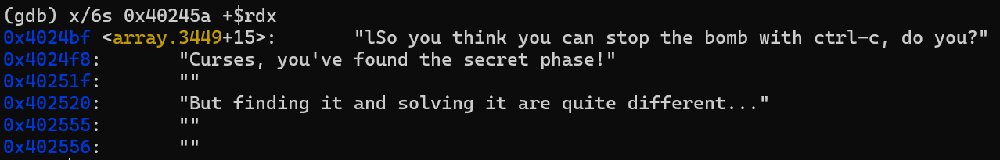
以`'xjtu'`的输入中的`'`为例子，在`0x401099`处：

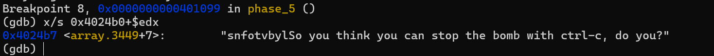
以`'xjtu'`的输入中的`x`为例子，在`0x401099`处(`%rdx`未变化)：

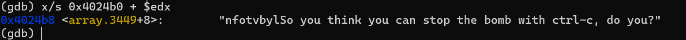
以`'xjtu'`的输入中的`j`为例子，在`0x401099`处：

以`'xjtu'`的输入中的`t`为例子，在`0x401099`处：

以`'xjtu'`的输入中的`u`为例子，在`0x401099`处：

结合下面指令会发现取了`%rcx`的低位为`%rdx`寄存器的初始值。
```
 401096:       83 e2 0f                and    $0xf,%edx
```
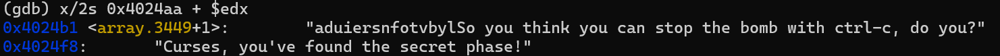
于是会发现一个很奇怪的字符串`aduiersnfotvbyl`，第七个是`s`，第八个是`n`，与`%rdx`初值刚好相等。至此，在`psol.txt`中输入:`ionefw`即可，答案不唯一。
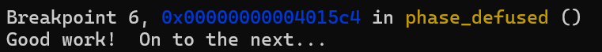
这代表我们 ：`Success！`
# phase_6 (已烂尾)
看来又是读入六个数字，`0x401121`及其附近告诉我们第一个数应该小于等于5。
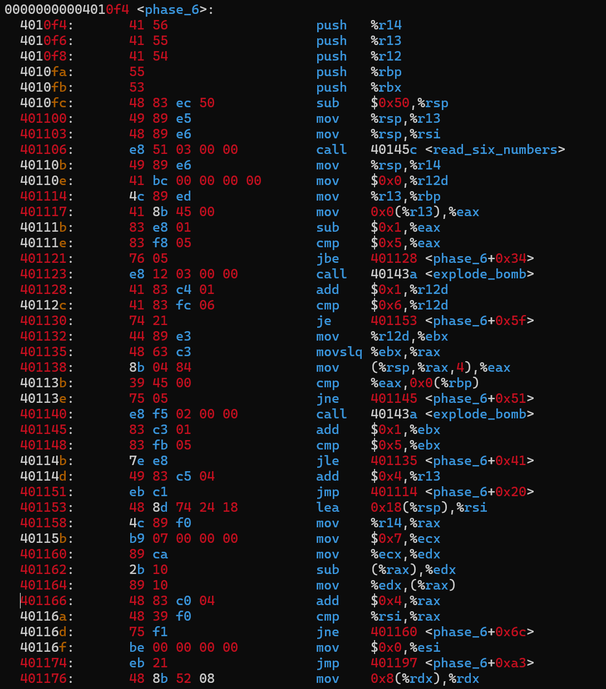
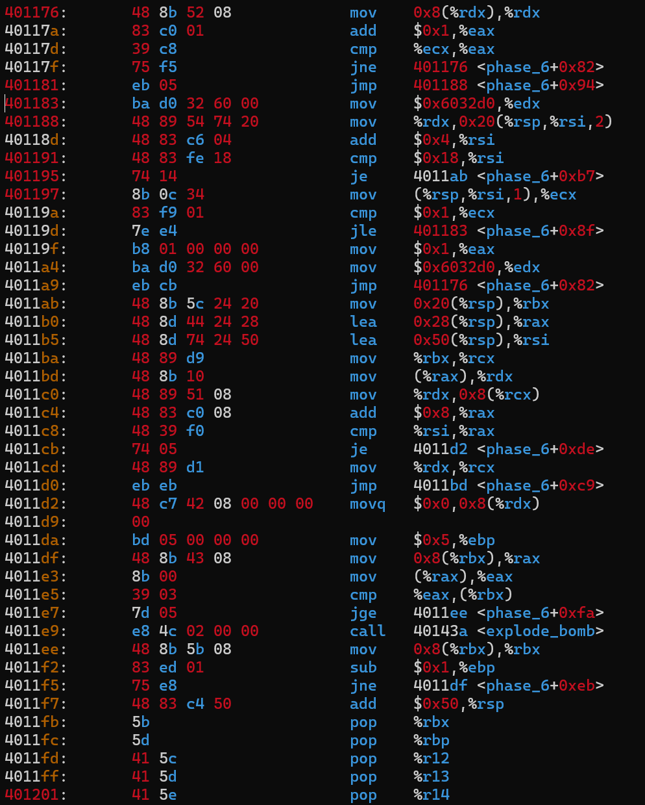

`%rbx`寄存着读入数字的个数。

未完待续……

