> 本文侧重1.讲解docker的插件使用。2.视觉consimulation项目的跨环境迁移
# 基础配置
- 安装vscode。
- 在vscode安装 Docker 插件与ms-vscode-remote.remote-containers插件。
# Docker 学习
这里可以参考：[阮一峰docker教程](https://ruanyifeng.com/blog/2018/02/docker-tutorial.html)、[菜鸟教程docker](https://www.runoob.com/docker/docker-tutorial.html)、[雪雁docker](https://www.cnblogs.com/codelove/p/10606434.html)

> 容器container是镜像image的实例化。

# 生成 dockerfile 
> 一种途径是自行编写dockerfile，另一种途径是使用插件自动生成再进行修改。

dockerfile的编写：[知乎](https://zhuanlan.zhihu.com/p/79949030)、[CSDN](https://blog.csdn.net/x1131230123/article/details/135769591)

无论是自行编写还是自动生成，需要知道的是，镜像`image`是由多个“层”组成的。每一层都是镜像构建过程中的一个步骤，每次 Docker 执行一个命令（例如 RUN、COPY、ADD 等）时，都会生成一个新的层。这些层共同构成了 `Docker` 镜像的内容。就使用`dev container`而言，`dockerfile`应该仅包含环境配置，不应该包含对应的项目功能代码包。

自动生成示例：

使用Docker扩展可以非常方便的从VisualStudio Code构建，管理和部署容器化应用程序，可以自动生成dockerfile、docker-compose.yml和.dockerignore文件（按F1并搜索Docker：将Docker文件添加到Workspace）
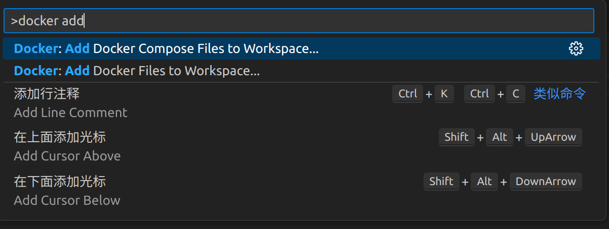
- `Add Docker Files to Workspace`用于生成一个单独的 Docker 配置文件（Dockerfile）和与之配套的基础配置文件。可能还会生成与应用环境相关的文件，例如 .dockerignore。
- `Add Docker Compose Files to Workspace` 用于生成支持多服务编排的 Docker Compose 配置文件（docker-compose.yml）。如果你的项目需要多个服务（例如后端服务、数据库服务、缓存服务）共同运行，这是更适合的选项。

接着：根据项目选择基本配置，由于不同项目需要配置不同，跟着导引选择。
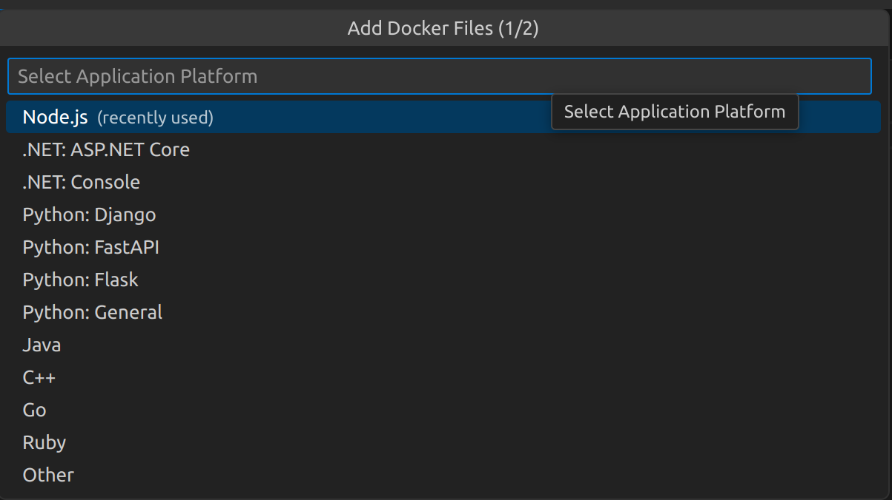
- `ASP.NET Core` 是用于构建 Web 应用程序的跨平台框架，适用于构建现代化的 Web 服务和应用。它支持 HTTP 请求处理、Web API、WebSocket、以及其他网络相关的功能。
- `Console` 应用是一个基于命令行界面的应用程序，通常用于执行后台任务、处理批量操作、定时任务等。 

这些信息自行GPT即可。

# build
上面步骤完成之后，你的项目会有`dockerfile`和`.dockerignore`，或许会有`docker-compose.debug.yml`、`docker-compose.yml`。

在资源管理器中选中`dockerfile`并且右键点击，找到`build image..`选项，接着输入<镜像名>:<标签>
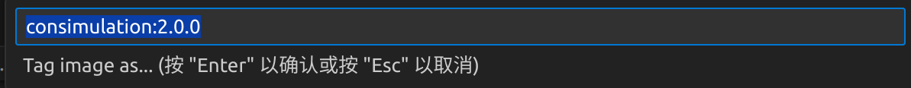

这一步相当于:`docker build -t <your-image-name>:<your-tag> .`

- `-t your-image-name:your-tag`：这里你可以指定镜像的名称和标签。例如，your-image-name 是镜像的名称，your-tag 是标签（如 latest 或 v1.0）。
- `.`：表示 Docker 构建上下文是当前目录，这意味着 Docker 会在当前目录下查找 Dockerfile。

接着等待结果。注意保持网络畅通无阻，在`git clone into..`这一步很容易Failed to connect to github.com port 443: Timed out 。
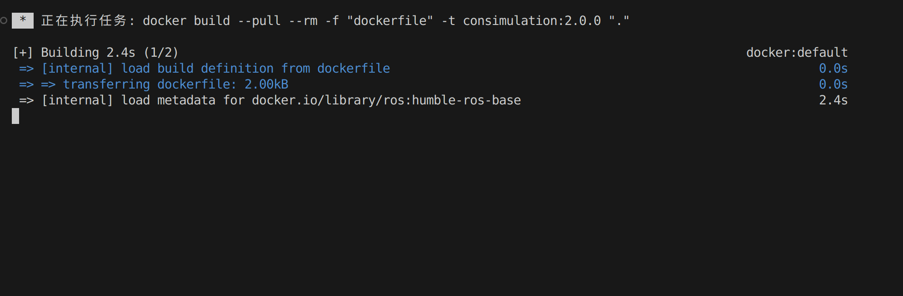

这样就算构建image成功了：
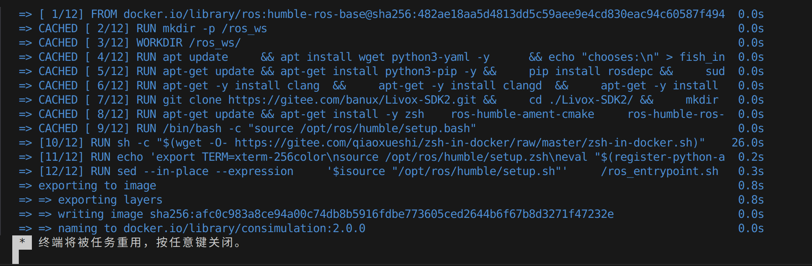

这时候你将在docker插件页面的左侧中见到刚刚 `build` 的 `consimulation:2.0.0`，如下图。`registeries`可以连接到`dockerhub`和`github`账号，不过本人`dockerhub`的状态一直是`fetch failed`。

可以在终端输入`docker images`查看已经构建的images。`docker container ps`则可以查看目前正在运行的容器的CONTAINER ID、镜像名称、端口映射等等状态。
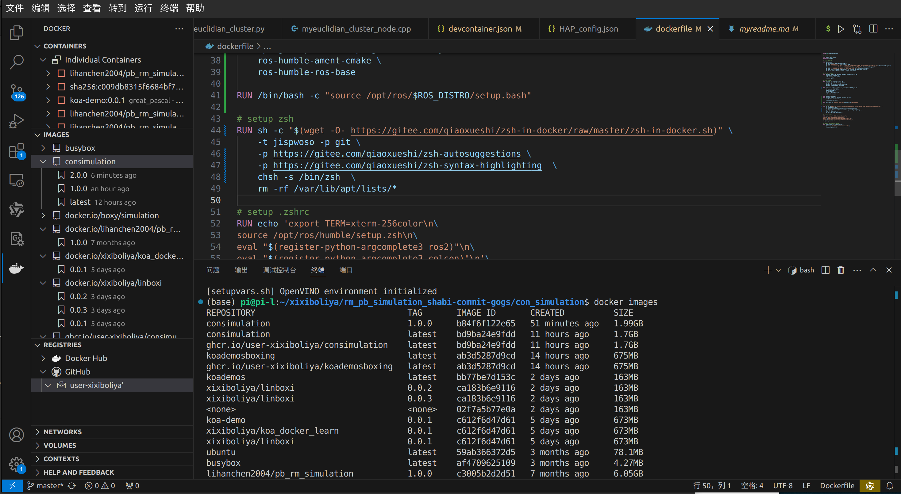
右键点击刚刚build的image，可以看到`run`和`run interactive`两个选项:
- `Run` 是直接启动容器并执行指定的命令。这通常用于容器启动后不需要用户干预的场景。容器在后台运行，不会直接打开交互式终端，适合用于以下情况：
- `Run Interactive` 则是以交互模式启动容器，并附加到容器的终端。这意味着你可以与容器内部进行交互，通常是进入容器的命令行（shell）进行操作。

此时也可以在终端输入`docker run -it --rm <image_name>:<tag> /bin/zsh`。这里的`/bin/zsh`是启动容器时执行的命令，也可以是`/bin/bash`等等，取决于dockerfile的配置。`-it`中 `-i` 表示以交互模式运行容器，`-t` 会为容器分配一个伪终端（terminal），这使得你能够与容器进行交互。`--rm`代表容器在退出后会被自动删除。这意味着容器停止后会被清除，不会留下任何痕迹。

启动示例：
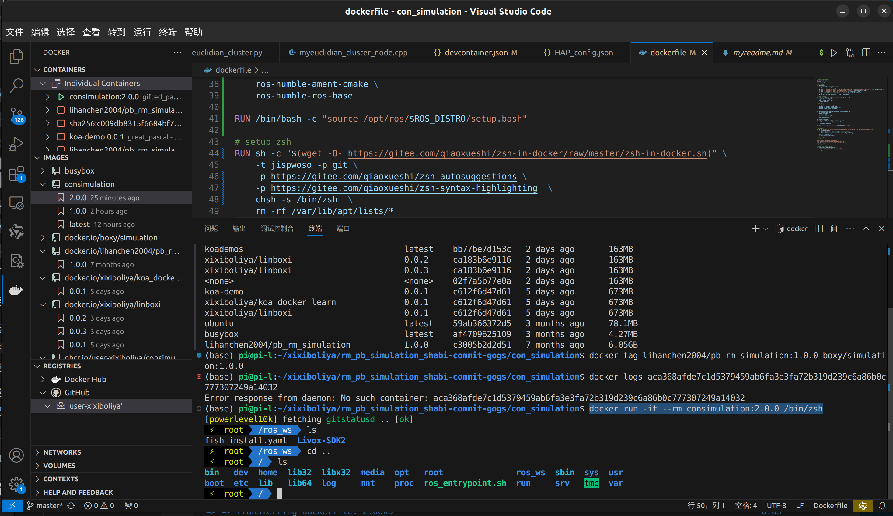

在vscode中下载dev container插件，`ctrl+shift+p`选择rebuild and reopen in container。

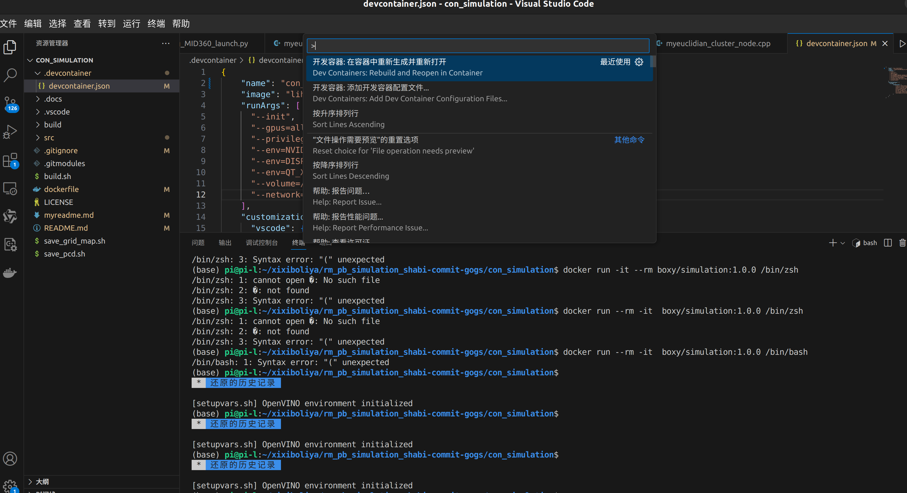

接着会发现，我们的image实例化之后的容器虽然在build时没有包含代码功能包，但我们是可以发现存在于本地项目下的代码功能包却在dockercontainer开发容器中。这样就可以对已经构建的容器进行测试了。。
# .devcontainer文件
当你`build`好`image`之后，这时你的的`image`还在本地，本机可以作为宿主机。

Visual Studio Code Dev Containers扩展允许您使用Docker 容器作为功能齐全的开发环境。项目中的文件告诉 VS Code 如何使用定义良好的工具和运行时堆栈devcontainer.json访问（或创建） Dev Containers 。该VS Code 的容器配置存储在devcontainer.json文件中。该文件类似于用于launch.json调试配置的文件，但用于启动（或附加到） Dev Containers 。

这一部分可以参考：[vscode 文档](https://vscode.github.net.cn/docs/devcontainers/create-dev-container)、[一起学docker](https://learnku.com/docs/learn-docker-together/1/pei-zhi-bian-ji-lian-lu/13233)     <=讲的挺好的

使用docker插件自动生成: 按下F1，输入`add development container configuration files...`
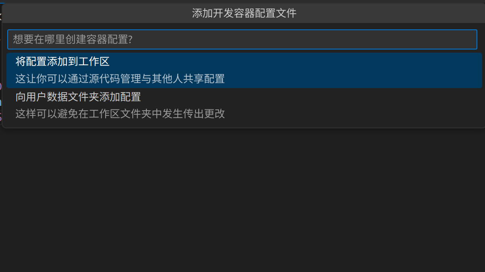

选择：`来自dockerfile`。

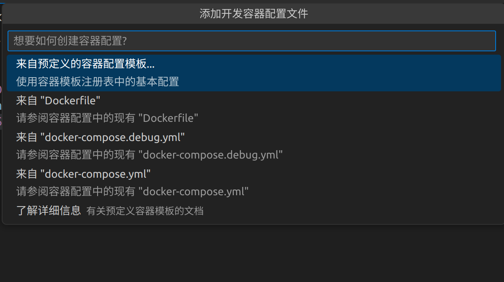

选择配置：

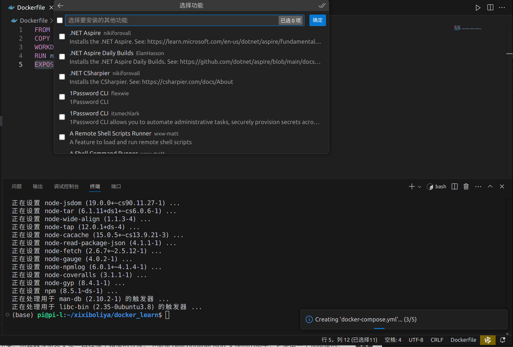

编写流程：

1、在 Command Palette 中，使用 Remote-Containers: Add Development Container Configuration Files 命令开始配置开发容器

2、按需编辑 .devcontainer 文件夹的内容

3、使用 Remote-Containers: Reopen in Container 来验证自己的配置是否可行

4、如果看到错误，在弹出的对话框中选择 Open Folder Locally

5、在窗口重新加载之后，控制台中会出现一份 build log （构建日志），以便查找问题点。再次按需编辑 .devcontainer 文件夹的内容。（如果你把构建日志关闭了以后，又想再看一下的话，可以使用 Remote-Containers: Open Log File 命令再次打开）

6、运行 `Remote-Containers: Rebuild and Reopen in Container ` 命令，如果需要，回到第 4 步。如此反复。

如果你已经成功构建了容器，仍旧可以在连上容器以后，按需编辑 .devcontainer 文件夹里面的内容。之后在 Command Palette 中，选中 Remote-Containers: Rebuild Container 命令，让修改的内容生效。

编写好.devcontainer/devcontainer.json文件之后，就能畅通无阻使用`ctrl+shift+p`在开发容器玩耍了。

# con_simulation视觉代码
由于dockerhub难以连接上(蚌埠住了)，假设原镜像有n层，本人build的n+1层镜像无法push到dockerhub，因此使用母镜像，经过测试确实能够使用，只不过镜像并不是本人的：
```bash
docker pull lihanchen2004/pb_rm_simulation:1.0.0
```
接着在rcgogs代码仓库git clone consimulation代码，用vscode打开，`ctrl+shift+p`，输入并点击 Dev Containers:Rebuild and Reopen in Container。

示例：
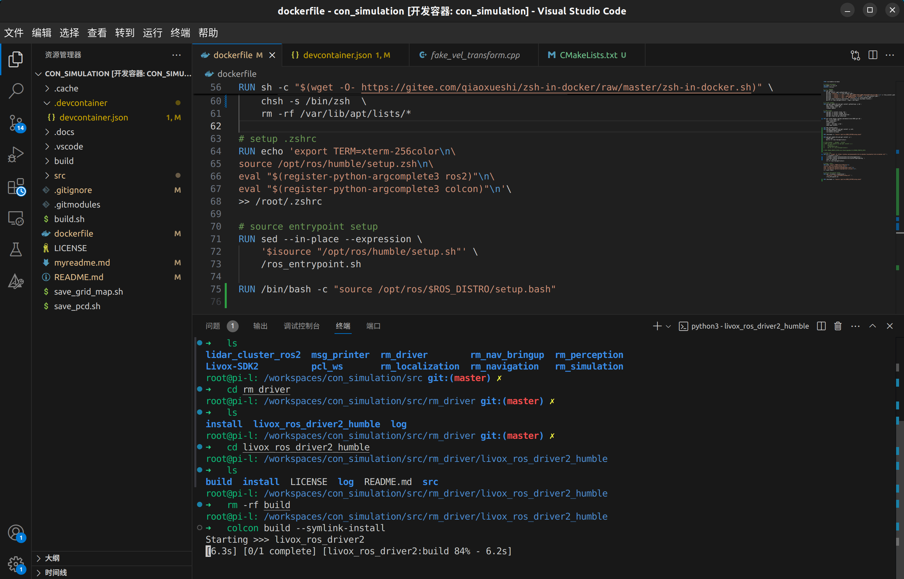

附上json文件：
```json
{
	"name": "con_simulation",  //本次的容器名称
	"image": "lihanchen2004/pb_rm_simulation:1.0.0",  // dev container 连接到的本地镜像名，可以用docker images命令找到对应的名字
	"runArgs": [
	  "--init",
	  "--gpus=all",
	  "--privileged",
	  "--env=NVIDIA_DRIVER_CAPABILITIES=all",
	  "--env=DISPLAY=${localEnv:DISPLAY}",
	  "--env=QT_X11_NO_MITSHM=1",
	  "--volume=/tmp/.X11-unix:/tmp/.X11-unix",
	  "--network=host"
	],
	"customizations": {
	  "vscode": {
			"extensions": [
				"llvm-vs-code-extensions.vscode-clangd",
				"vadimcn.vscode-lldb",
				"xaver.clang-format",
				"ms-python.python",
				"ms-iot.vscode-ros",
				"ms-vscode.cmake-tools",
				"usernamehw.errorlens"  //拓展名，具体怎么来的可以参考上面的[一起学docker]链接。
			]
	  }
	}
}

```
