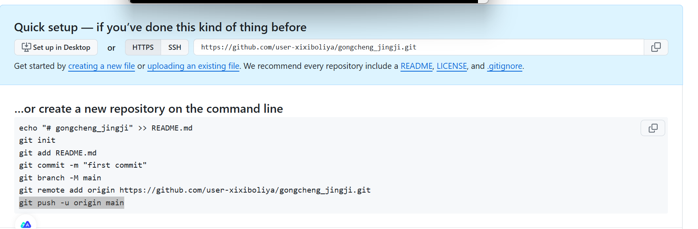
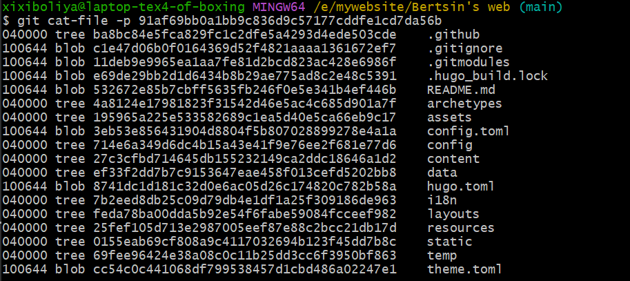

本文前半部分较为基础，后半部分对`.git`目录下进行了相关的解释。
## 基本命令
```bash
cd : 改变目录
cd .. 退回到上级目录
cd (filename)进入文件夹
pwd 显示当前目录
clear 清屏
ls 显示当前目录下的所有文件
touch （文件名.后缀） 新建一个文件
rm （文件名.后缀） 删除一个文件
mkdir test 建立一个test目录
rm -r test 删除test
mv index.txt test  移动index至test中
history 查看历史命令
help 帮助
exit 退出
```
## git项目基础
```bash
cd /path/to/your/project # 进入项目目录 
git init # 初始化 Git 仓库 
git add . # 添加所有文件到暂存区 
git commit -m "initial commit" # 提交文件 
git remote add origin https://github.com/your_username/your_repository.git # 添加远程仓库 
git branch -M main 将本地主分支设置为main
git checkout -b new-branch # 创建并切换到新分支
git push -u origin new-branch # 推送到新分支
```
内容过于基础，不再赘述。

## .git /config
`--global`、`--system`、`--local` 存在于`.git/config`中。高级别的设置会覆盖低级别的设置

- instead of 配置 : `git config --global url.git@github.com:.insteadOf https://github.com/`
- git 别名配置 `git config --global alias.cin "commit --amend --no-edit"`用cin代替。`git commit --amend --no-edit` 命令可以修改上一次提交的变更内容。
- `git config -l` 当前项目下的配置  
- `git config --system --list `查看系统的配置
- `git config --global --list` 查看用户的配置 名字 邮箱等等  就是c盘用户目录下的`.gitconfig `文件
- `git config --global user.name` 进行更改
- `cat .git/config`输出

# git/objects
`git cat-file -p <commit hash>` 这里的`<commit hash>`是在`.git`目录下的object的hash码，在项目根目录下使用`tree .git`可以看到。`commit/tree/blob`统一称为`objects`。
- blob 存储文件的内容
- Tree存储文件的目录信息
- commit存储提交信息，一个commit可以对应唯一版本的代码。
## 串联起来
通过commit寻找到Tree信息，每个commit都会存储对应的Tree ID。输入`git log`查看版本历史提交。如下：
```bash
commit 440c02148f899929c2faa3cbf5ca42f3f8785296
Author: utopia-x <your-email@linboxi123@163.com>
Date:   Sat Jan 4 16:29:19 2025 +0800
```
	
接着， 通过Tree找到对应的目录树信息：
```bash
xixiboliya@laptop-tex4-of-boxing MINGW64 /e/mywebsite/Bertsin's web (main)
$ git cat-file -p 440c02148f899929c2faa3cbf5ca42f3f8785296
tree 91af69bb0a1bb9c836d9c57177cddfe1cd7da56b
author utopia-x <your-email@linboxi123@163.com> 1735979359 +0800
committer utopia-x <your-email@linboxi123@163.com> 1735979359 +0800

first commit

```
通过Tree中获得blob的ID，通过blob获取对应的文件内容。
输入`$git cat-file -p 91af69bb0a1bb9c836d9c57177cddfe1cd7da56b`有：

# .git/refs
## head
分支名字存储在r`ref/heads`文件夹下面。
```bash
xixiboliya@laptop-tex4-of-boxing MINGW64 /e/mywebsite/Bertsin's web (main)
$ cat .git/refs/heads/main
156836544ef549d2a6af0774c7304eda45266672
```
## tag
`refs`文件存储的内容就是对应的`commit ID`，因此把`ref`当作指针，指向对应的`commit`来表示当前ref对应的版本。
```bash
git tag v0.0.1
```
## annotation tag
```bash
git -a v0.0.2 -m "add feature 1"
cat .git/refs/tags/v0.0.2`输出object的hash值
git cat-file -p [hash] 输出相关信息
```
其中就有`annotation tag`。
# 回溯历史版本代码
通过`ref`指向的`commit`可以获取唯一的代码版本。

`commit --amend`修改最近的一次`commit`信息，修改之后`commit id` 会变化。
`rebase`通过`git rebase -i HEAD~3`可以实现对最近三个`commit`的修改。
1. 合并commit
2. 修改具体的commit message 
3. 删除某一个commit
## git gc
可以删除一些不需要的`object`以及会对`object`进行一些打包也锁来减少仓库的体积。

`git gc --prune=now`指定修剪多久之前的对象，默认是两周前。
## reflog
`reflog`是用于记录操作日志，防止误操作后数据丢失。通过`reflog`来找到丢失的数据，手动将日志设置为过期。
```bash
git reflog expire --expire="2.weeks.ago" --all
```
## clone与fetch
`git fetch`将远端某些分支最新代码拉取到本地，不会进行merge操作。会修改refs/remote内的分支信息，如果需要和本地代码合并需要手动操作。

`pull`等于上述`clone` 和`fetch`的综合。不知道远端的修改建议先`fetch`在进行`rebase`。
