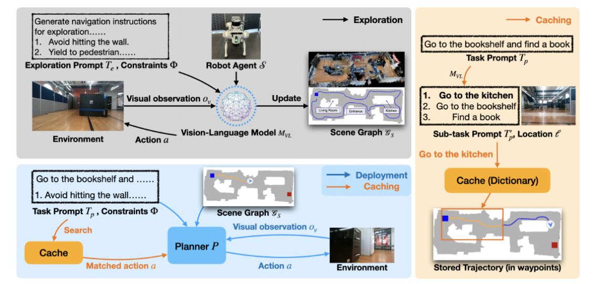
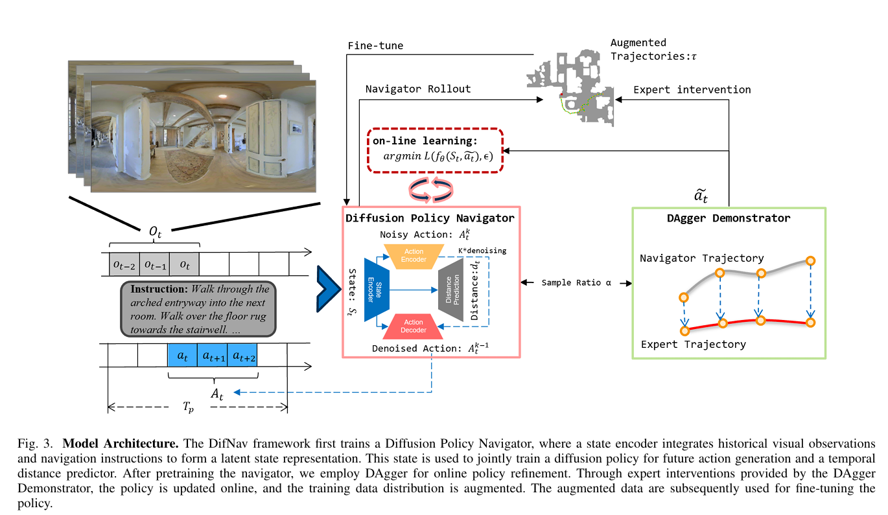

# Dream to Recall: Imagination-Guided Experience Retrieval for Memory-Persistent Vision-and-Language Navigation

- 世界模型(RSSM)的任务是：基于语言条件，想象未来导航状态：即预测 $z_{t+1},z_{t+2},…,z_{t+d}$（潜在状态）作为“如果继续导航，会发生什么/我会到哪里”。
- 同时，这些想象状态既用于“编码当前经验以存入记忆”，也用于“生成检索查询”以便后续从记忆中调取相关经验。
# Disentangling Foreground and Background for vision-Language Navigation via Online Augmentation

# NaVid: Video-based VLM Plans the Next Step for Vision-and-Language Navigation

翻译：[NaVid: Video-based VLM Plans the Next Step for Vision-and-Language Navigation](https://hjfy.top/arxiv/2402.15852)
# JanusVLN：通过双重隐式记忆解耦视觉语言导航中的语义与空间性

使用RGB达到导航的效果。对于图片输入，3D空间信息由VGGT得到，2D视觉编码则由Qwen VL得到。
# LaViRA: Language-Vision-Robot Actions Translation for Zero-Shot Vision Language Navigation in Continuous Environments
输入是纯 RGB 图像和 自然语言指令。

# VLN-Zero:Rapid Exploration and Cache-Enabled Neurosymbolic Vision-Language Planning for Zero-Shot Transfer in Robot Navigation
论文标题：VLN-Zero: Rapid Exploration and Cache-Enabled Neurosymbolic Vision-Language Planning for Zero-Shot Transfer in Robot Navigation

这篇论文提出了 VLN-Zero，一种新颖的基于神经符号的视觉-语言导航 (VLN) 规划框架，旨在实现机器人在 零样本转移 (zero-shot transfer)环境下的高效导航。该方法的核心创新在于将 **快速探索** 和 **缓存增强** 与 **神经符号规划** 结合起来，解决了传统视觉-语言导航任务中对样本依赖性和环境复杂性的高要求。

VLN-Zero 的目标是在 未见环境（zero-shot transfer）中实现机器人导航。传统的视觉-语言导航方法通常依赖于大规模的环境数据集和充足的训练样本，然而在实际应用中，机器人可能会遇到完全新的环境，这使得现有方法在适应性和普适性方面存在局限。为了克服这一挑战，VLN-Zero提出了一个新的方法框架，通过神经符号推理和环境缓存来支持机器人在未知环境中迅速适应并有效执行任务。

**VLN-Zero** 的关键技术之一是结合了 **快速探索** 和 **缓存增强**。具体来说，系统首先在任务初期执行 **快速探索**，通过较少的行动迅速了解环境的结构与布局。然后，通过 **缓存机制** 将这些经验存储下来，供后续的决策使用。这种策略使得机器人可以利用先前的经验进行推理，从而减少对传统大量样本的依赖，实现在未见环境中的 **零样本转移**。

此外，VLN-Zero 采用了 神经符号规划，它结合了神经网络和符号推理的方法。神经网络负责处理环境的感知输入（如图像和语言），而符号推理则负责将视觉和语言指令转换为高效的计划行动。通过这种方式，系统能够在VLA任务中更好地理解和执行复杂指令，同时能够处理多变的环境和任务要求。

在训练过程中，**VLN-Zero** 使用了多种增强技术，特别是 环境缓存，以减少模型对环境细节的依赖。通过缓存机制，机器人可以在不同的任务间共享相同的环境知识，从而提高任务执行效率。训练过程中，模型不仅学习如何理解和执行语言指令，还学习如何在新的、未知的环境中应用这些知识。此外，论文还提出了一种自适应的训练方法，允许机器人在探索过程中根据环境变化自动调整策略。

部署时，机器人根据 **视觉输入** 和 **语言指令** 进行实时推理。通过前期的缓存和符号推理，机器人可以有效地将输入的语言指令转化为动作，即使在完全没有见过的环境中，也能通过缓存的环境信息和符号规划策略执行任务。该方法在大规模仿真环境中进行了测试，并取得了良好的零样本转移结果，证明了其高效的跨环境泛化能力。

**VLN-Zero** 的主要贡献在于其创新的 **神经符号规划框架**，以及 **快速探索** 和 **缓存增强** 策略。这些方法有效地提高了机器人在 **零样本转移** 任务中的表现，突破了传统视觉-语言导航方法对于大量训练样本和环境依赖的限制。论文还通过多种实验验证了该方法在多种场景中的有效性，展示了其在 **跨环境导航** 和 **复杂任务执行** 中的巨大潜力。
# Walk and Read Less: Improving the Efficiency of Vision-and-Language Navigation via Tuning-Free Multimodal Token Pruning
一篇剪枝的文章。

# DAgger Diffusion Navigation: DAgger Boosted Diffusion Policy for Vision-Language Navigation

# Boosting Zero-Shot VLN via Abstract Obstacle Map-Based Waypoint Prediction with TopoGraph-and-VisitInfo-Aware Prompting
[Boosting Zero-Shot VLN via Abstract Obstacle Map-Based Waypoint Prediction with TopoGraph-and-VisitInfo-Aware Prompting](https://hjfy.top/arxiv/2509.20499)