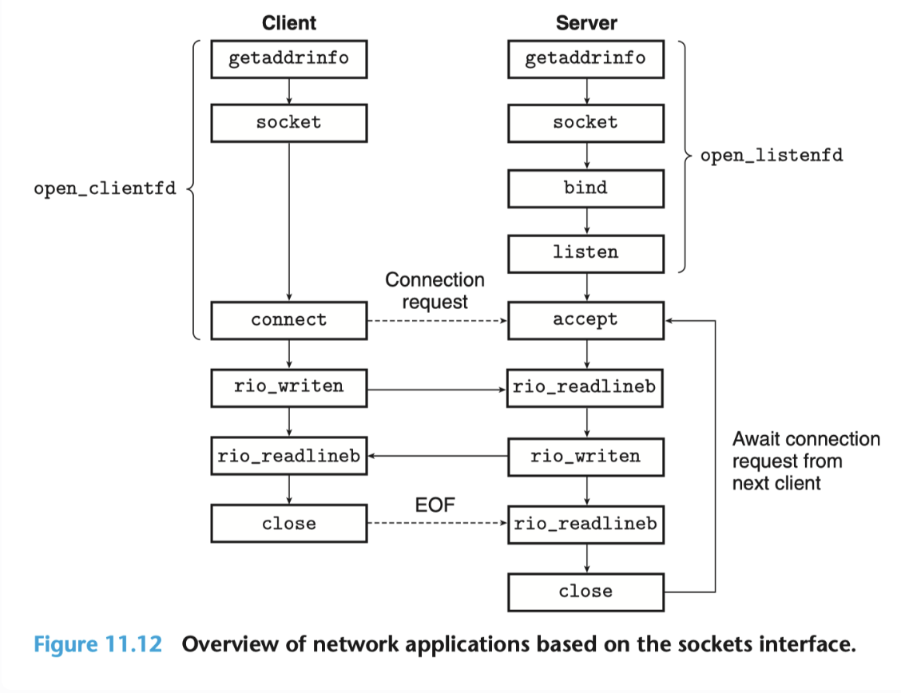
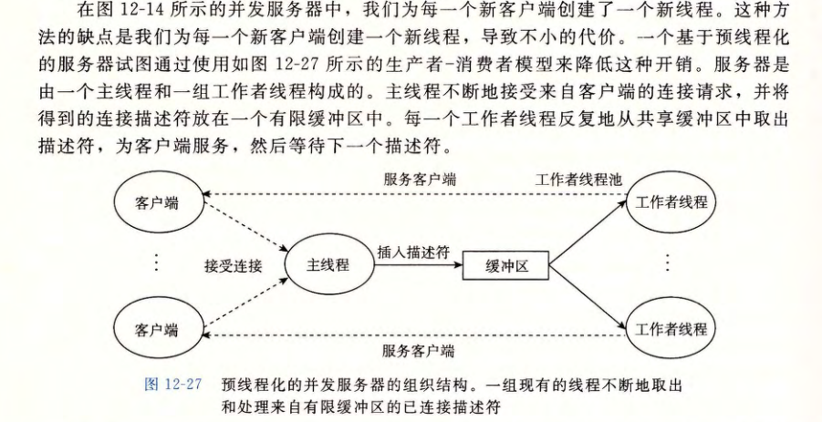

本文的所有配置、指令均以 Ubuntu 环境为例，而且假设你不具有桌面环境，只有纯命令行环境。
# Pre-start
在工作目录下解压`proxylab - handout.tar`：
```bash
tar -xvf proxylab-handout.tar  
```
- `-x`：表示提取文件，也就是解压操作。
- `-v`：用于显示详细的解压过程，方便你了解解压的进度和具体文件。
- `-f`：指定要处理的文件名，后面紧跟要解压的 `.tar` 文件的名称。

以下是简要介绍，本文的根工作空间是`proxylab-handout`：
```bash
proxylab-handout
├── Makefile
├── README
├── csapp.c
|—— cache.c  //自行编写的cache
|—— cache.h  //自行编写的chche
|—— proxy.h
├── csapp.h
├── driver.sh   //简单自动评分程序。进行基本的合理性检查。
├── free-port.sh
├── nop-server.py
├── port-for-user.pl  //给出偶数端口号，以便和Tiny web server 进行 testing。
├── proxy.c  //打印出一个特定的 HTTP `User-Agent` 头部信息到标准输出。用于标识客户端软件的类型和版本，服务器可以根据这个信息来提供不同的服务或内容。
└── tiny  //tiny服务器
```
## 环境配置
配置linux 版本的chrome 和 chrome driver 。两者版本需对应，还有自动化测试工具Selenium，参考[Arthals'ink环境配置]([更适合北大宝宝体质的 Proxy Lab 踩坑记 • Arthals' ink](https://arthals.ink/blog/proxy-lab#%E7%8E%AF%E5%A2%83%E9%85%8D%E7%BD%AE))

```bash
wget https://dl.google.com/linux/direct/google-chrome-stable_current_amd64.deb
sudo dpkg -i google-chrome-stable_current_amd64.deb
rm google-chrome-stable_current_amd64.deb

wget https://edgedl.me.gvt1.com/edgedl/chrome/chrome-for-testing/<your chrome corresponse verison>/linux64/chromedriver-linux64.zip
unzip chromedriver-linux64.zip
rm chromedriver-linux64.zip
sudo mv chromedriver /usr/local/bin/    #（即默认环境变量 `$PATH` 检索的位置）下，这样就可以在任意目录下使用 `chromedriver` 命令用以启动驱动。
sudo apt install net-tools
pip3 install selenium
```

开启`tiny`服务器，在当前shell中：
```bash
cd tiny && make clean && make & ./tiny 7778 & cd ..
jobs   如果删去的话：kill %1 
cd proxylab-handout
make clean && make && ./proxylab 7777 & 
curl -v --proxy http://localhost:7777 http://localhost:7778/
```

# About
```c
/* rio_readinitb - Associate a descriptor with a read buffer and reset buffer
 *
 * open_clientfd - Open connection to server at <hostname, port> and
 *     return a socket descriptor ready for reading and writing. This
 *     function is reentrant and protocol-independent.
 *     On error, returns:
 *       -2 for getaddrinfo error
 *       -1 with errno set for other errors.
 *
 * if (!Rio_readlineb(&rio, buf, MAXLINE))  //line:netp:doit:readrequest 带缓冲区的读，将一行读入buf中。
 * /
```
# begin
## web proxy的实验任务1
要求：
- 实现一个处理 HTTP/1.0 GET 请求的基本顺序 web 代理
- 如果接收到一个浏览器请求为 HTTP/1.1 版本，则应将它作为 HTTP/1.0 请求转发
- 转发合法的 HTTP 请求

- 假设请求为 `GET http://www.cmu.edu/hub/index.html HTTP/1.1`
- 则主机名为 `www.cmu.edu`
- 请求的页面为 `/hub/index.html`
- HTTP 请求每行以 `\r\n` 结束，以一个空行 `\r\n` 结尾

- 代理发送的请求的 header 为：

- `Host`: 如 `Host: www.cmu.edu`
- `User-Agent`: 如 `User-Agent: Mozilla/5.0 (X11; Linux x86_64; rv:10.0.3) Gecko/20120305 Firefox/10.0.3`
- `Connection`: 必须发送 `Connection: close`
- `Proxy-Connection`: 必须发送 `Proxy-Connection: close`

> 实现大体思路：



在`proxy`中，`open_listenfd(char* port)` 为我们完成了`getaddrinfo()`、`socket()`、`bind()`、`listen()`部分，`port`则是`char *argv[1]`，`argc`记录调用命令的参数个数。

首先，参考基于线程的并发`hello world`服务器，这只是一部分，后续我们会修改成预线程化的并发处理方式：
```c
int main(int argc,char *argv[])
{
    signal(SIGPIPE,SIG_IGN);
    int listenfd,connfd,*connfdp;
    socklen_t clientlen;
    struct sockaddr_storage clientaddr;  // 容纳不同地址族（如 IPv4、IPv6 等）的套接字地址信息
    char client_hostname[MAXLINE],client_port[MAXLINE];
    pthread_t tid;
    if(argc != 2){
        fprintf(stderr,"Usage: %s <port>\n", argv[0]);
        exit(1);
    }
    listenfd = Open_listenfd(argv[1]);  //listenfd 是监听socket的文件描述符，绑定到argv[1] port上。
    printf("%d\n",listenfd);
    while(1){
        clientlen = sizeof(clientaddr);
        connfdp = (int*)Malloc(sizeof(int));
        *connfdp = Accept(listenfd,(SA*)&clientaddr,&clientlen); //将 struct sockaddr_storage 类型的指针转换为 struct sockaddr * 类型的指针
        connfd = *connfdp;
        printf("connfd in main:%d\n",connfd);
        printf("tid : %ld \n",tid);
        Pthread_create(&tid,NULL,thread,connfdp);
        Pthread_join(tid,NULL);
        printf("connented to (%s,%s)\n",client_hostname,client_port);
        // Close(connfd);
    }
    printf("%s", user_agent_hdr);
    exit(0);
    return 0;
}
void *thread(void *vargp)
{
    int connfd = *((int *)vargp);
    Free(vargp);
    Pthread_detach(pthread_self());
    printf("Hello,world!\n");
    doit(connfd);
    Close(connfd);
    return 0;
}
   ```

将上述`printf("Hello,world!\n");`替换成具体的实现`GET`方法的`void doit()`函数，在`void doit()`中，要求实现对`http://localhost:7778/`(`tiny`的访问路径)的解析，解析成`hostname`，`port`，`path='/'`三部分，`hostname , port`用于`Open_clientfd()`打开`server`的`<hostname,port>`，返回套接字描述符，准备读写。

### 解析url
- `int strncmp(const char *s1, const char *s2, size_t n);`：
- **功能**：比较字符串 `s1` 和 `s2` 的前 `n` 个字符。如果两个字符串的前 `n` 个字符相等，则返回 0；如果 `s1` 的字符按字典序小于 `s2` 的字符，则返回一个小于 0 的值；如果 `s1` 的字符按字典序大于 `s2` 的字符，则返回一个大于 0 的值。在代码中，`strncmp(url, prefix, prefix_len)` 用于判断输入的 URL 是否以 `"http://"` 开头，如果不是则直接返回，不再进行后续解析。

- `char *strchr(const char *s, int c);`
- **功能**：在字符串 `s` 中查找字符 `c` 第一次出现的位置，并返回指向该位置的指针。如果字符 `c` 不在字符串 `s` 中，则返回 `NULL`。在代码中，`strchr(host_start, '/')` 用于查找 URL 中路径部分的起始位置，`strchr(host_start, ':')` 用于查找端口号部分的起始位置。
- `char *strdup(const char *s);`
- **功能**：分配足够的内存来复制字符串 `s`，并将 `s` 的内容复制到新分配的内存中，然后返回指向新字符串的指针。如果内存分配失败，则返回 `NULL`。在代码中，`strdup("80")` 用于在没有明确指定端口号时，为 `url_data->port` 分配内存并复制默认端口号 `"80"`，`strdup(path_start)` 和 `strdup("/")` 用于为 `url_data->path` 分配内存并复制相应的路径字符串。
- `char *strncpy(char *dest, const char *src, size_t n);`
- **功能**：将字符串 `src` 的前 `n` 个字符复制到字符串 `dest` 中。如果 `src` 的长度小于 `n`，则 `dest` 会以 null 字符填充剩余位置；如果 `src` 的长度大于等于 `n`，则 `dest` 不会自动添加 null 字符，需要手动添加。在代码中，`strncpy(url_data->hostname, host_start, host_len)` 用于将提取的主机名字符串复制到 `url_data->hostname` 中，`strncpy(url_data->port,port_start + 1,port_len)` 用于将提取的端口号字符串复制到 `url_data->port` 中。
```c
void parse_url(URL* url_data, const char* url) {
    if (!url_data || !url) return;
    const char* prefix = "http://";
    size_t prefix_len = strlen(prefix);
    if (strncmp(url, prefix, prefix_len) != 0) return;
    // 每一个部分的开始位置
    const char* host_start = url + prefix_len;
    const char* path_start = strchr(host_start, '/');
    const char* port_start = strchr(host_start,':');
    if (port_start - host_start < 0) {
        printf ("port_start - host_start error.");
    }
    size_t host_len = path_start ? (size_t)(port_start - host_start) : strlen(host_start);
    url_data->hostname = (char*)malloc(host_len + 1);
    strncpy(url_data->hostname, host_start, host_len);
    url_data->hostname[host_len] = '\0';
    // 如果没有端口号
    if (port_start == NULL){
        url_data->port = strdup("80");
    }
    else{
        const char* port_end = path_start ? path_start : (host_start + strlen(host_start));
        size_t port_len = (size_t)(port_end - (port_start + 1));
        url_data->port = (char*)malloc(port_len + 1);
        strncpy(url_data->port,port_start + 1,port_len);
        url_data->port[port_len] = '\0';
    }
    url_data->path = path_start ? strdup(path_start) : strdup("/");
    printf("Hostname: %s\n", url_data->hostname);
    printf("Port: %s\n", url_data->port);
    printf("Path: %s\n", url_data->path);
}
```
### 构建请求头
要求构建的请求头格式：
```bash
GET / HTTP/1.0
Host: localhost:7778
Accept: */*
Connection: close
Proxy-Connection: close
User-Agent: Mozilla/5.0 (X11; Linux x86_64; rv:10.0.3) Gecko/20120305 Firefox/10.0.3
```
`build_header` 函数的主要功能是构建一个 HTTP 请求头，这个请求头将被代理服务器用于向目标服务器发送请求。它会从客户端的请求中读取部分信息，对其进行处理和筛选，然后添加必要的请求头字段，最终生成一个完整的 HTTP 请求头。

当读取到空行（`\r\n`）时，意味着客户端请求头结束，此时跳出循环。

跳过 `Connection`、`Proxy-Connection` 和 `User-Agent` 这些头字段。因为代理服务器需要统一控制这些字段，避免客户端的设置对代理转发产生影响。
```c
void build_header(URL *url_data, char *serverbuf, const char *version, rio_t *clientrio)
{  
    snprintf(serverbuf, MAXLINE, "GET %s %s\r\n", url_data->path, version);
    // 使用 snprintf 函数将请求行（如 "GET /path HTTP/1.0"）写入 serverbuf 缓冲区。
    // 这样做是因为所有的 HTTP GET 请求都以请求行开始，指定了请求方法（GET）、请求路径和 HTTP 版本。
    // 第二步：初始化缓冲区和标志位
    char buf[MAXLINE];
    int has_host_flag = 0;
    while (1)
    {
        Rio_readlineb(clientrio, buf, MAXLINE);
        if (strcmp(buf, "\r\n") == 0)
        {
            break;
        }
        if (strncasecmp(buf, "Host:", 5) == 0)
        {
            has_host_flag = 1;
        }
        // 跳过客户端发送的 Connection、Proxy-Connection、User-Agent 头
        if (strncasecmp(buf, "Connection:", 11) == 0 ||
            strncasecmp(buf, "Proxy-Connection:", 17) == 0 ||
            strncasecmp(buf, "User-Agent:", 11) == 0)
        {
            continue;
        }
        strcat(serverbuf, buf);
    }

    if (!has_host_flag)
    {
        sprintf(buf, "Host: %s\r\n", url_data->hostname);
        strcat(serverbuf, buf);
    }
    strcat(serverbuf, "Connection: close\r\n");
    strcat(serverbuf, "Proxy-Connection: close\r\n");
    strcat(serverbuf, user_agent_hdr);
    strcat(serverbuf, "\r\n");
    printf("Generated header:\n%s", serverbuf);
}
```
### do it 方法
```c
void doit(int connfd){
    char buf[MAXLINE], method[MAXLINE], url[MAXLINE], version[MAXLINE];
    const char *http = "HTTP/1.0";
    rio_t clientrio;
    Rio_readinitb(&clientrio, connfd);
    if (Rio_readlineb(&clientrio, buf, MAXLINE) == 0)
    {
        return;
    }
    sscanf(buf, "%s%s%s", method, url, version);
    // 仅使用GET方法,不是GET的话就return。
    if (strcmp(method, "GET"))
    {
        printf("proxy dosen't support this method.");
        return;
    }
    else
    {
        // HTTP/1.1 -》 HTTP/1.0
        if (strcmp(version, http))
        {
            strcpy(version, http);
        }
        printf("version: %s\n", version);
        do_get(&clientrio, method, url, version,connfd,buf);
    }
   //  Close(connfd);
}
```
- **读取请求行**  
    在 `doit` 函数中，使用 `Rio_readlineb` 从客户端读入请求数据，通常第一行是形如 `"GET http://example.com/path HTTP/1.1"` 的请求行。使用 `sscanf` 分解出方法、URL 和版本。
    
- **判断请求方法**  
    代码只支持 GET 请求，如果请求方法不是 `"GET"`，则打印不支持提示并直接返回。
    
- **版本号处理**  
    如果请求的 HTTP 版本不是 `"HTTP/1.0"`，则将其强制改为 HTTP/1.0，这样后续与服务器的通信保持一致。
###  do get方法
```c
void do_get(rio_t *clientrio, const char *method, const char *url, const char *version, int connfd, char *buf)
{
    char serverbuf[MAXLINE];
    rio_t server_rio;
    URL *url_data = Malloc(sizeof(URL));
    ssize_t n;
    parse_url(url_data, url);
    if(query_cache(cache, connfd, url))
    {
        return;
    }
    printf("Can not find in cache , build header will coming!\n");
    build_header(url_data, serverbuf, version, clientrio);
    int serverfd = Open_clientfd(url_data->hostname, url_data->port);
    if (serverfd < 0)
    {
        printf("connection failed.\n");
        return;
    }
    Rio_readinitb(&server_rio, serverfd);
    printf("server id: %d\n", serverfd);
    Rio_writen(serverfd, serverbuf, strlen(serverbuf));
    // 临时缓存

    char response_cache[CACHESIZE];
    int total_size = 0;

    while ((n = Rio_readlineb(&server_rio, buf, MAXLINE)) != 0)
    {
        printf("proxy received %d bytes,then send to client\n", (int)n);
        Rio_writen(connfd, buf, n);
        if (total_size + n < CACHESIZE)
        {
            memcpy(response_cache + total_size, buf, n);
            total_size += n;
        }
        else
        {
            total_size = 0;
        }
    }
    if (total_size > 0)
    {
        cache_insert(cache, connfd, url, response_cache,total_size);
    }
    Close(serverfd);
    if (url_data)
    {
        free_url(url_data);
        free(url_data);
    }

}

void free_url(URL* url_data) {
    if (!url_data) return;
    free(url_data->hostname);
    free(url_data->port);
    free(url_data->path);
}
```
`chatgpt`的解释：
- **解析 URL**  
    在 `do_get` 函数中，首先调用 `parse_url` 对 URL 进行解析。解析过程包括：
    
    - 检查 URL 是否以 `"http://"` 开头。
    - 提取主机名、端口号（如果有，否则默认为 80）和路径（如果未提供路径则默认为 `/`）。
    - 打印解析结果，方便调试。
- **缓存查询**  
    调用 `query_cache(cache, connfd, url)` 判断请求是否已存在缓存中。如果存在则直接返回缓存内容给客户端，无需重新发起请求。
    
- **构建转发请求头**  
    如果缓存中未找到对应响应，调用 `build_header` 生成新的 HTTP 请求头。此函数：
    
    - 使用 `snprintf` 构造首行 `"GET <path> <version>"`。
    - 逐行读取客户端发送的请求头信息，跳过客户端的 `Connection`、`Proxy-Connection` 和 `User-Agent` 字段，确保这些头部由代理自行设置。
    - 若客户端请求中未包含 `Host` 字段，则手动添加一个 `Host: <hostname>` 字段。
    - 最后添加 `"Connection: close"`、`"Proxy-Connection: close"` 和预定义的 `User-Agent` 头，保证服务器端连接在响应后关闭。
- **建立与目标服务器的连接**  
    使用 `Open_clientfd(url_data->hostname, url_data->port)` 根据解析的主机名和端口建立到目标服务器的连接。成功后利用 `Rio_writen` 将构造好的请求头发送给目标服务器。
    
- **中继服务器响应**  
    通过一个循环不断调用 `Rio_readlineb` 读取服务器响应：
    
    - 每读取一行数据，通过 `Rio_writen` 发送回客户端，实现响应中继。
    - 同时，将数据临时保存在 `response_cache` 缓存数组中（如果数据总量未超过缓存大小）。
    - 打印调试信息，显示每次中继的数据字节数。
- **缓存响应数据**  
    如果整个响应数据大小小于缓存容量（`CACHESIZE`），则调用 `cache_insert` 将响应内容缓存，方便后续相同请求快速响应。
    
- **资源释放**  
    完成响应中继后，关闭与服务器的连接，并调用 `free_url` 释放在 URL 解析时分配的内存。
### Basic结果
```bash
*** Basic ***
Starting tiny on 20186
Starting proxy on 29325
1: home.html
   Fetching ./tiny/home.html into ./.proxy using the proxy
   Fetching ./tiny/home.html into ./.noproxy directly from Tiny
   Comparing the two files
   Success: Files are identical.
2: csapp.c
   Fetching ./tiny/csapp.c into ./.proxy using the proxy
   Fetching ./tiny/csapp.c into ./.noproxy directly from Tiny
   Comparing the two files
   Success: Files are identical.
3: tiny.c
   Fetching ./tiny/tiny.c into ./.proxy using the proxy
   Fetching ./tiny/tiny.c into ./.noproxy directly from Tiny
   Comparing the two files
   Success: Files are identical.
4: godzilla.jpg
   Fetching ./tiny/godzilla.jpg into ./.proxy using the proxy
   Fetching ./tiny/godzilla.jpg into ./.noproxy directly from Tiny
   Comparing the two files
   Success: Files are identical.
5: tiny
   Fetching ./tiny/tiny into ./.proxy using the proxy
   Fetching ./tiny/tiny into ./.noproxy directly from Tiny
   Comparing the two files
   Success: Files are identical.
Killing tiny and proxy
basicScore: 40/40
```
# Concurency 并发 与cache 缓存
## 并发
### main
```c
int main(int argc, char *argv[])
{
    signal(SIGPIPE, SIG_IGN);
    int listenfd, *connfdp;
    socklen_t clientlen;
    struct sockaddr_storage clientaddr; // 容纳不同地址族（如 IPv4、IPv6 等）的套接字地址信息
    pthread_t tid;
    if (argc != 2)
    {
        fprintf(stderr, "Usage: %s <port>\n", argv[0]);
        exit(1);
    }
    listenfd = Open_listenfd(argv[1]); // listenfd 是监听socket的文件描述符，绑定到argv[1] port上。
    cache = Malloc(sizeof(cache_header));
    cache_init(cache);
    printf("%d\n", listenfd);
    for (int i = 0; i < NTHREADS; i++)
    {
        Pthread_create(&tid, NULL, thread, NULL);  //为线程捆绑thread方法
    }
    while (1)
    {
        clientlen = sizeof(clientaddr);
        connfdp = (int *)Malloc(sizeof(int));
        *connfdp = Accept(listenfd, (SA *)&clientaddr, &clientlen); // 将 struct sockaddr_storage 类型的指针转换为 struct sockaddr * 类型的指针
        // connfdp 加入队列
        printf("connfdp number is %d\n", *connfdp);
        pthread_mutex_lock(&queue_mutex);
        struct myQueueNode *node = Malloc(sizeof(myQueueNode));
        node->connfdp = connfdp;
        node->next = NULL;
        if (queue.tail == NULL)
        { // 队列为空
            queue.head = queue.tail = node;
        }
        else
        { // 追加到队列尾部
            queue.tail->next = node;
            queue.tail = node;
        }
        pthread_cond_signal(&queue_cond); // 通知一个等待的线程
        pthread_mutex_unlock(&queue_mutex);
        printf("tid : %ld \n", tid);
    }
    printf("%s", user_agent_hdr);
    free(cache);
    exit(0);
    return 0;
}
```
1. 主线程首先通过 `pthread_mutex_lock(&queue_mutex);` 获取互斥锁，从而保证在修改共享队列 `queue` 时不会被其他线程干扰。
    
2. 随后，主线程创建一个新的节点 `node` 并将新的连接描述符加入到队列中（如果队列为空则初始化头尾，否则追加到队列尾）。
    
3. 添加节点完成后，通过 `pthread_cond_signal(&queue_cond);` 通知至少一个等待该条件变量的线程（这些线程可能正处于等待队列非空的状态）。
    
4. 最后，主线程通过 `pthread_mutex_unlock(&queue_mutex);` 释放锁，允许其他线程访问共享队列。
### thread
- **线程等待任务**  
    每个工作线程在 `thread` 函数开始时通过 `pthread_mutex_lock` 加锁后检查队列。如果队列为空，调用 `pthread_cond_wait` 阻塞等待新的连接到来。
- **从队列中取出任务**  
    一旦队列中有任务，线程获取队列头节点，将其从队列中摘除。取出连接后释放互斥锁。
- **调用请求处理函数**  
    线程调用 `doit(connfd)` 处理这个客户端请求。处理完后关闭连接并释放对应的内存资源。
```c
void *thread(void *vargp)
{  
    pthread_mutex_lock(&queue_mutex);
    while (queue.head == NULL)
    {
        pthread_cond_wait(&queue_cond, &queue_mutex);
    }  
    myQueueNode *node = queue.head;
    queue.head = queue.head->next;
    if( queue.head == NULL)
    {
        queue.tail = NULL;
    }
    // int connfd = *((int *)vargp);
    int *connfdp = node->connfdp;
    Free(node);
    pthread_mutex_unlock(&queue_mutex);
    printf("thread is working...\n");
    int connfd = *connfdp;
    doit(connfd);
    Close(connfd);
    free(connfdp);
    return 0;
}
```

这种做法确保了在对队列进行操作时的线程安全，防止了多个线程同时修改队列而产生数据竞争或数据不一致的问题。
## 缓存


 `Proxy` 中，当多个客户端或一个客户端多次访问同一个服务端的同一对象时，`Proxy` 每次都要从服务端请求，这是很耗费时间的。如果 `Proxy` 能把访问过的对象存储下来，那么再次遇到同样的请求时，就不需要再连接到服务端了，可以直接回复给客户端。而 `Cache` 的大小并不是无限的，所以就又要考虑替换策略，本实验要求使用 `LRU`，采用的是读者与写者的模型，读者的优先级高于写者。（见书上707页）

[CSAPP | Lab9-Proxy Lab 深入解析 - 知乎](https://zhuanlan.zhihu.com/p/497982541)
`cache`，包括`cache.c`和`cache.h`：
```c
// cache.h
#define CACHESIZE 102400
#define CACHENUM 10
#define CACHENAMELEN 64
typedef struct
{
  int size;
  int timestamp;
  char cache_name[CACHENAMELEN];
  char content[CACHESIZE];
} cache_content;
typedef struct
{
  int used_cache_num;
  cache_content menu[CACHENUM];
} cache_header;
void cache_insert(cache_header *cache_content, int connfd,const char* url,const char *response_cache,int response_size);

void cache_init(cache_header* cache);  //cache_header 是结构体类型，不能把取地址运算符用在类型声明上
void cache_clean(cache_header* cache);
int query_cache(cache_header* cache,int connfd,const char* url);

// cache.c
static sem_t mutex,w;
static int cache_time_stamp = 0;
static int reader_cnt = 0;
/**
 * @brief 添加到缓存
 * @param  cache_header     My Param doc
 * @param  connfd           My Param doc
 * @param  url              My Param doc
 * @param  response_cache   My Param doc
 * @param  response_size    My Param doc
 */
void cache_insert(cache_header *cache_header, int connfd, const char *url, const char *response_cache, int response_size)
{
  P(&w);
  // 若cache已经insert满了，找到最老的content进行LRU替换
  if (cache_header->used_cache_num == CACHENUM)
  {
    int oldest = 0;
    for (int i = 1; i < CACHENUM; i++)
    {
      if (cache_header->menu[i].timestamp < cache_header->menu[oldest].timestamp)
        oldest = i;
    }
    cache_header->menu[oldest].size = response_size;
    strncpy(cache_header->menu[oldest].cache_name, url, CACHENAMELEN - 1);
    cache_header->menu[oldest].cache_name[CACHENAMELEN - 1] = '\0';
    memcpy(cache_header->menu[oldest].content, response_cache, response_size);
    P(&mutex); // 更新时间戳的时候需要加锁
    cache_header->menu[oldest].timestamp = cache_time_stamp;
    V(&mutex);
    cache_time_stamp++;
  }
  else
  {
    // cache 没满
    printf("Insert into cache...");
    P(&mutex);
    cache_header->menu[cache_header->used_cache_num].timestamp = cache_time_stamp;
    V(&mutex); 
    cache_header->menu[cache_header->used_cache_num].size = response_size;
    strncpy(cache_header->menu[cache_header->used_cache_num].cache_name, url, CACHENAMELEN);
    cache_header->menu[cache_header->used_cache_num].cache_name[CACHENAMELEN - 1] = '\0';
    memcpy(cache_header->menu[cache_header->used_cache_num].content, response_cache, response_size);
    cache_header->used_cache_num += 1;
    cache_time_stamp++;
  }
  V(&w);
}
```
其实上述这段代码并不难，只是`cache_content struct` 的相关内容的替换，使用静态变量`static int cache_time_stamp = 0`记录总共对缓存进行操作的此时，包括读、写。读的时候更新对应`content`的 `time stamp`。
```c
/**
 * @brief 初始化cache
 * @param  cache
 */
void cache_init(cache_header *cache)
{
  cache->used_cache_num = 0;
  for (int i = 0; i < CACHENUM; i++)
  {
    for (int i = 0; i < CACHENUM; i++)
    {
      cache->menu[i].size = 0;
      cache->menu[i].timestamp = 0;
      memset(cache->menu[i].cache_name, 0, CACHENAMELEN);
      memset(cache->menu[i].content, 0, CACHESIZE);
    }
  }
  sem_init(&mutex, 0, 1);
  sem_init(&w, 0, 1);
}

void cache_clean(cache_header *cache)
{
  for (int i = 0; i < CACHENUM; i++)
  {
    free(cache->menu[i].content);
    free(cache->menu[i].cache_name);
  }
  free(cache);
}
/**
 * @brief  在缓存查找
 * @param  cache            My Param doc
 * @param  connfd           My Param doc
 * @param  url              My Param doc
 * @return int              1 命中缓存
 */
int query_cache(cache_header *cache, int connfd, const char *url)
{
  printf("Querying cache...\n");
  int find_flag = 0;
  // 当读者进来时，排队进入
  P(&mutex); // 进来一个读者时即加锁
  reader_cnt += 1;
  if (reader_cnt == 1)  //统计目前在下面for循环还没出去的reader数量
    P(&w);
  V(&mutex); // 读者解锁，下一个读者可以进来
  for (int i = 0; i < CACHENUM; i++)
  {
    if (strcmp(cache->menu[i].cache_name, url) == 0)
    { // 缓存命中
      printf("Get from proxy cache,then send to client\n");
      char cachebuf[MAXLINE];
      strncpy(cachebuf, cache->menu[i].content, cache->menu[i].size);
      Rio_writen(connfd, cachebuf, cache->menu[i].size);
      cache_time_stamp++;
      cache->menu[i].timestamp = cache_time_stamp;
      find_flag = 1;
      break;
    }
  }
  P(&mutex); // 读者加锁，一个一个出去，确保reader_cnt的修改是原子的
  reader_cnt -= 1;
  if (reader_cnt == 0)
    V(&w);
  V(&mutex); // 下一个读者可以出去
  if(find_flag) return 1;
  else return 0;
}
```

## 修改makefile
由于自行创建了`cache.c`和`cache.h`文件，需要按照如下修改`Makefile`：
```c
# Makefile for Proxy Lab
#
# You may modify this file any way you like (except for the handin
# rule). You instructor will type "make" on your specific Makefile to
# build your proxy from sources.
CC = gcc
CFLAGS = -g -Wall
LDFLAGS = -lpthread
all: proxy
csapp.o: csapp.c csapp.h
  $(CC) $(CFLAGS) -c csapp.c
cache.o: cache.c cache.h //`cache.o`目标依赖于`cache.c`源文件和`cache.h`头文件。当这些文件发生变化时，`make`会重新编译`cache.c`文件，使用`$(CC) $(CFLAGS) -c cache.c`命令生成`cache.o`目标文件。
  $(CC) $(CFLAGS) -c cache.c
proxy.o: proxy.c csapp.h cache.h cache.c proxy.h
  $(CC) $(CFLAGS) -c proxy.c
proxy: proxy.o csapp.o cache.o
  $(CC) $(CFLAGS) proxy.o csapp.o cache.o -o proxy $(LDFLAGS)
# Creates a tarball in ../proxylab-handin.tar that you can then

```
## Result
```bash
*** Concurrency ***
Starting tiny on port 33243
Starting proxy on port 25385
Starting the blocking NOP server on port 2897
Trying to fetch a file from the blocking nop-server
Fetching ./tiny/home.html into ./.noproxy directly from Tiny
Fetching ./tiny/home.html into ./.proxy using the proxy
Checking whether the proxy fetch succeeded
Success: Was able to fetch tiny/home.html from the proxy.
Killing tiny, proxy, and nop-server
concurrencyScore: 15/15

*** Cache ***
Starting tiny on port 3695
Starting proxy on port 15956
Fetching ./tiny/tiny.c into ./.proxy using the proxy
Fetching ./tiny/home.html into ./.proxy using the proxy
Fetching ./tiny/csapp.c into ./.proxy using the proxy
Killing tiny
Fetching a cached copy of ./tiny/home.html into ./.noproxy
Success: Was able to fetch tiny/home.html from the cache.
Killing proxy
cacheScore: 15/15

totalScore: 70/70
```
