## ssh简介

ssh是一个多义词。

1.  SSH（Secure Shell，安全外壳）是一种**网络安全协议**。SSH协议通过对网络数据进行加密和验证，在不安全的网络环境中提供了安全的网络服务。作为Telnet和其他不安全远程shell协议的安全替代方案，目前SSH协议已经被全世界广泛使用，大多数设备都支持SSH功能。[关于ssh协议的更多内容](https://info.support.huawei.com/info-finder/encyclopedia/zh/SSH.html)

2.  ssh是通过SSH协议提供远程终端(壳shell)访问（远程命令行登入）的**计算机服务**。其分为客户端与服务端，其中客户端预装在几乎每一台windows与linux上，而服务端需要手动安装，以防止被攻击破解。在客户端登录服务端后，默认情况下，客户端的命令行指令会被发送到服务端，服务端的指令执行结果也会发回客户端，其效果如同直接使用服务端的命令行一样（即远程终端）；通过重定向程序的输入输出流到ssh服务，也可以达到为明文流量加密的作用;ssh的其他应用还包括端口转发，代理等，堪称万能的网络工具。

3. Java三大框架。（显然不是这个）

## ssh使用入门

### 在服务器安装ssh服务端

ssh服务由多个软件提供，其中Linux上openSSH是开源免费的，可以通过下列命令直接安装

```bash
sudo apt update
sudo apt install openssh-server
```

1. 上述命令的显示样式在markdown中被称为"代码块"，代码块中的代码会根据注释中指明的计算机语言被高亮与上色。不作说明的情况下，其中的shell命令都需要被执行。

2. 在官方文档中，每行shell命令的开头往往会加上`$`，从而将多个命令与对应的输出之间做区分。但是为了方便读者观看与直接复制使用命令，本文档约定命令的输出应当尽量以图片的形式进行展示，因循此例。

### 获取服务器ip地址

```bash
sudo apt install net-tools
ifconfig
```

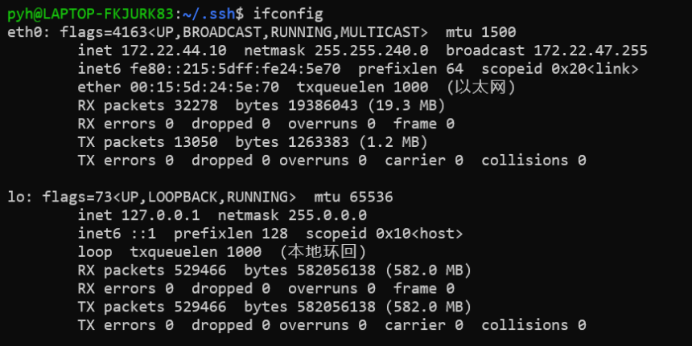


观察输出，其中第一项`eth0`是一个以太网网关，本机地址为172.22.44.10(wsl2的默认地址)，第二项`lo`是本地环回地址(localhost 127.0.0.1)。通过同样的方法，在其他网络中也可以分辨出你想通过哪一个网络访问该服务器，以及该服务器在网络中的ip地址是什么。

### 登入

ssh支持两种最常见的登录方法，一是密码验证，另一种是利用数字签名算法进行身份验证。

#### 密码验证

在终端(Bash或powershell)输入以下命令

```bash
ssh ${UserName}@${IPaddress}
```


>   1.  `${UserName}`与`${IPaddress}`是Bash中引用变量的方式，在此处分别指代：服务器上想要登录的账户的用户名，服务器地址。比如你需要访问的服务器的ip是172.22.44.10，用户名是rc，那么应该输入`ssh rc@172.22.44.10`
>   2.  实际上`${IPaddress}`的位置还可以填写主机名

-   如果是第一次登录，成功进入登录验证阶段

    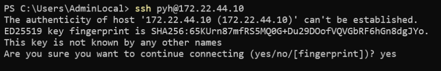

    此时输入`yes`（注意不能是缩写`y`,`Y`,`(Enter)`），会提示输入密码，正确与不正确均有反馈，遵循提示即可

-   如果未成功进入登录验证阶段

    -   ip地址/主机名输错，超时

        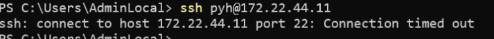

    -   登录的主机ip地址与之前登录过的不同主机的ip地址恰好相同

        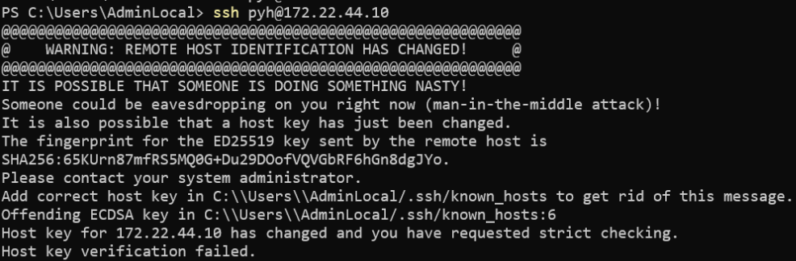

        参考解决方案：[问题解决——SSH时出现WARNING: REMOTE HOST IDENTIFICATION HAS CHANGED!](https://blog.csdn.net/wangguchao/article/details/85614914)


#### 秘钥验证


##### 首先生成非对称加密算法的密钥对

```bash
ssh-keygen
```

Ubuntu上的输出结果
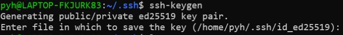

Windows上的输出结果
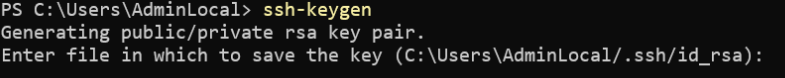

接下来会弹出一堆选项，要求你确认一堆东西或者设置密码之类的，为了方便，一直按`Enter`直到完成设置。

生成的密钥对会保存为`${HOME}/.ssh/${KeyType}`（私钥）与`${HOME}/.ssh/${KeyType}.pub`（公钥），其中公钥用于在分发到别的计算机上，私钥则需要妥善保存。

Ubuntu上的`${HOME}`是`/home/${UserName}`，Windows上的`${HOME}`是`C:\Users\${UserName}`,打开相应的文件夹可以看到生成的文件。


##### 服务端设置

先复制当前电脑的公钥文件`${HOME}/.ssh/${KeyType}.pub`的内容到剪切板，利用文件资源管理器打开文件夹，然后右键选择以记事本打开。

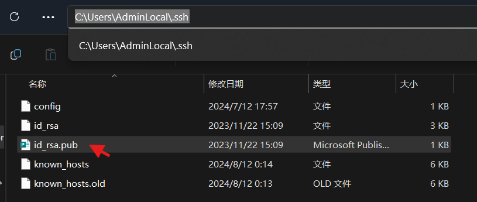

然后通过ssh密码登录方式连接上服务端

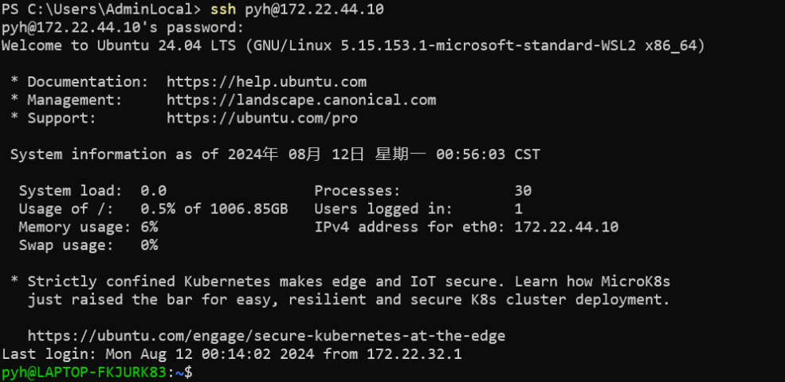

创建文件`${HOME}/.ssh/authorized_keys`，并且将剪切板的内容复制到文件的第一行

以下命令中的`${PubKey}`的内容是剪切板上粘贴下来的公钥内容。

**注意，你不能直接使用代码，而是应当将`${PubKey}`的内容改为自己剪切板上的公钥，然后再使用这一行代码**

```bash
mkdir ${HOME}/.ssh
PubKey="ssh-rsa AAAAB3NzaC1yc2EAAAADAQABAAABgQDWI1RPA1wttlKyW+RhVBv+2rpOy5EnvZOhalihTFuXdwlMujzNyyjDVH9RUm7Ya3fzUFNADgCK3sJhYsEfVBzQqFTmNyklD8AefJaSEFlCpy/u1JWdnSsPClYw7lkzcPTaOFxzYQH1UhKrkC9CCuqZdODRSJKTkVb9WSxdKcfn9Sawbs0dvscvbj7iIkmoNKJZV6XR7yDuJDBDK6EJnnEjmAOwj/n7VF8+hXkGtealmheWfrJDHtliQLgxRBqu4gd3iltVNx8bJkMMI5niziaCmeqpf1JWblXlvAv2gqXzPJezYPuYPpXhP9SNk84fKby6zYbI6AMTniW7T0u0WZTWQn7Ky6iX+AnkAiVAr9E3e90iz6XaVYfLzQ0AMSJbLysK4Cu6KnBFazHXk0bZ5Txy2CdnYSbA3tRCGcyDXuoo+9KaqGcCaUB7yg1wi7m0uHHHNE9fgmvknSS0Is6GzG9f0DSgZjgwUPSutujV6pCgc0Eb9qdKx5H+4PY6H36E9w8= pyh@LAPTOP-FKJURK83"
echo $PubKey> ${HOME}/.ssh/authorized_keys
```

之后每一次登录都无需密码

## VSCode 插件 Remote ssh的使用

安装vscode后，在扩展商店中输入remote development，进行安装

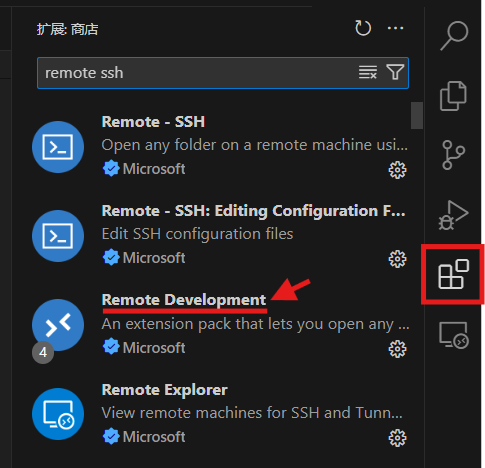

安装完成后，侧边会出现远程连接的扩展菜单，点击进入扩展后，将其上方的框中选中**远程(隧道/ssh)**，可以展开所有配置好的远程ssh选项，如图所示。但是由于还没有配置过，所以应该是空的。

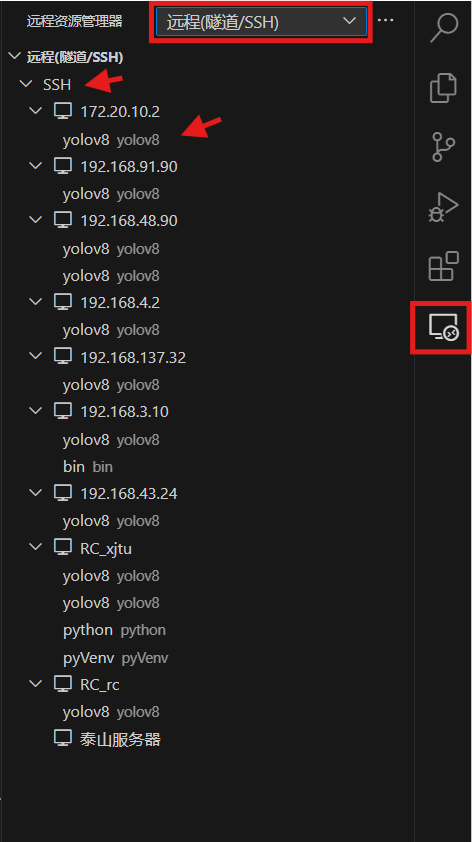

将光标放置在SSH一栏上，会出现符号，如图

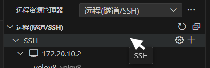

点击设置符号，更改配置文件，选择第一个文件

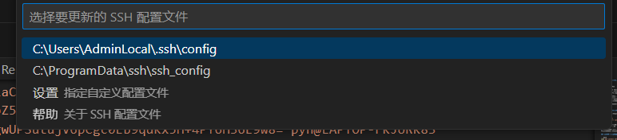

文件中的一个配置项的简单示例如下，可以隔一行增加另一个配置项

```bash
Host RC_xjtu
    HostName 115.154.175.254
    User rc

Host WSL
    HostName 172.22.44.10
    User pyh
```

| 必要字段 | 解释 | 
| :-: | :- |
|**Host**|指的是会在远程连接菜单中显示的名称（自己取的），比如第一个配置项会生成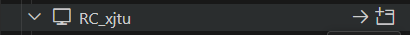|
|**HostName**|指地址或者是主机名，上文ssh命令中的`${HostName}`|
|**User**|指远程连接中的用户名，上文ssh命令中的`${UserName}`|


其他字段可以在[ssh配置文件手册](https://linux.die.net/man/5/ssh_config)中找到具体的含义

配置完成后，即可通过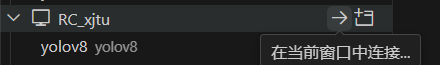进行远程连接。

**Tips:**

**注意，这一步需要命令行ssh能够正常连接的情况下才能成功，如果没有配置公钥，则要求输入密码，弹出来的提示框比较小，并且在连接过程中会弹出多次，注意别看漏了。** 如果不小心点到其他地方让输入框消失了，会被认为进行了取消了输入密码的操作，导致远程连接失败，需要再发起一次连接或者点击retry

远程连接后得到的窗口是一个空的，没有打开任何文件夹的窗口，查看状态栏（VSCode最下面那一条）的最左边标识会显示出当前窗口是一个远程连接窗口。

在窗口左上角 **文件->打开文件夹**，可以选择对应的文件夹进行开发工作。

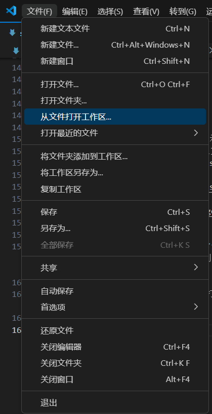


--- 
--- 这里是结束的分割线 ---