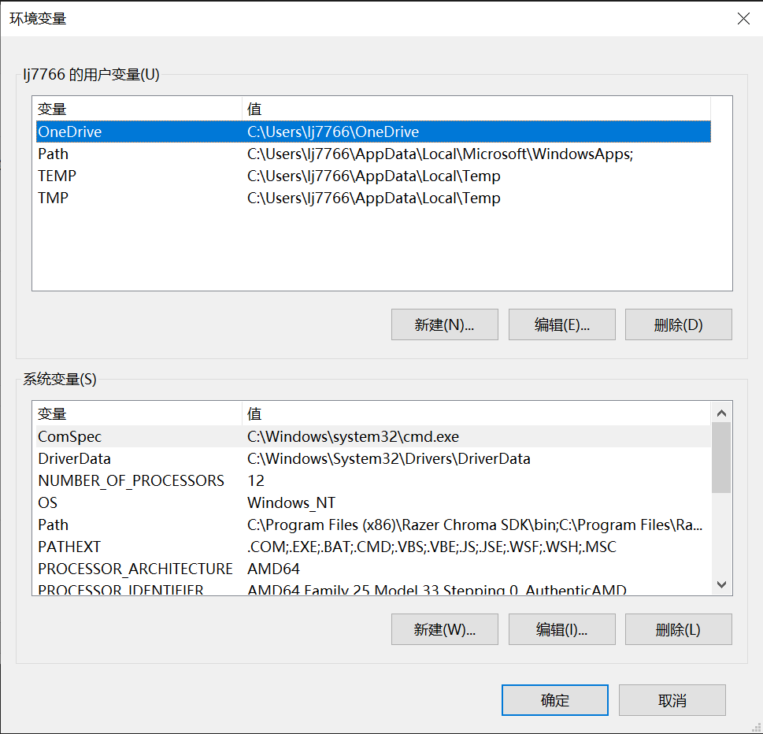

---
title:Windows-cpp 环境搭建
description: ROBOCON的Windows-cpp环境搭建指南,面向入门。
draft: false
categories:
  - technology
resources:
  - src: "**.{png,jpg}"
    title: "Image #:counter"
    params:
      byline: ""
date: 2025-06-25T15:00:00-07:18
lastmod: 2025-06-25T16:00:00-07:23
---
> 本文初版参照RM视觉组的msys2-windows-cpp环境搭建教程，并在一定程度上进行了补充。

让我们开始吧。

首先，欢迎大家了解RC视觉组并学习一些相关知识。在往期培训过程中，我们一般使用linux进行环境配置，但是由于需要了解的知识过于硬核，导致培训效果不太理想。

因此我们打算先使用windows配置环境并学习核心知识，之后再进行linux/ubuntu22.04环境的过渡。
# 环境基础知识
## 集成开发环境（IDE）

集成开发环境本质上是把编写、构建、调试、测试、重构与版本控制等开发工作流所需的工具整合到一个统一界面中，减少来回切换工具的成本，让开发更高效、更可控。对于 C++ 这种语言，IDE 不仅要提供语法高亮和自动补全，还需要与编译器、构建系统和调试器深度集成，以便处理头文件搜索、宏展开、模板实例化和平台相关的差异等复杂问题。

从功能角度看，一个适合 C++ 的 IDE 通常包含智能补全（基于 language server）、跳转定义/查找引用、重构支持、集成构建与任务系统、强大的调试器（断点、单步、变量/内存查看、核心转储分析）、静态分析与代码格式化（例如 clang-tidy、clang-format）、以及测试框架和版本控制的可视化支持。对于大型或跨平台项目，还希望 IDE 能处理 CMake/meson/bazel 等构建系统的配置，方便在不同平台和不同编译器间切换。

目前常见的选项各有侧重点：Visual Studio（Windows）在与 MSVC、Windows SDK、性能分析器和图形化调试方面最为成熟，适合开发 Windows 原生应用和大型企业项目；CLion（JetBrains）对 CMake 支持出色，提供强力的重构与代码分析，跨平台但为付费软件；Visual Studio Code（VSCode）则以轻量、免费与扩展生态见长，通过安装插件可以把它变成功能接近传统 IDE 的开发环境，适合希望高度定制或在 Linux/WSL/macOS 上开发的用户。

推荐把 **VSCode**当作 C++ 开发工具的原因在于其灵活性：你可以按需安装 language server（如 clangd 或 Microsoft 的 C/C++ 扩展）、CMake Tools、调试适配器（gdb/LLDB 或 Windows 的 cppvsdbg）、以及格式化/静态检查扩展。配合 Remote-WSL、Remote-Containers 或 Dev Containers，可以在容器或 WSL2 中运行实际的构建工具链和调试器，同时在宿主机上享受轻快的编辑体验，这对跨平台开发和保持一致的开发环境特别有益。

# 环境变量
环境变量是操作系统中用于存储有关系统运行环境的信息的特定名称对象。它们对于指定程序运行的方式和位置至关重要，因为它们可以告诉系统在哪里查找必要的文件和程序。环境变量分为用户变量和系统变量，用户变量仅对当前登录的用户有效，而系统变量对所有用户都有效。一个关于windows环境变量介绍的博客是：[看懂什么是环境变量! - 知乎](https://zhuanlan.zhihu.com/p/82011100)

## 搭建环境
对于c++开发环境，windows下可选择的环境还有visual studio (vs)，dev-c++等，然而vs使用的编译器为MinGW，是linux中使用的gcc编译器的windows移植版。目前mingw-w64位项目目前的状况比较复杂，有多个发行分支，具体可以参看[官网的下载页](https://link.zhihu.com/?target=https%3A//www.mingw-w64.org/downloads/)。目前在windows上最新、最靠谱的发行分支就是**MSYS2**。

>[MinGW (Minimalist GNU for Windows)](https://link.zhihu.com/?target=http%3A//www.mingw.org/) 是一种用于开发原生 Windows 应用的最小化 GNU 开发环境，可以理解为开发 Windows 程序的 **gcc**，也就是说这个gcc就是专门编译出能在windows平台运行的程序的编译器。MinGW 本身并不一定要运行在 Windows 下，Linux 上也可以通过 MinGW 工具链交叉编译 Windows 程序。

因此我们主要介绍msys32作为包含gcc的工具库，以vscode作为代码编辑器，进行环境配置。
ps: 关于mingw和mingw-w64的渊源，可以看[这篇文章](https://github.com/FrankHB/pl-docs/blob/master/zh-CN/mingw-vs-mingw-v64.md)
# msys2
> MSYS2（Minimal SYStem 2）是一个集成了大量的GNU工具链、工具和库的开源软件包集合。**它提供了一个类似于Linux的shell环境，可以在Windows系统中编译和运行许多Linux应用程序和工具。**
## 下载与安装
这里放一份不错的教程，按照这篇博文来安装并使用msys2 UCRT64：[给萌新的C/C++环境搭建攻略](https://zhuanlan.zhihu.com/p/401188789)

这个是官网下载链接：[MSYS2](https://www.msys2.org/)，并且包含了简单的环境配置过程。安装包下载速度较慢，有代理会快很多。

## 安装教程的补充(添加环境变量)
要告诉其他应用 msys 2 装在哪里，也就是要把 msys 2 添加到环境变量当中。

win 10/11：设置->系统->关于->高级系统设置->环境变量

找到系统变量名为 "Path"的变量，双击打开：

点击新建，把刚才安装 msys 2 的路径粘进去。我们只需要添加您ucrt 64安装路径下的bin文件夹，如图所示：

### 安装编译工具
msys 2 本质上是编译工具链的管理工具，我们还需要使用它来安装一些工具。

还是刚才打开的 ucrt 64 界面，先输入 `pacman -Syu` 后回车进行软件源更新。这个过程可能有些慢，可通过更换国内源解决，大家可查阅 msys 2换源的相关资料。关于 ucrt 的介绍知乎老哥说的比较清楚了，大家可以了解一下。之后 msys 2 应该会重启，按个 Y 回车后，重新打开即可。

之后，输入安装指令： `pacman -S mingw-w64-ucrt-x86_64-toolchain` ，遇到需要选择的部分一路回车就行。

安装`clangd`： `pacman -S mingw-w64-ucrt-x86_64-clang mingw-w64-ucrt-x86_64-clang-tools-extra` 。以上安装步骤大致需要 3 G 的硬盘空间。

> clangd是llvm项目推出的C++语言服务器，通过LSP(Language Server Protocal)协议向编辑器如vscode/vim/emacs提供语法补全、错误检测、跳转、格式化等等功能。是基于Clang C编译器的。

如何验证你装的东西有没有用呢？打开powershell终端试试。

分别输入 gcc 以及 clangd 后得到如图输出，说明安装成功，并且环境变量生效：

# cmake
!!! tip "提示"
    以下教程简略且带有主观性，请谨慎阅读，并且留意文末的question部分。

> 如果您想了解一下更快，集成度更高的xmake(基于.lua去描述工程)，您可以略微看一下[xmake入门，构建项目原来可以如此简单](https://zhuanlan.zhihu.com/p/35051214)。

cmake 是一个用于组织 cpp 项目的工具，能够实现多个 cpp 文件的构建，找头文件的效率更高，并且我们以后要用的 ros 2 也使用 cmake 构建项目，有必要学习一下。

cmake 下载地址：[download | Cmake ](https://cmake.org/download/)，我们用 64 位的 windows 安装包。

- 下滑找到 Windows x64 Installer（适用于 64 位系统），下载 .msi 文件。

之后的安装过程也没啥好说的，记着勾上环境变量：

再开个终端，试一下有没有：

这个样子就 ok 了。

# 安装vscode
为什么将 vscode 放在最后面呢，这里想告诉大家的是，实际上使用什么IDE 并不是很重要，在之后我们将会有大量的时间直接在终端当中运行cmake，使用一个 IDE 仅仅用于提升我们的开发效率。vscode 和记事本没有什么本质区别，它只是附带了语法高亮、cmake 相关的插件工具，才使其有了 IDE 的性能，最重要的还是刚才搭建的编译工具链。如果有人只装了个 vscode，来问我为啥没法写代码，那我只能说十分甚至九分的若至了。

官网下载：[Visual studio code](https://code.visualstudio.com/) ,推荐 system installer 版本，获取管理员权限更容易。

安装过程也没啥要说的，记得把添加环境变量勾上就行。

虽然它只是个编辑器，不过还是要欢迎大家使用，它强大的插件功能足够我们使用它用各种语言编程，用到大学毕业不是问题。

点击左边的四个框框图标，开始装插件。在上面的搜索栏搜索就行，目前需要的是这些插件，在左边那一列中显示。您也可以安装同义灵码、Trae和copliot 等一些AI插件。

这里就要介绍一下 vscode cmake 插件的用法了。按下`ctrl+shift+p`, 输入` cmake`，选中`cmake: quick start`。

之后您会看到包含CMakeLists.txt在内的项目文件。Cmakelists 就是用于管理 cmake 项目的工具，而 main. cpp 就是默认生成的实例代码。

直接点击vscode下方状态栏的生成(build)（一个齿轮），会看到这样的结果：

三角符号就是运行，点击之后可以看到 hello 输出：

至此，cpp 开发与运行环境基本搞定，大家可以在此基础上学习 cmake脚本的编写以及 c++的语法知识了。

??? question "按照教程并未成功怎么办?"
    上述教程后的clangd和vscode部分开始显得简略,并且添加了很多具有主观色彩的内容,读者无法完全理解是很正常的.
    
    除了上述要点之外, 笔者发现配置 clangd 工具链似乎并没有那么容易, 因为你将会与你电脑原有配置继续打交道, 并且如果你的 system 中没有下载 LLVM、clangd 的话 (并不是指 vscode 的扩展), 你需要访问官网先下载安装它。vscode 中的 clangd 插件只是语言服务器（只做编辑器智能）, 归根到底依赖于你电脑上安装的 clangd 工具链。一个有用的链接是 [知乎-vscode+clang+llvm 搭建 C++ 编译环境（windows）](https://zhuanlan.zhihu.com/p/613922486)。如果你能够坚持下来, 相信一定很有能耐了, 做什么都会成功的。