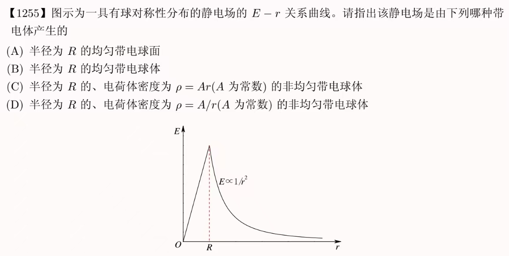
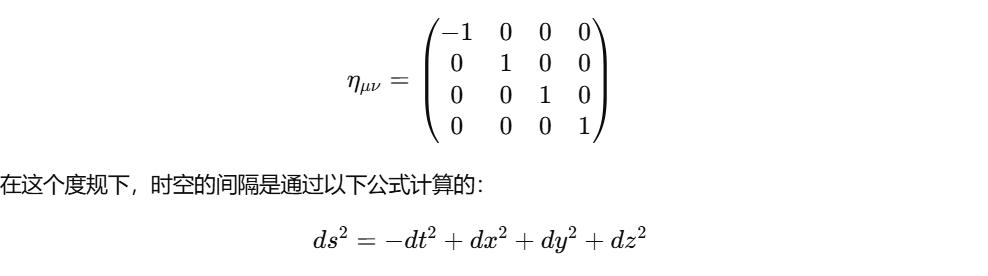
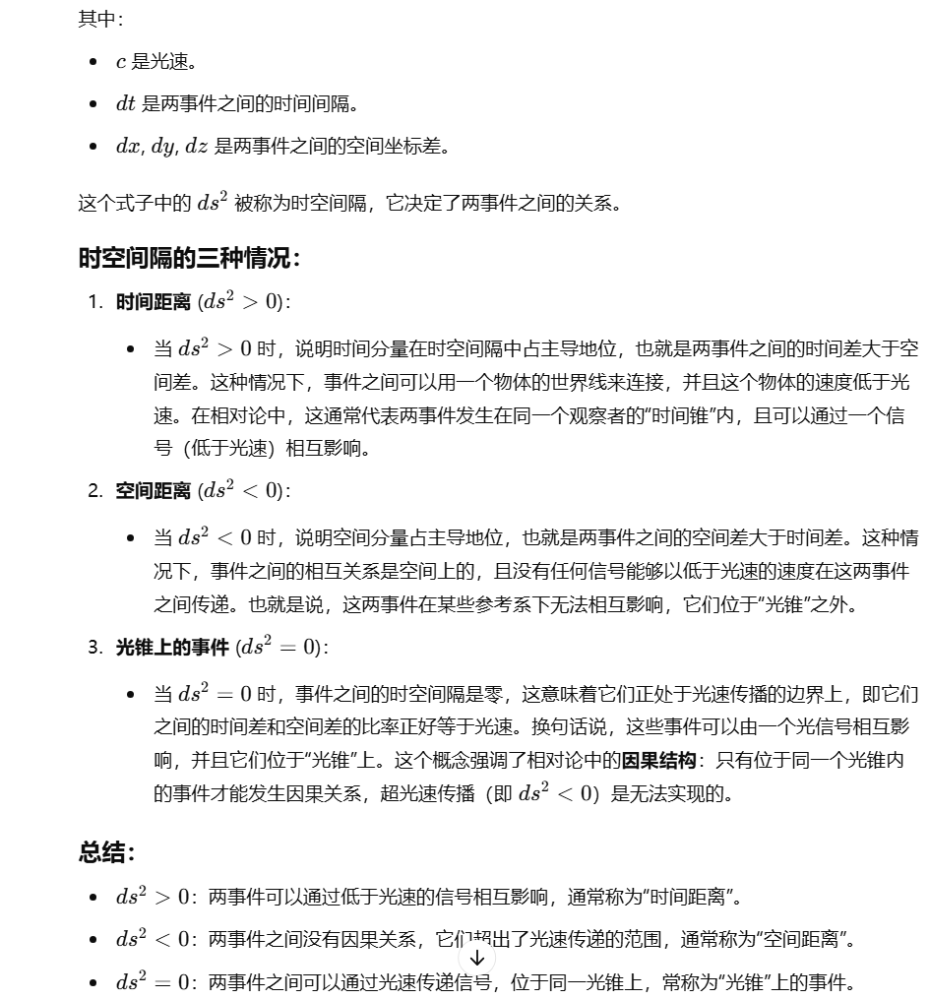
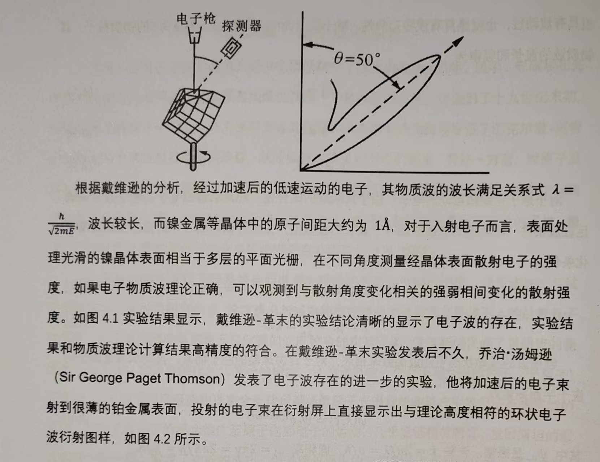
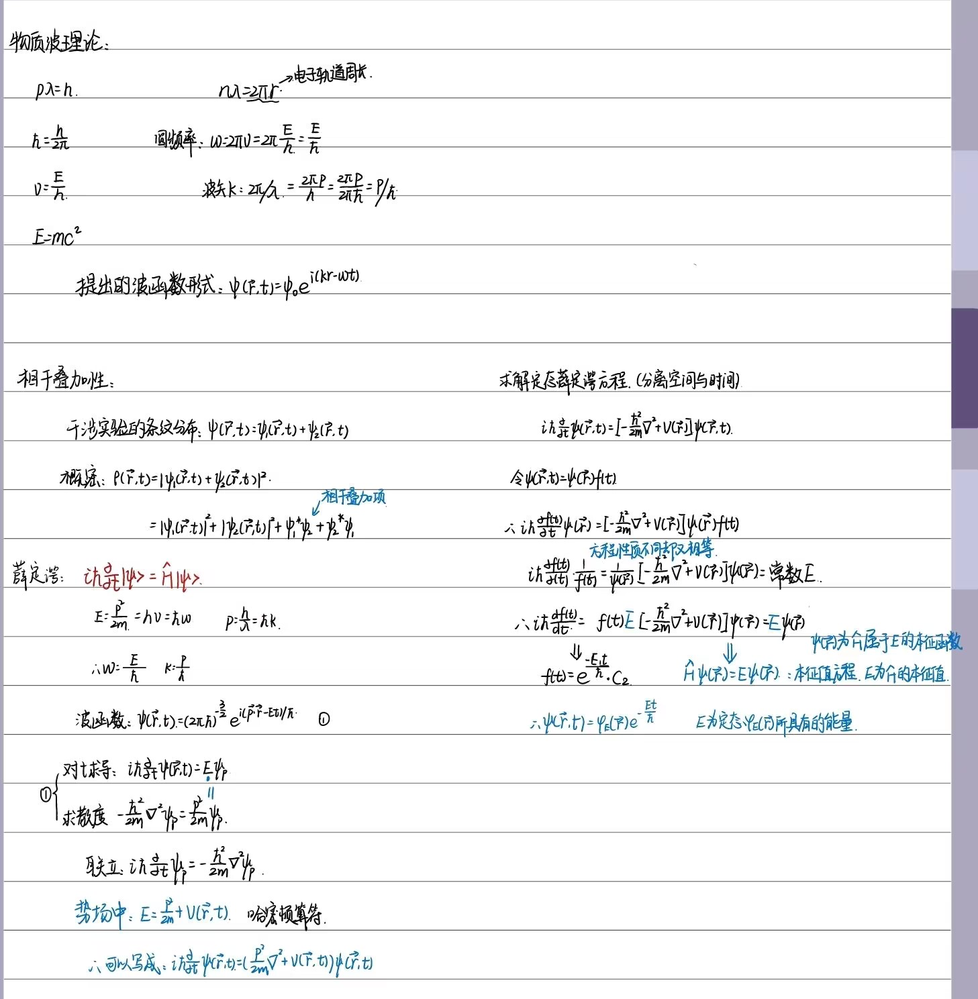
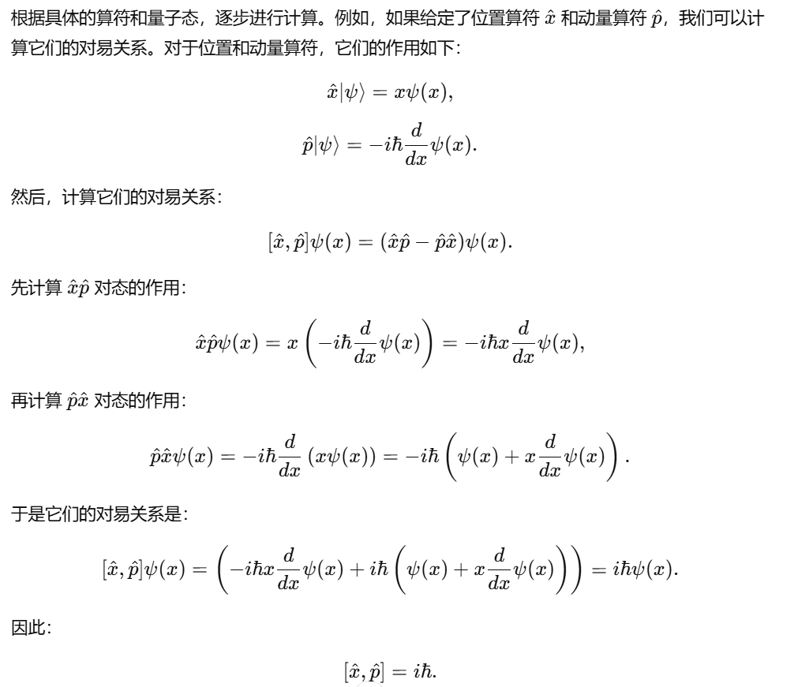

# 经典物理部分
本部分不做详尽说明。

牛顿运动定律+微积分

速度：$v(t) = \frac{{dr(t)}}{{dt}}$  

加速度：$a(t) = \frac{{dv(t)}}{{dt}}$ 

冲量定理：$Fdt = d(mv)$
## 角动量定理
`掌握如何计算刚体转动惯量`

$M = \frac{{dL}}{{dt}} = I\frac{{d\omega }}{{dt}}$

M为力矩，L为动量矩（角动量），I为转动惯量。

$\int {{r^2}dm = I}$    ${L_0} = J\omega$
${{\bf{L}}_0} = m{\bf{r}}\times v$     ${\bf{M}} = {\bf{r}} \times {\bf{F}}$

对于[动量矩定理](https://baike.baidu.com/item/%E5%8A%A8%E9%87%8F%E7%9F%A9%E5%AE%9A%E7%90%86/5560455?fromModule=lemma_inlink)而言， [质点系](https://baike.baidu.com/item/%E8%B4%A8%E7%82%B9%E7%B3%BB/8951990?fromModule=lemma_inlink)对一点（或一轴）的[角动量](https://baike.baidu.com/item/%E8%A7%92%E5%8A%A8%E9%87%8F/290656?fromModule=lemma_inlink)对时间的导数等于外力系对此点（或此轴）的[主矩](https://baike.baidu.com/item/%E4%B8%BB%E7%9F%A9/53669328?fromModule=lemma_inlink)，广泛用于处理刚体定点（或轴）转动问题。角动量定理的[微分形式](https://baike.baidu.com/item/%E5%BE%AE%E5%88%86%E5%BD%A2%E5%BC%8F/4184155?fromModule=lemma_inlink)为dL/dt=M。

## 简谐波 
$$y(x,t) = \cos (\omega t - \frac{{\omega x}}{u} + {\varphi _0})$$
或者 $$y(x,t) = \cos (\omega t - \frac{{2\pi x}}{\lambda } + {\varphi _0})$$
$u$是传播速度，$\lambda$是波长。

弹簧振子的能量和势能、总机械能。
### 波的干涉、叠加 
两个同频同方向简谐振动的合成：合振动仍为简谐振动，合振动的振幅取决于两个分振动的振幅以及相位差，即$A = \sqrt {A_1^2 + A_2^2 + 2{A_1}{A_2}\cos ({\varphi _2} - {\varphi _1})}$。

两列波在空间各点相遇后叠加的振幅仅依赖于所在位置而不随时间变化的谐振动分布，这种波叠加现象为相干叠加。

**什么是相干叠加条件** ：两列简谐波频率相同、振动方向相同（一致）、相位差恒定。

考察两个同方向的振动：${x_1} = A\cos ({\omega _1}t + {\varphi _1})$和${x_2} = A\cos ({\omega _2}t + {\varphi _2})$。
**什么是拍现象**：对于两个同方向的波，两个分振动频率不相同但是相差不大，即$|{\omega _1} - {\omega _2}| <  < \frac{{{\omega _1} + {\omega _2}}}{2}$，将会变成一种特殊的振动称为拍现象，表达式为 $x = {A'}\cos (\frac{{{\omega _1} + {\omega _2}}}{2}t)$ 。其中 $A' = 2A\cos (\frac{{{\omega _1} - {\omega _2}}}{2}t)$ 。拍的特点是合振动以与分振动相近的频率振动，振幅不再是一个常数，而是在缓慢的变化。

## 热力学四大定律
`热力学四大定律都是什么？`
第零定律：若两个热力学系统均与第三个系统处于热平衡状态，此两个系统也必互相处于热平衡。

第一定律：物体内能的增加等于物体吸收的热量和对物体所做的功的总和 。$\Delta U = Q - W$。能量不能凭空消失或者销毁，只能从一个系统转移到另一个系统。但是在转换过程中，能量的总值保持不变。其推广和本质就是著名的[能量守恒定律](https://baike.baidu.com/item/%E8%83%BD%E9%87%8F%E5%AE%88%E6%81%92%E5%AE%9A%E5%BE%8B/339215?fromModule=lemma_inlink)。

第二定理：说明一个孤立系统不可能朝[低熵](https://baike.baidu.com/item/%E4%BD%8E%E7%86%B5/7432544?fromModule=lemma_inlink)的状态发展，即不会变得[有序](https://baike.baidu.com/item/%E6%9C%89%E5%BA%8F/2949139?fromModule=lemma_inlink)。

第三定理：绝对零度不能被达到。
## 能量按自由度均分定理
`能量按自由度均分定理？`
对于数量为N的气体系统，每一个分子的平均热运动能量用$\overline \varepsilon$来表示，那么系统的内能为 $U = N\overline \varepsilon$ 。如果每一个分子的平动自由度、转动自由度和振动自由度数分别为 $t,r,s$ ，根据能量按自由度均分定理每一个分子的 $\overline \varepsilon$ 为：
$$\overline \varepsilon   = \frac{1}{2}(t + r + s){k_b}T$$
${k_b}$是玻尔兹曼常数，单原子分子为 $\overline \varepsilon   = \frac{3}{2}{k_b}T$ ，双原子分子为 $\overline \varepsilon   = \frac{5}{2}{k_b}T$ ，多原子分子为 $\overline \varepsilon   = 3{k_b}T$ 。单原子分子的平动自由度为3，转动自由度和振动自由度为0。双原子分子的有3个平动自由度，又有2个转动自由度，总共有5个自由度 i = t + r =3 + 2 = 5。理想情况下s都是0.

气体的平均动能仅与温度有关，温度相同则相同。$\frac{1}{2}m{v^2} = \lambda {k_b}T$。理想气体的内能仅与温度有关。对于理想气体，其内能满足$\Delta U = {C_v}\Delta T$。理想气体内能的积分表达式：$U = \int {{C_v}dT + {U_0}}$。 

## 理想气体内能
`如何计算理想气体的内能？`

$\Delta U = \Delta Q + \Delta W$ 
$$\Delta U = \frac{i}{2}nR \Delta T$$
其中单原子分子取$i=3$，双原子分子取$i=5$，多原子分子取$i=6$。

对于***等压膨胀***：
$$\Delta W = p\Delta V = nR\Delta T$$
$$\Delta U = \frac{i}{2}W,Q = \Delta U + W = \frac{{i + 2}}{2}W$$
可以求出吸热多少。
## 高斯定理
给一个带电球体，电荷体密度为$\rho  = Ar(r \le R),\rho  = 0(r \ge R)$，试求球体内外的场强分布。
$$\mathop{{\int\!\!\!\!\!\int}\mkern-21mu \bigcirc} {{\bf{E}} \bullet d{\bf{S}}}  = \frac{1}{{{\varepsilon _0}}}\sum {{q_i}}$$ $\sum {{q_i}}$为封闭曲面S所包围的所有电荷电量的代数和。

对于一个半径为R的带点球面，我们取半径为r的高斯面包住球体，我们需要求高斯面上某一点的电场强度E。



## 黑体辐射
辐射出度：单位时间单位表面积发射的各波长总辐射能。

黑体辐射的单色吸收比：是指一个物体在某一特定波长下的吸收能力，通常用 $\alpha(\lambda)$ 表示，其中 $\lambda$ 是波长。黑体的单色吸收比在任何波长上都是 1，意味着它在任何波长下都完全吸收辐射。而对于非黑体物体，吸收比$\alpha(\lambda)$的值可能小于 1，表示该物体在该波长下并未完全吸收辐射。

[理想黑体](https://baike.baidu.com/item/%E7%90%86%E6%83%B3%E9%BB%91%E4%BD%93/56095703?fromModule=lemma_inlink)可以吸收所有照射到它表面的[电磁辐射](https://baike.baidu.com/item/%E7%94%B5%E7%A3%81%E8%BE%90%E5%B0%84/484252?fromModule=lemma_inlink)，并将这些辐射转化为热辐射，其[光谱特征](https://baike.baidu.com/item/%E5%85%89%E8%B0%B1%E7%89%B9%E5%BE%81/53308897?fromModule=lemma_inlink)仅与该黑体的温度有关，与黑体的材质无关。理想的黑体辐射模型有$\alpha(\lambda,T)=1$，可以视作在容器上开一个小孔。

**斯特潘-玻尔兹曼定律**：热平衡状态下黑体的辐射能量密度和其温度T的四次方成正比关系，即$$U = \frac{{4\sigma }}{c}{T^4}$$
上式可以用来求温度T。U代表了黑体的辐射能量密度。$\sigma$是常数为$5.67 \times 10^{-6}W/m^2 * K^4$。
## 光电效应
存在截止频率，光的频率低于某一个特定频率，将无法产生光电效应。
$E = hv$，$p = \frac{h}{\lambda }$。

**三个特点**：当光的频率小于特定频率时将不会产生光电效应；瞬时性；电子的最大初动能和光照频率呈线性关系。
```
为什么经典的电磁理论解释不了光电效应？
第一，不能解释为什么存在截止频率，且不随光强变化。
按照波动光学的观点，无论频率是多少，只要光强大，时间长，电子就能获得足够的动能脱离阴极。
第二，不能解释为什么存在截止电压，且只随频率变化。
按照波动光学的观点，脱离阴极的电子的动能应该正比于正比于光强和照射时间，因此电子动能上限应随着光强和照射时间而变化。也就是截止电压会随着光强变化。
第三，即使光很弱，光电效应的反应时间还是很快，而且不随光强变化。
按照波动光学的观点，在特定截止电压下，产生光电效应的时间应该与光强成反比，但是无论何光强，只要满足截止频率和截止电压的要求，光电效应的产生时间都在10e-14s量级。
```

爱因斯坦光电效应与光量子:

$\frac{1}{2}m{v^2} = hv - W_0$，其中$W_0$为逸出功。

截止电压：$U=(hv -W_0)/e$，即在金属板上施加反向U的电压会让光电子刚好无法脱离金属板。

## 狭义相对论
### 基本原理

狭义相对性原理：任何真实的物理规律在所有惯性系中应形式不变。

光速不变原理：任意一个惯性系中的观测者所测得的真空中的光速恒为c。

### 推论

**时空观**

由两条基本原理可严格地导出惯性系之间时空坐标变换的方程组，即洛伦兹变换。与伽利略变换不同：

（1）相对地面静止的S惯性系观测到的同时事件在相对地面匀速运动的S’系看来是不同时的，即同时的相对性。

（2）同一根尺子，相对尺匀速运动的观测者比相对尺静止的观测者测量的杆长要短，即[尺缩](https://baike.baidu.com/item/%E5%B0%BA%E7%BC%A9/8347063?fromModule=lemma_inlink)效应。

（3）同一个钟，相对其匀速运动的观测者发现这个钟比相对其静止的情况下走得要慢，即[钟慢](https://baike.baidu.com/item/%E9%92%9F%E6%85%A2/8347082?fromModule=lemma_inlink)效应。
$$ t = \frac{{t'}}{{\sqrt {1 - v_0^2/{c^2}} }},L = L_0\sqrt {1 - v_0^2/{c^2}} $$
$t'$称为原有的时间，$t$是观测者测量的时间。$L_0$为原有的长度，L是测得的长度。我们要知道，比如有两个惯性系，发生了相对运动，当相对速度趋于零的时候，尺缩效应会消失。（助教说的）

某以宇航员想去距离地球5光年的星球旅行，如果他希望将这一路程缩短为3光年，则他所乘的火箭相对于地球的速度应是：0.8c

$3 = 5\sqrt {1 - \frac{{{v_0}^2}}{{{c^2}}}}$ ，解得0.8c.

## 广义相对论

**广义相对性原理**：物理规律对于所有参考性具有协变性。
```
这意味着，无论你选择哪个坐标系统（惯性参考系或非惯性参考系），物理定律的形式应该是相同的。
```
**等效原理**：物体的惯性质量和引力质量相等。

对于一般的有限区域，我们引入四维的时空坐标：
$$d{s^2} = {g_{\mu v}}d{x_\mu }d{x_v}$$
其中，$ds^2$是时空中的间隔（或称“度量”），$g_{μν}$​ 是度规张量，引力场的性质主要取决于度规张量的函数。$dx_μ$ 和 $dx_ν$是在坐标系中两个点之间的微小位移。这个公式提供了一种计算两点之间“距离”的方式，重要的是，这个“距离”并不一定是直觉中的欧几里得距离，尤其是在弯曲时空中。[度规张量（Metric Tensor）以及它的本质 - 知乎](https://zhuanlan.zhihu.com/p/94862461)。

下面$dX_i$表示四维坐标的微分。
$$d{s^2} = {\left( \begin{array}{l}
d{X_1}\\
d{X_2}
\end{array} \right)^T}\left( {\begin{array}{*{20}{c}}
{{g_{11}}}&{{g_{12}}}\\
{{g_{21}}}&{{g_{22}}}
\end{array}} \right)\left( \begin{array}{l}
d{X_1}\\
d{X_2}
\end{array} \right)$$
在 **平直时空**（即没有引力场的时空）中，时空是完全平坦的。最著名的例子是 **闵可夫斯基时空**，它描述了特殊相对论中的平直四维时空。

在平直时空中，度规张量​$g_{μν}$ 的形式，其他位置都是0。但是查阅发现：

助教给的是：diag={1 -1 -1 -1}。我们依照助教给的进行分析。

# 现代物理

## 量子波动理论
量子力学中的 **波动理论**（Wave Theory）是理解粒子行为的核心思想之一。它主要来源于 **波粒二象性**（Wave-Particle Duality），即粒子既可以表现为粒子，又可以表现为波动。这一理论为量子力学的基础之一，它解释了粒子如何在某些情况下表现为波动现象，尤其是在干涉和衍射等现象中。

波粒二象性是量子力学中的一个基本概念，它由路易·德布罗意（Louis de Broglie）提出，指出所有物质粒子都具有波动性质，粒子不仅表现出粒子的特性（如碰撞和局部化），同时也具备波动的性质（如干涉和衍射）。

- **德布罗意假设**：每个粒子都有与其动量 $p$ 相关的波长 $\lambda$，其关系由 **德布罗意波长公式**给出：

$\lambda = \frac{h}{p} = \frac{h}{mv}$​

其中，$h$ 是普朗克常数，$p$ 是粒子的动量，$m$ 是粒子的质量，$v$ 是粒子的速度。

这意味着不仅光子（电磁波）具有波动性质，任何具有动量的粒子（如电子、质子等）也都可以展现出波动性。

### 量子波的相干叠加性、衍射
量子波的相干叠加是量子力学中一个至关重要的概念，它揭示了量子系统可以同时处于多个状态，并且这些状态可以相互叠加。这个现象并不是经典物理所能解释的，且是量子力学的一大特点。量子波的相干叠加性与经典物理中的叠加（如合力叠加）有着本质的不同，通常通过波动函数来描述。

量子力学中的粒子（例如电子、光子等）并不简单地像经典粒子那样具有固定的轨迹，而是以波的形式存在，描述其位置和动量的不确定性。这些波通常由**波函数** $\psi (x,t)$ 来表示，它是描述量子态的数学工具，具有如下性质：

- 波函数的**模平方** $|\psi (x,t){|^2}$ 代表粒子在某一位置 $x$处被测量到的概率密度。
- 波函数本身是一个复数，包含振幅（与概率有关）和相位信息（与干涉效应和相干性有关）。

量子波的相干叠加性最著名的实验之一是**双缝实验**。在这个实验中，一个粒子（例如电子或光子）通过两个狭缝时，可以同时通过两个缝隙，其波函数是两个波的叠加。当它们在屏幕上干涉时，形成了典型的干涉图样。这表明粒子在通过两个缝隙时并不是选择其中一个，而是以波的形式同时通过两个缝隙，这种相干叠加现象使得干涉成为可能。

在这个实验中，粒子的波函数  $\psi (x,t)$ 由于叠加效应，在屏幕上形成了明暗相间的干涉图样，代表着不同路径的波动相位发生了干涉。

`提问："什么实验装置会满足量子干涉和量子衍射以及量子波的条纹是如何形成的"`

对于电子的物质波衍射实验，戴维逊认识到之前所作的电子的散射实验很可能就是电子衍射的结果。如此成功地验证了**电子具有波动性**。

乔治汤姆逊发表了电子波存在的进一步实验，用加速后的电子束打到很薄的铂金属表面，形成了环状电子波衍射图样。

更具有波动特征的电子波双缝干涉实验在1961年完成。电子是一个一个经过双缝而发生的干涉，说明干涉条纹或者说电子的波动性，并不是产生于不同电子之间“干扰”或者相互作用，而是电子自相干的性质或者电子自有的特征。

物质波是概率波的理论由伯恩提出。对于波函数形式为$\psi ({\bf{r}},t) = {\psi _0}{e^{i(kr - \omega t)}}$的粒子，$|\psi ({\bf{r}},t){|^2} = \rho ({\bf{r}},t)$表示粒子的概率分布，而且由概率的归一化性质有${\int {|\psi ({\bf{r}},t)|} ^2}dV = 1$。波函数是概率波，满足**连续性**（求解一维无限深势井）、**归一化**的性质。

### 物质波的相干叠加
$$\psi  = \sum {{a_i}} {\psi _i}$$其中 $\sum {{a_i}}  = 1$。一个粒子，可以同时处于空间上可能被分开的物质波的状态。
## 薛定谔方程
角动量的量子化必须满足驻波的条件，轨道长度必须是波长的整数倍。

## 算符的基本运算
算符的意义：按照某种物理量求平均值。
对于位置坐标：
$$\overline x  = \int_{ - \infty }^{ + \infty } {|\psi (x,t){|^2}xdx}$$
动量算符：$\widehat {{p_x}} =  - i\hbar \frac{d}{{dx}}$
$${\overline p _x} = \int_{ - \infty }^{ + \infty } {{\psi ^*}(x,t)} ( - i\hbar \frac{d}{{dx}})\psi (x,t)dx$$
${{\psi ^*}(x,t)}$中的$*$表示复共轭。
算符的作用方式：$$(\phi ,\widehat O\psi ) = \int {{\phi ^*}\widehat O\psi d\tau }$$
### 加法运算
   $$(\widehat {{O_1}} + \widehat {{O_2}})\psi  = \widehat {{O_1}}\psi  + \widehat {{O_2}}\psi $$
### 乘法运算
不能交换次序$\widehat {{O_1}}\widehat {{O_2}} \ne \widehat {{O_2}}\widehat {{O_1}}$。

定义两个算符的对易形式： $[\hat{A}, \hat{B}] = \hat{A} \hat{B} - \hat{B} \hat{A}=i\hat{c}$ 。如果$\hat{c}$为0，则是互易。

位置和动量算符对易证明：

### 逆运算
如果能够唯一解出$\varphi$，则逆运算有：
$${\widehat O^{ - 1}}\psi  = \varphi $$
### 算符的函数
如果$f(x)$的所有阶导数都存在，则定义算符的函数为：
$$f(x) = \sum\limits_{n = 0}^\infty  {{{{f^{(n)}}(0)} \over {n!}}{{\hat O}^n}} $$
### 算符的转置运算
$$(\phi ,\hat O\psi ) = \int {{\phi ^*}\hat O\psi d\tau  = } \int {\psi \widetilde {\widehat O}{\phi ^*}d\tau  = } ({\psi ^*},\widetilde {\widehat O}{\phi ^*})$$
$(A,B)$算符运算要求在积分中，对A进行复共轭。
## 厄米算符
在线性代数中表示矩阵变换。
如果算符$\widehat O$等于其共轭转置算符${\widehat O^ + }$，则称为厄米算符。即
$${\widehat O^ + } = \widehat O  \equiv  {\widehat {\widetilde O}^*}$$

${\widehat O^ + }$为$\widehat O$的共轭转置。位置算符、动量算符以及所有平均值为实数的算符函数都为厄米算符。厄米算符的和为厄米算符。厄米算符的乘积只有在它们相互对易时才能是厄米算符。任何算符都具有以下分解：$$\widehat O = {\widehat O_ + } + i{\widehat O_ - }$$
其中${\widehat O_ + } = {1 \over 2}(\widehat O + {\widehat O^ + })$,${\widehat O_ - } = {1 \over {2i}}(\widehat O - {\widehat O^ + })$都是厄米算符。

### 本征函数的正交性和完备性
这部分内容类比线性代数的特征值和特征空间。本征函数类比于矩阵变换的一些基底。
其具有**正交性**：厄米算符属于不同本征值的本征函数彼此正交，即：$$({\psi _m},{\psi _n}) = {\delta _{mn}}$$
$\delta$符号表明，当$m=n$时，内积为1，两者不等时，内积为0。
也可以证明**完备性**：$$\sum\limits_{n = 1}^N {|{\psi _n}{|^2}}  = 1$$这个条件说明了算符${\widehat O }$的本征函数${\psi _n}$具有**完备性**，任意的位置空间中的波函数（归一化）都可以用$\psi_n$作为基矢进行展开：$\sum\limits_{n = 1}^N {{c_n}{\psi _n}}  = \psi$。其中$\sum\limits_{n = 1}^N {|{c _n}{|^2}}  = 1$，${c_n} = ({\psi _n}^*,\psi )$。

## 狄拉克符号
```
掌握两个矢量的内积的定义。
正交矢量的表示和归一化条件。
```
$\left| {} \right\rangle$用来表示希尔伯特空间中的态矢量，$\left\langle {} \right|$用来表示右矢的共轭矢量。具体的，右矢往往对应于[列矢量](https://zhida.zhihu.com/search?content_id=167435036&content_type=Article&match_order=1&q=%E5%88%97%E7%9F%A2%E9%87%8F&zhida_source=entity)，左矢往往对应于行矢量。本征函数加上狄拉克符号变为本征态。

右矢的厄米共轭${\left| a \right\rangle ^ + }: = \left\langle a \right|$
算符A乘算符B的厄米共轭：${({O_1}{O_2})^ + } = {O_2}^ + {O_1}^ +$

1. 厄米算符的本征值是实数，有$\widehat O\left| \psi  \right\rangle  = \lambda \left| \psi  \right\rangle$。
2. 厄米算符的本征态是正交的。<$\psi$|$\psi$>=0 
3. 本征态可以**归一化**。<$\psi$|$\psi$>=1 
<$\psi$|$\psi$> 称为内积，可以看作***行向量***乘***列向量***：$\left( {{a_1} \ldots {a_n}} \right)$*$\left( \begin{array}{l}{a_1}\\\vdots \\{a_n}\end{array} \right)=1$.*
内积也可以表示为:$$<\psi|\varphi> =\int {{\psi ^*}\varphi d\tau}$$
|$\psi$> <$\psi$|叫做外积。

==两个矢量带算符的内积为==：
<$\psi$|A|$\psi$>:=<$\psi$|$\cdot$ (A|$\psi$>)=(<$\psi$|A)$\cdot$ |$\psi$>=$\int {{\psi ^*}A\psi d \tau}$。

==基矢的正交性==：$$\left\langle {{O_m}|\left. {{O_n}} \right\rangle } \right. = {\delta _{mn}}$$ ==基矢的完备性==：$$\sum {\left| {{O_n}} \right\rangle } \left\langle {{O_n}} \right| = 1$$

注意下面的计算：
****
$\left| \psi  \right\rangle  = \alpha \left| 0 \right\rangle  + \beta \left| 1 \right\rangle  + \gamma \left| 2 \right\rangle$

$\left\langle \psi  \right| = {\alpha ^*}\left\langle 0 \right| + {\beta ^*}\left\langle 1 \right| + {\gamma ^*}\left\langle 2 \right|$

<$\psi$|$\psi$>=${\alpha ^*}\alpha<0|0>$ +${\beta ^*}\beta<1|1>$+${\gamma ^*}\gamma <2|2>$=1

回顾性质：$\left\langle {{O_m}|\left. {{O_n}} \right\rangle } \right. = {\delta _{mn}}$    $m=n$时 $\delta _{mn} = 1$

即：${\left| \alpha  \right|^2} + {\left| \beta  \right|^2} + {\left| \gamma  \right|^2} = 1$
****
这确保了量子的规范性。
## 量子信息比特
这里深入了解信息比特：

[量子信息导论(Introduction to Quantum Information)笔记 - 知乎](https://zhuanlan.zhihu.com/p/572313405)

[量子信息理论笔记：量子态 密度矩阵 相干性 退相干演化 纠缠 缠结度&负熵 （Updating...） - 知乎](https://zhuanlan.zhihu.com/p/7821163698)

对于著名的Bell态或称之为EPR关联对为$\frac{1}{{\sqrt 2 }}(\left| {00} \right\rangle  + \left| {11} \right\rangle )$，即当${a_{01}} = {a_{10}} = 0$且${a_{00}} = {a_{11}} =\frac{1}{{\sqrt 2 }}$时，Bell态表示，比特1和比特2或者同时处于$\left| {00} \right\rangle$态，或者同时处于$\left| {11} \right\rangle$态；而同时测量一个比特的状态，将会等概率的处于$\left| 0 \right\rangle$或者$\left| 1 \right\rangle$的其中之一。

### 不可克隆性及其证明
由于量子体系的波动性，量子态的实际内涵表示的是量子体系处于某个状态的概率分布。只有通过大量测量，量子体系处于某些本征状态的概率分布才能被知道。我们想要克隆大量量子，以便进行多次测量。

能否对量子态进行克隆？我们定义一个一个克隆操$\widehat U$，这个克隆操作是一个幺正操作。

==**证明如下**==：
****
$U = {e^{ - i\widehat O}}$ ，${\widehat O}$是厄米算符。幺正操作满足$\widehat U{\widehat U^ + } = I$  、 ${\widehat U^ + }\widehat U = I$。幺正算符的特征值是单位模$|\lambda|=1$。

$\exists \left| \psi  \right\rangle , \left| \varphi  \right\rangle , \left| e \right\rangle$ ，其中$\left| e \right\rangle$是辅助态。

$\widehat U(\left| \varphi  \right\rangle  \otimes \left| e \right\rangle ) = \left| \varphi  \right\rangle  \otimes \left| \varphi  \right\rangle$，其中$\left| \varphi  \right\rangle  \otimes \left| e \right\rangle$表示第一个比特和第二个比特分别处于$\left| \varphi  \right\rangle$和$\left| e \right\rangle$的测量状态。

同理，$\widehat U(\left| \psi  \right\rangle  \otimes \left| e \right\rangle ) = \left| \psi  \right\rangle  \otimes \left| \psi  \right\rangle$。

因为我们是对于任意量子态$\left| \varphi  \right\rangle   \left| \psi \right\rangle$，一般不相等，所以$< \psi |\varphi  > \ne 1$。

$< \varphi |\psi  >  = (\left\langle \varphi  \right| \otimes \left\langle e \right|){U^ + }U(\left| \psi  \right\rangle  \otimes \left| e \right\rangle )$

$= (\left\langle \varphi  \right| \otimes \left\langle \varphi \right|)(\left| \psi  \right\rangle  \otimes \left| \psi \right\rangle )$

$= {( < \varphi |\psi  > )^2}$

则：若$< \varphi |\psi  >=0$，那么这两个本征态正交，若$< \varphi |\psi  >=1$，则说明$|\varphi>$和 $|\psi>$相同。

只能满足上述特定条件下才成立，故量子具有不可克隆性。
****


