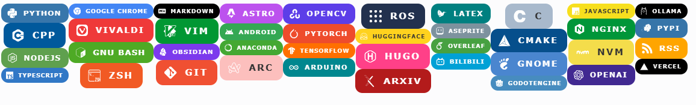
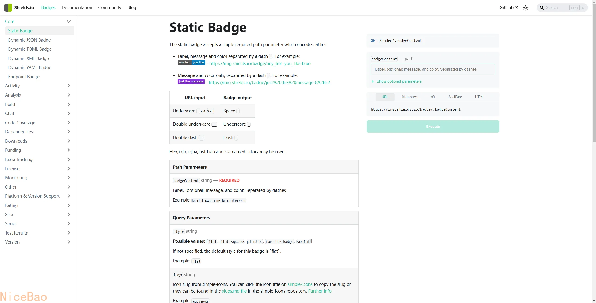
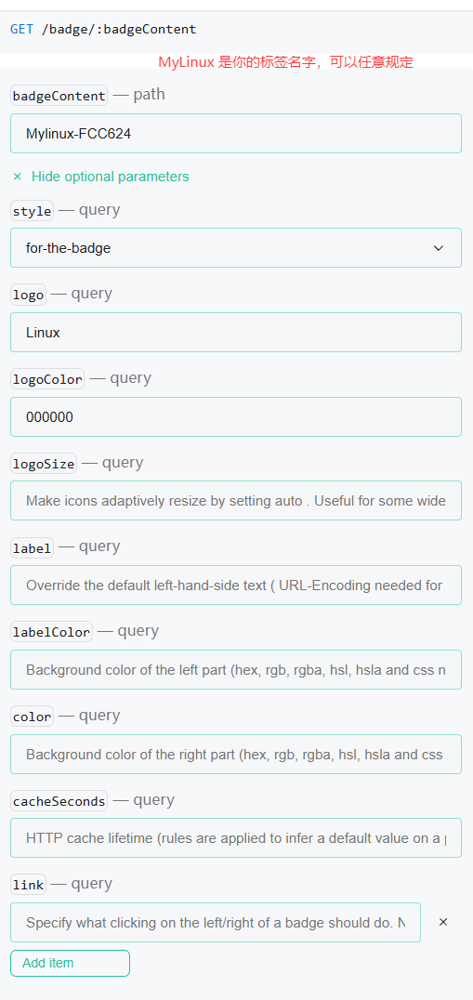
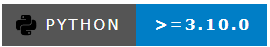

#  Shields.io徽章制作
在浏览 GitHub 时，你可能发现很多项目都有很漂亮的徽章。这些徽章可以用来显示项目版本、进度条、star 数量、fork 数量....，那么这些徽章是如何生成的呢？

准确的说，这种 badges 是可以在任何地方使用的，但是一般来说还是在 Github 里面见到的会多一些，所以干脆就在描述中添加一个 Github 的前缀。



其实这些徽章大多都出于一个网站 [shields](https://shields.io/)，里面不仅可以生成静态的徽章，也可以生成动态显示stars的徽章。

在Shields.io 网站中，进去默认展开的是静态徽章Static Badge。


在右侧可以看到四个内容，分别是：

- **title**：badge 的文字描述。
- **color**：badge 的背景色，使用 hex 编码表示（不包括 `#`）。
- **logoname**：badge 的 logo 名称。
- **logocolor**：logo 的颜色，使用 hex 编码表示（不包括 `#`）。

在下图中，logo需要严格按照[simple icon](https://simpleicons.org/)中的名字规定，`#FCC624`规定了徽章的背景色。比如，我找到了微信的图标，只需在simple icon的“logo”栏输入“WeChat”，即可让微信的图标出现在徽章上。


在badgeContent中，一般的输入可以是`label-(optional)message-color`，即【第一段内容】-【第二段内容】-【颜色】 ，中间使用`-`隔离。在badgeContent要输入空格或者下划线等内容可以参考下面：

|URL input|Badge output|
|---|---|
|Underscore `_` or `%20`|Space|
|Double underscore `__`|Underscore `_`|
|Double dash `--`|Dash `-`|
例如输入`python->=3.10.0-blue:`

与此同时，Shields.io也会生成对应的markdown供你使用。

在这里建议将 logo 颜色设置为白色，然后背景色设置为网页中推荐的那个 logo 的配色，会比正常设置要有质感一些，比如说显示 `vitepress`，就可以使用：
```

```
