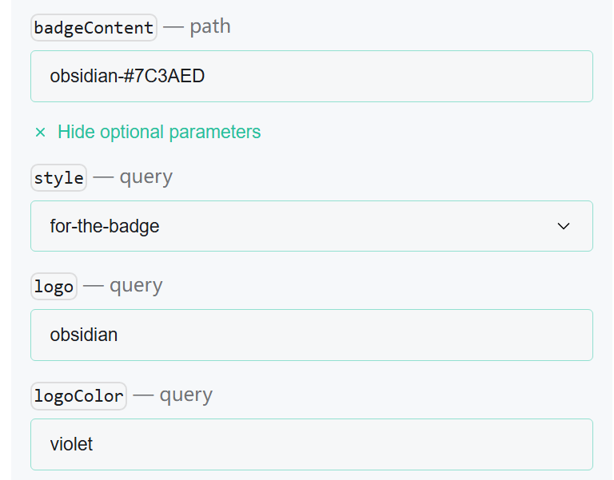
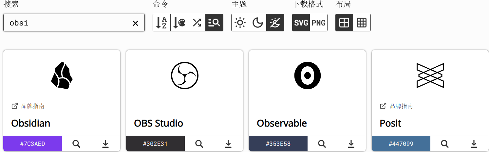
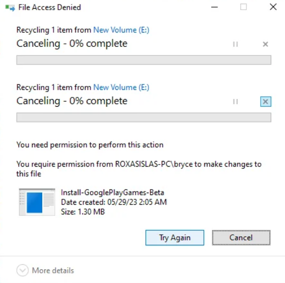

#  Shields.io徽章制作
在浏览 GitHub 时，你可能发现很多项目都有很漂亮的徽章。这些徽章可以用来显示项目版本、进度条、star 数量、fork 数量....，那么这些徽章是如何生成的呢？

准确的说，这种 badges 是可以在任何地方使用的，但是一般来说还是在 Github 里面见到的会多一些，所以干脆就在描述中添加一个 Github 的前缀。


其实这些徽章大多都出于一个网站 [shields](https://shields.io/)，里面不仅可以生成静态的徽章，也可以生成动态显示stars的徽章。

在Shields.io 网站中，进去默认展开的是静态徽章Static Badge。


在右侧可以看到四个内容，分别是：

- **title**：badge 的文字描述。
- **color**：badge 的背景色，使用 hex 编码表示（不包括 `#`）。
- **logoname**：badge 的 logo 名称。
- **logocolor**：logo 的颜色，使用 hex 编码表示（不包括 `#`）。

在下图中，logo需要严格按照[simple icon](https://simpleicons.org/)中的名字规定，`#FCC624`规定了徽章的背景色。比如，我找到了微信的图标，只需在simple icon的“logo”栏输入“WeChat”，即可让微信的图标出现在徽章上。


在badgeContent中，一般的输入可以是`label-(optional)message-color`，即【第一段内容】-【第二段内容】-【颜色】 ，中间使用`-`隔离。

在badgeContent要输入空格或者下划线等内容可以参考下面：
|URL input|Badge output|
|---|---|
|Underscore `_` or `%20`|Space|
|Double underscore `__`|Underscore `_`|
|Double dash `--`|Dash `-`|
例如输入`python->=3.10.0-blue:`

与此同时，Shields.io也会生成对应的markdown供你使用。

在这里建议将 logo 颜色设置为白色，然后背景色设置为网页中推荐的那个 logo 的配色，会比正常设置要有质感一些，比如说显示 `vitepress`，就可以使用：
```

```

## 应用举例
例如，我需要obsidian的图标：

其中，#7C3AED来自[simple icon](https://simpleicons.org/)的obsidian图标,复制之后填在badgeContent中的`color`字段中即可。



# windows 中需要管理员权限才能删除文件夹
遇到错误：

在 Windows 中以管理员权限删除文件夹时，若遇到 “你需要管理员权限” 或 “Access denied” 等提示，通常是因为当前用户或 UAC 权限不足、或目标文件夹仍归系统/TrustedInstaller 所有。以下是建议操作步骤和对应命令方法：

实际上意思是：即便你当前账号是管理员，但 Windows 判断你缺少对该文件夹的所有权或控制权（ownership/control），导致即便是你本人也无法删除。这类问题非常常见，以下是解决方案。
## 1. 以管理员身份打开命令提示符或 PowerShell
在开始菜单搜索 cmd 或 PowerShell，右键选择 以管理员身份运行，确保具有足够权限 

## 2. 接管文件夹所有权与权限控制
若文件夹归 TrustedInstaller 或非当前用户所有，需先接管其所有权并授权：

运行以下命令：
```bash
takeown /F "C:\路径\目标文件夹" /R /D Y
icacls "C:\路径\目标文件夹" /grant administrators:F /T
icacls "C:\路径\目标文件夹" /reset /T
```

- takeown 用于接管目标资源的所有权

- icacls /grant 将管理员组授予完全控制权限

- icacls /reset 重置访问控制列表使权限生效 

## 3. 删除文件夹

```bash
Remove-Item -LiteralPath "E:\mywebsite2\目标文件夹" -Recurse -Force
```

- Recurse：递归删除所有子项；

- Force：删除只读文件、隐藏文件等；

- LiteralPath：处理路径中存在特殊字符或空格的文件夹名称