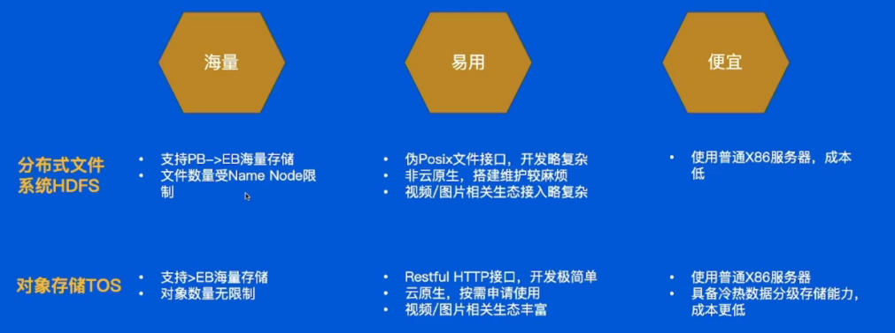
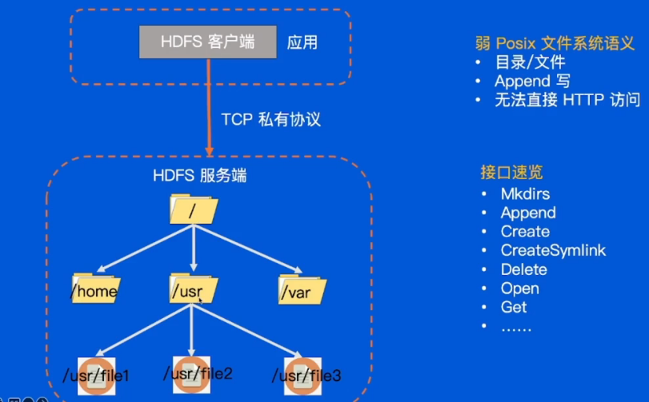
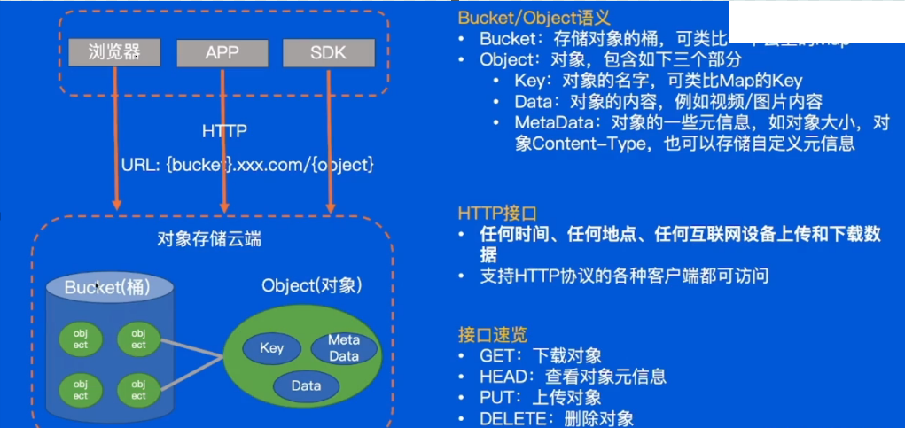
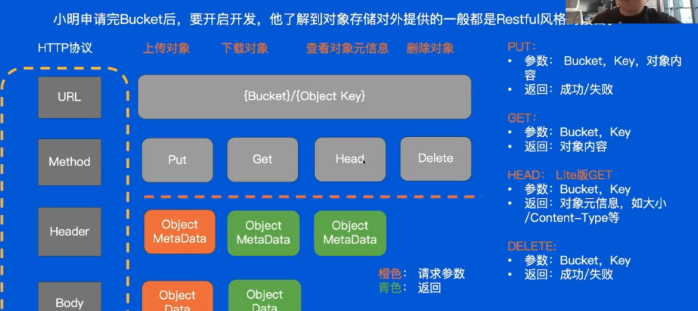
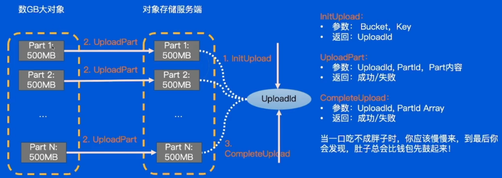
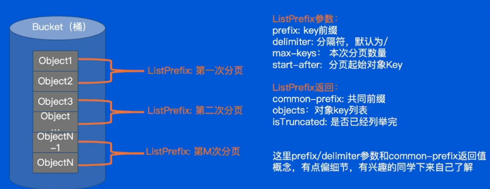

存储系统分为四类：
- 单机存储 File-system Key-Value
- 单机数据库 关系型和非关系型
- 分布式存储 分布式文件系统GFS HDFS等 对象存储TOS
- 分布式数据库：关系型(MySQL Oracle)和非关系型数据库

# 分布式存储选型


在TOS中，所有的数据都存储在“桶”中。桶是容器，可以理解为用于组织存储对象的命名空间。每个桶都具有唯一的名字，并可以设置权限来控制谁可以访问。

# 存储对象使用
先在TOS上申请一个Bucket，里面可以存放很多objects。此外，TOS提供了丰富的RESTful API，可以实现文件的上传、下载、删除、查询等操作。

对象存储对外提供的一般都是Restful风格的接口。
```c
restful风格：[参考链接1](https://zhuanlan.zhihu.com/p/334809573)、[参考链接2](https://www.runoob.com/w3cnote/restful-architecture.html)

以资源为基础 ：资源可以是一个图片、音乐、一个XML格式、HTML格式或者JSON格式等网络上的一个实体，除了一些二进制的资源外普通的文本资源更多以JSON为载体、面向用户的一组数据(通常从数据库中查询而得到)。RESTful风格的API则要求在URL上都以名词的方式出现，从几种请求方式上就可以看出想要进行的操作，这点与非RESTful风格的API形成鲜明对比。

统一接口: 对资源的操作包括获取、创建、修改和删除，这些操作正好对应HTTP协议提供的GET、POST、PUT和DELETE方法。换言而知，使用RESTful风格的接口但从接口上你可能只能定位其资源，但是无法知晓它具体进行了什么操作，需要具体了解其发生了什么操作动作要从其HTTP请求方法类型上进行判断。具体的HTTP方法和方法含义如下：

- GET（SELECT）：从服务器取出资源（一项或多项）。
- POST（CREATE）：在服务器新建一个资源。
- PUT（UPDATE）：在服务器更新资源（客户端提供完整资源数据）。
- PATCH（UPDATE）：在服务器更新资源（客户端提供需要修改的资源数据）。
- DELETE（DELETE）：从服务器删除资源。
```

```java
@PutMapping("/dogs/{id}") //`@PutMapping("/dogs/{id}")`：这是Spring注解，它将HTTP请求（路径为`/dogs/{id}`的PUT请求）与 `updateDog()` 方法绑定。
public ResponseEntity<String> updateDog(@PathVariable int id, @RequestBody Dog dog) {
    dog.setId(id); // 设置ID
    boolean isSuccess = dogMapper.updateDog(dog);
    if (isSuccess) {
        return new ResponseEntity<>("Dog updated successfully", HttpStatus.OK);
    }
    return new ResponseEntity<>("Failed to update dog", HttpStatus.BAD_REQUEST);
}  
```
## MultiUpload 接口
对于GB数据大对象：

- **Web应用**：允许用户一次上传多个文件，如在照片库中上传多个图片文件。
- **云存储服务**：例如AWS S3、Google Cloud Storage等支持批量上传文件。
### 实现
前端：通过HTML表单的`<input type="file" multiple>`属性允许选择多个文件。
```html
<form action="/upload" method="POST" enctype="multipart/form-data">
    <input type="file" name="files" multiple>
    <button type="submit">Upload</button>
</form>
```
后端：
```java
@PostMapping("/upload")
public ResponseEntity<String> handleMultiFileUpload(@RequestParam("files") MultipartFile[] files) {
    for (MultipartFile file : files) {
        System.out.println("Uploading: " + file.getOriginalFilename());
    }
    return ResponseEntity.ok("Files uploaded successfully!");
}

```
## Listprefix接口
`list-prefix`（列出前缀）通常出现在云存储服务中，指的是根据特定前缀筛选文件或对象的功能。在大多数云存储服务中，文件或对象被组织在一个“桶”或“容器”中，而`prefix`可以帮助你只列出符合特定前缀的文件。
分页列举接口：


### 实现：
假设我们在AWS S3存储了多个文件，其中有一些文件的键以`photos/`开始，使用`Prefix`参数可以列出这些文件。
```java
AmazonS3 s3Client = AmazonS3Client.builder().build();
ListObjectsV2Request listObjectsRequest = new ListObjectsV2Request()
        .withBucketName("my-bucket")
        .withPrefix("photos/");
ListObjectsV2Response response = s3Client.listObjectsV2(listObjectsRequest);
for (S3ObjectSummary objectSummary : response.contents()) {
    System.out.println(objectSummary.getKey());
}

```