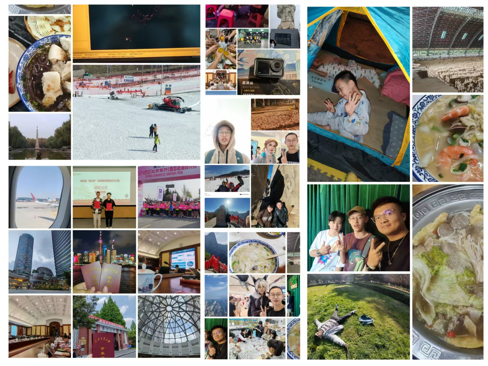

# 我的2024总结
当敲下‘my 2024 summary’这行标题开始本文的写作时，我正身处z128号列车归乡途中。z128是连接东西的大动脉之一，从西北到东南，从古都到蛮夷之地，从兰州、西安到福建，缓缓东迁、南开。今天没有下雨，车窗漏过的阳光着实令人欣慰，这在西安并不常见，当然也可能是北方都不常见，西安碑林区冬天的阳光几乎令人感觉不到温度。

尽管是临近除夕，确切而言，西安的年味并不浓厚。尽管政府在西安城墙、交大兴庆宫等古迹处加上了各种璀璨且卷出新高度的花灯，但明显体感的人口返乡外流、每晚零下凛然的室外寒风着实令人感到荒芜与漂泊。常常感到自己的抉择一定意义上都落向了漂泊，就像波函数向的某种定态的坍缩一般，只不过在十多年前是北漂，如今之后可能是南漂。

2024年年初还残留着一些博览古今的幻想。一年前的这段时间，借着复旦的一个全国性活动的名义，我正在研读跟专业毫不搭噶的斯多葛学派的哲学著作，寒假在家里面坐牢一点一点地憋了快20天才磨出来一篇巨型学术缝合作品《具身治疗》。这意义不大，但当初为什么会这样做很大程度上是因为笔者才大一，可以允许自己盲目探索一会儿。最大的收获是加了一位2021级pku学长的微信——这是一位个人感觉人格张力拉满的同学：学的是协和八年制临床，但在朋友圈表达过不想做研究型的学者，与此同时是pku学生合唱团成员，不仅有指挥经历，还有与中央多名艺术家同台或者受指导的经历。那位同学同时是一个e人，尽管他平时经常抽烟。笔者文笔功底有限，只能用有趣来形容这样的同学。上图中有fdu的星空咖啡馆、子彬院的会议厅照片。在答辩完之后笔者认识到fdu那些学问建树颇为丰硕的学者也不过是某一细分领域的学者专家，因为一个人的精力实在无法广博通闻诸多领域的诸多事。但话说回来，放在人生的维度上，笔者还是希望自己能够有趣一些。

是的，能够在个人擅长的技能上探索是一件有趣的事。但何谓擅长，你会发现大多人一生都不知所云，大多者只是浑噩地从事一份工作罢了。正如笔者在县城的时候辅导过课业的几位学生。成绩确实不够好，但一天天的披星戴月，不挑餐食又照顾妹妹关心家长，平时老实不去花里胡哨地玩，家长一想确实找不到理由训斥他。只是说不擅长读书罢了，不太能够实现阶级跃迁罢了，但这又如何能言呢？在其他方面笔者确实自愧不如。对于有趣而言，笔者曾认为自己在讲话方面挺擅长的，于是在4月份5月份背宣讲稿子希望加入西迁博物馆宣讲团。那时二十页A4纸左右的讲稿，笔者自己吸收内化，磕磕绊绊地背了将近一学期，但最后试讲的结果并没有很好，宣讲的语言过于平白。或许笔者擅长的只是像讲课那样侃侃而谈无所拘束的讲话，背讲稿、背台词的工作一直是笔者吃力的领域，于是这方面的时间和精力投入便变成了沉没成本。这是笔者所做出的探索。

自2月的年初开始，笔者对从事硬件控制的幻想逐步被戳破。那时找了北极熊学姐加入了robocup的一个组，做的是工程竞技项目，说白了是一个很无聊的工作——在一个迭代成熟的项目下教会机器人走路。现在以浅薄的分析，似乎可以手调RL，但对于本科生而言难度疑似略大。这个项目采用的自制板和舵机经常是出现了问题难以排查。这里接触不良，那里电压不够……可能是笔者较菜，硬件的debug、PCB板与黑商的交涉总是让人头疼。于是在五月份六月份已然属于灰心的状态，当时遇上考试周，这令笔者感到些许压抑。直到期末考之后才已然发现做这个项目的大部分的时间效果甚微。是这样的，比赛是这样的，我所能作的是这样的。到六月份那时，这个项目逐渐被笔者不看好因而处于淡淡然然的状态。七月份参加了robocup的省赛是省二，但已经看到了机械结构的不足，接着是10月份的国赛，成绩并不好。或许吧，是这样的。

笔者作为南方人第一次摸爬滚打地尝试了滑雪、为了满足占有欲用暑假辅导的收入购置了一个运动相机、勇闯了西安银泰社交coser拍照、不定时打卡了的家乡风味、摸摸碰碰跑通了RC livox lidar的代码、一刷与带mesome二刷了的华山之旅，还有糖蒜铺子的脱口秀experience（或许笔者更擅长这个？但是笔者实在不会叙述故事）、因为失落没人陪独自到青龙寺用周易算了命结果是上签而一时怀疑算命先生作祟、接任了唐仲英爱心社的某个小部长的职位、去了一次再也不会去的兵马俑骊山、参加了令人失落的发展对象答辩、下学期拿到了（？混进了）XJTU RC队伍 、回家再次品尝许久未吃的永安粿条和沙县小吃、元宵错失了家乡刚申请非物质文化遗产板凳龙的大型巡演……某种意义上是这样的，笔者与自己在某种意义上达到了和解——摆摆烂烂的，尽管许多时候感到无力与尽力、压抑与不知所措。 相当一部分繁忙事务的原因是自己在给自己层层加码，但转念一想繁忙某种意义上是精神世界的反衬。

有人思来想去扪心自问却仍未选择，有人稀里糊涂不知不觉却已经在路上。

编辑此行时正值2025春节元宵，笔者正在东航MU从福州长乐机场飞往西安咸阳的客机上。年味即将散去，往往令人沮丧，但新的一年希望保持心情、希望有所取舍、希望认识更多的人、希望有所进取与收获。笔者与正在阅读此文的你，共勉。

我还是很喜欢家乡味道的。
