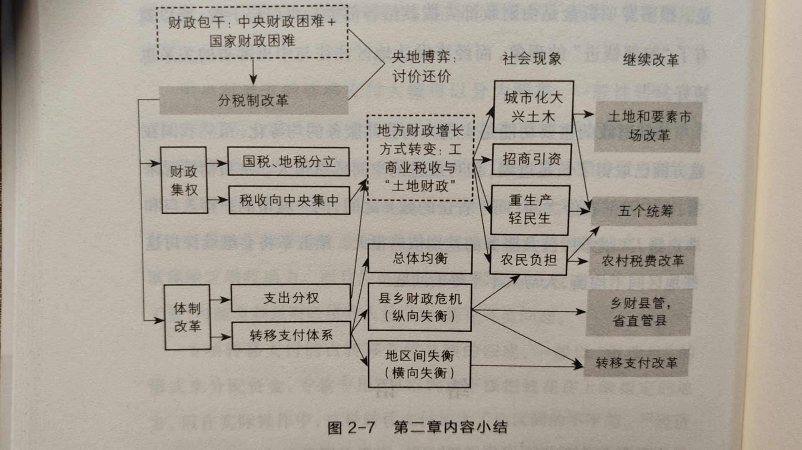

# 《置身事内》
>本文作为全书内容的大体回顾会更好一些。   

这是一本关于中国政府与经济发展的书，政府不仅参与公共服务，也深刻影响着资源与分配。
先姑且描述一下各个章节的内容：
- 第一章讨论的事权划分的三种理论：公共服务的规模经济与边界、信息复杂性、激励相容。
- 第二章通过对改开初期以来的分税制改革和土地财政的招商税收，初步概述了土地作为杠杆撬动信贷和各类资金的作用，也为政府债务、融投资埋下伏笔。

- 第三章重点讲述政府投融资与债务，加快的城镇化建设催生城投债与城投公司的兴起，当然土地投资有成功也有失败，引申出地方债的治理与改革。至于为何投资，涉及到官员激励与腐败的方面。本章使用金融财政学的术语较多，阅读起来需要一些耐心。
- 第四章讲述政府在工业化进程中的角色，书中举了京东方光电显示产业链和光伏发电从成本高用量少的研发阶段到平价市场化的过程来阐释。并介绍了居住土地和工业用地的定价逻辑以及政府引导基金建立的动机历程。
- 第五章阐述城市化进程中居民贫富差距的不平衡问题。房价房债、按揭贷款、土地流转以及户籍改革在本章被探讨，重视工业生产将转向重居民重民生，这是作者对服务型转向的一些看法。
- 对“防范化解重大风险”的讨论，第六章探讨中国政府的债务与风险，从四万亿计划到货币化“棚改”等等，本章聚焦于地方政府融资平台和国企、债主银行的债务。债务根源于我国经济发展的模式与结构，在降债务的过程中必然伴随着一系列深层次结构性改革。
- 我国经济结构最失衡的特点是消费不足。地方政府重生产重投资导致10年初我国制造业的巨大产能对外输出，进而引发贸易冲突。我国居民拥有高储蓄率但收入占比过低，重扩张的优点是能快速扩大投资和对外贸易，利用全球化的契机拉动经济快速增长，尽管缺点是经济结构上失衡。

本书一共讲述了七章，第五章开始讲述了宏观的经济现象。第八章则是对前述的总结，纵横捭阖颇为精彩。采用市场经济的理论研究中国经济，此二者之间的张力为研究分配制度、改革措施以及发展历程提供了良好的入口。不同“假想”、不同“标准”对于完善市场经济各有判断标准，换一套标准的政策制定可能完全不同。哈佛大学经济学家申克龙的话：“一套严格的概念框架无疑有助于理清问题，但也经常让人错把问题当成答案。社会科学总渴望发现一套‘放之四海而皆准’的方法和规律，这种心态需要成熟起来。不要低估经济现实的复杂性，也不要高估科学工具的质量。”

这里还有一段精彩的论述：

```
经济落后的国家之所以落后，正是因为它缺乏发达国家的很多硬件或软件资源，缺乏完善的市场竞争机制。在推进现代化的进程中，
落后国家所采用的组织和动员资源的方式，注定与发达国家不同。落后国家能否赶超，关键在于能否找到一套适合国情的组织和动
用资源的方式，持续不断地推动经济发展。所谓“市场在资源配置中起到决定性作用”，站在今天的角度上看是未来的趋势之一，但
往后看市场的经济状况也是几十年来经济、政府、社会协同发展和建设的结果。
```


我国曾在二十世纪六七十年代进行过工业体系的分散化，当时是叫做“三线建设”的开展。以一个全国整合工业资源的角度看确实不妥。这种先分散后整合的方式被解释为能够带动地方农民向工人阶级的转变，为二十一世纪工业加速提供了愿意外出闯荡的大量劳动力，也为地方政府“官场+市场”的竞争和属地管理提供了地区经济的推动力。

常谈道发展中国家各自的发展模式不尽相同，我国发展中各个省的发展路径和发展方式也不尽相同。社会现实决定了经济发展的政策边界。例如工业化城市化的进程，微观而言则是农民到工人的演变问题，落到个人身上是观念的剧变。作者提到我国可行的政策空间和演变路径受三大制度约束：农村集体所有制、城市土地公有制、户籍制度。因而中国的工业化才离不开乡镇企业的发展，离不开“土地财政”和“土地金融”。政策的制定伴随着利益的约束，研究发展过程的经济学还讨论了发展顺序和发展节奏，政策的路径和步骤、激进与否都有利益冲突，这种必然指引着一种“渐进式改革”的兴起：允许拖低效率的资源错配，建立缓冲机制，因为人需要花时间去适应。

作者认为，经济学的主要作用仍是发现和提出问题，解决问题仍然只能在摸索中产生——这需要权衡取舍、调整改进、需要魄力。发现和提出好的问题是解决问题的第一步，“提问”本身也是一门艺术，切中要害的问题一定是对于现实具有深刻的理解。“具体问题具体分析”的道理是不会过时的精神。
## 推荐书目
冯军旗 《中县干部》 周黎安 《转型中的地方政府：官员激励与治理》

耶鲁大学哥顿《银行的秘密：现代金融生存启示录》

保尔森《与中国打交道：亲历一个新经济大国的崛起》

潘功胜《大行蝶变：中国大型商业银行复兴之路》

哈佛大学 傅高义 《邓小平时代》

复旦大学历史地理学家葛剑雄《统一与分裂：中国历史的启示》

复旦大学陈明明、中山大学肖滨《当代中国政府与政治》
