---
title: '认知心理学复习纲要'
description: 一份难评的课的期末复习资料。
draft: false
categories: 
    - 通识
date: 2025-02-23T15:00:00-07:10
lastmod: 2025-03-14T16:00:00-07:20

---
>“出题极其阴险。”

`题型有 名词解释、成对概念分析、填空、判断对错、匹配连线、填图、实验分析、psychopy。`

认知心理学以研究黑箱方法为主，神经生物学以白箱研究为主，二者均启发计算神经工程。神经生物学为认知心理学提供了机理与证据。

*Mental progress: Private psychological activities that include thinking, perceiving, and feeling.*

**认知心理学研究的基本问题**：
心理表征问题——心理表征的形成与对心理表征的加工。表征是指**信息**或**知识**在心理活动中的表现和记载的方式，是外部事物在心理活动中的内部表现。

认知活动（心理表征及其加工）的意识水平：意识和无意识

身心关系问题

# 认知心理学的研究范式
## 信息加工范式
研究目的是确定认知操作的过程和结构，将外部信息转换为可操作的离散符号——心理表征 对信息的加工范式是序列(sequential)进行的 该模式可以回答自下而上的加工过程，却忽视了自上而下的加工过程。

[信息加工的一般原理图]   感受器、效应器、信息加工系统
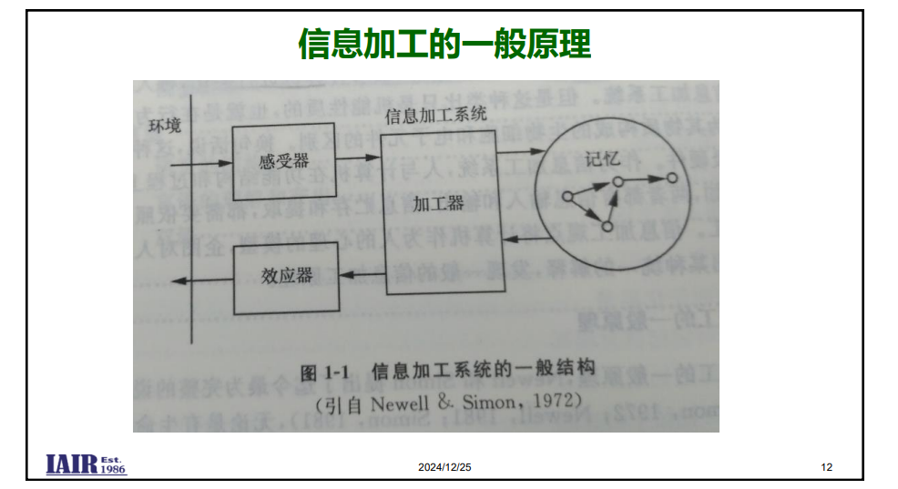
[对信息加工观点的批评图]  认知系统、调节系统、情绪系统、物理信号、运动和声音

## 联结主义范式
模拟神经网络的集成**平行加工**方式。
 1. 信息表征是以**神经网络的激活模式**实现的，不同的激活模式表征**不同信息**，一个网络当中可以存储和表征不同的信息（一个网络有不同的激活模式）。信息是以**非符号的分布式**存储于神经网络中，存储具有**非局部性**；信息加工就是以一定模式在网络当中**激活扩散**，在空间上是平行分布式加工。
 2. 这种网络具有学习能力。

联结主义范式图他敢考？

此外，认知心理学研究的生态学取向也日趋明显，强调人与环境的动态交互过程，从更为整体的观点认识人的认知过程。

## 认知心理学的产生基础
**哲学：**

柏拉图的理性主义（知识的基础是大脑的先天特征） VS    亚里士多德的经验主义（一切皆学习所得）

认知心理学既依赖于理性主义研究，也依赖于经验主义研究。

**心理学：**

实验内省法：冯特主张以**意识作为研究对象**。 

行为主义：华生主张用纯粹客观的自然科学方法来研究，认为心理学应该研究similate-react。

早期注重于研究行为主义，而托尔曼、班杜拉等行为主义者已开始注意行为的认知过程。

格式塔学派也反对冯特的观点，但强调心理活动的整体性。“整体大于部分之和。”

## 控制论
冯诺依曼提出自复制自动机理论，构造出了一种基于29状态的二维元胞自动机模型的自复制自动机的理论原型

1948年，维纳发表的控制论《控制论——关于在动物和机器中控制和通讯的科学》提出核心思想——**控制、反馈和人机交互**。

1956年，认知心理学正式诞生，1967年出版史上第一部《认知心理学》专著。

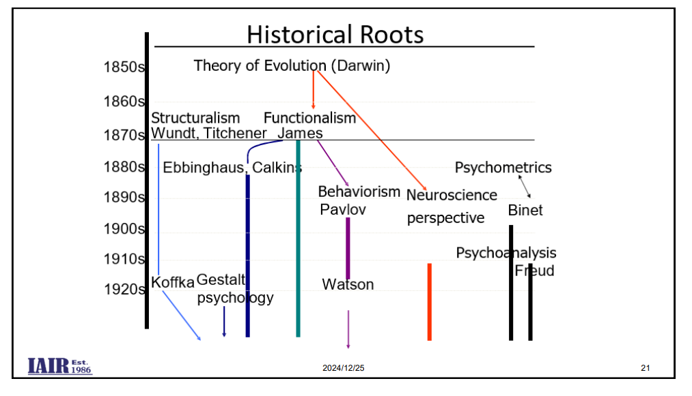
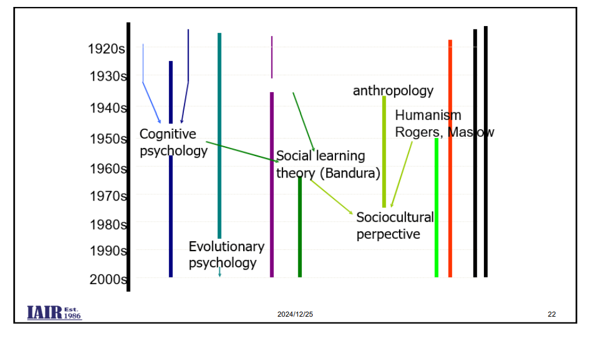

# 感觉
什么是absolute threshold？ 能够被感知到的最小强度的刺激。在50%的时间里可以检测到的最小能量。
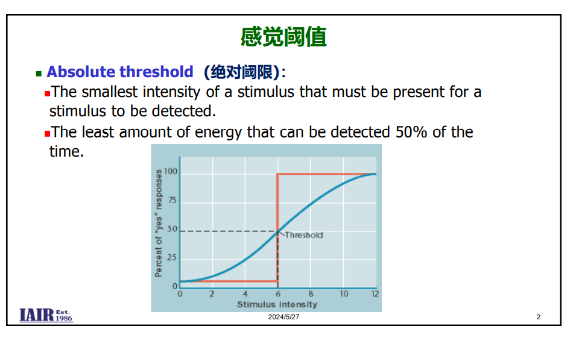
sensory adaptation？

 [感觉适应图]

- 长时间暴露于**不变**的刺激下感觉能力的调整。
- 在大多数情况下，我们的感官会适应他们所经历的刺激水平。
- 敏感性的明显下降是由于感觉神经受体无法无限期地向大脑发送信息。

**双目立体视觉的深度计算**
$d$是两眼之间的距离。${x_{right}}$  ${x_{left}}$是眼中成像与视网中心点之间的距离。
$$Z = \frac{{f \times d}}{{{x_{right}} - {x_{left}}}}$$
## 对立过程理论
三套颜色感受器：黄Y-蓝B 红R-绿G 黑B-白W ，非此即彼。
虽然视网膜中有三种颜色受体，但他们传递的信息被视觉系统中的其他神经元编码为对手过程形式。

```
视觉系统中的神经元对这些颜色对进行编码，并通过“对立”的方式进行信号传递。例如：

如果红色感受器被激活，则绿色感受器被抑制（或反之），这种对立关系帮助我们感知颜色的不同。

类似地，明亮与黑暗的对立（黑-白）也是通过神经元的对立过程来进行编码的。

这意味着在视觉神经传导过程中，同一颜色感受器的刺激不能同时表现出两个相对的颜色（比如红与绿）。当一个颜色对的一个元素被激活时，另一个颜色就会被抑制，这种机制帮助视觉系统识别和分辨颜色。
```


**听觉位置理论:** 人耳的听觉范围16~200Hz。基底膜的不同区域对不同的频率有分离的反应，大致可以分为三个区域。

```
傅里叶级数 复指数信号 连续时间信号的傅里叶级数
```

**嗅觉**：设计用来模拟生物嗅觉的神经算法……成果有助于未来在未知背景气味的情境下识别特定气味。利用甲苯、氨、丙酮、一氧化碳和甲烷等对其进行气味训练。

**触觉**：senses of touch,pressure,temperature and pain. skin senses play critial role in survival,making us aware of danger.

# 知觉
## 概念
神经系统只会关注可能对决策产生影响的主要物体（知觉物体）。

什么是刺激？ 产生感觉器官反应的能量。

什么是感觉？感官刺激的体验。 感觉器官被物理能量源激活。

知觉 (Perception) ：
从原始感觉信息中创建有意义模式的过程。 感觉信息在感觉器官和大脑之间进行分类、解释、分析和整合的过程。
## 错觉 （important）
### 知觉错觉
知觉的欺骗。 知觉错觉主要依赖于我们自身的知觉过程，并且由于刺激包含误导性线索而发生。
### 视觉错觉
当我们使用各种感觉线索来创造实际上并不存在的知觉体验时，就会发生视觉错觉。
### 感觉≠知觉 
错觉并非指出了我们知觉能力的缺陷，而是为我们提供了“知觉系统如何工作”更富洞察的启发。
## 格式塔心理学 
描述我们如何将零碎的信息组织成有意义的整体的一系列原则。

- 邻近律  指邻近的元素更倾向于被分为一组。
- 相似律 指（形状、颜色、亮度等）相似的元素更倾向于被分为一组。
- 连续律 组合起来构成直线、平滑曲线、光滑表面的元素，往往被视为属于一组。
- 封闭律 组合成封闭图案的一组元素往往被认为成一组。

## 方向对知觉的影响 
模式的自发组织是刺激本身的自然作用，与该物体过去的经验几乎没有关系（知觉的直接属性）
### 典型视角 
典型视角是格式塔心理学观点的拓展，指能对物体做出最佳表征的形象 对典型视角的一种理论解释是，我们对物体的日常经验可以发展出对该物体最具代表性形象的永久记忆。
## 胶囊网络
胶囊网络(Capsule Networks)是深度学习三巨头之一的Geofrey Hinton 提出的一种全新的神经网络结构。

胶囊就是将原有CNN神经网络中的个体神经元替换成了一组神经元组成的向量，这些神经元被包裹在一起，组成了一个胶囊。

胶囊网络中的每层神经网络都包含了多个胶囊基本单元，这些胶囊与上层网络中的胶囊进行信息交互传递。

## 两种对立的知觉理论 
核心争议在于知觉是否需要知觉者已有内部心理表征的参与调节。内部表征是指知觉者已有的与知觉对象相关的知识经验、期望、动机和情绪等内部因素。
### 知觉的假设考验说：建构主义的间接知觉理论  
- 知觉需要已有内部表征的中介调节
- 认为感觉信息对知觉是不充分的强调自上而下概念驱动的加工，也包括强调自下而上数据驱动的加工
### 知觉的刺激物说：Gibson的直接知觉理论
- 知觉不需要内部表征的中介调节 
- 强调自下而上数据驱动的加工能从环境中获得充分的感觉信息来完成知觉任务，形成直接知觉
- 强调生态学方法，知觉、行动和环境三者互动的动态知觉

## Top-down & Bottom up
- Top-down processing（自上而下加工）：以更高层次的知识、经验、期望和动机为指导的感知 
- Bottom-up processing（自下而上加工）：感知，包括识别和处理有关刺激各个组成部分的信息

### 自下而上和自上而下加工的结合 
知觉是自下而上的数据驱动加工与自上而下概念驱动加工两种成分综合的结果，两种成分相对比例的多少取决于知觉任务中的具体因素，随知觉任务的不同而不同 。

单纯地依赖自下而上的数据驱动加工的知觉任务相对很少，大部分知觉任务是两种加工成分的综合，即知觉是现实刺激和已贮存知识经验相互作用的结果。0

## 建构主义的听知觉实验
**实验范式解析**：

句子的正确知觉率是音噪比的函数 ——验证了知觉的直接性质

相同音噪比下： 正常句 > 异常句 > 非语法句 ——验证了知觉的间接性质
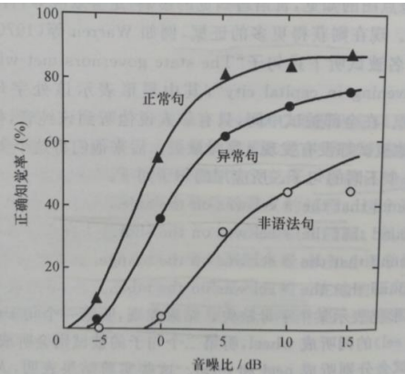
结论：
- 人的已有语言知识对知觉具有作用 
- 知觉既具有直接性质，也具有间接性质

## 整体加工与局部加工的争论 （很有可能出现）
对于一个客体（object），是先知觉其各部分，进而再知觉整体？还是先知觉整体，再由此知觉其各部分？ 

格式塔心理学认为，整体是在其部分之前被知觉的。

Navon（1977）的著名视听知觉实验研究证实了上述观点。
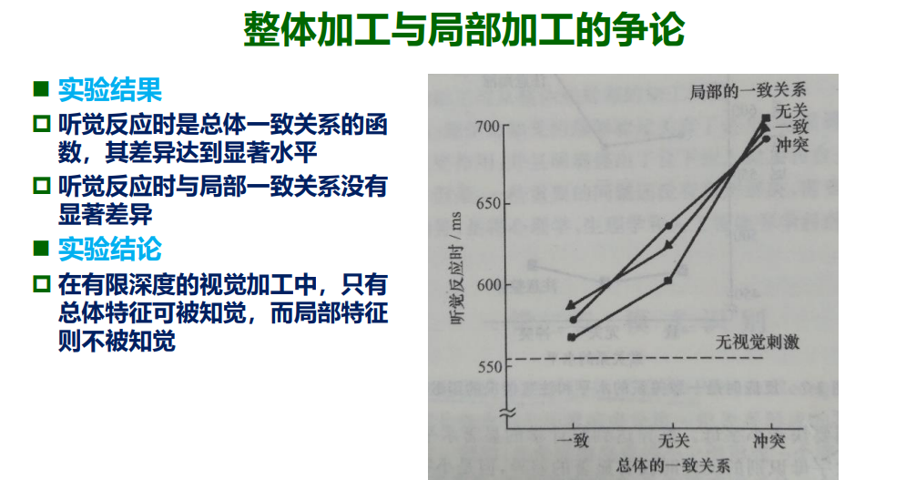
## 平行与序列加工 
其他关于知觉的心理表征的争论还包括：平行加工与序列加工。

# 模式识别
## 模式（Pattern）
- 有若干元素或者成分按照一定关系形成的某种刺激结构，也可以说模式是刺激的组合。
- 当人能够确认他所知觉的某个模式是什么，并能够将它与其他模式区分开来，这就是模式识别。
## 模式识别的基本过程
对当前知觉对象特征的知觉表征（特征提取） 
记忆中与对象有关的表征在视觉系统中的激活（哈希检索） 
当前对象的知觉表征与激活的记忆表征的比较（哈希检索） 
决策过程：决定哪个长时记忆中的项目与当前对象有着最佳匹配（距离度量空间）

## 模板说

在人的长时记忆中，贮存着许多各式各样的过去在生活中形成的外部模式的袖珍复本，称作模板。

模板匹配（Template Matching）: 物体识别是基于对物体的**知觉输入**与记忆中的有关模版进行比较匹配的结果，这种匹配要求两者有最大程度的重叠。
### 困难
- 如果模式在外形、大小、方位等某一方面有所变化，即识别不了。 
- 预处理必不可少 
- 需要在人的记忆中贮存不可计数的模板，增加了记忆负担，且与人的模式识别的高度灵活性不一致。
## 原型说 
原型(prototype)：不是某个特定模式的内部**复本**，而是一类客体的内部表征，即一个类别或**范畴**的所有个体**概括表征**，反映一类客体具有的基本特征。
### 原型说的基本观点 
在模式识别中，外部刺激只需要与原型进行比较，由于原型是一种概括表征，因此**不要求严格匹配**，只需近似的匹配即可。当刺激与某一原型有最近似的匹配，即可将该刺激纳入此原型所代表的范畴，从而得到识别。
corr
## 视知觉实验(1967)
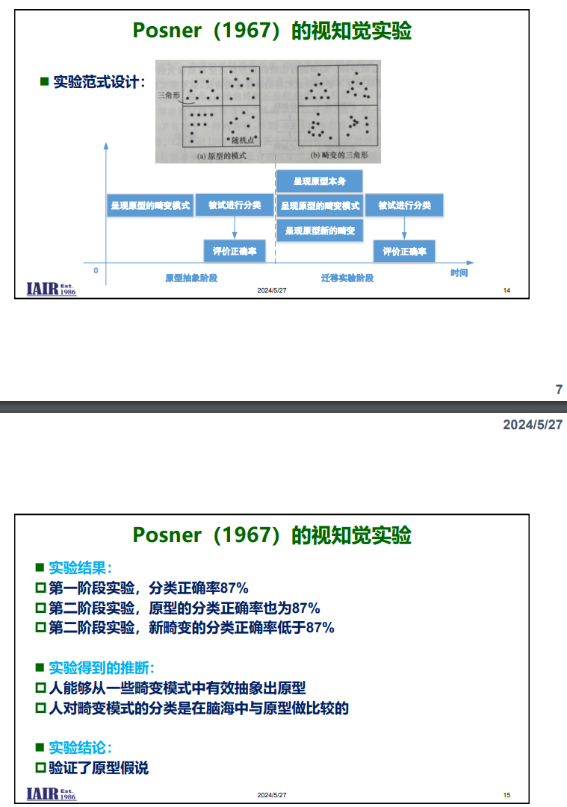

## 原型说VS模板匹配说
原型说允许近似匹配，即使某一范畴的个体之间存在外形、大小等方面的差异，所有这些个体都可与原型近似匹配而得到识别； 原型说使人的模式识别更加灵活，更能适应环境，新的不熟悉的模式也可以识别 ；原型说可以大大减轻记忆负担。
## 原型形成的两大理论
- Centraltendency theory (趋中理论，Posner et al., 1967)：在概念上，原型代表了一组示例的平均值。
- Attributefrequency theory (特征-频率理论，Solso and McCarthy, 1981)：原型代表最常见的属性组合模式，与一组模式的 "最佳范例 "同义。

## 特征说
特征（feature）：模式是由若干元素或成分按一定关系构成的，这些元素或成分可称为特征。

- 外部刺激在人的长时记忆中是由特征符号的集合来表征的 
- 模式识别首先要对刺激的特征进行分析，即抽取刺激的有关特征，然后将这些抽取的特征加以合并，再与长时记忆中的有关特征符号集合进行比较，一旦获得了最佳的匹配，外部刺激就被识别了 
- 与模板匹配模型的关系：特征可以看做是一种局部的部件模板 
- 但特征分析模型较模板匹配模型有如下优点： 更强的适应性，依据刺激的特征和关系进行识别，不管刺激的大小、多少等细节 
- 同样的特征可以出现在不同的模式中，极大地减轻了记忆的负担

【字母搜索实验】验证了特征说，反驳了模板匹配说。
### 【静止网像实验】 
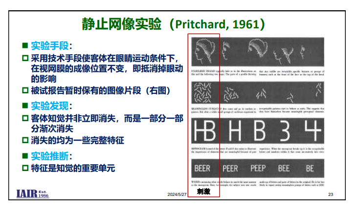

【幼年猫🐱的视觉皮层实验】 
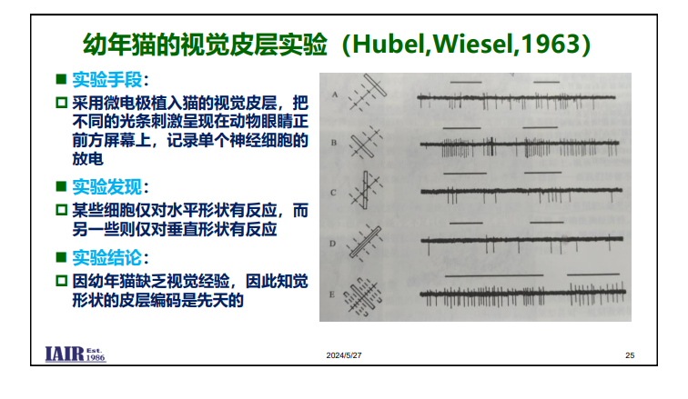
`实验发现`：某些细胞仅对水平形状有反应，而另一些仅对垂直形状有反应。

`实验结论`：因幼年猫缺乏视觉经验，知觉形状的皮层编码是先天的。

## 成分说
成分说又称作成分识别理论或几何子理论。

基于简单三维 "几何子 "组合检测的感知能力 。

根据视角不变特性定义的地线：即使从不同角度观察也能保持不变的特性

几何子（geons）：24 个不同的形式，就像字母表中的字母一样，构成了一种系统类型

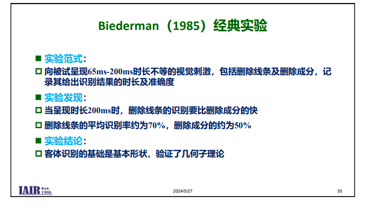

- 模板说（模板匹配模型）——自下而上模型
- 原型说（原型匹配模型）——自下而上+自上而下模型 
- 特征说（特征分析模型）——自下而上模型
- 成分说（几何子理论） ——自下而上+自上而下模型

## 结构优势效应
上下文效应。指整体的结构在模式识别中所起到的重要作用。
### 字词优势效应实验（可能会出现）
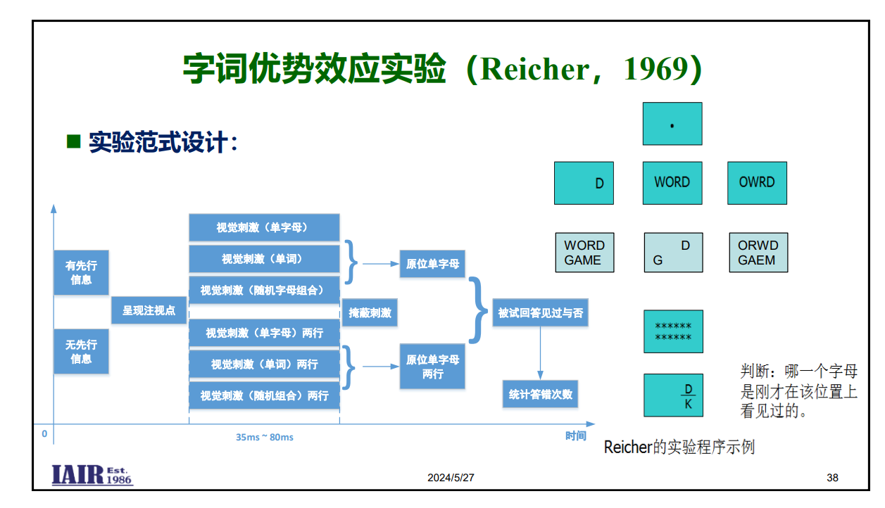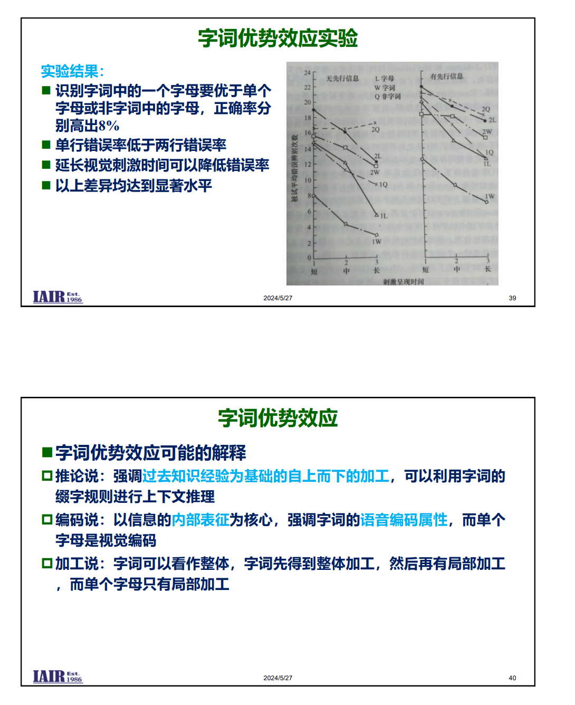
### 句子优势效应 （可能会出现）
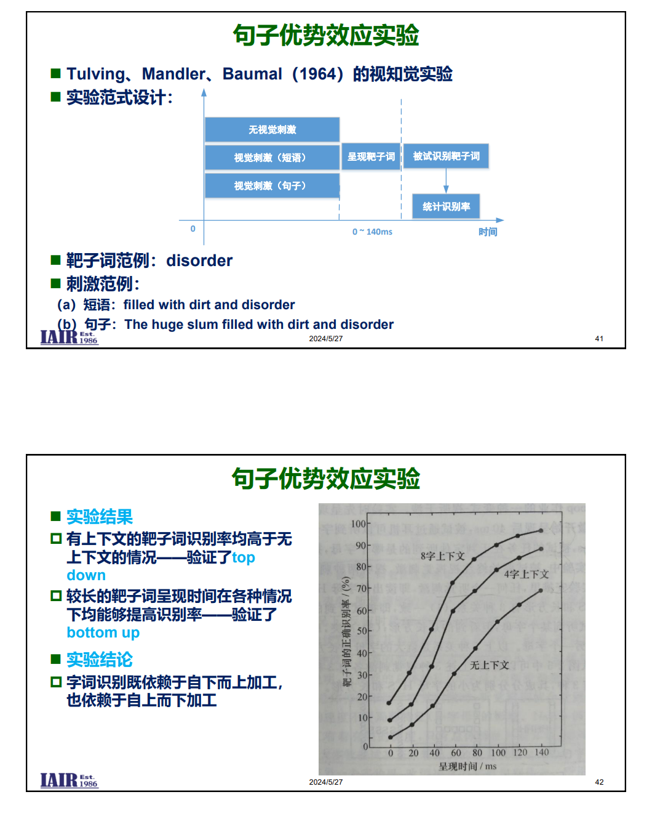
### 客体优势效应实验
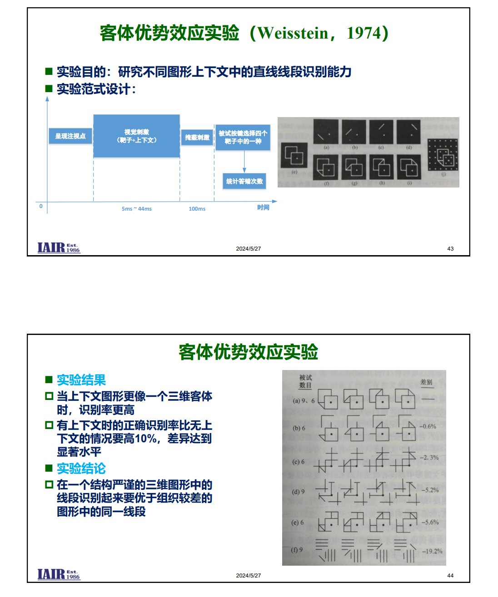
解释是：
- 存在两种知觉系统：特征系统——自底向上；客体系统——可被结构严谨的整体刺激激活
## 小结
- 以整体加工和局部加工为核心的假设，可以为上述各类结构优势效应给出统一的解释  
- 视觉以外的其他感觉通道可能也存在着类似的效应  
- 模式识别任务以外的其他的知觉活动可能也存在着类似的效应

# 注意
行为主义：否定注意的存在。格式塔心理学：注意完全融化于知觉之中。

二战期间，工程心理学又开始重视注意的研究。 认知心理学将注意看做信息加工的重要机制。

## 注意的定义

注意：是意识接收信息的过程，它是意识从同时呈现的几个对象或思维序列中选择一个对象并给予清晰和生动的关注的过程，意识集中与专注是注意的核心。

注意的两个实质特征：**选择性**和改善心理加工的**有效性**。

## 注意的模型
### 过滤器模型
单通道模型。过滤器至高级水平分析的通道只有一条。
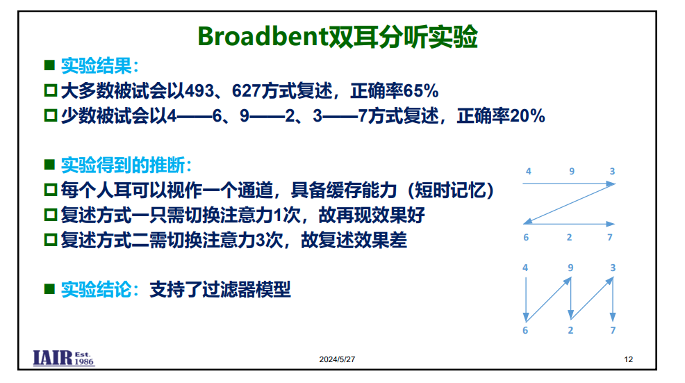
### 衰减器模型
过滤器并不是按“有或无”的方式来工作的，不是只允许一个通道（追随耳）的信息通过， 而是既允许追随耳信息通过，又允许非追随耳信息通过，只是非追随耳的信号受到衰减，强度减弱了，但一些信息仍然可得到高级加工。

### 过滤器VS衰减器模型
共同点 

根本出发点相同：高级分析水平容量有限，需要过滤器调节 

过滤器的位置相同：处于初级分析和高级分析之间 

过滤器的作用相同：选择一部分信息进入高级知觉分析，注意选择都是知觉性质的 

不同点：迟钝的耳朵与失聪的耳朵 

**合并称为 Broadbent-Treisman 过滤器衰减器模型——注意的知觉选择模型。**

### 反应选择模型（新加）
又称为后期选择模型，该模型认为几个输入通道的信息均可以进入高级分析，得到全部知觉加工，注意不在于选择知觉刺激，而在于选择对刺激的反应。 

中枢的分析结构可以识别一切输入，单输出是按照重要性来安排的，对重要的信息作反应，而对不重要的信息不反应，注意是对反应的选择。尽管这是一种“不经济”的工作机制，心理学界仍未在两者间形成定论。
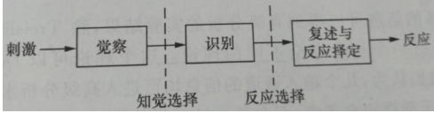
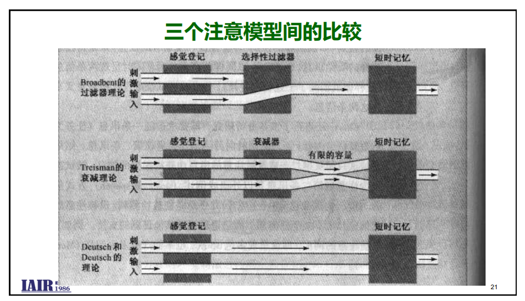

### 中枢能量理论（新加）

认为人们拥有一个容量有限的非特异的认知资源，这些认知资源可以被灵活的分配给人们面临的各种刺激和任务上。  

他并没有设想一个瓶颈结构，也没有过滤器，而是将注意看成人能用于执行任务的数量有限的能量或者资源，用这种能量或资源的分配来解释注意。

解释了常见的**双作业操作**。

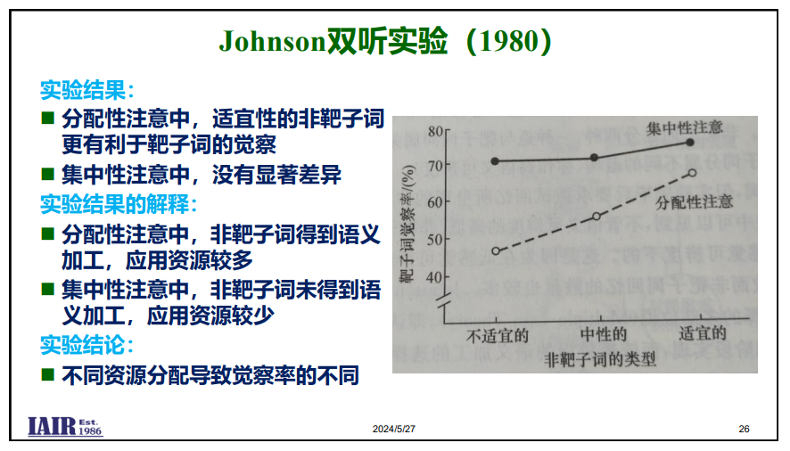

### 特征整合理论（新加）
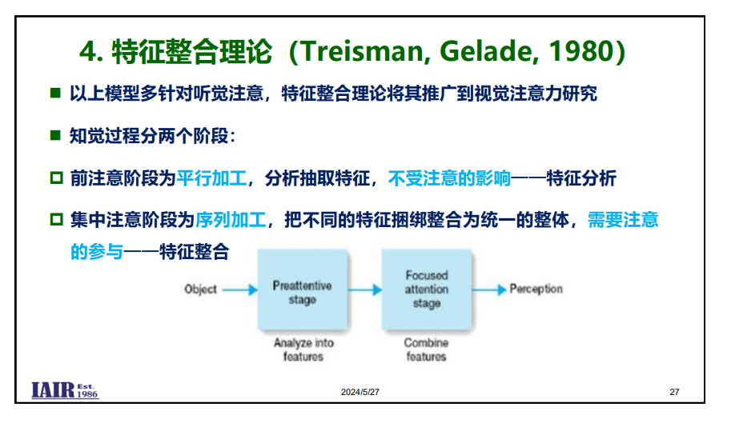
大脑皮层的不同区域的特征地图对客体的不同空间属性进行了编码。

在特征分析与特征整合两个相继进行的加工过程中，特征分析加工过程快速有效，而特征整合加工过程更慢而且效率不高。
## 弹出效应
当奇异元素嵌入彼此相似，但在形状、颜色、大小、运动方向等某一特征截然不同的干扰物区域时，奇异元素很容易被直接识别到。  （奇异元素嵌入干扰物区域）

## 计算机视觉显著性的研究方法
多尺度对比特征：在高斯图像金字塔上对比每像素邻域内的相似性，假设显著物体内部通常具有较高的像素相似性，而边缘相似性较低。

中央-周围直方图特征：假设显著物体与其周围区域往往具有较大的像素差异。

颜色空间分布特征：图像中所有颜色可以用高斯混合模型（GMM）来表征，据此可以衡量每个像素属于某个高斯元的概率。 这里假设显著物体的颜色一般较为单一。

## 控制加工与自动化加工（概念辨析）
认知加工过程按受注意的控制调节程度可分为控制加工和自动加工 
- 控制加工（controlled process）需要注意力控制，以序列方式进行，相对较慢，但具有弹性 
- 自动化加工（automatic process）很少或几乎不需要注意，以并行加工方式进行，相对较快，但缺少弹性 
控制过程是容量有限的，并且在变化情境下可以灵活使用自动化过程没有容量限制，并且一旦掌握就很难改变。

### shiffrin & schneider 视觉搜索实验
呈现识记项目，再现识记项目，被试判定是否见过。
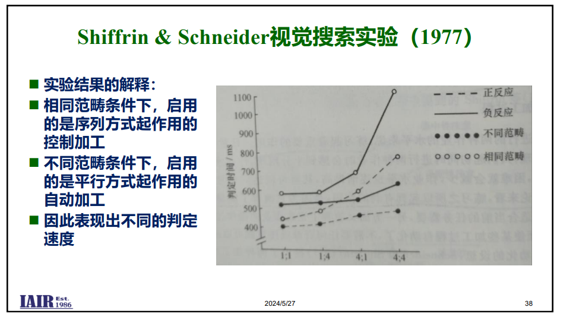
### stroop实验范式
实验结果：颜色的命名受到词汇语义的干扰，语义的自动识别很难抑制。
# 意识
意识：大脑创建内外经验模型的过程 

Nonconscious processes（无意识加工）：任何不涉及意识加工的大脑过程

Preconscious memories（前意识）：目前不在意识中，但可以被唤起 

Unconscious（潜意识）：经典的弗洛伊德理论

两方面：一是对环境的觉察，二是一个人对心里事件的认知——由记忆和自己的内在意识和自我意识产生的想法。

## 潜意识
在弗洛伊德的经典理论中，这是心灵的一部分，它容纳了记忆、欲望和感受，如果这些记忆、欲望和感受被带入意识中，就会造成威胁。 

许多现代认知心理学家认为，无意识并不那么险恶，它只是在意识（知觉）之外运作的心理过程的集合，但通常不会压制信息，也不会与意识相抵触。

## 意识的框架：AWAREness理论
该框架吸收了传统意识研究的要素，并提出了一些新的观点，集大成者

- 注意（Attention） 
- 觉醒（Wakefulness）：通过从睡眠到清醒的脑电，研究睡眠相关现象 
- 构筑（Architecture）：研究决定意识加工的生理结构及其物理定位
- 知识回忆（Recall of knowledge）: 包括自我知识、世界知识、共情 
- 情感（Emotion） 
- 新异性（novelty）、浮现（emergence）、选择性（selectivity）、主观性（subjectivity）
```
新异性（novelty）：人和动物都有追求新异而有新信息刺激的倾向，即偏好“新”事物 
浮现（emergence）：意识处理的是私有、内部的思想，是关于内部信息和自我反映的神经过程 
选择性（selectivity）：人随时不断选择一小部分想法进行考虑，并频繁受到新想法的干扰，“探照灯”隐喻是其具象表现 
主观性（subjectivity）：每个人的意识体验是独一无二的
```
### 知识回忆
自我觉察：知道自己就是自己，个人信息：可以即刻回忆起来而无需重新体验实际事件。

世界知识：长时记忆中保存的所有关于外部世界的事实。

共情：知道另一个的想法，共情敏感性有利于生存。


### 觉醒——关于睡眠的研究

- 第 1 阶段：相对快速、低振幅
- 第 2 阶段：较低、更有规律的波形，睡眠纺锤 
- 第 3 阶段：较低、较高的峰值和较低的谷值 
- 第 4 阶段：更慢、更有规律，对外界刺激反应最小 
- 快速眼动睡眠（REM sleep）（快速眼动）。

#### 睡眠的特征
90 分钟一个周期，每晚睡眠 4~6 次 

最深睡眠出现在接近夜幕降临时 

快速眼动持续时间随着睡眠的进展而增加第一个周期只有 10 分钟，最后一个周期将近一个小时

#### 快速眼动
每90分钟出现一次，占成人总睡眠时间的20%，在闭眼状态下出现的眼球快速运动。

会产生睡眠性麻痹，除了控制眼睛的肌肉外，其他任何自主肌肉都无法运动。

与做梦有关。

#### 做梦
生存活动梦理论：梦源于大脑对白天吸收的信息的再处理，这些信息对有机体的生存很重要。 做梦可以增强我们对重要信息的记忆

激活-合成理论：梦是各种记忆随机激活的结果，这些记忆在逻辑故事情节中交织在一起。

白日梦：意识的一种常见变化，其中注意力转移到记忆、期望、欲望或幻想上，而远离眼前的情况。

#### 催眠
一种诱发的意识状态，通常以高度的暗示性、深度放松和高度集中的注意力为特征。

#### 冥想
1. 一种意识状态，通常是通过专注于重复行为、采取某些身体姿势以及尽量减少外部刺激而引起的 
2. 冥想可以用来增强自我认识、幸福感和灵性。
3. 降低新陈代谢率，降低心率和呼吸频率。
4. 大脑活动类似于放松的清醒状态下的活动，伴随的血乳酸下降可以减轻压力。

Baars(1983)提出的综合工作平台理论（剧院模型）把意识看做是一套在整个大脑里传播信息的全局广播系统
# 记忆
短时记忆存在的证据：自由回忆实验
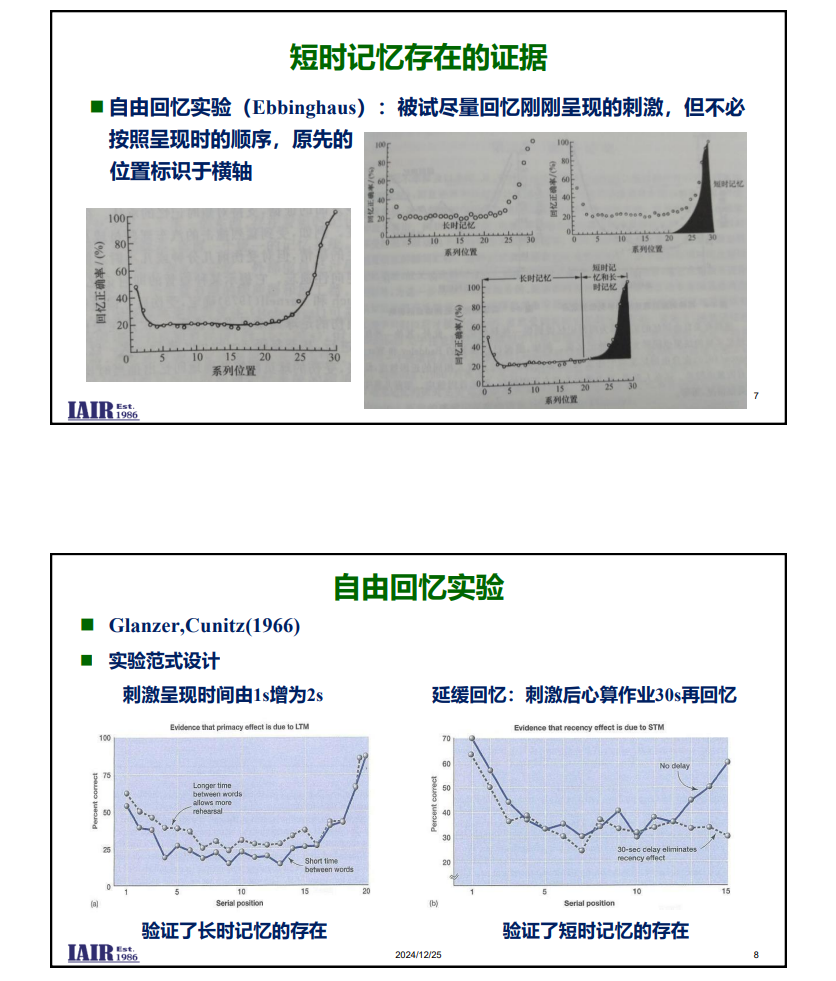
自由回忆实验为两种记忆说提供了证据。

## 记忆的多重结构
短时记忆、长时记忆、感觉记忆【又称为感觉登记、瞬时记忆，每一种感觉贮存保持的时间均非常短暂而且是感觉通道特异性的（即只局限于一种感觉通道）——ms为单位】。

感觉记忆：视觉记忆、声象记忆（三耳人声象记忆）

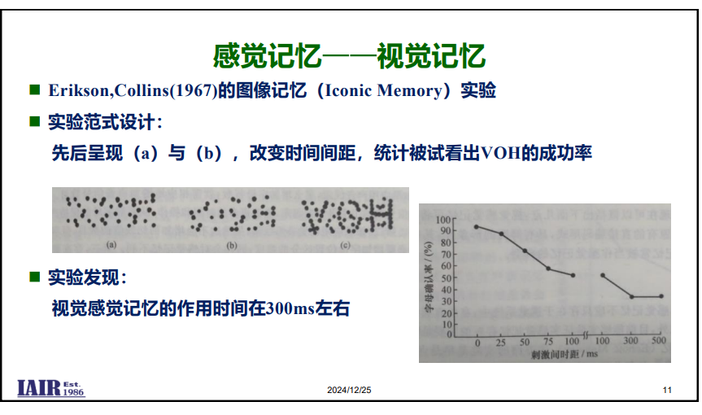
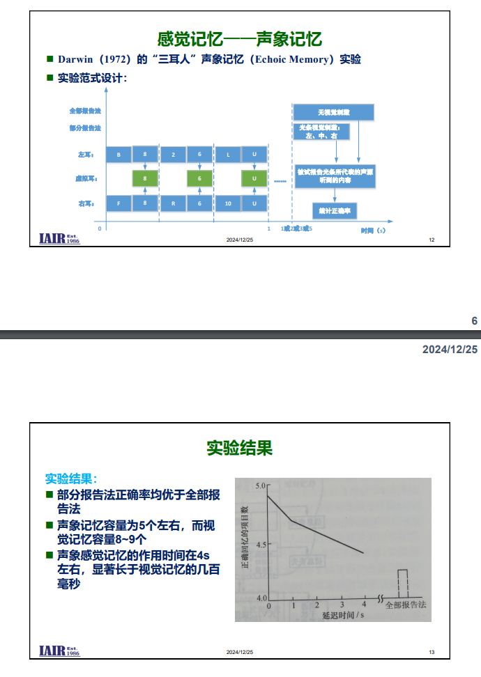

实验结果：
部份报告法正确率均优于全部报告法；
声象记忆的作用时间在4秒左右，显著高于视觉记忆的几百毫秒；声象记忆的容量为5个左右，而视觉记忆容量8~9个。

###  Atkinson & Shiffrin 三级记忆模型（可能会出现）
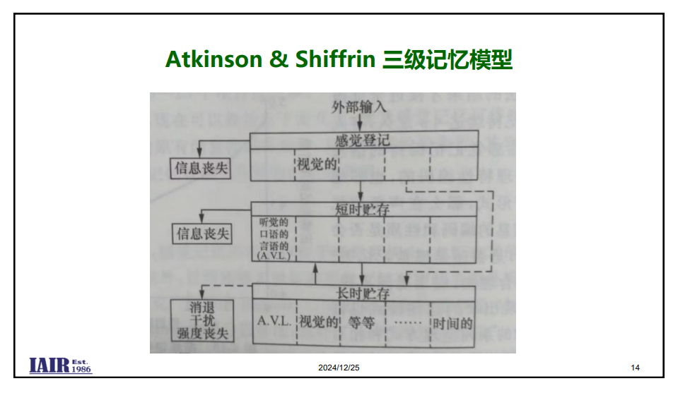
简化的记忆信息三级加工模型：
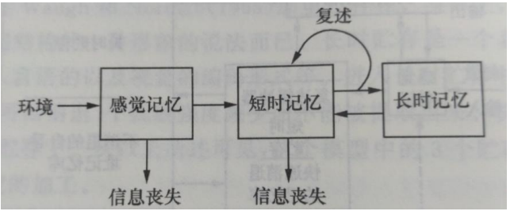
## 记忆的加工水平理论
Craik & Lockhart（1972）对两种记忆说提出了尖锐的批评，提出了完全 相反的假设：即“信息加工——记忆”，区别于之前的“记忆——信息加工”

存储是在编码深度这个维度上连续变化的。信息被存储的水平取决于被加工的深入程度。

- 浅层加工：只涉及很少的对含义的注意 
- 深层加工：涉及深层次的注意，专注于意义，并把它和其他事物关联

### Craik 和 Tulving 的实验  不随意学习
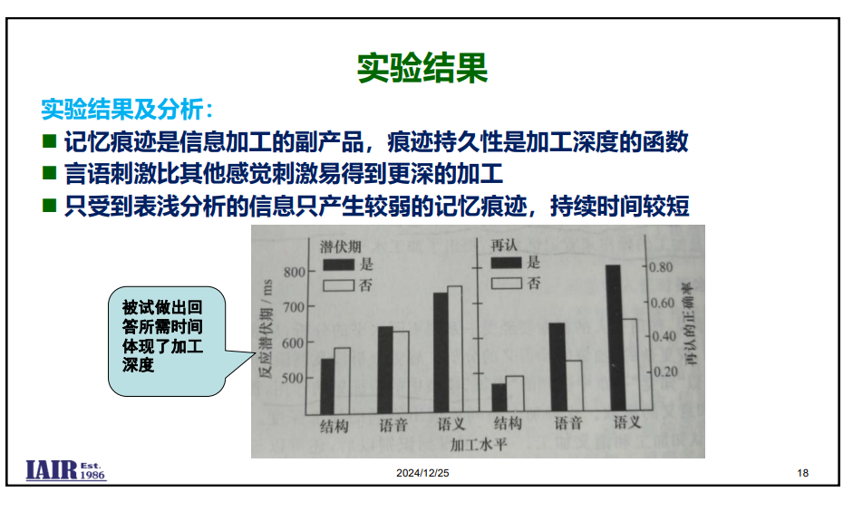

## 短时记忆理论
短时记忆的信息量不是以信息论中的bit为单位，而是以组块（Chunk）为单位

人利用贮存于长时记忆的知识，对进入短时记忆的信息进行合并，构成有意义的和熟悉的较大的单位

## 分组
**组块**是**有意义的**，而即使**无意义的**组合，即**分组**，同样有利于短时记忆。（注意概念辨析）

分组是时间、空间接近项目的合并；分组内部并不存在意义联系，也不构成一个熟悉的单位；分组可以增加短时记忆容纳的项目，但作用远小于组块。

## 短期记忆信息的提取
`短时记忆的提取是序列加工的，进一步是从头到尾进行扫描的，不会发生自我停止，即循环中不会发生break。 实验范式是相加因素法（相加罂粟法）`
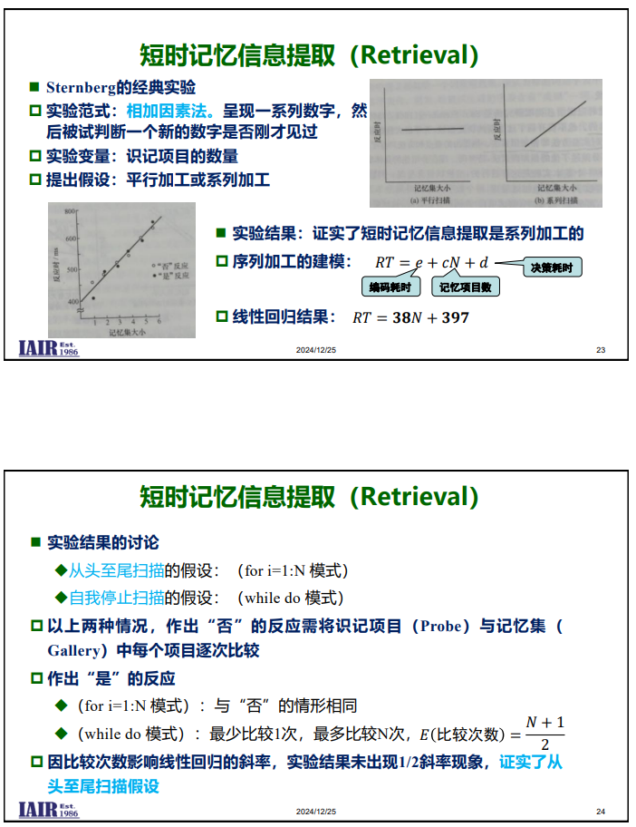
从头至尾扫描：类比于最优解（如 A星算法） 
自我停止扫描：类比与满意解（如 A 算法）

## 短时记忆的遗忘
探测法巧妙实现了两个因素间的解纠缠。
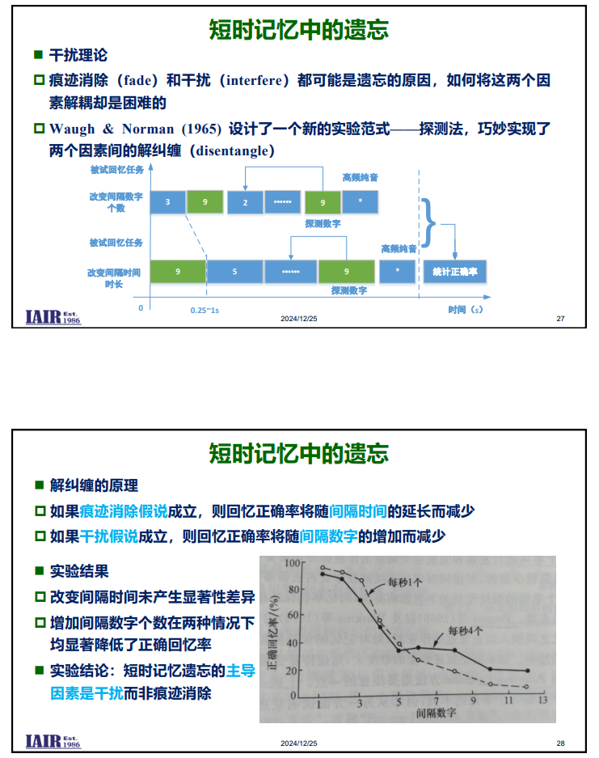
## 长时记忆理论
- 长时记忆分为陈述性记忆与隐形记忆。
- 陈述性记忆分为情景记忆与语义记忆。
- 隐形记忆分为启动效应和程序性记忆。

【长时记忆的神经生理学机制】 
当一个刺激不断被重复时，突触产生结构改变，并导致激活频率的增加，这种激活频率的增加被称为“长时程增强效应”（long-term potentiation, LTP）。

### 陈述性记忆
- 情景记忆是对个人在特定的时空背景下特定的经验或事件的记忆
- 语义记忆是个人关于世界的一般知识的记忆
- 语义记忆影响情景记忆
### 外显和内隐记忆
外显记忆受意识控制，测验时要求被试有意识地回忆早期学过的东西

内隐记忆又叫自动的无意识记忆，测验时不要求有意识地去提取信息，专注眼前作业。

#### 启动效应（可能会考？）
 先前信息潜在影响了后续任务的表现，并且人可能不曾意识到回忆过先前信息，这就是**内隐记忆**（Implicit memory），与外显记忆相对应。

人几乎意识不到内隐记忆，它是启动效应研究的基础。

#### 剑桥大学的阈下启动实验
采用了LDT（词汇判断任务）实验设计范式，破坏视网膜上的视觉暂留，避免短时记忆的影响。

阈下刺激：呈现时间非常短，被试甚至未察觉到刺激。

#### 程序性记忆
程序性记忆是针对“怎样做”或“如何做”事情的记忆，它以**技巧性动作**为基础，包括知觉技能、运动技能和认知技能的记忆。
 
## 长时记忆的模型
层次网络模型的实验验证

**激活扩散模型**
```
激活扩散模型的验证——语义启动效应

情况1：说出一种水果名称是以A字母开头 
情况2：说出一种以A字母开头的水果名称

结果解释：水果这个概念与其下级概念“Apple”等有紧密联系，扩散到“Apple”等结点的激活既多又快，接近其活动阈限，所以一旦接收到“A字母开头”就可很快出现激活交叉，说出“Apple”；但是，在情况2中，由于扇面效应，反应要慢；情况3中，因为增加了知识间的联系 ，可以克服扇面效应，如说出 “pineapple”
```
### 扇面效应
由于从一个给定的结点发出的激活总量是一定的，如与该结点相联的结点越多，则激活分配越分散，每个结点所得到的激活越少，因此提取就越慢和越困难，这就是扇面效应——符合能量守恒原理。

### 特征模型
层次网络模型与激活扩散模型都属于网络模型范畴

特征模型范畴主要包括以下两种：
1.集理论模型：概念由属性集或者特征集组成，**诸特征同等重要**，两个集之间的重叠程度越高，两个概念越接近——类比于汉明（Hamming）距离

2.特征比较模型：将两个集的特征进一步细化为定义性特征（mandatory） 和特异性特征（optional），且**特征按重要性排列**，**定义性特征**高于**特异性特征**——类比于主成分分析（PCA）

# 表征
## 表征的分类
### 意象表征
意象（Imagery）的定义：又被称为表象，是对在当前不被感知的事物形象的再现（记忆表象）或想象（想象表象），是一种心理上的类比表征。

### 双重编码理论
人脑中同时存在两种信息编码和存储系统。

表象系统对具体的事物或事件信息进行编码、存储、 转换和提取，其表征类似于知觉。

言语符号系统主要用言语听觉、抽象概念或命题形式对信息进行加工。

### 命题理论
## 意象表征
## 意象表征的理论模型
### 机能等价假设
认为视觉意象在功能上与视觉知觉相对等。

证据支持：
- 意象具有可操作性 
   1. 定位实验
   2. 心理旋转、心理扫描实验
   3. 意象缩放实验
- 神经机能有重叠：脑成像脑损伤研究
 【定位实验】
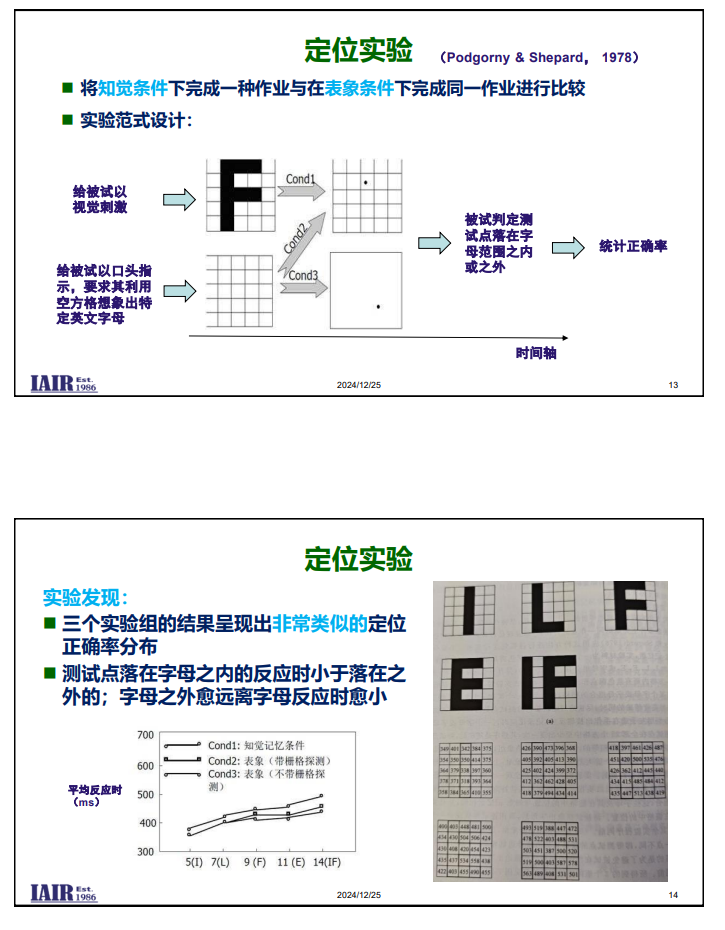

【心理旋转实验】180度时所需反应时最长；人的心理旋转速度约为180度/0.5s；

【心理扫描实验】意象可以被扫描，扫描时间随距离而增加。

【意象缩放】 评价主观意象较小的客体要难于较大的客体，这与知觉是相似的。
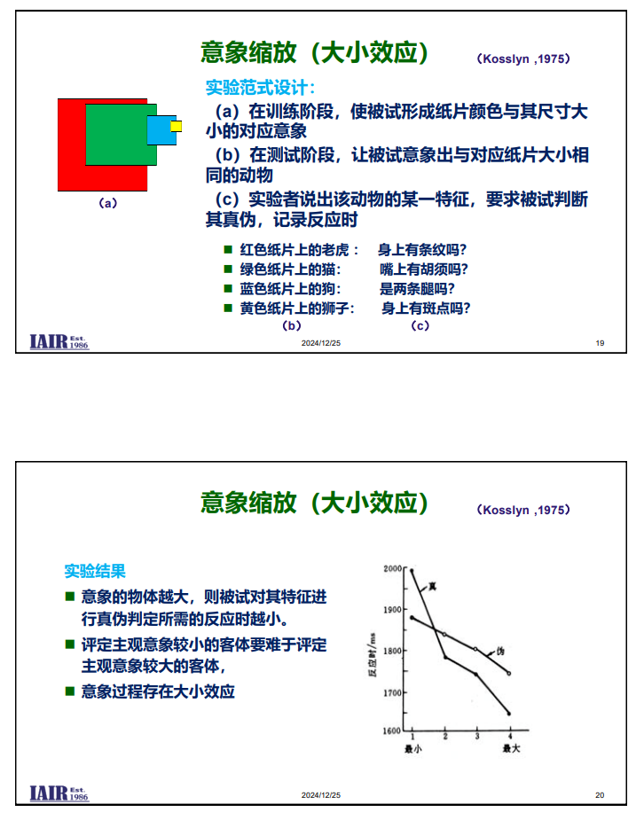

意象的功能：
- 对学习记忆的促进作用：使用意义相近的名词进行成对的联想记忆学习。意象在字词识记中有中介作用，可以促进记忆学习。
- 对知觉的促进作用
- 对思维推理的促进作用

# 概念
认知心理学中概念研究的范畴：
- 概念形成：也成为概念学习，是指个人掌握概念的过程，获得事物的概括表征
- 概念结构：概念的表征由哪些因素所构成，研究表征的内部组织

 概念研究的早期阶段：

刺激-反应原则：共同因素说（Hull，1920），共同中介说（Osgood，1953），强 调概念形成的被动性，忽略了人的主动性

## 概念形成
假设-考验说：人在概念形成过程中，需要综合利用即时获得的、和已存贮的信息来主动提出一些可能的假设组成一个假设库，通过某种策略， 从记忆库中选取某种假设，并基于外界的反馈进行考验，直到形成某个正确的假设，形成概念。

【人工概念的形成实验】

被试的选择不是杂乱无章的，而是有着某种顺序；部分假设基于正实例的一个 属性建立未知概念的假设，而总体假设聚焦于正实例的所有属性

**策略选取**  
- 同时性扫描：同时进行多个概念 的假设和考验——记忆负担重 
- 继时性扫描：一次只考验一个假 设——记忆负担轻但易重蹈覆辙 
- 保守性聚焦：排除法，每次更换 一个焦点——优于上述两种策略 
- 博弈性聚焦：一次更换两个以上 焦点——有可能快速发现概念

### 概念形成研究中的实验范式设计
渐进式还是阶跃式？
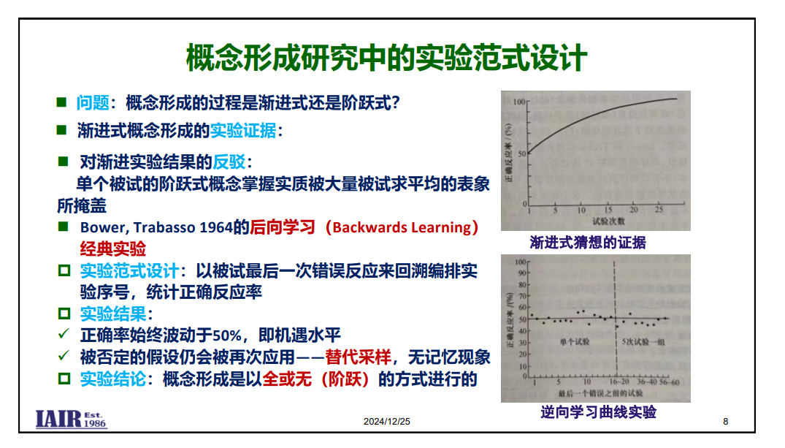
【空白试验法】
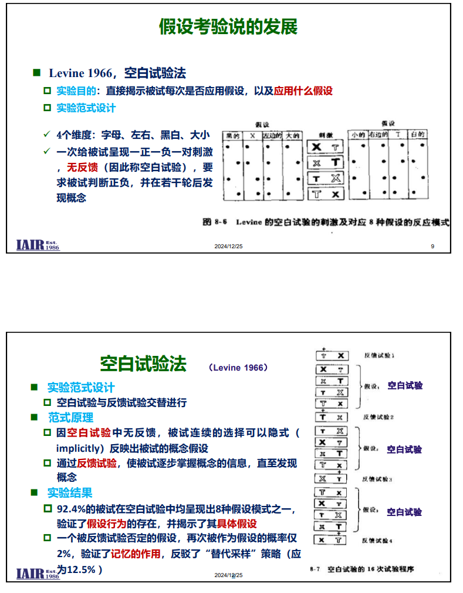
## 概念结构
两种彼此对立的学说：特征表说（一类个体具有的共同重要特征来说明概念）；原型说（原型（最佳实例）表征出来的）

### 特征表说
继承了层次网络模型，集理论模型、特征比较模型中对概念的语义特征表征方式。例如：鸟是动物与羽毛的合取。

### 原型说
概念主要是以原型，即它的最佳实例表征的，人们能从最好说明一个概念的实例来理解该概念。

最高等级的实例即为该概念的原型（最佳实例）

####  原型的编码（很可能会考）
Rosch 1975 匹配试验： 给被试同时呈现一对名词，要求被试尽快说出其范畴是否相同，记录反应时。
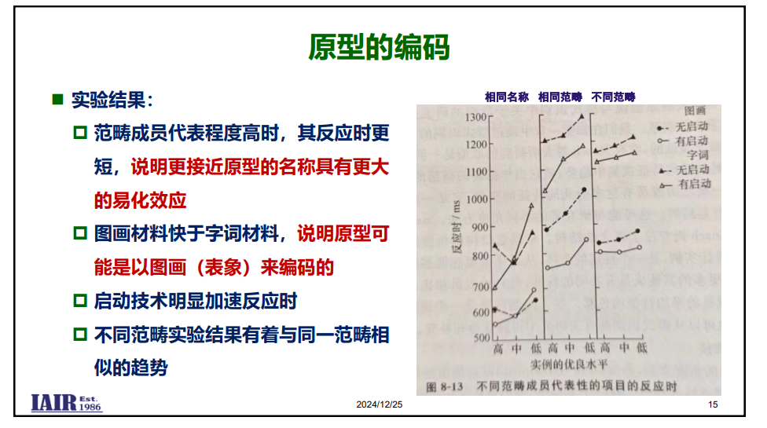
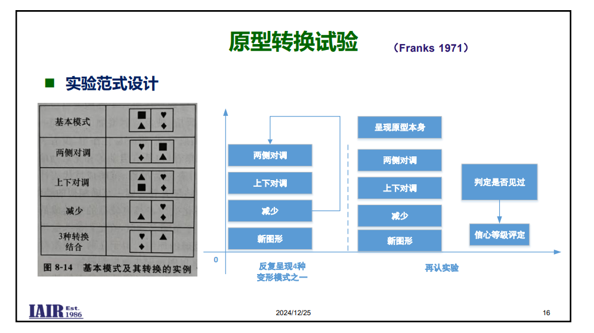
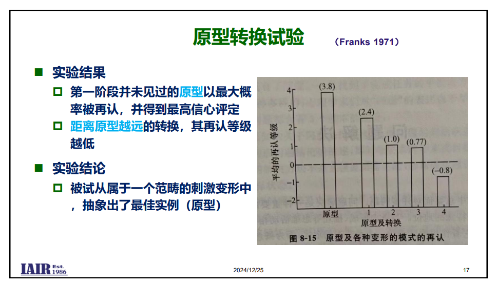

# 决策
## 贝叶斯推理和决策
人的推理方式是否遵循贝叶斯推理规则？Kahneman 和 Tversky（1972）却认为，人们的思维不符合概率理论，人们会忽略基础概率信息，而使用有偏差的启发式策略进行推理。

## 决策框架
- 人们的决策会受到决策框架的影响 
- 决策框架存在于每个人的头脑之中 
	1. 问题表述 
	2.  规范 
	3. 习惯 
	4. 个性
## 框架边界
必须始终明确决策的目标、必须突破老的边界的束缚。
### 心理账户（理查德.塞勒）
- 制定理财计划 
	不同账户这一概念可以帮助制定理财计划。用于在心理上事先把这些钱一一归入了不同的账户，一般就不会产生挪用的念头 

- 政府制定政策 
	一个政府想通过减少税收的方法刺激消费，可有两种做法：
	1. 减税，直接降低税收水平 
	2. 退税，在一段时间后返还纳税人一部分税金 
	从金钱数额来看，减收5%的税和返还5%的税是一样的，但在刺激消费上的作用却大不一样 退还的税金对人们来说就如同一笔意外之财，刺激人们增加更多的消费。因此，对政府来说，退税政策比减税政策达到的效果要好得多。
## 参考点
在决策框架中参考点的作用就象一个坐标系中的原点。 

参考点选择不同，同样一件事情该不该做，价值如何评价都会完全不同。

## 框架标尺
在建立决策框架时，标尺选择不当，对决策的执行就可能失控。 

框架标尺的变化有时会对企业的发展起到导向的作用。

## 不确定条件下的人类决策
丹尼尔·卡尼曼（Daniel Kahneman）：
	他将认知心理学研究中得到的洞见整合进经济科学，尤其关注不确定条件下的人类判断与决策，阐明了人类决策如何系统地 偏离标准经济学的预测,奠定了一个新研究领域的基础。

理查德· 塞勒（Richard Thaler）：
	将心理上的现实假设纳入到经济决策分析中。通过探索有限理性，社会偏好和缺乏自我控制的后果，他展示了这些人格特质如何系统地影响个人决策以及市场成果。

## 丹尼尔·卡尼曼前景理论的特色
与传统经济学理论的最大不同在于，前景理论在“有限理性”的基本假设上解释人类的决策行为。

```
期望效用理论
在传统经济学中，冯·纽曼和摩根斯坦于1944年提出的期望效用理论（Expected Utility Theory，简称EU理论） 长期占据统治地位。 
 该理论认为，人类的决策行为总是期望使自己能够得到的效用为最大，因此，在做决策时，人们会使用自己的理性，根据自己掌握的所有信息做出最优的选择，即使在有风险的条件下依然如此——这就是“理性人”假设。 
 基于这个假设，期望效用理论认为，期望效用值最大的方案就是最佳决策方案。
```

### 有限理性和启发式
- 抛弃理性人假设，并不意味着人类没有理性，也不意味着人类不使用理性。 
- 理性人假设的问题在于将人类理性的作用范围设定得非常大。 卡尼曼所依据的假设是“有限理性” 另一位诺贝尔经济学奖（1978年）的获得者赫尔伯特·西蒙（Herbert Simon）教授在1947年提出了“有限理性”这个概念。

【有限理性】

任何动物的思维方式都有其认知局限性而且有赖于其生存的环境

人的理性是有限的

人们在做决策时，并不是去计算一个物品的真正价值，而是用某种比较容易评价的线索来判断
### 满意原则
- 以最优为原则进行决策是理想人的专利。 
- 真实人的决策无法坚持最优原则，而只能贯彻满意原则。 
- 满意原则涉及四个基本问题： 
1. 有限目标 
2. 欲望水平 
3. 搜索方法：试探方法，随机方法，折衷方法 
4. 效益准则：在决策中尽可能以最少的代价获取满意的结果。 

西蒙说：“效益准则指的是，在所用资源一定的情况下，选择能产生最大效益的备选方案。”
### 经验和启发式
西蒙认为，由于人的信息加工能力是有限的，人不可能依据所能获得的全部信息做所谓完全“符合理性”的决策，而只能贯彻满意原则，即在决策中尽可能以最少的代价获取满意的结果，主要依靠的是经验和启发式（窍门）。 

著名的二八原则。

### 启发式
几种常用的启发式：

- 代表性启发式
    -  指人们在决策中倾向于根据某种信息本身在一类别中的代表性，判断该信息属于 特定类别的概率。
- 易获得性启发式
	-  一种认知捷径，指个体把他/她容易想象或回忆的事件视为与特定现象有关的实例，并基于此做决策。过去的经验误导决策。
- 锚定和调整策略（锚定-调整启发式）
	- 指人们在获得新信息时，难以准确地修正他们对于事件的最初估计，其判断在很大程度上被“锚定”于事件的“初始值”。
### 前景理论
卡尼曼和特沃斯基还做了其他大量类似的认知心理学实验。他们的实验结果表明，在不确定条件下，人们所做的判断和决策系统地偏离了期望效用理论的预测，因此，人们并不是完全理性的决策者。
#### 前景理论的四个原理
1. 大多数人在面临获得的时候是风险规避的 
2. 大多数人在面临损失的时候是风险偏爱的 
3. 人们对损失比对获得更敏感 
4. 参照依赖，多数人对得失的判断往往由参照点决定

【捐赠效应】

## 生态理性
特沃斯基和卡尼曼的研究着重在理解人类思维能力本身的限制这个方面。

当*思维能力与环境合适地对应起来*时，即使是有限的理性也会由于符合环境的要求而快速有效

## 启发式的结构
启发式是由问题而决定的，用于解决不同的问题。

共同的结构：
搜索规则（寻找环境中的信息和线索） 

停止规则（考虑到几条线索后停止搜索） 

决策规则（吃？跑？攻击？）
## 四类借助直觉和常识的思维窍门
基于忽略的决策 
- 基于忽略的决策：忽略掉以前不曾遇到过的那个选项。 
- 基于忽略的决策是最简单的决策方式，也最适用于限制条件极其严格的环境。

基于单原因的决策 
- 基于单原因的决策：做出选择的根据仅仅是一条信息。
- 因为要整合各种不同方面的信息就必须要将这些信息转换成一定数量的通货，然后才能比较这些信息的价值，并 且计算出行动结果的价值

基于多选项消除的决策 
- 有时没有任何一条评价标准适合于所有的选项。这时候人们就不能够仅用一条线索来衡量所有的选项。
- 在这样的情景下，多选项逐渐消除的决策方法，简单地说就是排除法，就可以发挥作用了。 

基于满意原则的决策 
- 满意原则与前几类决策方式共同的一点是，它们都适用于同时遇到很多个选项的情况。 与它们不同的是，满意原则在各种选项按时间顺序依次出现时发挥作用。 

心理捷径并不总是最好的选择 
- 一般来说，人们在有充足的时间时往往用复杂的推理 
- 在紧迫情况下，人们用启发式 

启发式在很广的范围内适用。

## 关于窍门
在卡尼曼和特沃斯基看来，“窍门儿”是人类思维不够完善的标志，它们与人们常常会犯的偏误（Bias）联系在一起，因此他们用窍门儿来解释人们在推理中常常会发生与逻辑不一致的现象。 

Gigerenzer 教授的研究显示出，对人类思维而言，窍门儿并不总是意味着偏误。尤其当我们考察发生在真实世界中的决策时，恰恰相反，窍门儿常常意味着用更少的时间，并且保证准确有效的思考。


